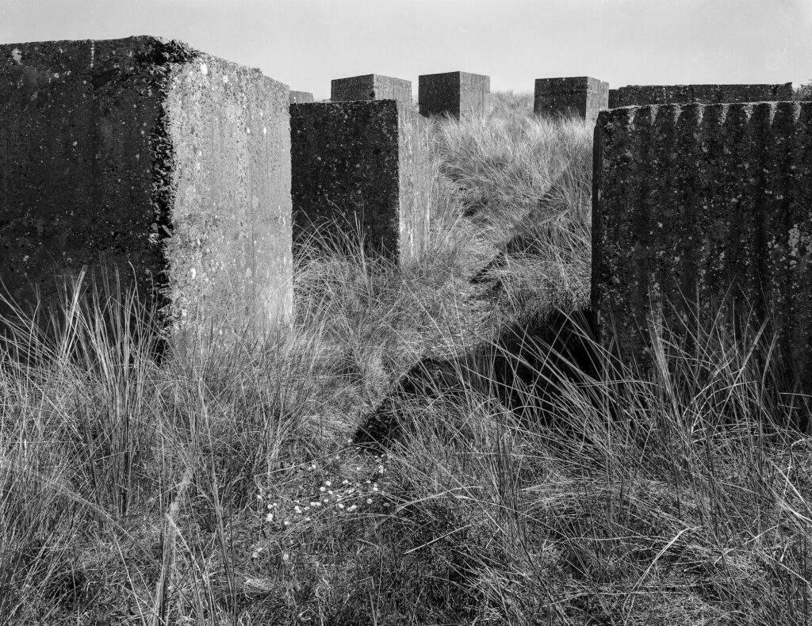

> “Needing to have reality confirmed and experience enhanced by photographs is an aesthetic consumerism to which everyone is now addicted. Industrial societies turn their citizens into image-junkies; it is the most irresistible form of mental pollution.”
> 
> Susan Sontag **1977**

https://youtu.be/8gdJiNqP35k

It is worth dwelling on the date of the Susan Sontag quote. This was long before the digital age.

What should the response of a "serious" photographer be?
