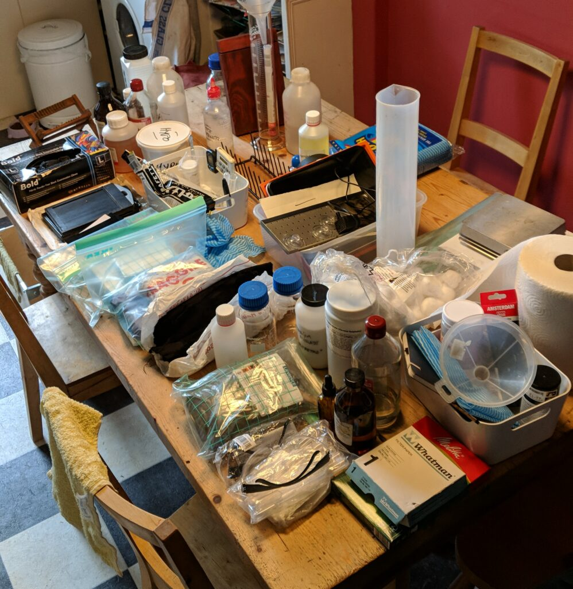
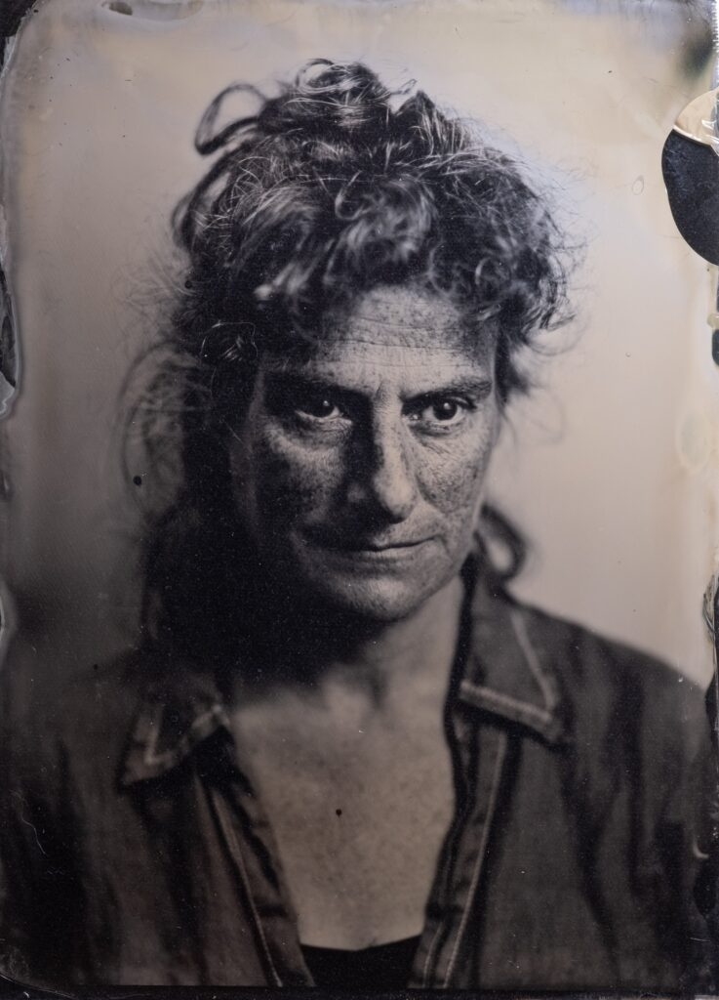

There is no doubt that making wet plate collodion photographs is a faff. I can make an image with my phone in just a few seconds. Setting up the darkroom, making a wet plate photo then packing everything away again is measured in hours. When we principally consume images on small screens the whole wet plate collodion process is just a crazy thing to do. I bother to do it because an ambrotype or tintype is a tangible, original, artifact with intrinsic meaning beyond what is conveyed by the image alone.

- **Tangible** - Perceptible by touch, accessible to experience.
- **Original** - Not a copy. Created personally by an artist.
- **Artifact** - An object made by a human being.
- **Intrinsic** \- Belonging naturally to the object itself.
- **Meaning** - Communicating something that isn't directly expressed.

If I want to make images mainly to share on-line or even print I use a digital camera or modern film.

Sorting my wet plate stuff

Demetra. My first half plate ambrotype

