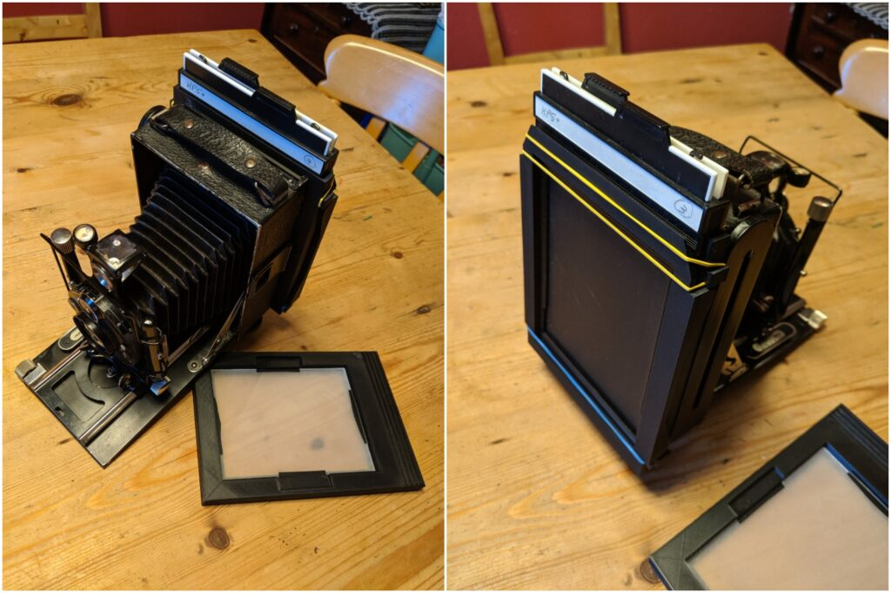

From 1913 to 1935 the German company Voigtländer manufactured a midrange plate camera called the Avus. This was before the standardisation of sheet film holders that came after WWII (I think). These cameras took 9x12cm film which was common in Europe and used by several other manufactures.

A very famous Edinburgh view with the 90 year old optics of a Voigtländer Avus f/4.5 Skopar

The Avus was really well made. I remember there was one in the house when I was growing up that was in pretty good condition but we never put any film through it. It would have been too complex when we could take and develop 35mm anyway. I'm not sure what happened to that particular camera. Today, 80+ years after they stopped being made, you can still pick up a working Avus on eBay for not too much money. The trouble is they are more or less just ornaments because you can't easily get film or developing tanks for 9x12cm film.

A few weeks ago I saw one going for a song (£45 incl. postage) which lacked either a focussing screen or any plate holders. It did have a pack film holder though and I thought I could maybe use it for wet plate collodion photography - I was also reminiscing about playing with that Avus some forty years ago. So I did some Googling around to see if I could convert the pack film holder for wet plate use and I came across a guy on [Thingiverse](https://www.thingiverse.com/) who had created a model for 3D printing [a converter back](https://www.thingiverse.com/thing:3449588) so that you could use "modern" 4x5 inch film holders on the Avus. This would be ideal as I have a bunch of 4x5 film and plate holders as well as a roll film back. It was late at night so, [reader, I bought the camera](https://en.wikipedia.org/wiki/Reader,_I_Married_Him).

The trouble is I don't have a 3D printer or space to put one even if I bought one (I mustn't) so I needed to get the parts printed. I discovered that there are POSH services where printing something like this comes in at several hundred pounds (you can buy a home 3D printer for £300) but also much cheaper services. I found a really nice guy on Gumtree who was a CAD designer by trade and had a 3D printer at home. He printed the parts for just £33. This weekend I glued them together and hey presto I have yet another working plate camera for less than £80! Plus I've had a lot of fun. I've used 21st Century technology to join a 90 year old camera to a 60+ year old film format. Soon I'll use it with a 170 year old imaging technology. It'll also be interesting to see how the low contrast, uncoated lens interacts with high contrast [Harman Direct Positive Paper](https://www.ilfordphoto.com/harman-direct-positive-paper-sheets).

