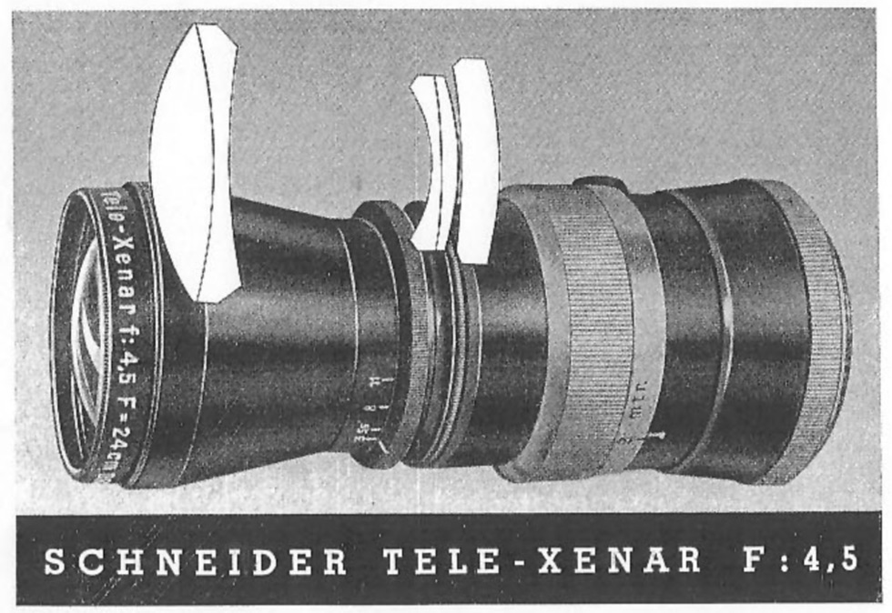

If, like me, you spend too much time and money on old large format lenses you may be frustrated that the data that used to be [hosted on the Schneider Optics site](https://www.schneideroptics.com/info/vintage_lens_data/) has disappeared. The URL now redirects to [https://schneiderkreuznach.com/](https://schneiderkreuznach.com/) I've looked around but can only find the data on the [Internet Archives Wayback Machine](https://web.archive.org/) where it is slower and trickier to access.

For your convenience and mind I therefore wrote a script and did some data knitting to create this single web page with all the old data on it. I expect someone will tell me this data is available somewhere else and I've wasted my time but it was only a couple of hours and is done now. Just search this page for the lens you are looking for.

Update: You may be interested in my [lens coverage app](http://www.hyam.net/blog/archives/3974) based on this data.

I don't believe it is possible to copyright specifications within the EU so I am free to do this. I also don't believe Scheinder would mind - but guys if you do please let me know and I'll take it down.

# Angulon

Introduced in 1930, the Angulon is the original Schneider wide-angle lens. It is a 6-element, 2-group, symmetric design. Compared to many modern wide angles, these lenses are quite compact, although the angle of coverage is only 80°. They are well color-corrected and the symmetrical design results in excellent close up performance.

* * *

[Source](https://web.archive.org/web/20150911120252/http://www.schneideroptics.com/info/vintage_lens_data/large_format_lenses/angulon/data/6,8-65mm.html)

## _Angulon 6.8/65mm_

### OPTO-MECHANICAL DATA

### (with lens focused at infinity)

|   **Lens elements, Groups**   |   6, 2   |
| :-: | --- |
|   **Shutter Size**   |   00   |
|   **Flange Focal Distance**   |   63.5mm   |
|   **Filter Mounting Thread**   |   M 30.5 X 0.5   |
|   **Weight (with shutter)**   |   80g   |
|   **Overall Length**   |   21mm   |

### IMAGE DATA

### (with lens focused at infinity)

|   **Recommended Format (negative) Size**   |   65 X 90 mm   |
| --- | --- |
|   **Image Circle Diameter at f/16**   |   109mm   |
|   **Angle of View at f/16**   |   81 degrees   |
|   **Lens Displacement at f/16 (vertical/horizontal)**   | \_ |
|   **56 X 72 mm ; 56 X 72 mm**   |   13/11mm   |
|   **65 X 90 mm ; 58.2 X 81 mm**   |   8/6mm   |

### OPTICAL DATA

### (with lens focused at infinity)

|   **Effective Focal Length (F')**   |   64.5mm   |
| --- | --- |
|   **Back Focal Length (S'F')**   |   60.3mm   |
|   **Principal Point Separation (HH')**   |   2.0mm   |

* * *

[Source](https://web.archive.org/web/20160313022207/http://schneideroptics.com/info/vintage_lens_data/large_format_lenses/angulon/data/6,8-90mm.html)

## _Angulon 6.8/90mm_

### OPTO-MECHANICAL DATA

### (with lens focused at infinity)

|   **Lens elements, Groups**   |   6, 2   |
| :-: | --- |
|   **Shutter Size**   |   0   |
|   **Flange Focal Distance**   |   90mm   |
|   **Filter Mounting Thread**   |   M 40.5 X 0.5   |
|   **Weight (with shutter)**   |   130g   |
|   **Overall Length**   |   25mm   |

### IMAGE DATA

### (with lens focused at infinity)

|   **Recommended Format (negative) Size**   |   90 X 120 mm   |
| --- | --- |
|   **Image Circle Diameter at f/16**   |   154mm   |
|   **Angle of View at f/16**   |   81 degrees   |
|   **Lens Displacement at f/16 (vertical/horizontal)**   | \_ |
|   **56 X 72 mm ; 56 X 72 mm**   |   40/35mm   |
|   **65 X 90 mm ; 58.2 X 81 mm**   |   36/30mm   |
|   **90 X 120 mm ; 83.5 X 114 mm**   |   10/8mm   |

### OPTICAL DATA

### (with lens focused at infinity)

|   **Effective Focal Length (F')**   |   90.4mm   |
| --- | --- |
|   **Back Focal Length (S'F')**   |   84.7mm   |
|   **Principal Point Separation (HH')**   |   2.7mm   |

* * *

[Source](https://web.archive.org/web/20150911120241/http://www.schneideroptics.com/info/vintage_lens_data/large_format_lenses/angulon/data/6,8-120mm.html)

## _Angulon 6.8/120mm_

### OPTO-MECHANICAL DATA

### (with lens focused at infinity)

|   **Lens elements, Groups**   |   6, 2   |
| :-: | --- |
|   **Shutter Size**   |   I   |
|   **Flange Focal Distance**   |   121mm   |
|   **Filter Mounting Thread**   |   M 49 X 0.75   |
|   **Weight (with shutter)**   |   225g   |
|   **Overall Length**   |   30mm   |

### IMAGE DATA

### (with lens focused at infinity)

|   **Recommended Format (negative) Size**   |   130 X 180 mm   |
| --- | --- |
|   **Image Circle Diameter at f/16**   |   211mm   |
|   **Angle of View at f/16**   |   83 degrees   |
|   **Lens Displacement at f/16 (vertical/horizontal)**   | \_ |
|   **65 X 90 mm ; 58.2 X 81 mm**   |   68/61mm   |
|   **90 X 120 mm ; 83.5 X 114 mm**   |   47/40mm   |
|   **4 X 5" ; 94.4 X 120.3 mm**   |   34/28mm   |
|   **5 X 7" ; 118.8 X 167 mm**   |   5/4mm   |
|   **130 X 180 mm ; 122 X 172 mm**   |   \_   |

### OPTICAL DATA

### (with lens focused at infinity)

|   **Effective Focal Length (F')**   |   119mm   |
| --- | --- |
|   **Back Focal Length (S'F')**   |   112mm   |
|   **Principal Point Separation (HH')**   |   3.6mm   |

* * *

[Source](https://web.archive.org/web/20150911120246/http://www.schneideroptics.com/info/vintage_lens_data/large_format_lenses/angulon/data/6,8-165mm.html)

## _Angulon 6.8/165mm_

### OPTO-MECHANICAL DATA

### (with lens focused at infinity)

|   **Lens elements, Groups**   |   6, 2   |
| :-: | --- |
|   **Shutter Size**   |   II 5/2   |
|   **Flange Focal Distance**   |   166mm   |
|   **Filter Mounting Thread**   |   M 58 X 0.75   |
|   **Weight (with shutter)**   |   310g   |
|   **Overall Length**   |   35mm   |

### IMAGE DATA

### (with lens focused at infinity)

|   **Recommended Format (negative) Size**   |   180 X 240 mm   |
| --- | --- |
|   **Image Circle Diameter at f/16**   |   300mm   |
|   **Angle of View at f/16**   |   84 degrees   |
|   **Lens Displacement at f/16 (vertical/horizontal)**   | \_ |
|   **90 X 120 mm ; 83.5 X 114 mm**   |   97/87mm   |
|   **4 X 5" ; 94.4 X 120.3 mm**   |   82/70mm   |
|   **5 X 7" ; 118.8 X 167 mm**   |   65/55mm   |
|   **130 X 180 mm ; 122 X 172 mm**   |   62/51mm   |
|   **180 X 240 mm ; 172 X 232 mm**   |   9/7mm   |

### OPTICAL DATA

### (with lens focused at infinity)

|   **Effective Focal Length (F')**   |   167mm   |
| --- | --- |
|   **Back Focal Length (S'F')**   |   154mm   |
|   **Principal Point Separation (HH')**   |   4.5mm   |

* * *

[Source](https://web.archive.org/web/20150910173209/http://www.schneideroptics.com/info/vintage_lens_data/large_format_lenses/angulon/data/6,8-210mm.html)

## _Angulon 6.8/210mm_

### OPTO-MECHANICAL DATA

### (with lens focused at infinity)

|   **Lens elements, Groups**   |   6, 2   |
| :-: | --- |
|   **Shutter Size**   |   III 7   |
|   **Flange Focal Distance**   |   213mm   |
|   **Filter Mounting Thread**   |   M 67 X 0.75   |
|   **Weight (with shutter)**   |   475g   |
|   **Overall Length**   |   48mm   |

### IMAGE DATA

### (with lens focused at infinity)

|   **Recommended Format (negative) Size**   |   240 X 300 mm   |
| --- | --- |
|   **Image Circle Diameter at f/16**   |   382mm   |
|   **Angle of View at f/16**   |   85 degrees   |
|   **Lens Displacement at f/16 (vertical/horizontal)**   | \_ |
|   **180 X 240 mm ; 172 X 232 mm**   |   65/54mm   |
|   **8 X 10" ; 194.7 X 243.2 mm**   |   60/49mm   |

### OPTICAL DATA

### (with lens focused at infinity)

|   **Effective Focal Length (F')**   |   208mm   |
| --- | --- |
|   **Back Focal Length (S'F')**   |   196mm   |
|   **Principal Point Separation (HH')**   |   6.2mm   |

* * *

# M-Componon

The M-Componon is a special-purpose large format macro lens, designed for greater than 1:1 reproduction. The lenses are intended for use with 6×9 cm, 4×5 inch, and 5×7 inch formats.

* * *

[Source](https://web.archive.org/web/20120501060541/http://www.schneideroptics.com/info/vintage_lens_data/large_format_lenses/m-componon/data/4-28mm.html)

## _M-Componon 4/28mm_

### Minimum Magnifications for negative sizes (mm x mm)

|   **Lens**   |   **65 x 90**   |   **90 x 120**   |   **130 x 180**   |
| --- | --- | --- | --- |
| M-Componon 28mm/4.0 |   3.6x   |   5.1x   |   7.4x   |
| M-Componon 50mm/4.0 |   1.8x   |   2.3x   |   3.5x   |
| M-Componon 80mm/4.0 |   1.0x   |   1.2x   |   1.9x   |

### Engraved Apertures

|   **Engraved Aperture**   |   **Relative Aperture**   |
| --- | --- |
|   1   |   f/4.0   |
|   2   |   f/5.6   |
|   4   |   f/8   |
|   8   |   f/11   |
|   16   |   f/16   |
|   32   |   f/32   |

### Depth of Field in mm

|   **Reproduction   Ratio**   |   **Engraved Apertures**   |  |  |  |  |  |
| --- | --- | --- | --- | --- | --- | --- |
|   **1**   |   **2**   |   **4**   |   **8**   |   **16**   |   **32**   |
|   **1:1**   |   1.6   |   2.2   |   3.2   |   4.4   |   6.4   |   8.8   |
|   **1.5:1**   |   0.9   |   1.2   |   1.8   |   2.4   |   3.6   |   4.9   |
|   **2:1**   |   0.6   |   0.8   |   1.2   |   1.7   |   2.4   |   3.3   |
|   **2.5:1**   |   0.4   |   0.6   |   0.9   |   1.2   |   1.8   |   2.5   |
|   **3:1**   |   0.4   |   0.5   |   0.7   |   1.0   |   1.4   |   2.0   |
|   **4:1**   |   0.3   |   0.4   |   0.5   |   0.7   |   1.0   |   1.4   |
|   **5:1**   |   0.2   |   0.3   |   0.4   |   0.5   |   0.8   |   1.1   |
|   **6:1**   |   0.2   |   0.2   |   0.3   |   0.4   |   0.6   |   \- |
|   **7:1**   |   0.1   |   0.2   |   0.3   |   0.4   |   0.5   |   \- |
|   **8:1**   |   0.1   |   0.2   |   0.2   |   0.3   |   0.5   |   \- |
|   **10:1**   |   0.1   |   0.1   |   0.2   |   0.2   |   \- |   \- |
|   **12:1**   |   0.1   |   0.1   |   0.1   |   0.2   |   \- |   \- |
|   **16:1**   |   0.1   |   0.1   |   0.1   |   \- |   \- |   \- |
|   **20:1**   |   0.0   |   0.1   |   \- |   \- |   \- |   \- |

### Optical Data

|    |    |    |    |    |   **Object field for negative size**   |  |  |
| --- | --- | --- | --- | --- | --- | --- | --- |
|   **Reproduction Ratio**   |   **Flange Focal Distance**   |   **Subject to Film Distance**   |   **Working Distance**   |   **Multiplying factor for exposure time**   |   **65x90**   |   **90x120**   |   **130x180**   |
|   **4:1**   |   140   |   181   |   21.3   |   25   |   14.5x20.3   |   \- |   \- |
|   **6:1**   |   199   |   238   |   18.8   |   50   |   9.7x13.5   |   13.8x19.0   |   \- |
|   **8:1**   |   258   |   295   |   17.6   |   80   |   7.2x10.1   |   10.4x14.3   |   15.2x21.4   |
|   **10:1**   |   317   |   354   |   16.9   |   120   |   5.8x8.1   |   8.3x11.4   |   12.2x17.1   |
|   **12:1**   |   378   |   412   |   16.4   |   170   |   4.8x6.7   |   6.9x9.5   |   10.2x14.2   |
|   **16:1**   |   494   |   530   |   15.7   |   300   |   3.6x5.1   |   5.2x7.1   |   7.6x10.7   |
|   **20:1**   |   612   |   647   |   15.4   |   440   |   2.9x4.0   |   4.2x5.7   |   6.1x8.5   |

* * *

# Super-Angulon

These are wide-angle lenses of modern design which have substantially greater coverage than the Angulons. The f/4 lenses give 95° of coverage, the f/8 lens series gives 100° coverage, and the f/5.6 lenses give a 105° coverage. The f/4 and f/5.6 lenses are 8-element, 4-group designs. The f/8 lenses are 6-element in 4 groups. Super-Angulons have been multicoated. since the late 70s.

* * *

[Source](https://web.archive.org/web/20130802002250/http://www.schneideroptics.com/info/vintage_lens_data/large_format_lenses/super-angulon/data/4-53mm.html)

## _Super-Angulon 4/53mm_

### OPTO-MECHANICAL DATA

### (with lens focused at infinity)

|   **Lens elements, Groups**   |   8, 4   |
| --- | --- |
|   **Shutter Size**   |   0   |
|   **Flange Focal Distance**   |   70.2mm   |
|   **Filter Mounting Thread**   |   M 67 X 0.75   |
|   **Weight (with shutter)**   |   465g   |
|   **Overall Length**   |   104mm   |

### IMAGE DATA

### (with lens focused at infinity)

|   **Recommended Format (negative) Size**   |   56 X 72 mm   |
| --- | --- |
|   **Image Circle Diameter at f/16**   |   115mm   |
|   **Angle of View at f/16**   |   95 degrees   |
|   **Lens Displacement at f/16 (vertical/horizontal)**   | \_ |
|   **56 X 72 mm ; 56 X 72 mm**   |   16.8/14.2mm   |
|   **65 X 90 mm ; 58.2 X 81 mm**   |   11.7/9.1mm   |

### OPTICAL DATA

### (with lens focused at infinity)

|   **Effective Focal Length (F')**   |   52.7mm   |
| --- | --- |
|   **Back Focal Length (S'F')**   |   24.2mm   |
|   **Principal Point Separation (HH')**   |   47.7mm   |

* * *

[Source](https://web.archive.org/web/20160412220753/http://schneideroptics.com/info/vintage_lens_data/large_format_lenses/super-angulon/data/5.6-47mm.html)

## _Super-Angulon 5.6/47mm_

### Stats in Copal Shutter

### OPTO-MECHANICAL DATA

### (with lens focused at infinity)

|   |   **Coated**   | **MC** |
| --- | --- | --- |
|   **Lens elements, Groups**   |   8, 4   | 8, 4 |
|   **Shutter Size**   |   00\*   |   0   |
|   **Flange Focal Distance**   |   51.6mm   |   52.2mm   |
|   **Filter Mounting Thread**   |   M 49 X 0.75   |   M 49 X 0.75   |
|   **Weight (with shutter)**   |   165g   |   235g   |
|   **Overall Length**   |   51.3mm   |   54.7mm   |
|   ##### \*Compur 00   |   |   |

### IMAGE DATA

### (with lens focused at infinity)

|   |   **Coated**   | **MC** |
| --- | --- | --- |
|   **Recommended Format (negative) Size**   |   65 X 90 mm   |   65 X 90 mm   |
|   **Image Circle Diameter at f/22**   |   123mm   |   123mm   |
|   **Angle of View at f/22**   |   105 degrees   |   105 degrees   |
|   **Lens Displacement at f/22 (vertical/horizontal)**   | \_ | \_ |
|   **56 X 72 mm ; 56 X 72 mm**   |   21.9/18.8mm   |   21/18mm   |
|   **65 X 90 mm ; 58.2 X 81 mm**   |   17.2/13.7mm   |   17/13mm   |

### OPTICAL DATA

### (with lens focused at infinity)

|   | **Coated** | **MC** |
| --- | --- | --- |
|   **Effective Focal Length (F')**   |   47.2mm   |   47.5mm   |
|   **Back Focal Length (S'F')**   |   32mm   |   30.8mm   |
|   **Principal Point Separation (HH')**   |   18.3mm   |   20.8mm   |

* * *

[Source](https://web.archive.org/web/20130802002258/http://www.schneideroptics.com/info/vintage_lens_data/large_format_lenses/super-angulon/data/5.6-65mm.html)

## _Super-Angulon 5.6/65mm_

### Stats in Copal Shutter

### OPTO-MECHANICAL DATA

### (with lens focused at infinity)

|   | **Coated** | **MC** |
| --- | --- | --- |
|   **Lens elements, Groups**   |   8, 4   |   8, 4   |
|   **Shutter Size**   |   0   |   0   |
|   **Flange Focal Distance**   |   71mm   |   72.5mm   |
|   **Filter Mounting Thread**   |   M 67 X 0.75   |   M 67 X 0.75   |
|   **Weight (with shutter)**   |   323g   |   380g   |
|   **Overall Length**   |   69mm   |   78mm   |

### IMAGE DATA

### (with lens focused at infinity)

|   | **Coated** | **MC** |
| --- | --- | --- |
|   **Recommended Format (negative) Size**   |   65 X 90 mm   |   65 X 90 mm   |
|   **Image Circle Diameter at f/22**   |   170mm   |   170mm   |
|   **Angle of View at f/22**   |   105 degrees   |   105 degrees   |
|   **Lens Displacement at f/22 (vertical/horizontal)**   | \_ | \_ |
|   **56 X 72 mm ; 56 X 72 mm**   |   49.0/44.3mm   |   49/44mm   |
|   **65 X 90 mm ; 58.2 X 81 mm**   |   45.6/39.4mm   |   45/39mm   |
|   **90 X 120 mm ; 83.5 X 114 mm**   |   21.3/17.0mm   |   21/17mm   |
|   **4 X 5" ; 94.4 X 120.3 mm**   |   12.9/10.5mm   |   12/10mm   |

### OPTICAL DATA

### (with lens focused at infinity)

|   | **Coated** | **MC** |
| --- | --- | --- |
|   **Effective Focal Length (F')**   |   65.3mm   |   65.3mm   |
|   **Back Focal Length (S'F')**   |   44.3mm   |   43.4mm   |
|   **Principal Point Separation (HH')**   |   25.2mm   |   26.9mm   |

* * *

[Source](https://web.archive.org/web/20160412220753/http://schneideroptics.com/info/vintage_lens_data/large_format_lenses/super-angulon/data/5.6-75mm.html)

## _Super-Angulon 5.6/75mm_

### Stats in Copal Shutter

### OPTO-MECHANICAL DATA

### (with lens focused at infinity)

|   | **Coated** | **MC** |
| --- | --- | --- |
|   **Lens elements, Groups**   |   8, 4   |   8, 4   |
|   **Shutter Size**   |   0+1   |   0   |
|   **Flange Focal Distance**   |   82.4mm   |   84.8mm   |
|   **Filter Mounting Thread**   |   M 67 X 0.75   |   M 67 X 0.75   |
|   **Weight (with shutter)**   |   371g   |   380g   |
|   **Overall Length**   |   77mm   |   78mm   |

### IMAGE DATA

### (with lens focused at infinity)

|   | **Coated** | **MC** |
| --- | --- | --- |
|   **Recommended Format (negative) Size**   |   90 X 120 mm   |   90 X 120 mm   |
|   **Image Circle Diameter at f/22**   |   198mm   |   198mm   |
|   **Angle of View at f/22**   |   105 degrees   |   105 degrees   |
|   **Lens Displacement at f/22 (vertical/horizontal)**   | \_ |   |
|   **56 X 72 mm ; 56 X 72 mm**   |   64.2/59.0mm   |   |
|   **65 X 90 mm ; 58.2 X 81 mm**   |   61.2/54.1mm   |   61/54mm   |
|   **90 X 120 mm ; 83.5 X 114 mm**   |   39.2/32.8mm   |   39/32mm   |
|   **4 X 5" ; 94.4 X 120.3 mm**   |   31.4/26.9mm   |   30/26mm   |

### OPTICAL DATA

### (with lens focused at infinity)

|   | **Coated** | **MC** |
| --- | --- | --- |
|   **Effective Focal Length (F')**   |   76mm   |   75.7mm   |
|   **Back Focal Length (S'F')**   |   51.2mm   |   50.7mm   |
|   **Principal Point Separation (HH')**   |   29.1mm   |   29.6mm   |

* * *

[Source](https://web.archive.org/web/20160412220753/http://schneideroptics.com/info/vintage_lens_data/large_format_lenses/super-angulon/data/8-90mm.html)

## _Super-Angulon 8/90mm_

### Stats in Copal Shutter

### OPTO-MECHANICAL DATA

### (with lens focused at infinity)

|   | **Coated** | **MC** |
| --- | --- | --- |
|   **Lens elements, Groups**   |   6, 4   |   6, 4   |
|   **Shutter Size**   |   0+1   |   0   |
|   **Flange Focal Distance**   |   99.0mm   |   98.8mm   |
|   **Filter Mounting Thread**   |   M 67 X 0.75   |   M 67 X 0.75   |
|   **Weight (with shutter)**   |   363g   |   390g   |
|   **Overall Length**   |   78mm   |   74.9mm   |

### IMAGE DATA

### (with lens focused at infinity)

|   | **Coated** | **MC** |
| --- | --- | --- |
|   **Recommended Format (negative) Size**   |   130 X 180 mm   |   130 X 180 mm   |
|   **Image Circle Diameter at f/22**   |   216mm   |   216mm   |
|   **Angle of View at f/22**   |   100 degrees   |   100 degrees   |
|   **Lens Displacement at f/22 (vertical/horizontal)**   | \_ | \_ |
|   **5 X 7" ; 118.8 X 167 mm**   |   5.5/4mm   |   5/4mm   |
|   **130 X 180 mm ; 122 X 172 mm**   |   4.3/3.1mm   |   4/3mm   |

### OPTICAL DATA

### (with lens focused at infinity)

|   | **Coated** | **MC** |
| --- | --- | --- |
|   **Effective Focal Length (F')**   |   90.7mm   |   90.4mm   |
|   **Back Focal Length (S'F')**   |   66.3mm   |   67.0mm   |
|   **Principal Point Separation (HH')**   |   30mm   |   26.9mm   |

* * *

[Source](https://web.archive.org/web/20130802002212/http://www.schneideroptics.com/info/vintage_lens_data/large_format_lenses/super-angulon/data/8-120mm.html)

## _Super-Angulon 8/120mm_

### Stats in Copal Shutter

### OPTO-MECHANICAL DATA

### (with lens focused at infinity)

|   | **MC** |
| --- | --- |
|   **Lens elements, Groups**   |   6, 4   |
|   **Shutter Size**   |   0   |
|   **Flange Focal Distance**   |   133.1mm   |
|   **Filter Mounting Thread**   |   M82 X 0.75   |
|   **Weight (with shutter)**   |   700g   |
|   **Overall Length**   |   96.1mm   |

### IMAGE DATA

### (with lens focused at infinity)

|   | **MC** |
| --- | --- |
|   **Recommended Format (negative) Size**   |   180 X 240 mm   |
|   **Image Circle Diameter at f/22**   |   288mm   |
|   **Angle of View at f/22**   |   100 degrees   |
|   **Lens Displacement at f/22 (vertical/horizontal)**   | \_ |
|   **90 X 120 mm ; 83.5 X 114 mm**   |   91/81mm   |
|   **4 X 5" ; 94.4 X 120.3 mm**   |   83/76mm   |

### OPTICAL DATA

### (with lens focused at infinity)

|   | **MC** |
| --- | --- |
|   **Effective Focal Length (F')**   |   121.4mm   |
|   **Back Focal Length (S'F')**   |   90.2mm   |
|   **Principal Point Separation (HH')**   |   35.1mm   |

* * *

[Source](https://web.archive.org/web/20160412220753/http://schneideroptics.com/info/vintage_lens_data/large_format_lenses/super-angulon/data/8-121mm.html)

## _Super-Angulon 8/121mm_

### Stats in Copal Shutter

### OPTO-MECHANICAL DATA

### (with lens focused at infinity)

|   | **Coated** |
| --- | --- |
|   **Lens elements, Groups**   |   6, 4   |
|   **Shutter Size**   |   0+1   |
|   **Flange Focal Distance**   |   134.2mm   |
|   **Filter Mounting Thread**   |   M 77 X 0.75   |
|   **Weight (with shutter)**   |   516g   |
|   **Overall Length**   |   104.5mm   |

### IMAGE DATA

### (with lens focused at infinity)

|   | **Coated** |
| --- | --- |
|   **Recommended Format (negative) Size**   |   180 X 240 mm   |
|   **Image Circle Diameter at f/22**   |   288.4mm   |
|   **Angle of View at f/22**   |   100 degrees   |
|   **Lens Displacement at f/22 (vertical/horizontal)**   | \_ |
|   **90 X 120 mm ; 83.5 X 114 mm**   |   92/82mm   |
|   **4 X 5" ; 94.4 X 120.3 mm**   |   84.3/76.6mm   |

### OPTICAL DATA

### (with lens focused at infinity)

|   | **Coated** |
| --- | --- |
|   **Effective Focal Length (F')**   |   121.6mm   |
|   **Back Focal Length (S'F')**   |   88.5mm   |
|   **Principal Point Separation (HH')**   |   40mm   |

* * *

[Source](https://web.archive.org/web/20160412220753/http://schneideroptics.com/info/vintage_lens_data/large_format_lenses/super-angulon/data/8-165mm.html)

## _Super-Angulon 8/165mm_

### Stats in Copal Shutter

### OPTO-MECHANICAL DATA

### (with lens focused at infinity)

|   | **Coated** | **MC** |
| --- | --- | --- |
|   **Lens elements, Groups**   |   6, 4   |   6, 4   |
|   **Shutter Size**   |   3   |   3   |
|   **Flange Focal Distance**   |   180mm   |   179.2mm   |
|   **Filter Mounting Thread**   |   M 105 X 1   |   M 110 X 1   |
|   **Weight (with shutter)**   |   1550g   |   1605g   |
|   **Overall Length**   |   144mm   |   135.5mm   |

### IMAGE DATA

### (with lens focused at infinity)

|   | **Coated** | **MC** |
| --- | --- | --- |
|   **Recommended Format (negative) Size**   |   240 X 300 mm   |   240 X 300 mm   |
|   **Image Circle Diameter at f/22**   |   394mm   |   395mm   |
|   **Angle of View at f/22**   |   100 degrees   |   100 degrees   |
|   **Lens Displacement at f/22 (vertical/horizontal)**   | \_ | \_ |
|   **180 X 240 mm ; 172 X 232 mm**   |   73.2/61.2mm   |   73/61mm   |
|   **8 X 10" ; 194.7 X 243.2 mm**   |   57.6/49.7mm   |   56/48mm   |

### OPTICAL DATA

### (with lens focused at infinity)

|   | **Coated** | **MC** |
| --- | --- | --- |
|   **Effective Focal Length (F')**   |   165mm   |   165.7mm   |
|   **Back Focal Length (S'F')**   |   120.4mm   |   123.2mm   |
|   **Principal Point Separation (HH')**   |   55mm   |   47.8mm   |

* * *

[Source](https://web.archive.org/web/20130802002233/http://www.schneideroptics.com/info/vintage_lens_data/large_format_lenses/super-angulon/data/8-210mm.html)

## _Super-Angulon 8/210mm_

### Stats in Copal Shutter

### OPTO-MECHANICAL DATA

### (with lens focused at infinity)

|   | **Coated** | **MC** |
| --- | --- | --- |
|   **Lens elements, Groups**   |   6, 4   |   6, 4   |
|   **Shutter Size**   |   3   |   3   |
|   **Flange Focal Distance**   |   228mm   |   229.4mm   |
|   **Filter Mounting Thread**   |   M 127 X 1   |   M 135 X 1   |
|   **Weight (with shutter)**   |   2380g   |   3065g   |
|   **Overall Length**   |   180mm   |   169.5mm   |

### IMAGE DATA

### (with lens focused at infinity)

|   | **Coated** | **MC** |
| --- | --- | --- |
|   **Recommended Format (negative) Size**   |   300 X 400 mm   |   300 X 400 mm   |
|   **Image Circle Diameter at f/22**   |   500mm   |   500mm   |
|   **Angle of View at f/22**   |   100 degrees   |   100 degrees   |
|   **Lens Displacement at f/22 (vertical/horizontal)**   | \_ | \_ |
|   **180 X 240 mm ; 172 X 232 mm**   |   141/121mm   |   136/120mm   |
|   **8 X 10" ; 194.7 X 243.2 mm**   |   121/109mm   |   121/108mm   |

### OPTICAL DATA

### (with lens focused at infinity)

|   | **Coated** | **MC** |
| --- | --- | --- |
|   **Effective Focal Length (F')**   |   210mm   |   210.2mm   |
|   **Back Focal Length (S'F')**   |   153mm   |   156.6mm   |
|   **Principal Point Separation (HH')**   |   70mm   |   60.5mm   |

* * *

# Symmar

The Symmar was originally introduced in 1920. It is a 6-element, 4-group, symmetric design with a 70° angle of coverage. The Symmar lenses are "convertable". Like most large format lenses they are constructed with two cells which fit into the front and back of a shutter. By removing one of these cells and using only half the lens, the user can create a lens with substantially longer focal length. The resulting longer focal length lens will produce a softer image that can be useful for portrait photography.

* * *

[Source](https://web.archive.org/web/20160412220746/http://schneideroptics.com/info/vintage_lens_data/large_format_lenses/symmar/data/5,6-80mm.html)

## _Symmar 5.6/80mm_

### OPTO-MECHANICAL DATA

### (with lens focused at infinity)

|   **Lens elements, Groups**   |   6, 4   |
| --- | --- |
|   **Shutter Size**   |   0   |
|   **Flange Focal Distance**   |   75.7mm   |
|   **Filter Mounting Thread**   |   M 40.5 X 0.5   |
|   **Weight (with shutter)**   |   230g   |
|   **Overall Length**   |   36mm   |

### IMAGE DATA

### (with lens focused at infinity)

|   **Recommended Format (negative) Size**   |   56 X 72 mm   |
| --- | --- |
|   **Image Circle Diameter at f/16**   |   110.6mm   |
|   **Angle of View at f/16**   |   70 degrees   |
|   **Lens Displacement at f/16 (vertical/horizontal)**   | \_ |
|   **56 X 72 mm ; 56 X 72 mm**   |   14.0/11.7mm   |

### OPTICAL DATA

### (with lens focused at infinity)

|   **Effective Focal Length (F')**   |   79mm   |
| --- | --- |
|   **Back Focal Length (S'F')**   |   66.2mm   |
|   **Principal Point Separation (HH')**   |   1.4mm   |

* * *

[Source](https://web.archive.org/web/20120402234949/http://www.schneideroptics.com/info/vintage_lens_data/large_format_lenses/symmar/data/5,6-100mm.html)

## _Symmar 5.6/100mm_

### OPTO-MECHANICAL DATA

### (with lens focused at infinity)

|   **Lens elements, Groups**   |   6, 4   |
| --- | --- |
|   **Shutter Size**   |   0   |
|   **Flange Focal Distance**   |   99.1mm   |
|   **Filter Mounting Thread**   |   M 40.5 X 0.5   |
|   **Weight (with shutter)**   |   225g   |
|   **Overall Length**   |   40mm   |

### IMAGE DATA

### (with lens focused at infinity)

|   **Recommended Format (negative) Size**   |   65 X 90 mm   |
| --- | --- |
|   **Image Circle Diameter at f/16**   |   143.2mm   |
|   **Angle of View at f/16**   |   70 degrees   |
|   **Lens Displacement at f/16 (vertical/horizontal)**   | \_ |
|   **56 X 72 mm ; 56 X 72 mm**   |   37.0/33.0mm   |
|   **65 X 90 mm ; 58.2 X 81 mm**   |   33.4/28.1mm   |

### OPTICAL DATA

### (with lens focused at infinity)

|   **Effective Focal Length (F')**   |   102.3mm   |
| --- | --- |
|   **Back Focal Length (S'F')**   |   85.9mm   |
|   **Principal Point Separation (HH')**   |   1.8mm   |

* * *

[Source](https://web.archive.org/web/20120502214703/http://www.schneideroptics.com/info/vintage_lens_data/large_format_lenses/symmar/data/5,6-135mm.html)

## _Symmar 5.6/135mm_

### OPTO-MECHANICAL DATA

### (with lens focused at infinity)

|   **Lens elements, Groups**   |   6, 4   |
| --- | --- |
|   **Shutter Size**   |   0   |
|   **Flange Focal Distance**   |   131mm   |
|   **Filter Mounting Thread**   |   M 40.5 X 0.5   |
|   **Weight (with shutter)**   |   230g   |
|   **Overall Length**   |   44mm   |

### IMAGE DATA

### (with lens focused at infinity)

|   **Recommended Format (negative) Size**   |   90 X 120 mm   |
| --- | --- |
|   **Image Circle Diameter at f/16**   |   190mm   |
|   **Angle of View at f/16**   |   70 degrees   |
|   **Lens Displacement at f/16 (vertical/horizontal)**   | \_ |
|   **90 X 120 mm ; 83.5 X 114 mm**   |   34.2/28.3mm   |
|   **4 X 5" ; 94.4 X 120.3 mm**   |   26.3/22.3mm   |

### OPTICAL DATA

### (with lens focused at infinity)

|   **Effective Focal Length (F')**   |   135.5mm   |
| --- | --- |
|   **Back Focal Length (S'F')**   |   113mm   |
|   **Principal Point Separation (HH')**   |   2.9mm   |

* * *

[Source](https://web.archive.org/web/20160412220746/http://schneideroptics.com/info/vintage_lens_data/large_format_lenses/symmar/data/5,6-150mm.html)

## _Symmar 5.6/150mm_

### OPTO-MECHANICAL DATA

### (with lens focused at infinity)

|   **Lens elements, Groups**   |   6, 4   |
| --- | --- |
|   **Shutter Size**   |   I+1   |
|   **Flange Focal Distance**   |   146.5mm   |
|   **Filter Mounting Thread**   |   M 49 X 0.75   |
|   **Weight (with shutter)**   |   300g   |
|   **Overall Length**   |   47mm   |

### IMAGE DATA

### (with lens focused at infinity)

|   **Recommended Format (negative) Size**   |   90 X 120 mm   |
| --- | --- |
|   **Image Circle Diameter at f/16**   |   210mm   |
|   **Angle of View at f/16**   |   70 degrees   |
|   **Lens Displacement at f/16 (vertical/horizontal)**   | \_ |
|   **90 X 120 mm ; 83.5 X 114 mm**   |   46.4/39.3mm   |
|   **4 X 5" ; 94.4 X 120.3 mm**   |   38.8/33.6mm   |

### OPTICAL DATA

### (with lens focused at infinity)

|   **Effective Focal Length (F')**   |   150mm   |
| --- | --- |
|   **Back Focal Length (S'F')**   |   125mm   |
|   **Principal Point Separation (HH')**   |   3.3mm   |

* * *

[Source](https://web.archive.org/web/20160412220746/http://schneideroptics.com/info/vintage_lens_data/large_format_lenses/symmar/data/5,6-180mm.html)

## _Symmar 5.6/180mm_

### OPTO-MECHANICAL DATA

### (with lens focused at infinity)

|   **Lens elements, Groups**   |   6, 4   |
| --- | --- |
|   **Shutter Size**   |   I+1   |
|   **Flange Focal Distance**   |   178mm   |
|   **Filter Mounting Thread**   |   M 58 X 0.75   |
|   **Weight (with shutter)**   |   400g   |
|   **Overall Length**   |   56mm   |

### IMAGE DATA

### (with lens focused at infinity)

|   **Recommended Format (negative) Size**   |   130 X 180 mm   |
| --- | --- |
|   **Image Circle Diameter at f/16**   |   255mm   |
|   **Angle of View at f/16**   |   70 degrees   |
|   **Lens Displacement at f/16 (vertical/horizontal)**   | \_ |
|   **5 X 7" ; 118.8 X 167 mm**   |   35.6/28.1mm   |
|   **130 X 180 mm ; 122 X 172 mm**   |   31.8/24.8mm   |

### OPTICAL DATA

### (with lens focused at infinity)

|   **Effective Focal Length (F')**   |   182mm   |
| --- | --- |
|   **Back Focal Length (S'F')**   |   154mm   |
|   **Principal Point Separation (HH')**   |   4.0mm   |

* * *

[Source](https://web.archive.org/web/20130707001924/http://www.schneideroptics.com/info/vintage_lens_data/large_format_lenses/symmar/data/5,6-210mm.html)

## _Symmar 5.6/210mm_

### OPTO-MECHANICAL DATA

### (with lens focused at infinity)

|   **Lens elements, Groups**   |   6, 4   |
| --- | --- |
|   **Shutter Size**   |   I+1   |
|   **Flange Focal Distance**   |   205mm   |
|   **Filter** **Mounting Thread**   |   M 58 X 0.75   |
|   **Weight (with shutter)**   |   480g   |
|   **Overall Length**   |   64mm   |

### IMAGE DATA

### (with lens focused at infinity)

|   **Recommended Format (negative) Size**   |   130 X 180 mm   |
| --- | --- |
|   **Image Circle Diameter at f/16**   |   297mm   |
|   **Angle of View at f/16**   |   70 degrees   |
|   **Lens Displacement at f/16 (vertical/horizontal)**   | \_ |
|   **5 X 7" ; 118.8 X 167 mm**   |   63.3/52.5mm   |
|   **130 X 180 mm ; 122 X 172 mm**   |   60.0/49.4mm   |

### OPTICAL DATA

### (with lens focused at infinity)

|   **Effective Focal Length (F')**   |   212mm   |
| --- | --- |
|   **Back Focal Length (S'F')**   |   176mm   |
|   **Principal Point Separation (HH')**   |   4.6mm   |

* * *

[Source](https://web.archive.org/web/20160412220746/http://schneideroptics.com/info/vintage_lens_data/large_format_lenses/symmar/data/5,6-240mm.html)

## _Symmar 5.6/240mm_

### OPTO-MECHANICAL DATA

### (with lens focused at infinity)

|   **Lens elements, Groups**   |   6, 4   |
| --- | --- |
|   **Shutter Size**   |   II 5/2+3   |
|   **Flange Focal Distance**   |   236mm   |
|   **Filter Mounting Thread**   |   M 67 X 0.75   |
|   **Weight (with shutter)**   |   725g   |
|   **Overall Length**   |   75mm   |

### IMAGE DATA

### (with lens focused at infinity)

|   **Recommended Format (negative) Size**   |   180 X 140 mm   |
| --- | --- |
|   **Image Circle Diameter at f/16**   |   336mm   |
|   **Angle of View at f/16**   |   70 degrees   |
|   **Lens Displacement at f/16 (vertical/horizontal)**   | \_ |
|   **180 X 240 mm ; 172 X 232 mm**   |   35/28mm   |
|   **8 X 10" ; 194.7 X 243.2 mm**   |   18/15mm   |

### OPTICAL DATA

### (with lens focused at infinity)

|   **Effective Focal Length (F')**   |   240mm   |
| --- | --- |
|   **Back Focal Length (S'F')**   |   201mm   |
|   **Principal Point Separation (HH')**   |   4.7mm   |

* * *

[Source](https://web.archive.org/web/20160312000508/http://www.schneideroptics.com/info/vintage_lens_data/large_format_lenses/symmar/data/5,6-300mm.html)

## _Symmar 5.6/300mm_

### OPTO-MECHANICAL DATA

### (with lens focused at infinity)

|   **Lens elements, Groups**   |   6, 4   |
| --- | --- |
|   **Shutter Size**   |   3   |
|   **Flange Focal Distance**   |   284mm   |
|   **Filter Mounting Thread**   |   M 86 X 1   |
|   **Weight (with shutter)**   |   1000g   |
|   **Overall Length**   |   90mm   |

### IMAGE DATA

### (with lens focused at infinity)

|   **Recommended Format (negative) Size**   |   240 X 300 mm   |
| --- | --- |
|   **Image Circle Diameter at f/16**   |   402mm   |
|   **Angle of View at f/16**   |   70 degrees   |
|   **Lens Displacement at f/16 (vertical/horizontal)**   | \_ |
|   **5 X 7" ; 118.8 X 167 mm**   |   123/108mm   |
|   **130 X 180 mm ; 122 X 172 mm**   |   121/106mm   |
|   **180 X 240 mm ; 172 X 232 mm**   |   83.2/68mm   |
|   **8 X 10" ; 194.7 X 243.2 mm**   |   63/54mm   |

### OPTICAL DATA

### (with lens focused at infinity)

|   **Effective Focal Length (F')**   |   287mm   |
| --- | --- |
|   **Back Focal Length (S'F')**   |   242mm   |
|   **Principal Point Separation (HH')**   |   5.1mm   |

* * *

[Source](https://web.archive.org/web/20160412220746/http://schneideroptics.com/info/vintage_lens_data/large_format_lenses/symmar/data/5,6-360mm.html)

## _Symmar 5.6/360mm_

### OPTO-MECHANICAL DATA

### (with lens focused at infinity)

|   **Lens elements, Groups**   |   6, 4   |
| --- | --- |
|   **Shutter Size**   |   5FS   |
|   **Flange Focal Distance**   |   353.4mm   |
|   **Filter Mounting Thread**   |   M 105 X 1   |
|   **Weight (with shutter)**   |   1725mm   |
|   **Overall Length**   |   114mm   |

### IMAGE DATA

### (with lens focused at infinity)

|   **Recommended Format (negative) Size**   |   300 X 400 mm   |
| --- | --- |
|   **Image Circle Diameter at f/16**   |   500mm   |
|   **Angle of View at f/16**   |   70 degrees   |
|   **Lens Displacement at f/16 (vertical/horizontal)**   | \_ |
|   **180 X 240 mm ; 172 X 232 mm**   |   141/121mm   |
|   **8 X 10" ; 194.7 X 243.2 mm**   |   121/109mm   |

### OPTICAL DATA

### (with lens focused at infinity)

|   **Effective Focal Length (F')**   |   358mm   |
| --- | --- |
|   **Back Focal Length (S'F')**   |   300mm   |
|   **Principal Point Separation (HH')**   |   6.3mm   |

* * *

# Symmar-S

* * *

[Source](https://web.archive.org/web/20160412172557/http://schneideroptics.com/info/vintage_lens_data/large_format_lenses/symmar-s/data/1,5,6-100mm.html)

## _Symmar-S 5.6/100mm_

### OPTO-MECHANICAL DATA

### (with lens focused at infinity)

| **Available Mounts** | **Compur 0** | **Prontor Prof. 0** | **Copal 0** | **BK 0** |
| --- | :-: | :-: | :-: | :-: |
|   **Lens Elements, Groups**   |   6, 4   |   6, 4   | 6, 4 |   6, 4   |
| **Flange Focal Distance** | 96.6mm | 94.1mm | 96.2mm | 96.6mm |
|   **Accessory Thread**   |   M 40.5 X 0.5   |   M 40.5 X 0.5   | M 40.5 X 0.5 |   M 40.5 X 0.5   |
|   **Mounting Thread**   |   M 32.5 X 0.5   |   M 39 X 0.75   | M 32.5 X 0.5 |   M 32.5 X 0.5   |
|   **Max. f/#**   |   45   |   45   | 45 |   45   |
|   **Weight**   |   185g   |   250g   | 185g |   150g   |
|   **Overall Length**   |   38.5mm   |   38.5mm   | 38.5mm |   38.5mm   |

### IMAGE DATA

### (with lens focused at infinity)

|   **Recommended Format Size**   |   65 X 90 mm    (2.5 X 3.5") |   65 X 90 mm    (2.5 X 3.5") | 65 X  90 mm    (2.5 X 3.5") |   65 X 90 mm    (2.5 X 3.5") |
| --- | --- | --- | --- | --- |
|   **Image Circle Diameter at f/22**   | 143mm | 143mm | 143mm | 143mm |
|   **Angle of View at f/22**   | 70  degrees | 70  degrees | 70  degrees | 70  degrees |
|   **Lens Displacement at f/22 (vertical/horizontal)**   |   |   |   |   |
|   **2.25 X 3.25" ;  51 X 77 mm**   | 35/28mm | 35/28mm | 35/28mm | 35/28mm |
|   **56 X 72 mm ; 56 X 72 mm (ideal)**   | 34/30mm | 34/30mm | 34/30mm | 34/30mm |
| **2.5  X 3.5" ; 56 X 80 mm** | 31/26mm | 31/26mm | 31/26mm | 31/26mm |
| **65 X 90 mm ; 58 X 81 mm** | 30/25mm | 30/25mm | 30/25mm | 30/25mm |

### OPTICAL DATA

### (with lens focused at infinity)

|   **Effective Focal Length (F')**   |   102.1mm   |   102.1mm   | 102.1mm |   102.1mm   |
| --- | --- | --- | --- | --- |
|   **Back Focal Length (S'F')**   |   84.6mm   |   84.6mm   | 84.6mm |   84.6mm   |
|   **Principal Point Separation (HH')**   |   \-2.1mm   |   \-2.1mm   | \-2.1mm |   \-2.1mm   |

* * *

[Source](https://web.archive.org/web/20140715152302/http://www.schneideroptics.com/info/vintage_lens_data/large_format_lenses/symmar-s/data/1,5,6-120mm.html)

## _Symmar-S 5.6/120mm_

### OPTO-MECHANICAL DATA

### (with lens focused at infinity)

| **Available Mounts** | **Compur 0** | **Prontor Prof. 0** | **Copal 0** | **BK 0** |
| --- | :-: | :-: | :-: | :-: |
|   **Lens Elements, Groups**   |   6, 4   |   6, 4   | 6, 4 |   6, 4   |
| **Flange Focal Distance** | 118.3mm | 115.8mm | 117.9mm | 118.3mm |
|   **Accessory Thread**   |   M 49 X 0.75   |   M 49 X 0.75   | M 49 X 0.75 |   M 49 X 0.75   |
|   **Mounting Thread**   |   M 32.5 X 0.5   |   M 39 X 0.75   | M 32.5 X 0.5 |   M 32.5 X 0.5   |
|   **Max. f/#**   |   45   |   45   | 45 |   45   |
|   **Weight**   |   210g   |   265g   | 250g |   190g   |
|   **Overall Length**   |   45mm   |   45mm   | 45mm |   45mm   |

### IMAGE DATA

### (with lens focused at infinity)

|   **Recommended Format Size**   |   90 X 120 mm    (4 X 5") |   90 X 120 mm    (4 X 5") | 90  X 120 mm    (4 X 5") |   90 X 120 mm    (4 X 5") |
| --- | --- | --- | --- | --- |
|   **Image Circle Diameter at f/22**   | 173mm | 173mm | 173mm | 173mm |
|   **Angle of View at f/22**   | 70  degrees | 70  degrees | 70  degrees | 70  degrees |
|   **Lens Displacement at f/22 (vertical/horizontal)**   |   |   |   |   |
|   **2.25 X 3.25" ;  51 X 77 mm**   | 52/44mm | 52/44mm | 52/44mm | 52/44mm |
|   **56 X 72 mm; 56 X 72 mm (ideal)**   | 51/46mm | 51/46mm | 51/46mm | 51/46mm |
| **2.5  X 3.5" ; 56 X 80 mm** | 49/42mm | 49/42mm | 49/42mm | 49/42mm |
| **65 X 90 mm ; 58 X 81 mm** | 47/41mm | 47/41mm | 47/41mm | 47/41mm |
| **90  X 120 mm ; 83 X 114 mm** | 24/19mm | 24/19mm | 24/19mm | 24/19mm |
| **4 X 5" ; 96 X 120 mm** | 14/12mm | 14/12mm | 14/12mm | 14/12mm |

### OPTICAL DATA

### (with lens focused at infinity)

|   **Effective Focal Length (F')**   |   123.4mm   |   123.4mm   | 123.4mm |   123.4mm   |
| --- | --- | --- | --- | --- |
|   **Back Focal Length (S'F')**   |   102.1mm   |   102.1mm   | 102.1mm |   102.1mm   |
|   **Principal Point Separation (HH')**   |   \-2.7mm   |   \-2.7mm   | \-2.7mm |   \-2.7mm   |

* * *

[Source](https://web.archive.org/web/20140715152308/http://www.schneideroptics.com/info/vintage_lens_data/large_format_lenses/symmar-s/data/1,5,6-135mm.html)

## _Symmar-S 5.6/135mm_

### OPTO-MECHANICAL DATA

### (with lens focused at infinity)

| **Available Mounts** | **Compur 0** | **Prontor Prof. 0** | **Copal 0** | **BK 0** |
| --- | :-: | :-: | :-: | :-: |
|   **Lens Elements, Groups**   |   6, 4   |   6, 4   | 6, 4 |   6, 4   |
| **Flange Focal Distance** | 128.9mm | 126.4mm | 128.5mm | 96.6mm |
|   **Accessory Thread**   |   49mm   |   49mm   | 49mm |   49mm   |
|   **Mounting Thread**   |   M 32.5 X 0.5   |   M 39 X 0.75   | M 32.5 X 0.5 |   M 32.5 X 0.5   |
|   **Max. f/#**   |   45   |   45   | 45 |   45   |
|   **Weight**   |   230g   |   285g   | 130g |   196g   |
|   **Overall Length**   |   47.6mm   |   47.6mm   | 47.6mm |   47.6mm   |

### IMAGE DATA

### (with lens focused at infinity)

|   **Recommended Format Size**   |   90 X 120 mm    (4 X 5") |   90 X 120 mm    (4 X 5") | 90  X 120 mm    (4 X 5") |   90 X 120 mm    (4 X 5") |
| --- | --- | --- | --- | --- |
|   **Image Circle Diameter at f/22**   | 190mm | 190mm | 190mm | 190mm |
|   **Angle of View at f/22**   | 70  degrees | 70  degrees | 70  degrees | 70  degrees |
|   **Lens Displacement at f/22 (vertical/horizontal)**   |   |   |   |   |
|   **2.25 X 3.25" ;  51 X 77 mm**   | 61/53mm | 61/53mm | 61/53mm | 61/53mm |
|   **56 X 72 mm; 56 X 72 mm (ideal)**   | 60/55mm | 60/55mm | 60/55mm | 60/55mm |
| **2.5  X 3.5" ; 56 X 80 mm** | 58/51mm | 58/51mm | 58/51mm | 58/51mm |
| **65 X 90 mm ; 58 X 81 mm** | 57/50mm | 57/50mm | 57/50mm | 57/50mm |
| **90  X 120 mm ; 83 X 114 mm** | 35/29mm | 35/29mm | 35/29mm | 35/29mm |
| **4 X 5" ; 96 X 120 mm** | 26/22mm | 26/22mm | 26/22mm | 26/22mm |

### OPTICAL DATA

### (with lens focused at infinity)

|   **Effective Focal Length (F')**   |   135.4mm   |   135.4mm   | 135.4mm |   135.4mm   |
| --- | --- | --- | --- | --- |
|   **Back Focal Length (S'F')**   |   112.3mm   |   112.3mm   | 112.3mm |   112.3mm   |
|   **Principal Point Separation (HH')**   |   \-2.6mm   |   \-2.6mm   | \-2.6mm |   \-2.6mm   |

* * *

[Source](https://web.archive.org/web/20160412172557/http://schneideroptics.com/info/vintage_lens_data/large_format_lenses/symmar-s/data/1,5,6-150mm.html)

## _Symmar-S 5.6/150mm_

### OPTO-MECHANICAL DATA

### (with lens focused at infinity)

| **Available Mounts** | **Compur 0** | **Compur 1** | **Prontor Prof. 0** | **Copal 0** | **BK 0** |
| --- | :-: | :-: | :-: | :-: | :-: |
|   **Lens Elements, Groups**   |   6, 4   | 6, 4 |   6, 4   | 6, 4 |   6, 4   |
| **Flange Focal Distance** | 143.5mm | 142.2mm | 141.0mm | 143.1mm | 143.5mm |
|   **Accessory Thread**   |   M 58 X 0.75   | M 58 X 0.75 |   M 58 X 0.75   | M 58 X 0.75 |   M 58 X 0.75   |
|   **Mounting Thread**   | M 32.5 X 0.5 | M 39 X 0.75 | M 39 X 0.75 | M 32.5 X 0.5 | M 32.5 X 0.5 |
|   **Max. f/#**   |   64   | 64 |   64   | 64 |   64   |
|   **Weight**   |   255g   | 320g |   300g   | 250g |   220g   |
|   **Overall Length**   |   55mm   | 55mm |   55mm   | 55mm |   55mm   |

### IMAGE DATA

### (with lens focused at infinity)

|   **Recommended Format**  **Size** |   90 X 120 mm    (4 X 5") | 90 X 120 mm    (4 X 5") |   90 X 120 mm    (4 X 5") | 90  X 120 mm    (4 X 5") |   90 X 120 mm    (4 X 5") |
| --- | --- | --- | --- | --- | --- |
|   **Image Circle Diameter at f/22**   | 210mm | 210mm | 210mm | 210mm | 210mm |
|   **Angle of View at f/22**   | 70  degrees | 70  degrees | 70  degrees | 70  degrees | 70  degrees |
|   **Lens Displacement at f/22 (vertical/horizontal)**   |   |   |   |   |   |
|   **2.25 X 3.25" ;  51 X 77 mm**   | 72/63mm | 72/63mm | 72/63mm | 72/63mm | 72/63mm |
|   **56 X 72 mm; 56 X 72 mm (ideal)**   | 70/65mm | 70/65mm | 70/65mm | 70/65mm | 70/65mm |
| **2.5  X 3.5" ; 56 X 80 mm** | 69/61mm | 69/61mm | 69/61mm | 69/61mm | 69/61mm |
| **65 X 90 mm ; 58 X 81 mm** | 68/60mm | 68/60mm | 68/60mm | 68/60mm | 68/60mm |
| **90  X 120 mm ; 83 X 114 mm** | 47/39mm | 47/39mm | 47/39mm | 47/39mm | 47/39mm |
| **4 X 5" ; 96 X 120 mm** | 38/33mm | 38/33mm | 38/33mm | 38/33mm | 38/33mm |

### OPTICAL DATA

### (with lens focused at infinity)

|   **Effective Focal Length (F')**   |   150.3mm   | 150.3mm |   150.3mm   | 150.3mm |   150.3mm   |
| --- | --- | --- | --- | --- | --- |
|   **Back Focal Length (S'F')**   |   125.0mm   | 125.0mm |   125.0mm   | 125.0mm |   125.0mm   |
|   **Principal Point Separation (HH')**   |   \-2.9mm   | \-2.9mm |   \-2.9mm   | \-2.9mm |   \-2.9mm   |

* * *

[Source](https://web.archive.org/web/20140715152330/http://www.schneideroptics.com/info/vintage_lens_data/large_format_lenses/symmar-s/data/1,5,6-180mm.html)

## _Symmar-S 5.6/180mm_

### OPTO-MECHANICAL DATA

### (with lens focused at infinity)

| **Available Mounts** | **Compur 1** | **Prontor Prof. 1** | **Copal 1** | **BK 1** |
| --- | :-: | :-: | :-: | :-: |
|   **Lens Elements, Groups**   |   6, 4   |   6, 4   | 6, 4 |   6, 4   |
| **Flange Focal Distance** | 171.2mm | 169.8mm | 171.3mm | 171.2mm |
|   **Accessory Thread**   |   M 67 X 0.75   |   M 67 X 0.75   | M 67 X 0.75 |   M 67 X 0.75   |
|   **Mounting Thread**   |   M 39 X 0.75   |   M 39 X 0.75   | M 39 X 0.75 |   M 39 X 0.75   |
|   **Max. f/#**   |   64   |   64   | 64 |   64   |
|   **Weight**   |   495g   |   470g   | 450g |   405g   |
|   **Overall Length**   |   64mm   |   64mm   | 64mm |   64mm   |

### IMAGE DATA

### (with lens focused at infinity)

|   **Recommended Format Size**   |   130 X 180 mm    (5 X 7") |   130 X 180 mm    (5 X 7") | 130 X  180 mm    (5 X 7") |   130 X 180 mm    (5 X 7") |
| --- | --- | --- | --- | --- |
|   **Image Circle Diameter at f/22**   | 252mm | 252mm | 252mm | 252mm |
|   **Angle of View at f/22**   | 70  degrees | 70  degrees | 70  degrees | 70  degrees |
|   **Lens Displacement at f/22 (vertical/horizontal)**   |   |   |   |   |
| **2.5  X 3.5" ; 56 X 80 mm** | 91/83mm | 91/83mm | 91/83mm | 91/83mm |
| **65 X 90 mm ; 58 X 81 mm** | 90/82mm | 90/82mm | 90/82mm | 90/82mm |
| **90  X 120 mm ; 83 X 114 mm** | 71/62mm | 71/62mm | 71/62mm | 71/62mm |
| **4 X 5" ; 96 X 120 mm** | 63/56mm | 63/56mm | 63/56mm | 63/56mm |
| **5 X 7" ; 121 X 170 mm** | 33/26mm | 33/26mm | 33/26mm | 33/26mm |
| **130  X 180 mm ; 122 X 171 mm** | 32/25mm | 32/25mm | 32/25mm | 32/25mm |

### OPTICAL DATA

### (with lens focused at infinity)

|   **Effective Focal Length (F')**   |   180.0mm   |   180.0mm   | 180.0mm |   180.0mm   |
| --- | --- | --- | --- | --- |
|   **Back Focal Length (S'F')**   |   149.5mm   |   149.5mm   | 149.5mm |   149.5mm   |
|   **Principal Point Separation (HH')**   |   \-3.4mm   |   \-3.4mm   | \-3.4mm |   \-3.4mm   |

* * *

[Source](https://web.archive.org/web/20140714015032/http://www.schneideroptics.com/info/vintage_lens_data/large_format_lenses/symmar-s/data/1,5,6-210mm.html)

## _Symmar-S 5.6/210mm_

### OPTO-MECHANICAL DATA

### (with lens focused at infinity)

| **Available Mounts** | **Compur 1** | **Prontor Prof. 1** | **Copal 1** | **BK 1** |
| --- | :-: | :-: | :-: | :-: |
|   **Lens Elements, Groups**   |   6, 4   |   6, 4   | 6, 4 |   6, 4   |
| **Flange Focal Distance** | 200.9mm | 199.5mm | 201.0mm | 200.9mm |
|   **Accessory Thread**   |   M 77 X 0.75   |   M 77 X 0.75   | M 77 X 0.75 |   M 77 X 0.75   |
|   **Mounting Thread**   |   M 39 X 0.75   |   M 39 X 0.75   | M 39 X 0.75 |   M 39 X 0.75   |
|   **Max. f/#**   |   64   |   64   | 64 |   64   |
|   **Weight**   |   590g   |   570g   | 550g |   480g   |
|   **Overall Length**   |   73mm   |   73mm   | 73mm |   73mm   |

### IMAGE DATA

### (with lens focused at infinity)

|   **Recommended Format Size**   |   130 X 180 mm    (5 X 7") |   130 X 180 mm    (5 X 7") | 130 X  180 mm    (5 X 7") |   130 X 180 mm    (5 X 7") |
| --- | --- | --- | --- | --- |
|   **Image Circle Diameter at f/22**   | 294mm | 294mm | 294mm | 294mm |
|   **Angle of View at f/22**   | 70  degrees | 70  degrees | 70  degrees | 70  degrees |
|   **Lens Displacement at f/22 (vertical/horizontal)**   |   |   |   |   |
| **90  X 120 mm ; 83 X 114 mm** | 71/62mm | 71/62mm | 71/62mm | 71/62mm |
| **4 X 5" ; 96 X 120 mm** | 63/56mm | 63/56mm | 63/56mm | 63/56mm |
| **5 X 7" ; 121 X 170 mm** | 33/26mm | 33/26mm | 33/26mm | 33/26mm |
| **130  X 180 mm ; 122 X 171 mm** | 32/25mm | 32/25mm | 32/25mm | 32/25mm |

### OPTICAL DATA

### (with lens focused at infinity)

|   **Effective Focal Length (F')**   |   209.9mm   |   209.9mm   | 209.9mm |   209.9mm   |
| --- | --- | --- | --- | --- |
|   **Back Focal Length (S'F')**   |   174.7mm   |   174.7mm   | 174.7mm |   174.7mm   |
|   **Principal Point Separation (HH')**   |   \-4.0mm   |   \-4.0mm   | \-4.0mm |   \-4.0mm   |

* * *

[Source](https://web.archive.org/web/20140714015055/http://www.schneideroptics.com/info/vintage_lens_data/large_format_lenses/symmar-s/data/1,5,6-240mm.html)

## _Symmar-S 5.6/240mm_

### OPTO-MECHANICAL DATA

### (with lens focused at infinity)

| **Available Mounts** | **Compur 3** | **Prontor Prof. 3** | **Copal 3** | **BK 3** |
| --- | :-: | :-: | :-: | :-: |
|   **Lens Elements, Groups**   |   6, 4   |   6, 4   | 6, 4 |   6, 4   |
| **Flange Focal Distance** | 229.0mm | 227.9mm | 229.0mm | 229.0mm |
|   **Accessory Thread**   |   M 86 X 1   |   M 86 X 1   | M 86 X 1 |   M 86 X 1   |
|   **Mounting Thread**   |   M 62 X 0.75   |   M 62 X 0.75   | M 62 X 0.75 |   M 62 X 0.75   |
|   **Max. f/#**   |   64   |   64   | 64 |   64   |
|   **Weight**   |   950g   |   1000g   | 895g |   725g   |
|   **Overall Length**   |   83.5mm   |   83.5mm   | 83.5mm |   83.5mm   |

### IMAGE DATA

### (with lens focused at infinity)

|   **Recommended Format Size**   |   180 X 240 mm    (8 X 10") |   180 X 240 mm    (8 X 10") | 180  X 240 mm    (8 X 10") |   180 X 240 mm    (8 X 10") |
| --- | --- | --- | --- | --- |
|   **Image Circle Diameter at f/22**   | 337mm | 337mm | 337mm | 337mm |
|   **Angle of View at f/22**   | 70  degrees | 70  degrees | 70  degrees | 70  degrees |
|   **Lens Displacement at f/22 (vertical/horizontal)**   |   |   |   |   |
| **4 X 5" ; 96 X 120 mm** | 109/102mm | 109/102mm | 109/102mm | 109/102mm |
| **5 X 7" ; 121 X 170 mm** | 85/72mm | 85/72mm | 85/72mm | 85/72mm |
| **130  X 180 mm ; 122 X 171 mm** | 84/72mm | 84/72mm | 84/72mm | 84/72mm |
| **180  X 240 mm ; 171 X 231 mm** | 37/30mm | 37/30mm | 37/30mm | 37/30mm |
| **8  X 10" ; 194 X 245 mm** | 19/15mm | 19/15mm | 19/15mm | 19/15mm |

### OPTICAL DATA

### (with lens focused at infinity)

|   **Effective Focal Length (F')**   |   240.8mm   |   240.8mm   | 240.8mm |   240.8mm   |
| --- | --- | --- | --- | --- |
|   **Back Focal Length (S'F')**   |   200.4mm   |   200.4mm   | 200.4mm |   200.4mm   |
|   **Principal Point Separation (HH')**   |   \-4.5mm   |   \-4.5mm   | \-4.5mm |   \-4.5mm   |

* * *

[Source](https://web.archive.org/web/20140715152346/http://www.schneideroptics.com/info/vintage_lens_data/large_format_lenses/symmar-s/data/1,5,6-300mm.html)

## _Symmar-S 5.6/300mm_

### OPTO-MECHANICAL DATA

### (with lens focused at infinity)

| **Available Mounts** | **Compur 3** | **Prontor Prof. 3** | **Copal 3** | **BK 3** |
| --- | :-: | :-: | :-: | :-: |
|   **Lens Elements, Groups**   |   6, 4   |   6, 4   | 6, 4 |   6, 4   |
| **Flange Focal Distance** | 280.0mm | 278.9mm | 280.0mm | 280.0mm |
|   **Accessory Thread**   |   M 105 X 1   |   M 105 X 1   | M 105 X 1 |   M 105 X 1   |
|   **Mounting Thread**   |   M 62 x 0.75   |   M 62 x 0.75   | M 62 x 0.75 |   M 62 x 0.75   |
|   **Max. f/#**   |   64   |   64   | 64 |   45   |
|   **Weight**   |   1215g   |   1260g   | 1160g |   970g   |
|   **Overall Length**   |   101.5mm   |   101.5mm   | 101.5mm |   101.5mm   |

### IMAGE DATA

### (with lens focused at infinity)

|   **Recommended Format Size**   |   240 X 300 mm    (8 X 10") |   240 X 300 mm    (8 X 10") | 240  X 300 mm    (8 X 10") |   240 X 300 mm    (8 X 10") |
| --- | --- | --- | --- | --- |
|   **Image Circle Diameter at f/22**   | 411mm | 411mm | 411mm | 411mm |
|   **Angle of View at f/22**   | 70  degrees | 70  degrees | 70  degrees | 70  degrees |
|   **Lens Displacement at f/22 (vertical/horizontal)**   |   |   |   |   |
| **5 X 7" ; 121 X 170 mm** | 127/111mm | 127/111mm | 127/111mm | 127/111mm |
| **130  X 180 mm ; 122 X 171 mm** | 126/111mm | 126/111mm | 126/111mm | 126/111mm |
| **180  X 240 mm ; 171 X 231 mm** | 84/71mm | 84/71mm | 84/71mm | 84/71mm |
| **8  X 10" ; 194 X 245 mm** | 68/59mm | 68/59mm | 68/59mm | 68/59mm |
| **240  X 300 mm ; 230 X 290 mm** | 31/25mm | 31/25mm | 31/25mm | 31/25mm |
| **10  X 12" ; 245 X 295 mm** | 21/18mm | 21/18mm | 21/18mm | 21/18mm |

### OPTICAL DATA

### (with lens focused at infinity)

|   **Effective Focal Length (F')**   |   293.8mm   |   293.8mm   | 293.8mm |   293.8mm   |
| --- | --- | --- | --- | --- |
|   **Back Focal Length (S'F')**   |   244.1mm   |   244.1mm   | 244.1mm |   244.1mm   |
|   **Principal Point Separation (HH')**   |   \-5.4mm   |   \-5.4mm   | \-5.4mm |   \-5.4mm   |

* * *

[Source](https://web.archive.org/web/20160412172557/http://schneideroptics.com/info/vintage_lens_data/large_format_lenses/symmar-s/data/1,6,8-360mm.html)

## _Symmar-S 6.8/360mm_

### OPTO-MECHANICAL DATA

### (with lens focused at infinity)

| **Available Mounts** | **Compur 3** | **Prontor Prof. 3** | **Copal 3** | **BK 3** |
| --- | :-: | :-: | :-: | :-: |
|   **Lens Elements, Groups**   |   6, 4   |   6, 4   | 6, 4 |   6, 4   |
| **Flange Focal Distance** | 335.8mm | 334.7mm | 335.8mm | 335.8mm |
|   **Accessory Thread**   |   M 120 X 1   |   M 120 X 1   | M 120 X 1 |   M 120 X 1   |
|   **Mounting Thread**   |   M 62 x 0.75   |   M 62 x 0.75   | M 62 x 0.75 |   M 62 x 0.75   |
|   **Max. f/#**   |   64   |   64   | 64 |   45   |
|   **Weight**   |   1545g   |   1590g   | 1490g |   1320g   |
|   **Overall Length**   |   112mm   |   112mm   | 112mm |   112mm   |

### IMAGE DATA

### (with lens focused at infinity)

|   **Recommended Format Size**   |   240 X 300 mm    (10 X 12") |   240 X 300 mm    (10 X 12") | 240  X 300 mm    (10 X 12") |   240 X 300 mm    (10 X 12") |
| --- | --- | --- | --- | --- |
|   **Image Circle Diameter at f/22**   | 491mm | 491mm | 491mm | 491mm |
|   **Angle of View at f/22**   | 70  degrees | 70  degrees | 70  degrees | 70  degrees |
|   **Lens Displacement at f/22 (vertical/horizontal)**   |   |   |   |   |
| **180  X 240 mm ; 171 X 231 mm** | 131/115mm | 131/115mm | 131/115mm | 131/115mm |
| **8  X 10" ; 194 X 245 mm** | 116/103mm | 116/103mm | 116/103mm | 116/103mm |
| **240  X 300 mm ; 230 X 290 mm** | 83/72mm | 83/72mm | 83/72mm | 83/72mm |
| **10  X 12" ; 245 X 295 mm** | 74/65mm | 74/65mm | 74/65mm | 74/65mm |

### OPTICAL DATA

### (with lens focused at infinity)

|   **Effective Focal Length (F')**   |   350.5mm   |   350.5mm   | 350.5mm |   350.5mm   |
| --- | --- | --- | --- | --- |
|   **Back Focal Length (S'F')**   |   292.5mm   |   292.5mm   | 292.5mm |   292.5mm   |
|   **Principal Point Separation (HH')**   |   \-5.5mm   |   \-5.5mm   | \-5.5mm |   \-5.5mm   |

* * *

[Source](https://web.archive.org/web/20160412172557/http://schneideroptics.com/info/vintage_lens_data/large_format_lenses/symmar-s/data/1,8,4-480mm.html)

## _Symmar-S 8.4/480mm_

### OPTO-MECHANICAL DATA

### (with lens focused at infinity)

| **Available Mounts** | **Copal 3** |
| --- | :-: |
|   **Lens Elements, Groups**   | 6, 4 |
| **Flange Focal Distance** | 455.2mm |
|   **Accessory Thread**   | M 105 X 1 |
|   **Mounting Thread**   | M 62 X 0.75 |
|   **Max. f/#**   | 64 |
|   **Weight**   | 1700g |
|   **Overall Length**   | 128.1mm |

### IMAGE DATA

### (with lens focused at infinity)

|   **Recommended Format Size**   |   240 X 300 mm    (10 X 12") |
| --- | --- |
|   **Image Circle Diameter at f/22**   | 500mm |
|   **Angle of View at f/22**   | 56  degrees |
|   **Lens Displacement at f/22 (vertical/horizontal)**   |   |
| **180  X 240 mm ; 171 X 231 mm** | 136/119mm |
| **8  X 10" ; 194 X 245 mm** | 121/108mm |
| **240  X 300 mm ; 230 X 290 mm** | 88/77mm |
| **10  X 12" ; 245 X 295 mm** | 79/70mm |

### OPTICAL DATA

### (with lens focused at infinity)

|   **Effective Focal Length (F')**   |   470.5mm   |
| --- | --- |
|   **Back Focal Length (S'F')**   |   400.8mm   |
|   **Principal Point Separation (HH')**   |   \-5.5mm   |

* * *

[Source](https://web.archive.org/web/20160412172557/http://schneideroptics.com/info/vintage_lens_data/large_format_lenses/symmar-s/data/1,9,4-480mm.html)

## _Symmar-S 9.4/480mm_

### OPTO-MECHANICAL DATA

### (with lens focused at infinity)

| **Available Mounts** | **Compur 3** | **Prontor Prof. 3** | **BK 3** |
| --- | :-: | :-: | :-: |
|   **Lens Elements, Groups**   |   6, 4   |   6, 4   |   6, 4   |
| **Flange Focal Distance** | 455.2mm | 454.1mm | 455.2mm |
|   **Accessory Thread**   |   M 105 X 1   |   M 105 X 1   |   M 105 X 1   |
|   **Mounting Thread**   |   M 62 X 0.75   |   M 62 X 0.75   |   M 62 X 0.75   |
|   **Max. f/#**   |   64   |   64   |   45   |
|   **Weight**   |   1700g   |   1740g   |   1460g   |
|   **Overall Length**   |   128.1mm   |   128.1mm   |   128.1mm   |

### IMAGE DATA

### (with lens focused at infinity)

|   **Recommended Format Size**   |   240 X 300 mm    (10 X 12") |   240 X 300 mm    (10 X 12") |   240 X 300 mm    (10 X 12") |
| --- | --- | --- | --- |
|   **Image Circle Diameter at f/22**   | 500mm | 500mm | 500mm |
|   **Angle of View at f/22**   | 56  degrees | 56  degrees | 56  degrees |
|   **Lens Displacement at f/22 (vertical/horizontal)**   |   |   |   |
| **180  X 240 mm ; 171 X 231 mm** | 136/119mm | 136/119mm | 136/119mm |
| **8  X 10" ; 194 X 245 mm** | 121/108mm | 121/108mm | 121/108mm |
| **240  X 300 mm ; 230 X 290 mm** | 88/77mm | 88/77mm | 88/77mm |
| **10  X 12" ; 245 X 295 mm** | 79/70mm | 79/70mm | 79/70mm |

### OPTICAL DATA

### (with lens focused at infinity)

|   **Effective Focal Length (F')**   |   470.5mm   |   470.5mm   |   470.5mm   |
| --- | --- | --- | --- |
|   **Back Focal Length (S'F')**   |   400.8mm   |   400.8mm   |   400.8mm   |
|   **Principal Point Separation (HH')**   |   \-5.5mm   |   \-5.5mm   |   \-5.5mm   |

* * *

# Tele-Arton

The Tele-Arton is a telephoto design. Their short flange focal length allows the use of long lenses on cameras with short bellows extension, such as the "technical cameras". Earlier f/4 and f/5.5 models are 5 elements in 4 groups. The 250 mm f/5.6 is a modern multicoated 5-element, 5-group lens. All models have a 35° angle of coverage.

* * *

[Source](https://web.archive.org/web/20080725034922/http://www.schneideroptics.com/info/vintage_lens_data/large_format_lenses/tele-arton/data/4-180mm.htm)

## _Tele-Arton 4/180mm_

### OPTO-MECHANICAL DATA

### (with lens focused at infinity)

|   **Lens elements, Groups**   |   5, 4   |
| --- | --- |
|   **Shutter Size**   |   I+1   |
|   **Flange Focal Distance**   |   102.4mm   |
|   **Filter Mounting Thread**   |   M 67 X 0.75   |
|   **Weight (with shutter)**   |   700g   |
|   **Overall Length**   |   97mm   |

### IMAGE DATA

### (with lens focused at infinity)

|   **Recommended Format (negative) Size**   |   65 X 90 mm   |
| --- | --- |
|   **Image Circle Diameter at f/16**   |   110mm   |
|   **Angle of View at f/16**   |   35 degrees   |
|   **Lens Displacement at f/16 (vertical/horizontal)**   | \_ |
|   **56 X 72 mm ; 56 X 72 mm**   |   13.6/11.3mm   |
|   **65 X 90 mm ; 58.2 X 81 mm**   |   8.1/6.1mm   |

### OPTICAL DATA

### (with lens focused at infinity)

|   **Effective Focal Length (F')**   |   176mm   |
| --- | --- |
|   **Back Focal Length (S'F')**   |   77mm   |
|   **Principal Point Separation (HH')**   |   26.8mm   |

* * *

[Source](https://web.archive.org/web/20080725032117/http://www.schneideroptics.com/info/vintage_lens_data/large_format_lenses/tele-arton/data/5.5-180mm.htm)

## _Tele-Arton 5.5/180mm_

### OPTO-MECHANICAL DATA

### (with lens focused at infinity)

|   **Lens elements, Groups**   |   5, 4   |
| --- | --- |
|   **Shutter Size**   |   0   |
|   **Flange Focal Distance**   |   115.5mm   |
|   **Filter Mounting Thread**   |   M 40.5 X 0.5   |
|   **Weight (with shutter)**   |   315g   |
|   **Overall Length**   |   77mm   |

### IMAGE DATA

### (with lens focused at infinity)

|   **Recommended Format (negative) Size**   |   65 X 90 mm   |
| --- | --- |
|   **Image Circle Diameter at f/16**   |   110mm   |
|   **Angle of View at f/16**   |   35 degrees   |
|   **Lens Displacement at f/16 (vertical/horizontal)**   | \_ |
|   **56 X 72 mm ; 56 X 72 mm**   |   15.5/13.1mm   |
|   **65 X 90 mm ; 58.2 X 81 mm**   |   10.3/7.9mm   |

### OPTICAL DATA

### (with lens focused at infinity)

|   **Effective Focal Length (F')**   |   180mm   |
| --- | --- |
|   **Back Focal Length (S'F')**   |   74mm   |
|   **Principal Point Separation (HH')**   |   38.5mm   |

* * *

[Source](https://web.archive.org/web/20140306223516/http://www.schneideroptics.com/info/vintage_lens_data/large_format_lenses/tele-arton/data/5.5-240mm.htm)

## _Tele-Arton 5.5/240mm_

### OPTO-MECHANICAL DATA

### (with lens focused at infinity)

|   **Lens elements, Groups**   |   5, 4   |
| --- | --- |
|   **Shutter Size**   |   II 5/2+3 or \*I+1   |
|   **Flange Focal Distance**   |   158mm or \*146mm   |
|   **Filter Mounting Thread**   |   M 49 X 0.75   |
|   **Weight (with shutter)**   |   800g or \*370g   |
|   **Overall Length**   |   103mm   |

### IMAGE DATA

### (with lens focused at infinity)

|   **Recommended Format (negative) Size**   |   90 X 120 mm or \*65 X 90 mm   |
| --- | --- |
|   **Image Circle Diameter at f/16**   |   152mm or \*130mm   |
|   **Angle of View at f/16**   |   35 or \*30 degrees   |
|   **Lens Displacement at f/16 (vertical/horizontal)**   | \_ |
|   **56 X 72 mm ; 56 X 72 mm**   |   26.1/22.6mm   |
|   **65 X 90 mm ; 58.2 X 81 mm**   |   21.7/17.6mm   |
|   **\*90 X 120 mm ; 83.5 X 114 mm**   |   \*9.3/7.1mm   |

### OPTICAL DATA

### (with lens focused at infinity)

|   **Effective Focal Length (F')**   |   241mm   |
| --- | --- |
|   **Back Focal Length (S'F')**   |   99.3mm   |
|   **Principal Point Separation (HH')**   |   49.2mm   |

* * *

[Source](https://web.archive.org/web/20160412224107/http://schneideroptics.com/info/vintage_lens_data/large_format_lenses/tele-arton/data/5.5-270mm.htm)

## _Tele-Arton 5.5/270mm_

### OPTO-MECHANICAL DATA

### (with lens focused at infinity)

|   **Lens elements, Groups**   |   5, 4   |
| --- | --- |
|   **Shutter Size**   |   I+1   |
|   **Flange Focal Distance**   |   152mm   |
|   **Filter Mounting Thread**   |   M 77 X 0.75   |
|   **Weight (with shutter)**   |   560g   |
|   **Overall Length**   |   97mm   |

### IMAGE DATA

### (with lens focused at infinity)

|   **Recommended Format (negative) Size**   |   90 X 120 mm   |
| --- | --- |
|   **Image Circle Diameter at f/16**   |   178mm   |
|   **Angle of View at f/16**   |   37 degrees   |
|   **Lens Displacement at f/16 (vertical/horizontal)**   | \_ |
|   **90 X 120 mm ; 83.5 X 114 mm**   |   21.3/17.0mm   |
|   **4 X 5" ; 94.4 X 120.3 mm**   |   12.8/10.5mm   |

### OPTICAL DATA

### (with lens focused at infinity)

|   **Effective Focal Length (F')**   |   265mm   |
| --- | --- |
|   **Back Focal Length (S'F')**   |   126mm   |
|   **Principal Point Separation (HH')**   |   54mm   |

* * *

[Source](https://web.archive.org/web/20080828060139/http://www.schneideroptics.com/info/vintage_lens_data/large_format_lenses/tele-arton/data/5.5-360mm.htm)

## _Tele-Arton 5.5/360mm_

### OPTO-MECHANICAL DATA

### (with lens focused at infinity)

|   **Lens elements, Groups**   |   5, 4   |
| --- | --- |
|   **Shutter Size**   |   3   |
|   **Flange Focal Distance**   |   209mm   |
|   **Filter Mounting Thread**   |   M 95 X 1   |
|   **Weight (with shutter)**   |   960g   |
|   **Overall Length**   |   124mm   |

### IMAGE DATA

### (with lens focused at infinity)

|   **Recommended Format (negative) Size**   |   130 X 180 mm   |
| --- | --- |
|   **Image Circle Diameter at f/16**   |   264mm   |
|   **Angle of View at f/16**   |   41 degrees   |
|   **Lens Displacement at f/16 (vertical/horizontal)**   | \_ |
|   **5 X 7" ; 118.8 X 167 mm**   |   43/34mm   |
|   **130 X 180 mm ; 122 X 172 mm**   |   40/31mm   |

### OPTICAL DATA

### (with lens focused at infinity)

|   **Effective Focal Length (F')**   |   353mm   |
| --- | --- |
|   **Back Focal Length (S'F')**   |   168mm   |
|   **Principal Point Separation (HH')**   |   74.3mm   |

* * *

# Tele-Xenar

Tele-Xenar lenses are 4-element, 2-group telephoto lenses. As with all telephoto lenses, they have a short flange focal length, allowing the use of long lenses even on cameras with limited bellows draw. The 360mm and 500mm focal lengths feature 35° of coverage. The 1000 mm lenses, by comparison, give only an 18° angle of coverage, but require even less bellows draw than other telephoto designs (slightly more than 1/2 the effective focal length, as opposed to about 2/3 for a normal tele lens). All of the Tele-Xenars will cover the 5×7 inch format.

* * *

[Source](https://web.archive.org/web/20080725035648/http://www.schneideroptics.com/info/vintage_lens_data/large_format_lenses/tele-xenar/data/5,5-360mm.htm)

## _Tele-Xenar 5.5/360mm_

### OPTO-MECHANICAL DATA

### (with lens focused at infinity)

|   **Lens elements, Groups**   |   4, 2   |
| --- | --- |
|   **Shutter Size**   |   III 7+3   |
|   **Flange Focal Distance**   |   214mm   |
|   **Filter Mounting Thread**   |   M 67 X 0.75   |
|   **Weight (with shutter)**   |   670g   |
|   **Overall Length**   |   110mm   |

### IMAGE DATA

### (with lens focused at infinity)

|   **Recommended Format (negative) Size**   |   130 X 180 mm   |
| --- | --- |
|   **Image Circle Diameter at f/16**   |   230mm   |
|   **Angle of View at f/16**   |   35 degrees   |
|   **Lens Displacement at f/16 (vertical/horizontal)**   | \_ |
|   **5 X 7" ; 118.8 X 167 mm**   |   13.7/10.2mm   |
|   **130 X 180 mm ; 122 X 172 mm**   |   9.2/6.7mm   |

### OPTICAL DATA

### (with lens focused at infinity)

|   **Effective Focal Length (F')**   |   366mm   |
| --- | --- |
|   **Back Focal Length (S'F')**   |   184mm   |
|   **Principal Point Separation (HH')**   |   68.6mm   |

* * *

[Source](https://web.archive.org/web/20080725035721/http://www.schneideroptics.com/info/vintage_lens_data/large_format_lenses/tele-xenar/data/5,5-500mm.htm)

## _Tele-Xenar 5.5/500mm_

### OPTO-MECHANICAL DATA

### (with lens focused at infinity)

|   **Lens elements, Groups**   |   4, 2   |
| --- | --- |
|   **Shutter Size**   |   V/12+5FS   |
|   **Flange Focal Distance**   |   312mm   |
|   **Filter Mounting Thread**   |   M 105 X 1   |
|   **Weight (with shutter)**   |   1650g   |
|   **Overall Length**   |   155mm   |

### IMAGE DATA

### (with lens focused at infinity)

|   **Recommended Format (negative) Size**   |   180 X 240 mm   |
| --- | --- |
|   **Image Circle Diameter at f/16**   |   312mm   |
|   **Angle of View at f/16**   |   35 degrees   |
|   **Lens Displacement at f/16 (vertical/horizontal)**   | \_ |
|   **180 X 240 mm ; 172 X 232 mm**   |   18.3/14.1mm   |

### OPTICAL DATA

### (with lens focused at infinity)

|   **Effective Focal Length (F')**   |   497mm   |
| --- | --- |
|   **Back Focal Length (S'F')**   |   250mm   |
|   **Principal Point Separation (HH')**   |   97.7mm   |

* * *

[Source](https://web.archive.org/web/20160412224102/http://schneideroptics.com/info/vintage_lens_data/large_format_lenses/tele-xenar/data/8-1000mm.htm)

## _Tele-Xenar 8/1000mm_

### OPTO-MECHANICAL DATA

### (with lens focused at infinity)

|   **Lens elements, Groups**   |   4, 2   |
| --- | --- |
|   **Shutter Size**   |   \_   |
|   **Flange Focal Distance**   |   540mm   |
|   **Filter Mounting Thread**   |   M 127 X 1   |
|   **Weight (with shutter)**   |   \_   |
|   **Overall Length**   |   272mm   |

### IMAGE DATA

### (with lens focused at infinity)

|   **Recommended Format (negative) Size**   |   180 X 240 mm   |
| --- | --- |
|   **Image Circle Diameter at f/16**   |   312mm   |
|   **Angle of View at f/16**   |   18 degrees   |

### OPTICAL DATA

### (with lens focused at infinity)

|   **Effective Focal Length (F')**   |   970mm   |
| --- | --- |
|   **Back Focal Length (S'F')**   |   523mm   |
|   **Principal Point Separation (HH')**   |   142mm   |

* * *

[Source](https://web.archive.org/web/20150628075334/http://www.schneideroptics.com/info/vintage_lens_data/large_format_lenses/tele-xenar/data/10-1000mm.htm)

## _Tele-Xenar 10/1000mm_

### OPTO-MECHANICAL DATA

### (with lens focused at infinity)

|   **Lens elements, Groups**   |   4, 2   |
| --- | --- |
|   **Shutter Size**   |   5FS   |
|   **Flange Focal Distance**   |   540mm   |
|   **Filter Mounting Thread**   |   M 127 X 1   |
|   **Weight (with shutter)**   |   3000g   |
|   **Overall Length**   |   272mm   |

### IMAGE DATA

### (with lens focused at infinity)

|   **Recommended Format (negative) Size**   |   180 X 240 mm   |
| --- | --- |
|   **Image Circle Diameter at f/16**   |   312mm   |
|   **Angle of View at f/16**   |   18 degrees   |
|   **Lens Displacement at f/16 (vertical/horizontal)**   | \_ |
|   **56 X 72 mm ; 56 X 72 mm**   |   \_   |

### OPTICAL DATA

### (with lens focused at infinity)

|   **Effective Focal Length (F')**   |   970mm   |
| --- | --- |
|   **Back Focal Length (S'F')**   |   523mm   |
|   **Principal Point Separation (HH')**   |   142mm   |

* * *

# Xenar

The Schneider lenses of the Xenar series are world-renowned as standard lenses used by professional photographers in the press, advertising, and portrait fields.

Designed as four-element, three-component systems, they give brilliant pictures in full, natural color. Their carefully balanced correction ensures outstanding image quality. As a result, reasonably priced and versatile Xenar lenses are essential elements for any professional photographer.

Xenar lenses are 4 element "Tessar type" lenses, originally introduced in in 1919. They offer good image quality in a compact lens with coverage of 60-62°. This classic design stood the test of time and was produced until the late 1990's.

* * *

[Source](https://web.archive.org/web/20150909193953/http://www.schneideroptics.com/info/vintage_lens_data/large_format_lenses/xenar/data/3,5-75mm.html)

## _Xenar 3.5/75mm_

### OPTO-MECHANICAL DATA

### (with lens focused at infinity)

|   **Lens elements, Groups**   |   4, 3   |
| --- | --- |
|   **Shutter Size**   |   00   |
|   **Flange Focal Distance**   |   71.3mm   |
|   **Filter Mounting Thread**   |   \_   |
|   **Weight (with shutter)**   |   90g   |
|   **Overall Length**   |   26mm   |

### IMAGE DATA

### (with lens focused at infinity)

|   **Recommended Format (negative) Size**   |   60 X 60 mm   |
| --- | --- |
|   **Image Circle Diameter at f/16**   |   85mm   |
|   **Angle of View at f/16**   |   58 degrees   |
|   **Lens Displacement at f/16 (vertical/horizontal)**   |   \_   |

### OPTICAL DATA

### (with lens focused at infinity)

|   **Effective Focal Length (F')**   |   75.8mm   |
| --- | --- |
|   **Back Focal Length (S'F')**   |   65.5mm   |
|   **Principal Point Separation (HH')**   |   0.7mm   |

* * *

[Source](https://web.archive.org/web/20160412220757/http://schneideroptics.com/info/vintage_lens_data/large_format_lenses/xenar/data/3,5-100mm.html)

## _Xenar 3.5/100mm_

### OPTO-MECHANICAL DATA

### (with lens focused at infinity)

|   **Lens elements, Groups**   |   4, 3   |
| --- | --- |
|   **Shutter Size**   |   0   |
|   **Flange Focal Distance**   |   96.2mm   |
|   **Filter Mounting Thread**   |   M 40.5 X 0.5   |
|   **Weight (with shutter)**   |   225g   |
|   **Overall Length**   |   37.7mm   |

### IMAGE DATA

### (with lens focused at infinity)

|   **Recommended Format (negative) Size**   |   65 X 90 mm   |
| --- | --- |
|   **Image Circle Diameter at f/16**   |   116mm   |
|   **Angle of View at f/16**   |   60 degrees   |
|   **Lens Displacement at f/16 (vertical/horizontal)**   | \_ |
|   **56 X 72 mm ; 56 X 72 mm**   |   17.5/14.8mm   |
|   **65 X 90 mm ; 58.2 X 81 mm**   |   14.9/9.7mm   |

### OPTICAL DATA

### (with lens focused at infinity)

|   **Effective Focal Length (F')**   |   101mm   |
| --- | --- |
|   **Back Focal Length (S'F')**   |   84.5mm   |
|   **Principal Point Separation (HH')**   |   1.9mm   |

* * *

[Source](https://web.archive.org/web/20160412220757/http://schneideroptics.com/info/vintage_lens_data/large_format_lenses/xenar/data/4,5-105mm.html)

## _Xenar 4.5/105mm_

### OPTO-MECHANICAL DATA

### (with lens focused at infinity)

|   **Lens elements, Groups**   |   4, 3   |
| --- | --- |
|   **Shutter Size**   |   0   |
|   **Flange Focal Distance**   |   99.8mm   |
|   **Filter Mounting Thread**   |   M 40.5 X 0.5   |
|   **Weight (with shutter)**   |   190g   |
|   **Overall Length**   |   30.4mm   |

### IMAGE DATA

### (with lens focused at infinity)

|   **Recommended Format (negative) Size**   |   65 X 90 mm   |
| --- | --- |
|   **Image Circle Diameter at f/16**   |   127mm   |
|   **Angle of View at f/16**   |   62 degrees   |
|   **Lens Displacement at f/16 (vertical/horizontal)**   | \_ |
|   **56 X 72 mm ; 56 X 72 mm**   |   23.1/19.9mm   |
|   **65 X 90 mm ; 58.2 X 81 mm**   |   18.5/14.8mm   |

### OPTICAL DATA

### (with lens focused at infinity)

|   **Effective Focal Length (F')**   |   106mm   |
| --- | --- |
|   **Back Focal Length (S'F')**   |   93.1mm   |
|   **Principal Point Separation (HH')**   |   1.0mm   |

* * *

[Source](https://web.archive.org/web/20160412220757/http://schneideroptics.com/info/vintage_lens_data/large_format_lenses/xenar/data/4,5-135mm.html)

## _Xenar 4.5/135mm_

### OPTO-MECHANICAL DATA

### (with lens focused at infinity)

|   **Lens elements, Groups**   |   4, 3   |
| --- | --- |
|   **Shutter Size**   |   l+1   |
|   **Flange Focal Distance**   |   126mm   |
|   **Filter Mounting Thread**   |   M 40.5 X 0.5   |
|   **Weight (with shutter)**   |   245g   |
|   **Overall Length**   |   34mm   |

### IMAGE DATA

### (with lens focused at infinity)

|   **Recommended Format (negative) Size**   |   90 X 120 mm   |
| --- | --- |
|   **Image Circle Diameter at f/16**   |   161mm   |
|   **Angle of View at f/16**   |   62 degrees   |
|   **Lens Displacement at f/16 (vertical/horizontal)**   | \_ |
|   **90 X 120 mm ; 83.5 X 114 mm**   |   15.1/11.8mm   |
|   **4 X 5" ; 94.4 X 120.3 mm**   |   6.3/5.1mm   |

### OPTICAL DATA

### (with lens focused at infinity)

|   **Effective Focal Length (F')**   |   134mm   |
| --- | --- |
|   **Back Focal Length (S'F')**   |   116.7mm   |
|   **Principal Point Separation (HH')**   |   1.1mm   |

* * *

[Source](https://web.archive.org/web/20160412220757/http://schneideroptics.com/info/vintage_lens_data/large_format_lenses/xenar/data/4,7-135mm.html)

## _Xenar 4.7/135mm_

### OPTO-MECHANICAL DATA

### (with lens focused at infinity)

|   **Lens elements, Groups**   |   4, 3   |
| --- | --- |
|   **Shutter Size**   |   0   |
|   **Flange Focal Distance**   |   126mm   |
|   **Filter Mounting Thread**   |   M 40.5 X 0.5   |
|   **Weight (with shutter)**   |   155g   |
|   **Overall Length**   |   34mm   |

### IMAGE DATA

### (with lens focused at infinity)

|   **Recommended Format (negative) Size**   |   90 X 120 mm   |
| --- | --- |
|   **Image Circle Diameter at f/16**   |   161mm   |
|   **Angle of View at f/16**   |   62 degrees   |
|   **Lens Displacement at f/16 (vertical/horizontal)**   | \_ |
|   **90 X 120 mm ; 83.5 X 114 mm**   |   15.1/11.8mm   |
|   **4 X 5" ; 94.4 X 120.3 mm**   |   6.3/5.1mm   |

### OPTICAL DATA

### (with lens focused at infinity)

|   **Effective Focal Length (F')**   |   134mm   |
| --- | --- |
|   **Back Focal Length (S'F')**   |   116.7mm   |
|   **Principal Point Separation (HH')**   |   1.1mm   |

* * *

[Source](https://web.archive.org/web/20150721062956/http://www.schneideroptics.com/info/vintage_lens_data/large_format_lenses/xenar/data/4,5-150mm.html)

## _Xenar 4.5/150mm_

### OPTO-MECHANICAL DATA

### (with lens focused at infinity)

|   **Lens elements, Groups**   |   4, 3   |
| --- | --- |
|   **Shutter Size**   |   l+1   |
|   **Flange Focal Distance**   |   144mm   |
|   **Filter Mounting Thread**   |   M 40.5 X 0.5   |
|   **Weight (with shutter)**   |   250g   |
|   **Overall Length**   |   38.5mm   |

### IMAGE DATA

### (with lens focused at infinity)

|   **Recommended Format (negative) Size**   |   90 X 120 mm   |
| --- | --- |
|   **Image Circle Diameter at f/16**   |   180mm   |
|   **Angle of View at f/16**   |   62 degrees   |
|   **Lens Displacement at f/16 (vertical/horizontal)**   | \_ |
|   **90 X 120 mm ; 83.5 X 114 mm**   |   27.9/22.7mm   |
|   **4 X 5" ; 94.4 X 120.3 mm**   |   19.8/16.5mm   |

### OPTICAL DATA

### (with lens focused at infinity)

|   **Effective Focal Length (F')**   |   150mm   |
| --- | --- |
|   **Back Focal Length (S'F')**   |   131.2mm   |
|   **Principal Point Separation (HH')**   |   1.5mm   |

* * *

[Source](https://web.archive.org/web/20160412220757/http://schneideroptics.com/info/vintage_lens_data/large_format_lenses/xenar/data/4,5-180mm.html)

## _Xenar 4.5/180mm_

### OPTO-MECHANICAL DATA

### (with lens focused at infinity)

|   **Lens elements, Groups**   |   4, 3   |
| --- | --- |
|   **Shutter Size**   |   ll 6/2+3   |
|   **Flange Focal Distance**   |   174mm   |
|   **Filter Mounting Thread**   |   M 49 X 0.75   |
|   **Weight (with shutter)**   |   410g   |
|   **Overall Length**   |   44mm   |

### IMAGE DATA

### (with lens focused at infinity)

|   **Recommended Format (negative) Size**   |   100 X 150 mm   |
| --- | --- |
|   **Image Circle Diameter at f/16**   |   217mm   |
|   **Angle of View at f/16**   |   62 degrees   |
|   **Lens Displacement at f/16 (vertical/horizontal)**   | \_ |
|   **90 X 120 mm ; 83.5 X 114 mm**   |   50.6/43.2mm   |
|   **4 X 5" ; 94.4 X 120.3 mm**   |   43.1/37.5mm   |

### OPTICAL DATA

### (with lens focused at infinity)

|   **Effective Focal Length (F')**   |   181mm   |
| --- | --- |
|   **Back Focal Length (S'F')**   |   159mm   |
|   **Principal Point Separation (HH')**   |   1.8mm   |

* * *

[Source](https://web.archive.org/web/20160412220757/http://schneideroptics.com/info/vintage_lens_data/large_format_lenses/xenar/data/4,5-210mm.html)

## _Xenar 4.5/210mm_

### OPTO-MECHANICAL DATA

### (with lens focused at infinity)

|   **Lens elements, Groups**   |   4, 3   |
| --- | --- |
|   **Shutter Size**   |   3   |
|   **Flange Focal Distance**   |   201mm   |
|   **Filter Mounting Thread**   |   M 58 X 0.75   |
|   **Weight (with shutter)**   |   550g   |
|   **Overall Length**   |   52.5mm   |

### IMAGE DATA

### (with lens focused at infinity)

|   **Recommended Format (negative) Size**   |   130 X 180 mm   |
| --- | --- |
|   **Image Circle Diameter at f/16**   |   253mm   |
|   **Angle of View at f/16**   |   62 degrees   |
|   **Lens Displacement at f/16 (vertical/horizontal)**   | \_ |
|   **5 X 7" ; 188.8 X 167 mm**   |   34.9/27.5mm   |
|   **130 X 180 mm ; 122 X 172 mm**   |   31.1/24.2mm   |

### OPTICAL DATA

### (with lens focused at infinity)

|   **Effective Focal Length (F')**   |   211mm   |
| --- | --- |
|   **Back Focal Length (S'F')**   |   186mm   |
|   **Principal Point Separation (HH')**   |   2.1mm   |

* * *

[Source](https://web.archive.org/web/20160412220757/http://schneideroptics.com/info/vintage_lens_data/large_format_lenses/xenar/data/4,5-240mm.html)

## _Xenar 4.5/240mm_

### OPTO-MECHANICAL DATA

### (with lens focused at infinity)

|   **Lens elements, Groups**   |   4, 3   |
| --- | --- |
|   **Shutter Size**   |   IV/10+5FS   |
|   **Flange Focal Distance**   |   228mm   |
|   **Filter Mounting Thread**   |   M 67 X 0.75   |
|   **Weight (with shutter)**   |   780g   |
|   **Overall Length**   |   59mm   |

### IMAGE DATA

### (with lens focused at infinity)

|   **Recommended Format (negative) Size**   |   130 X 180 mm   |
| --- | --- |
|   **Image Circle Diameter at f/16**   |   282mm   |
|   **Angle of View at f/16**   |   62 degrees   |
|   **Lens Displacement at f/16 (vertical/horizontal)**   | \_ |
|   **5 X 7" ; 188.8 X 167 mm**   |   54.2/44.3mm   |
|   **130 X 180 mm ; 122 X 172 mm**   |   50.7/41.1mm   |

### OPTICAL DATA

### (with lens focused at infinity)

|   **Effective Focal Length (F')**   |   235mm   |
| --- | --- |
|   **Back Focal Length (S'F')**   |   214mm   |
|   **Principal Point Separation (HH')**   |   3.6mm   |

* * *

[Source](https://web.archive.org/web/20150621074034/http://www.schneideroptics.com/info/vintage_lens_data/large_format_lenses/xenar/data/4,5-300mm.html)

## _Xenar 4.5/300mm_

### OPTO-MECHANICAL DATA

### (with lens focused at infinity)

|   **Lens elements, Groups**   |   4, 3   |
| --- | --- |
|   **Shutter Size**   |   V/12+5FS   |
|   **Flange Focal Distance**   |   289mm   |
|   **Filter Mounting Thread**   |   M 82 X 0.75   |
|   **Weight (with shutter)**   |   1085g   |
|   **Overall Length**   |   73mm   |

### IMAGE DATA

### (with lens focused at infinity)

|   **Recommended Format (negative) Size**   |   180 X 240 mm   |
| --- | --- |
|   **Image Circle Diameter at f/16**   |   364mm   |
|   **Angle of View at f/16**   |   62 degrees   |
|   **Lens Displacement at f/16 (vertical/horizontal)**   | \_ |
|   **180 X 240 mm ; 172 X 232 mm**   |   54.2/44.4mm   |
|   **8 X 10" ; 194.7 X 243.2 mm**   |   38.0/32.1mm   |

### OPTICAL DATA

### (with lens focused at infinity)

|   **Effective Focal Length (F')**   |   303mm   |
| --- | --- |
|   **Back Focal Length (S'F')**   |   269mm   |
|   **Principal Point Separation (HH')**   |   5.0mm   |

* * *

[Source](https://web.archive.org/web/20160412220757/http://schneideroptics.com/info/vintage_lens_data/large_format_lenses/xenar/data/4,5-360mm.html)

## _Xenar 4.5/360mm_

### OPTO-MECHANICAL DATA

### (with lens focused at infinity)

|   **Lens elements, Groups**   |   4, 3   |
| --- | --- |
|   **Shutter Size**   |   \_   |
|   **Flange Focal Distance**   |   336mm   |
|   **Filter Mounting Thread**   |   M 102 X 1   |
|   **Weight (with shutter)**   |   \_   |
|   **Overall Length**   |   81mm   |

### IMAGE DATA

### (with lens focused at infinity)

|   **Recommended Format (negative) Size**   |   240 X 300 mm   |
| --- | --- |
|   **Image Circle Diameter at f/16**   |   432mm   |
|   **Angle of View at f/16**   |   62 degrees   |
|   **Lens Displacement at f/16 (vertical/horizontal)**   | \_ |
|   **180 X 240 mm ; 172 X 232 mm**   |   96.2/82.1mm   |
|   **8 X 10" ; 194.7 X 243.2 mm**   |   81.1/71.2mm   |

### OPTICAL DATA

### (with lens focused at infinity)

|   **Effective Focal Length (F')**   |   360mm   |
| --- | --- |
|   **Back Focal Length (S'F')**   |   319mm   |
|   **Principal Point Separation (HH')**   |   5.4mm   |

* * *

[Source](https://web.archive.org/web/20150621074042/http://www.schneideroptics.com/info/vintage_lens_data/large_format_lenses/xenar/data/4,5-420mm.html)

## _Xenar 4.5/420mm_

### OPTO-MECHANICAL DATA

### (with lens focused at infinity)

|   **Lens elements, Groups**   |   4, 3   |
| --- | --- |
|   **Shutter Size**   |   \_   |
|   **Flange Focal Distance**   |   401mm   |
|   **Filter Mounting Thread**   |   M 120 X 1   |
|   **Weight (with shutter)**   |   \_   |
|   **Overall Length**   |   87mm   |

### IMAGE DATA

### (with lens focused at infinity)

|   **Recommended Format (negative) Size**   |   240 X 300 mm   |
| --- | --- |
|   **Image Circle Diameter at f/16**   |   506mm   |
|   **Angle of View at f/16**   |   62 degrees   |
|   **Lens Displacement at f/16 (vertical/horizontal)**   | \_ |
|   **180 X 240 mm ; 172 X 232 mm**   |   144/124mm   |
|   **8 X 10" ; 194.7 X 243.2 mm**   |   125/112mm   |

### OPTICAL DATA

### (with lens focused at infinity)

|   **Effective Focal Length (F')**   |   422mm   |
| --- | --- |
|   **Back Focal Length (S'F')**   |   376mm   |
|   **Principal Point Separation (HH')**   |   6.4mm   |

* * *

[Source](https://web.archive.org/web/20160412220757/http://schneideroptics.com/info/vintage_lens_data/large_format_lenses/xenar/data/4,5-480mm.html)

## _Xenar 4.5/480mm_

### OPTO-MECHANICAL DATA

### (with lens focused at infinity)

|   **Lens elements, Groups**   |   4, 3   |
| --- | --- |
|   **Shutter Size**   |   \_   |
|   **Flange Focal Distance**   |   458mm   |
|   **Filter Mounting Thread**   |   M 120 X 1   |
|   **Weight (with shutter)**   |   \_   |
|   **Overall Length**   |   100mm   |

### IMAGE DATA

### (with lens focused at infinity)

|   **Recommended Format (negative) Size**   |   240 X 300 mm   |
| --- | --- |
|   **Image Circle Diameter at f/16**   |   580mm   |
|   **Angle of View at f/16**   |   62 degrees   |
|   **Lens Displacement at f/16 (vertical/horizontal)**   | \_ |
|   **180 X 240 mm ; 172 X 232 mm**   |   185/162mm   |
|   **8 X 10" ; 194.7 X 243.2 mm**   |   166/152mm   |

### OPTICAL DATA

### (with lens focused at infinity)

|   **Effective Focal Length (F')**   |   483mm   |
| --- | --- |
|   **Back Focal Length (S'F')**   |   429mm   |
|   **Principal Point Separation (HH')**   |   7.3mm   |

* * *

[Source](https://web.archive.org/web/20150917190549/http://www.schneideroptics.com/info/vintage_lens_data/large_format_lenses/xenar/data/5,6-150mm.html)

* * *

[Source](https://web.archive.org/web/20150917190549/http://www.schneideroptics.com/info/vintage_lens_data/large_format_lenses/xenar/data/5,6-150mm.html)

## _Xenar 5.6/150mm_

### OPTO-MECHANICAL DATA

### (with lens focused at infinity)

|   **Lens elements, Groups**   |   4, 3   |
| --- | --- |
|   **Shutter Size**   |   \_   |
|   **Flange Focal Distance**   |   142.6mm   |
|   **Filter Mounting Thread**   |   M 34 X 0.5   |
|   **Weight (with shutter)**   |   170g   |
|   **Overall Length**   |   35.5mm   |

### IMAGE DATA

### (with lens focused at infinity)

|   **Recommended Format (negative) Size**   |   90 X 120 mm   |
| --- | --- |
|   **Image Circle Diameter at f/22**   |   173mm   |
|   **Angle of View at f/22**   |   60 degrees   |
|   **Lens Displacement at f/22 (vertical/horizontal)**   | \_ |
|   **90 X 120 mm ; 83 X 114 mm**   |   24/19mm   |
|   **4 X 5" ; 96 X 120 mm**   |   14/12mm   |

### OPTICAL DATA

### (with lens focused at infinity)

|   **Effective Focal Length (F')**   |   149.9mm   |
| --- | --- |
|   **Back Focal Length (S'F')**   |   131.2mm   |
|   **Principal Point Separation (HH')**   |   0.6mm   |

* * *

[Source](https://web.archive.org/web/20160412220757/http://schneideroptics.com/info/vintage_lens_data/large_format_lenses/xenar/data/5,6-300mm.html)

## _Xenar 5.6/300mm_

### OPTO-MECHANICAL DATA

### (with lens focused at infinity)

|   **Lens elements, Groups**   |   4, 3   |
| --- | --- |
|   **Shutter Size**   |   \_   |
|   **Flange Focal Distance**   |   289.5mm   |
|   **Filter Mounting Thread**   |   M 67 X 0.75   |
|   **Weight (with shutter)**   |   920g   |
|   **Overall Length**   |   68.2mm   |

### IMAGE DATA

### (with lens focused at infinity)

|   **Recommended Format (negative) Size**   |   180 X 240 mm   |
| --- | --- |
|   **Image Circle Diameter at f/22**   |   347mm   |
|   **Angle of View at f/22**   |   60 degrees   |
|   **Lens Displacement at f/22 (vertical/horizontal)**   | \_ |
|   **5 X 7" ; 121 X 170 mm**   |   30/24mm   |
|   **130 X 180 mm ; 122 X 171 mm**   |   29/23mm   |

### OPTICAL DATA

### (with lens focused at infinity)

|   **Effective Focal Length (F')**   |   300mm   |
| --- | --- |
|   **Back Focal Length (S'F')**   |   263.8mm   |
|   **Principal Point Separation (HH')**   |   1.7mm   |

* * *

[Source](https://web.archive.org/web/20160412220757/http://schneideroptics.com/info/vintage_lens_data/large_format_lenses/xenar/data/6,1-210mm.html)

## _Xenar 6.1/210mm_

### OPTO-MECHANICAL DATA

### (with lens focused at infinity)

|   **Lens elements, Groups**   |   4, 3   |
| --- | --- |
|   **Shutter Size**   |   \_   |
|   **Flange Focal Distance**   |   206mm   |
|   **Filter Mounting Thread**   |   M 46 X 0.75   |
|   **Weight (with shutter)**   |   375g   |
|   **Overall Length**   |   49.7mm   |

### IMAGE DATA

### (with lens focused at infinity)

|   **Recommended Format (negative) Size**   |   130 X 180 mm   |
| --- | --- |
|   **Image Circle Diameter at f/22**   |   249mm   |
|   **Angle of View at f/22**   |   60 degrees   |
|   **Lens Displacement at f/22 (vertical/horizontal)**   | \_ |
|   **180 X 240 mm ; 171 X 231 mm**   |   44/35mm   |
|   **8 X 10" ; 194 X 245 mm**   |   26/21mm   |

### OPTICAL DATA

### (with lens focused at infinity)

|   **Effective Focal Length (F')**   |   215mm   |
| --- | --- |
|   **Back Focal Length (S'F')**   |   188.8mm   |
|   **Principal Point Separation (HH')**   |   1.2mm   |

* * *

# Xenotar

A 5-element, 4-group design, giving a 60° angle of coverage. These are fast lenses compared to other lens designs of similar focal length, but with somewhat less coverage.

* * *

[Source](https://web.archive.org/web/20110515100929/http://www.schneideroptics.com/info/vintage_lens_data/large_format_lenses/xenotar/data/2,8-80mm.html)

## _Xenotar 2.8/80mm_

### OPTO-MECHANICAL DATA

### (with lens focused at infinity)

|   **Lens elements, Groups**   |   5, 4   |
| --- | --- |
|   **Shutter Size**   |   I+1   |
|   **Flange Focal Distance**   |   73.5mm   |
|   **Filter Mounting Thread**   |   M 49 X 0.75   |
|   **Weight (with shutter)**   |   230g   |
|   **Overall Length**   |   40.5mm   |

### IMAGE DATA

### (with lens focused at infinity)

|   **Recommended Format (negative) Size**   |   56 X 72 mm   |
| --- | --- |
|   **Image Circle Diameter at f/16**   |   91mm   |
|   **Angle of View at f/16**   |   59 degrees   |
|   **Lens Displacement at f/16 (vertical/horizontal)**   | \_ |
|   **56 X 72 mm ; 56 X 72 mm**   |   \_   |

### OPTICAL DATA

### (with lens focused at infinity)

|   **Effective Focal Length (F')**   |   80.4mm   |
| --- | --- |
|   **Back Focal Length (S'F')**   |   60mm   |
|   **Principal Point Separation (HH')**   |   \-6.3mm   |

* * *

[Source](https://web.archive.org/web/20160414113715/http://www.schneideroptics.com/info/vintage_lens_data/large_format_lenses/xenotar/data/2,8-100mm.html)

## _Xenotar 2.8/100mm_

### OPTO-MECHANICAL DATA

### (with lens focused at infinity)

|   **Lens elements, Groups**   |   5, 4   |
| --- | --- |
|   **Shutter Size**   |   I+1   |
|   **Flange Focal Distance**   |   95.3mm   |
|   **Filter Mounting Thread**   |   M 58 X 0.75   |
|   **Weight (with shutter)**   |   360g   |
|   **Overall Length**   |   49.2mm   |

### IMAGE DATA

### (with lens focused at infinity)

|   **Recommended Format (negative) Size**   |   65 X 90 mm   |
| --- | --- |
|   **Image Circle Diameter at f/16**   |   117mm   |
|   **Angle of View at f/16**   |   60 degrees   |
|   **Lens Displacement at f/16 (vertical/horizontal)**   | \_ |
|   **56 X 72 mm ; 56 X 72 mm**   |   18.1/15.4mm   |
|   **65 X 90 mm ; 58.2 X 81 mm**   |   13.1/10.2mm   |

### OPTICAL DATA

### (with lens focused at infinity)

|   **Effective Focal Length (F')**   |   101.4mm   |
| --- | --- |
|   **Back Focal Length (S'F')**   |   75.5mm   |
|   **Principal Point Separation (HH')**   |   \-8.0mm   |

* * *

[Source](https://web.archive.org/web/20160414113715/http://www.schneideroptics.com/info/vintage_lens_data/large_format_lenses/xenotar/data/2,8-150mm.html)

## _Xenotar 2.8/150mm_

### OPTO-MECHANICAL DATA

### (with lens focused at infinity)

|   **Lens elements, Groups**   |   5, 4   |
| --- | --- |
|   **Shutter Size**   |   II 5/2+3   |
|   **Flange Focal Distance**   |   139mm   |
|   **Filter Mounting Thread**   |   M 77 X 0.75   |
|   **Weight (with shutter)**   |   875g   |
|   **Overall Length**   |   76.7mm   |

### IMAGE DATA

### (with lens focused at infinity)

|   **Recommended Format (negative) Size**   |   90 X 120 mm   |
| --- | --- |
|   **Image Circle Diameter at f/16**   |   160mm   |
|   **Angle of View at f/16**   |   56 degrees   |
|   **Lens Displacement at f/16 (vertical/horizontal)**   | \_ |
|   **90 X 120 mm ; 83.5 X 114 mm**   |   14.4/11.2mm   |
|   **4 X 5" ; 94.4 X 120.3 mm**   |   5.5/4.4mm   |

### OPTICAL DATA

### (with lens focused at infinity)

|   **Effective Focal Length (F')**   |   149.5mm   |
| --- | --- |
|   **Back Focal Length (S'F')**   |   108mm   |
|   **Principal Point Separation (HH')**   |   \-15.2mm   |

* * *

[Source](https://web.archive.org/web/20160414113715/http://www.schneideroptics.com/info/vintage_lens_data/large_format_lenses/xenotar/data/3,5-75mm.html)

## _Xenotar 3.5/75mm_

### OPTO-MECHANICAL DATA

### (with lens focused at infinity)

|   **Lens elements, Groups**   |   5, 4   |
| --- | --- |
|   **Shutter Size**   |   00   |
|   **Flange Focal Distance**   |   69.4mm   |
|   **Filter Mounting Thread**   |   \_   |
|   **Weight (with shutter)**   |   100g   |
|   **Overall Length**   |   30.3mm   |

### IMAGE DATA

### (with lens focused at infinity)

|   **Recommended Format (negative) Size**   |   60 X 60 mm   |
| --- | --- |
|   **Image Circle Diameter at f/16**   |   85mm   |
|   **Angle of View at f/16**   |   59 degrees   |
|   **Lens Displacement at f/16 (vertical/horizontal)**   | \_ |
|   **56 X 72 mm ; 56 X 72 mm**   |   \_   |

### OPTICAL DATA

### (with lens focused at infinity)

|   **Effective Focal Length (F')**   |   75mm   |
| --- | --- |
|   **Back Focal Length (S'F')**   |   58.5mm   |
|   **Principal Point Separation (HH')**   |   \-1.0mm   |

* * *

[Source](https://web.archive.org/web/20160414113715/http://www.schneideroptics.com/info/vintage_lens_data/large_format_lenses/xenotar/data/3,5-135mm.html)

## _Xenotar 3.5/135mm_

### OPTO-MECHANICAL DATA

### (with lens focused at infinity)

|   **Lens elements, Groups**   |   5, 4   |
| --- | --- |
|   **Shutter Size**   |   I+1   |
|   **Flange Focal Distance**   |   125.3mm   |
|   **Filter Mounting Thread**   |   M 58 X 0.75   |
|   **Weight (with shutter)**   |   380g   |
|   **Overall Length**   |   50mm   |

### IMAGE DATA

### (with lens focused at infinity)

|   **Recommended Format (negative) Size**   |   90 X 120 mm   |
| --- | --- |
|   **Image Circle Diameter at f/16**   |   153mm   |
|   **Angle of View at f/16**   |   59 degrees   |
|   **Lens Displacement at f/16 (vertical/horizontal)**   | \_ |
|   **90 X 120 mm ; 83.5 X 114 mm**   |   903/7.1mm   |

### OPTICAL DATA

### (with lens focused at infinity)

|   **Effective Focal Length (F')**   |   135.5mm   |
| --- | --- |
|   **Back Focal Length (S'F')**   |   105.2mm   |
|   **Principal Point Separation (HH')**   |   \-1.7mm   |

* * *

[Source](https://web.archive.org/web/20160414113715/http://www.schneideroptics.com/info/vintage_lens_data/large_format_lenses/xenotar/data/4-100mm.html)

## _Xenotar 4/100mm_

### OPTO-MECHANICAL DATA

### (with lens focused at infinity)

|   **Lens elements, Groups**   |   5, 4   |
| --- | --- |
|   **Shutter Size**   |   0   |
|   **Flange Focal Distance**   |   87.4mm   |
|   **Filter Mounting Thread**   |   M 49 X 0.75   |
|   **Weight (with shutter)**   |   230g   |
|   **Overall Length**   |   47.7mm   |

### IMAGE DATA

### (with lens focused at infinity)

|   **Recommended Format (negative) Size**   |   56 X 72 mm   |
| --- | --- |
|   **Image Circle Diameter at f/16**   |   110mm   |
|   **Angle of View at f/16**   |   60 degrees   |
|   **Lens Displacement at f/16 (vertical/horizontal)**   | \_ |
|   **56 X 2 mm ; 56 X 72 mm**   |   13.6/11.3mm   |

### OPTICAL DATA

### (with lens focused at infinity)

|   **Effective Focal Length (F')**   |   95.9mm   |
| --- | --- |
|   **Back Focal Length (S'F')**   |   71.2mm   |
|   **Principal Point Separation (HH')**   |   \-7.3mm   |

[APO ATAR PDF](http://www.hyam.net/blog/wp-content/uploads/2019/08/apo_artar.pdf)[Download](http://www.hyam.net/blog/wp-content/uploads/2019/08/apo_artar.pdf)

[Super Symmar HM PDF](http://www.hyam.net/blog/wp-content/uploads/2019/08/super_symmar_hm.pdf)[Download](http://www.hyam.net/blog/wp-content/uploads/2019/08/super_symmar_hm.pdf)

[Symmar-S Group Data](http://www.hyam.net/blog/wp-content/uploads/2019/08/Symmar-S_Group_Data.pdf)[Download](http://www.hyam.net/blog/wp-content/uploads/2019/08/Symmar-S_Group_Data.pdf)

[Tele Xenar 1938 Leaflet](http://www.hyam.net/blog/wp-content/uploads/2019/08/Tele_Xenar_1938_Leaflet.pdf)[Download](http://www.hyam.net/blog/wp-content/uploads/2019/08/Tele_Xenar_1938_Leaflet.pdf)

[Xenar Data](http://www.hyam.net/blog/wp-content/uploads/2019/08/Xenar_data.pdf)[Download](http://www.hyam.net/blog/wp-content/uploads/2019/08/Xenar_data.pdf)
