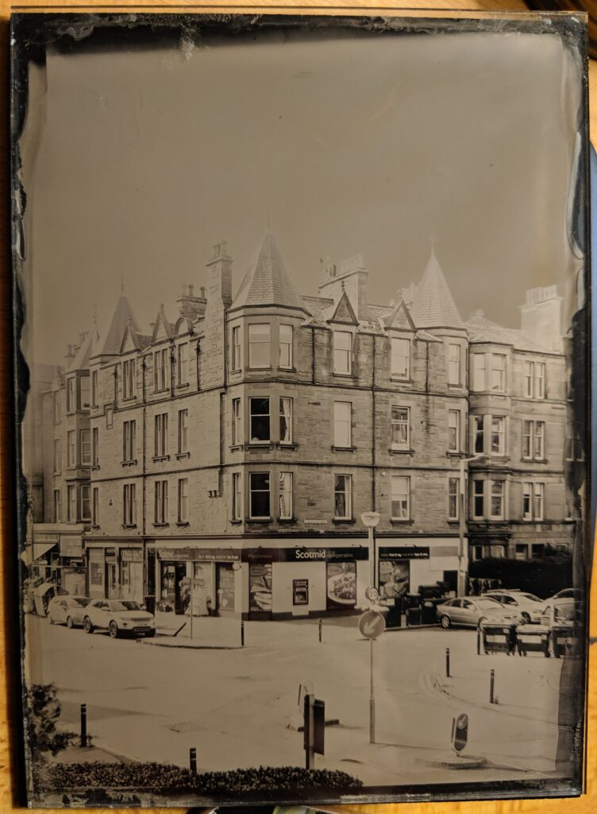
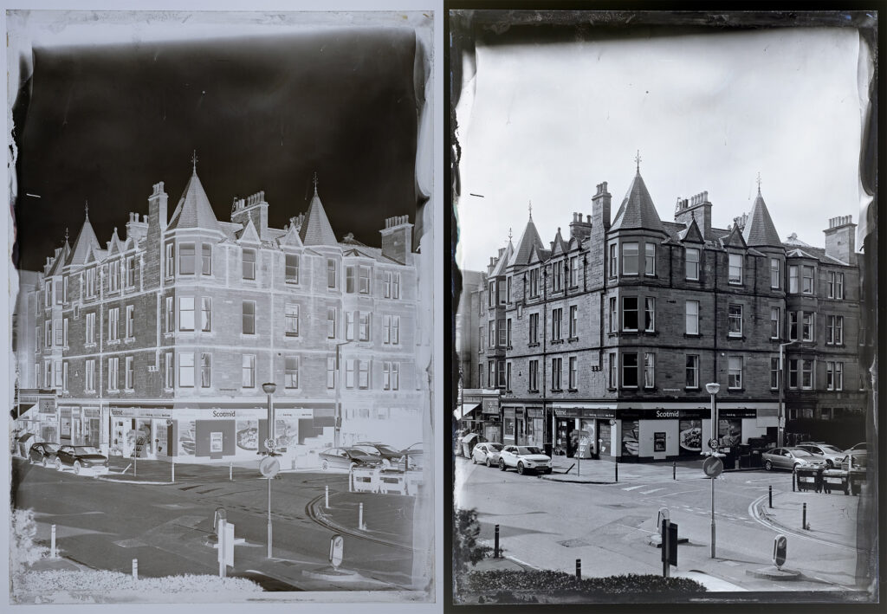
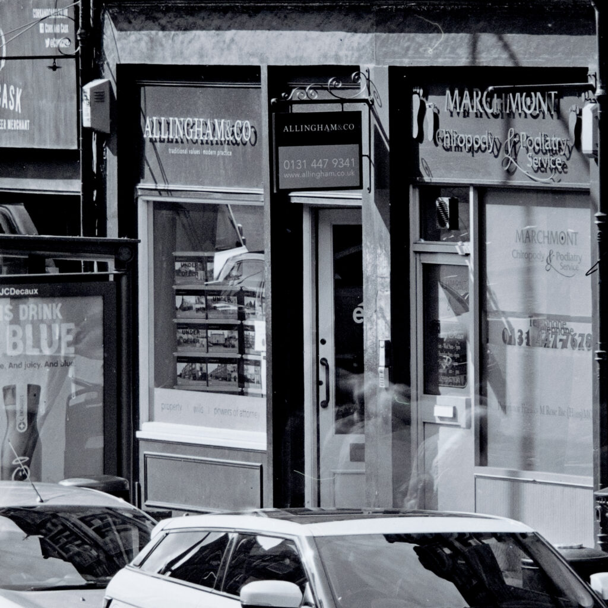

I made a disappointing ambrotype by pointing my half-plate, wet-plate camera out of the window. I was just doing a test shot to see how the collodion behaved. After two exposures it was still way over exposed/developed.

Disappointing Ambrotype

But then this evening I held it up to the light and realised I'd made quite a nice negative. It certainly looked like something that would print on normal paper. So I photographed it and inverted it digitally.

Digital conversion

I've not been that impressed when people have talked about how high resolution wet-plate is but this seems amazing.

As close as I can get with a macro lens on the digital camera.

I had thought that producing negatives for printing on modern paper would be hard and involve multiple steps but it seems that it is quite straight forward. You just need to expose them more! I'll have to have a go at doing some contact prints and enlargements.
