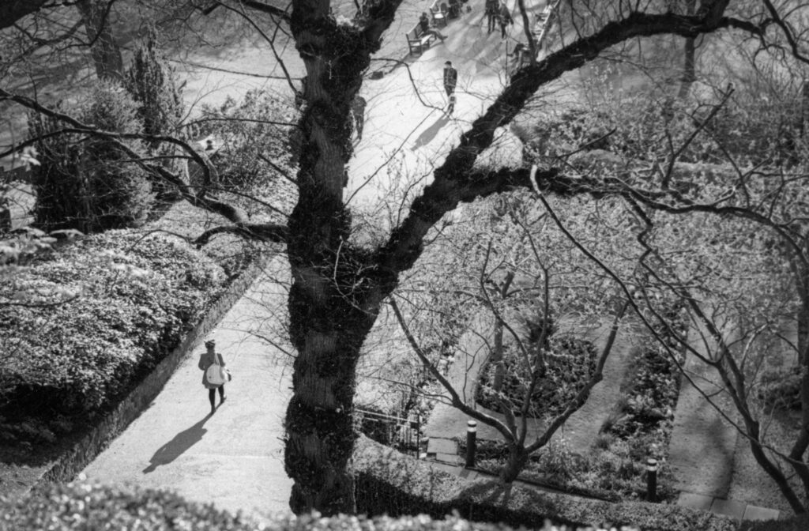

I went to a lecture on [The Walking Dead](https://en.wikipedia.org/wiki/The_Walking_Dead_\(TV_series\)) (a TV series about zombie apocalypse living) and photography at [Stills](http://www.stills.org/) by [David Grinly](http://www.davidjamesgrinly.com/) last week. It was heavy post modern, French philosopher type stuff but also entertaining. David expounded in a semi random fashion. When I left after two hours the discussion was still going strong. They may still be there. He touched on something that acted as "a provocation" for this piece. Modern life is characterised by a loss of subject-object relations. This rings true but conflicts with my core assumptions based on the Buddha Dharma and overlaps with [my previous thoughts on traditional photographic processes](http://www.hyam.net/blog/archives/3933).

Buddhist philosophy, ethics and path can be summed up by the Three (or Four) Dharma Seals which are the same as the Three Marks of Existence.

1. Everything is empty of a separate self (_sunyata_). There are no essences or souls. Things are just composed of other things. They still exist. An empty cup doesn't mean a non-existent cup but no matter how far you dismantle the cup you won't find its soul, just clay and energy and thought.
2. Everything is impermanent (_anitya_). Because everything is composed of everything else if one thing changes everything changes. Impermanence is emptiness through time and emptiness is impermanence through space.
3. Nirvana - realisation/peace - is the celebration/embracing of emptiness and impermanence. Suffering is caused by rejecting this fundamental nature of existence. Sometimes suffering is considered a fourth mark of existence but it is really the flip side of the third. It is also where the false assumption that Buddhist say "everything is suffering" comes from. It is equally true to say "everything is enlightenment". The difference is purely on whether you embrace true nature or reject it.

So taking this world view I should be over the moon that modernity is characterised by a loss of our relationship with objects, after all those objects are empty anyway. But I'm not over the moon. It feels disturbing and precisely for the reasons zombies feel disturbing.

David demonstrated it very well. Holding up his keys he said "This keyring is very important to me. I bought it in the Cotswolds. But when anyone can go online and order three identical ones delivered tomorrow the specialness disappears." I'd sum it up as the combination of mass production and ubiquitous distribution destroying the intrinsic value of objects. They tend to only have an extrinsic value. This is amplified with digital objects.

We see this in the development of photography. Daguerreotypes along with tintypes and ambrotypes were one-off objects but the adoption of the positive/negative process and the possibility of multiple replacement prints devalued the photograph as object. Still during the analogue years producing identical prints, especially at different time points, was difficult. Negatives were often lost, degraded or guarded by a professional who wanted payment. This assured that photographs that weren't reproduced in books and magazines continued to be largely considered objects in themselves. And of course the negative was always the root object from which prints were derived.

Come the digital age photographs lost all meaning as objects. My digital camera simultaneously writes to two memory cards in both JPEG and RAW formats so there are four "originals" and none of them are tangible objects. As soon as I plug it into the computer the "images" (or is it the files or data?) are sucked into the cloud where they are distributed amongst multiple servers so as to be immortal. If I make an image with my phone this can happen almost in real time.

Pre-digital, when photographs were objects they could be experienced as impermanent and empty and therefore a source of nirvana, or at least happiness. In the digital age photographs are no longer living things that can give me the experience of emptiness and impermanence and so are not a source of true happiness. They are neither living things nor dead. They are zombies.

After my father died I went through a batch of his photographs, colour prints in folders with the negatives. Most were of historical sites he visited on trips in his retirement. They were of meaning to him but would have no meaning to anyone now. I threw them out. It was painful. I felt the passing and impermanence. I felt human and ultimately wiser. My children will have a very different experience with my digital photographs. They may not have access to my online accounts but if they do they could quite easily choose to keep everything. The image recognition algorithms would pull out any family photos that may be of interest. There is no need to discard or to experience loss. Many of the images will live forever without the meaning which was only derived from my presence. They become undead, life without meaning.

Perhaps this is our current fascination with zombies. We are surrounded by things that simply won't die even when they no longer have meaning and just bring trouble. We subscribe to newspapers online so we never have the experience of finishing one. We never spill our tea on a broadsheet or take cuttings that brown and curl. We read books on a Kindle so they never fill our house. Music can flow but our cupboards never fill and our virtual cassettes and records never wear out. We can consume as much as we like without ever having to poop. And yet we are never satisfied. Depression and anxiety increase. As with junk food we continue consuming pleasant experiences in a vain attempt to obtain sufficient nutrition but always fail.

The instruction in Buddhism, and other contemplative practices, is to engage with the physical first, to come back to the sensations of breathing and embrace our changing bodies and the world around us. The more digital that world is the harder it is to learn from it. A digital "object" has no possibility of expressing [wabi-sabi](https://en.wikipedia.org/wiki/Wabi-sabi), (it never ages) and its identity is prescribed. Contrary to the advice of some pundits, purchasing experiences can never satisfy us the way physical objects can. Exotic holidays ("travel") can be consumed multiple times a year without ever growing old or needing to be discarded. The photos from the trip can be stored forever without fading and the carbon emissions from the flights are soon forgotten, if they were even noticed. Other than the brief discomfort of returning to work the opportunities for growth may be smaller than from buying a new TV. Purchasing an object, whether it is a photograph, house plant or dog, involves disposal of the old one and watching the new one age into obsolescence and die right in front of us - making us feel more human in the process.

So what do you do if you feel hollow because you no longer connect with the physical world but are immersed in an undead digital one? Maybe you would watch zombie movies and vicariously engage in the pleasure of bashing the brains out of the undead. Maybe you would seek to possess something real, a one off, linked to you, that will age with you and die with you. Maybe you'd get a tattoo. There are hell of a lot of people with tattoos these days.
