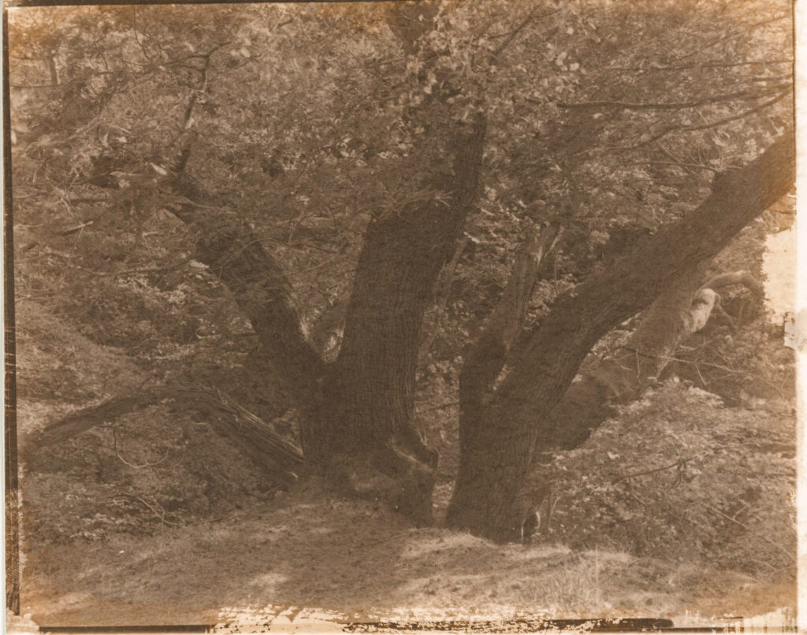

My first Salt Print (a la Fox Talbot). As usually I took the "bull at a gate" approach to something new.

1. Google some
2. Watch some YouTube
3. Book from library and only read relevant bits
4. Substitute what comes to hand for what is required.
5. Go for it.

Because I already do wet plate collodion I had silver nitrate solution (9% not 12%) and some citric acid. I used paper from an old water colour pad I had lying around. The HP5+ negative made in my [Intrepid](https://intrepidcamera.co.uk/) Mk3+ is good for conventional printing but not contrasty enough really.

I'm really pleased with the result. Trying something entirely new and get and image - any image - is just incredibly rewarding.

What now? Will look at increasing contrast and smoother paper.
