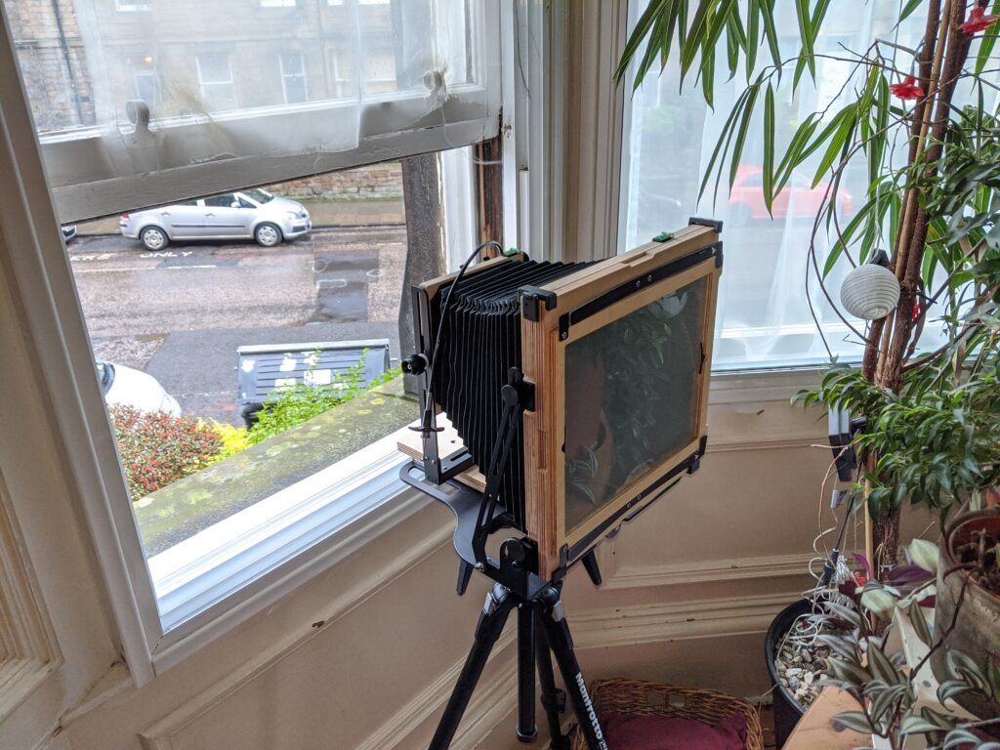
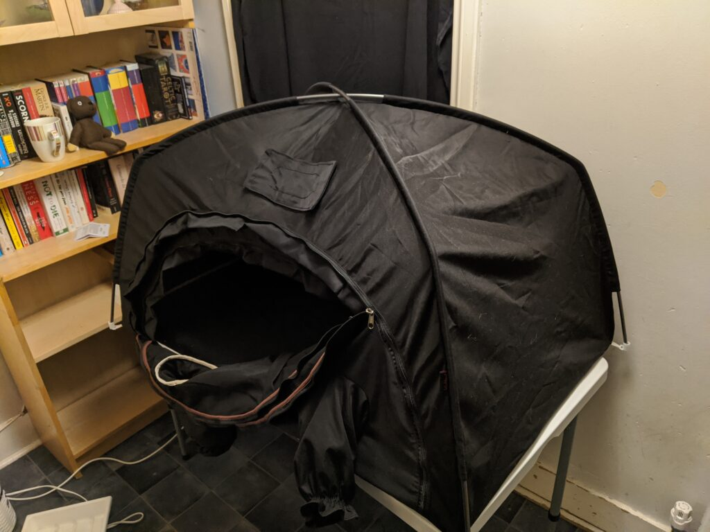
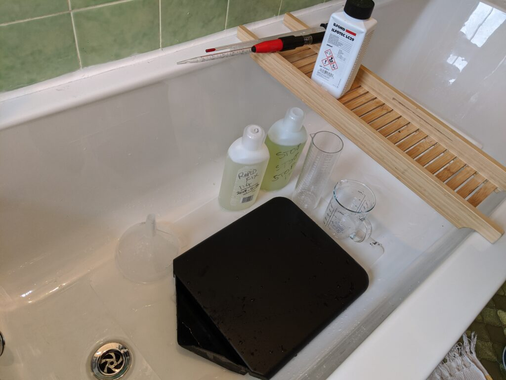
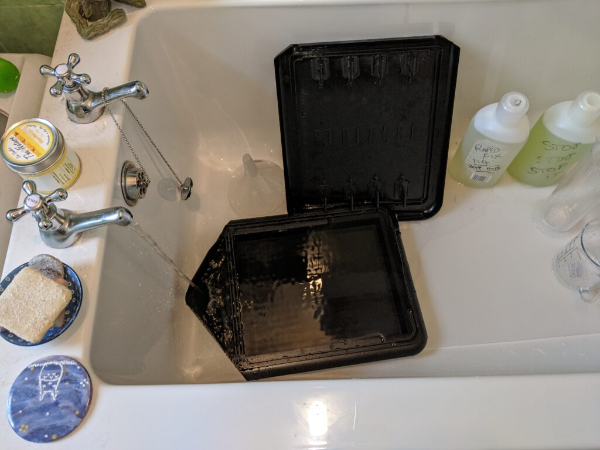
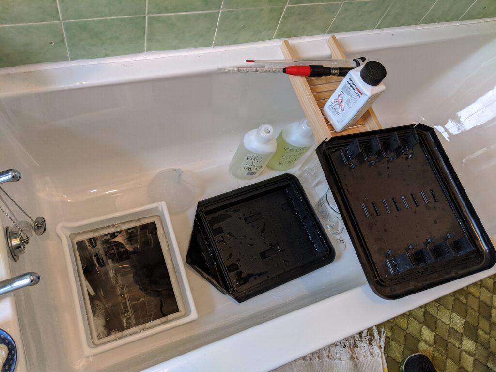
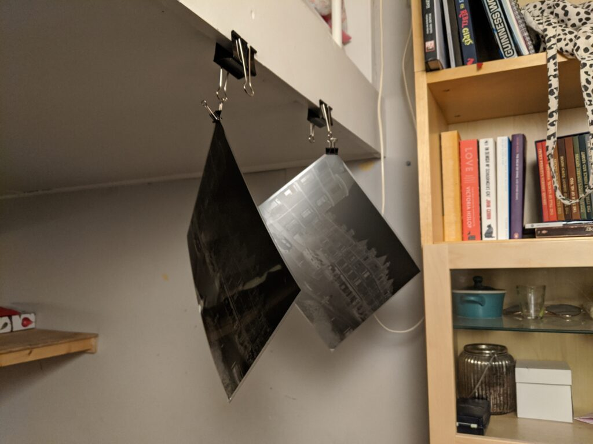
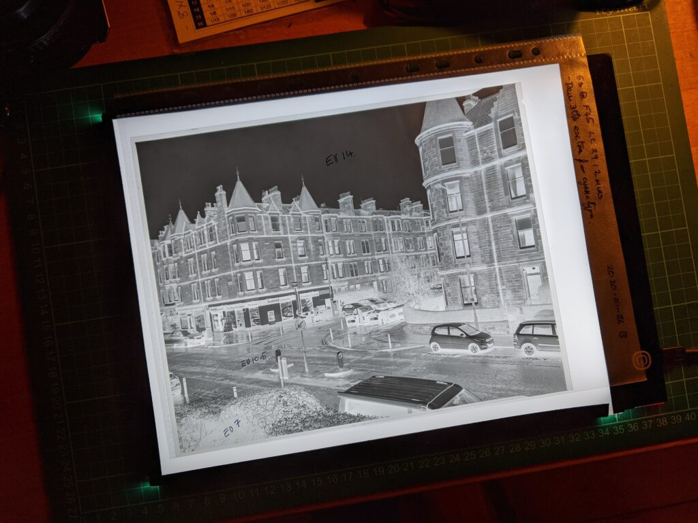
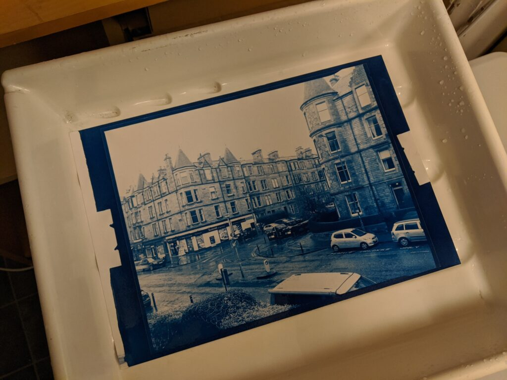

This is a really quick post about the new Stearman SP-810 developing tank because someone asked me my opinion. I must be one of the first to own it. I'm not going to talk through the tank as you can see what it is and what it does in this video.

https://youtu.be/0WdzqOWl4h8

Tim Clien of Stearman Press gives his overview

I've been using the excellent SP-45 tank for my 4x5 work for a while but wanted to try 8x10. Whilst I waited for my [Intrepid 8x10](https://intrepidcamera.co.uk/) camera to be made I assembled a bunch of associated equipment including an old junk shop jobo colour print drum that I intended to develop film in. In the end Stearman released this light tight tray and I thought I'd splash out even more cash on one.

The tray arrived before my camera so I ran four sheets of 4x5 through it instead of using my SP-45 tank and it worked very well although I don't think I would do this routinely. The SP-45 is a much simpler (smaller) experience for developing 4x5 if both tanks are available.

Anyone seen Hitchcock "Rear Window" recently?

Last week my Intrepid 8x10 arrived and the first chance I got to use it was Sunday. It was raining and windy so I made a series of test exposures out of the window. I still have to establish that the battered old film holders I've acquired are light tight and, of course, test the tank and developing process.

Cheaper option for light tent is a little large but works well

I don't trust the room I use to print to be light tight for film so I used a light tent for loading holders and tray.

The SP-810 is "just" a tray with a lid on. If I had a dedicated darkroom I'd be tempted to just use regular print trays to develop film. Having said that using one shot developer for consistency means longer development times and standing in total darkness for ten minutes for each sheet would make the SP-810 attractive even then. But, as you can see, my wet bench is the bath so the SP-810 is just perfect. (I practice yoga on the floor between agitations).

If you prop up the spout end of the tray it makes a good running water washer. I don't usually wash film this way but follow the Ilford method of a series of changes of water. It is better for the environment and probably more thorough.

One thing that concerned me was the speed with which the tray could be reused. With a conventional spiral tank or a tank with frames like the SP-45 you need to dry everything before reloading. If you are only doing one exposure at a time this could be a pain. It turned out however that it is quite quick to wipe down the SP-810 with a dedicated towel and get it dry enough to do another sheet in a few moments. So the neg can be transferred to a separate tray for washing whilst you get on with the next sheet. The same could be done for fixing but I'm reluctant to do this for purely superstitious reasons - I'm sure it would work fine.

It is quite a thrill to make your first 8x10 negs

I'm using Fomapan 100 and looking at getting negs suitable for alternative processes like cyanotype and salt prints.

I had time by the evening to do a basic cyanotype proof. My desire is to keep a totally analogue process from subject to print.

A verdict? On first usage the SP-810 is great. It seems robust and does the job very well. Nothing is perfect and I'm sure there will be some gotchas somewhere but they haven't jumped out at me yet. It feels expensive in both senses; you have to pay quite a lot (especially outside of USA) for it but then it feels like a quality product when you use it. If you are considering doing large format, especially bigger than 4x5, you need to be prepared for some cost. Doing large format in this day and age is just crazy - embrace your insanity :)

### Addendum 5th May 2020

I've just done a series of film tests on 4x5, exposing and developing each of a dozen sheets individually, each for a different time. The SP-810 was invaluable for this. I just popped the sheet in (without the dividers) developed and stopped then opened the tank and moved it to the fixer. A quick rinse and wipe down of the tank and I was ready to do the next sheet. This tilts me more in favour of using it for doing 4x5. I still love my SP-45 but in critical situations where you want to see the results of the last sheet before you develop the next one the SP-810 is great.
