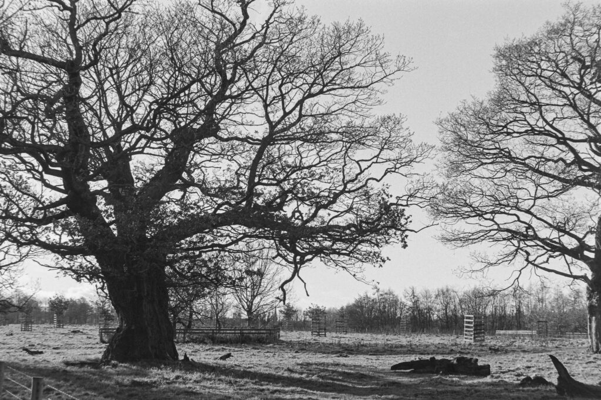

Oaks at Dalkeith Country Park

The winter months have been tough in terms of colds and flu-like illness that have kept me from walking all the days I'd wanted. Nothing particularly bad but enough that I've had to take care of my body and get the bus one way or the other across town. I continue to walk in the gardens at lunchtime though.

Then Covid-19 arrives. On 18th March I was told to work at home. On 23rd the country went into lockdown and I'm asked not to leave the house at all. It looks like this will go on for at least a month maybe several months.

Could this be what ends the marathon monk project? We all have the wonderful opportunity of a few weeks to reflect. This an official pause of the project. Over two and half thousand miles so something to be proud of.

\[catlist name="project-marathon-monk" orderby="date" order="ASC" numberposts=100  \]
