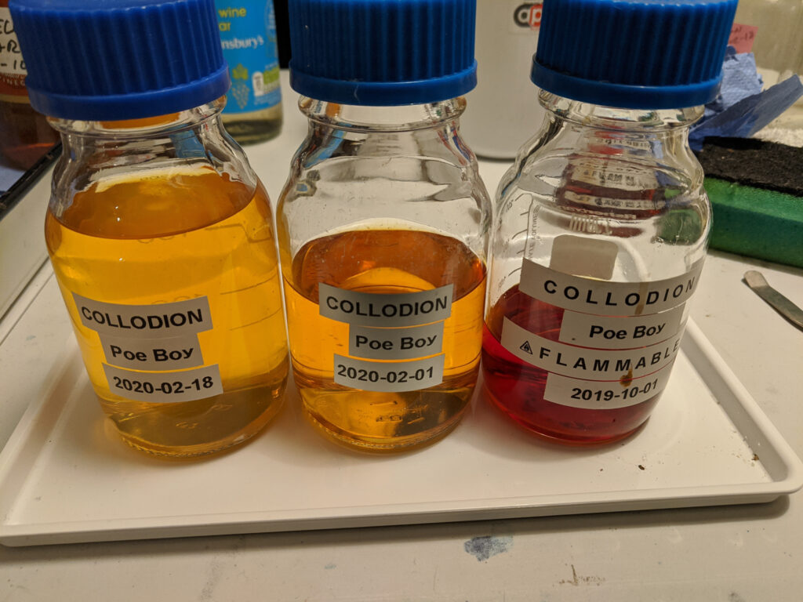
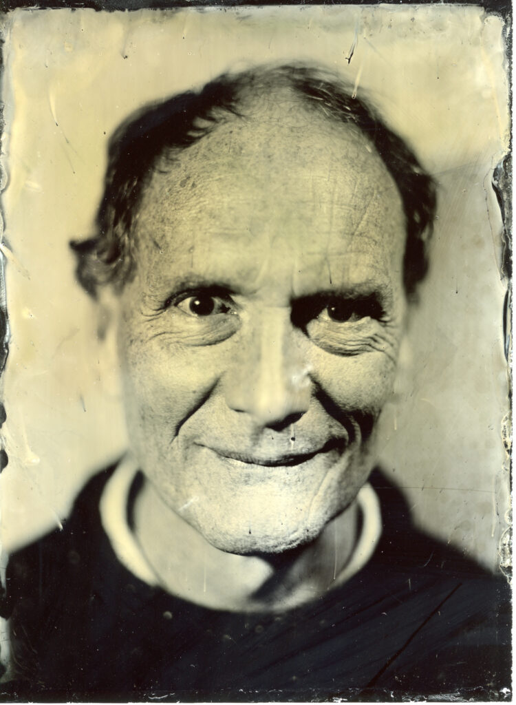

Working with the wet plate collodion technique is something of a "lifestyle choice" in that it isn't an activity you can just choose to do when you fancy it. For starters acquiring the equipment and minimal skills to get the process going can take months. Once you are up and running the chemistry starts to age so you need to be continually maintaining it and planning ahead for when you might like to make some images. You also get rusty if you don't do it regularly. It's like making pancakes. If you make them every day then every pancake will be nearly perfect. If you only make pancakes on Shrove Tuesday each year then they won't be so good, certainly the first few will be disasters. In effect there is a part of you that needs to always be thinking about making collodion images if you are to do it successfully.

One part of the chemistry that ages visibly is salted collodion itself. Once the bromides and iodides have been added to the raw collodion it begins a process of iodisation. At first this is a good thing. The Poe Boy recipe I use needs two weeks to settle and become good. After six weeks it becomes less sensitive to light. After several months it is very slow. It may still be OK to make images of some kind but no good for portraits unless your subject can remain motionless for twenty minutes!

When I ran my Victorian photo booth at our [wet plate party](http://www.hyam.net/blog/archives/4081) I made a couple of batches of collodion in advance so I would have different levels of maturity available. I also knew spring was coming and I'd get to use up anything left over in the coming weeks. Unfortunately what arrived in the coming weeks was Covid-19 and a nation wide lock down. I can't get close enough to other people to photograph them. My daughter has returned from university to wait out the passing storm with us and I've lost the spare room I need to do the process. I can't even prepare my mobile kit to make still life images in the garden.

Covid-19 has probably put an end to my wet plate collodion photography for much of the year. If things get back to normal in September I may be able to get up and running again but then the light will be drawing. Mean time I can get my ageing collodion out every now and again and watch it turn red. Ho hum.

Mark: Taken during the wet plat party. Things were getting flakey at this stage.

