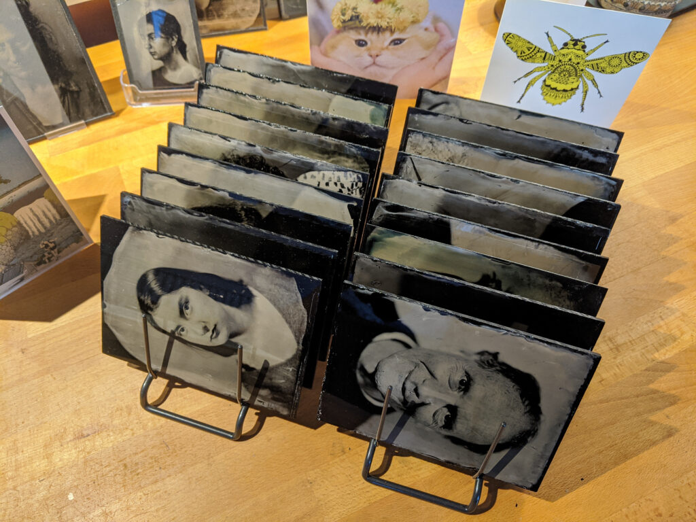
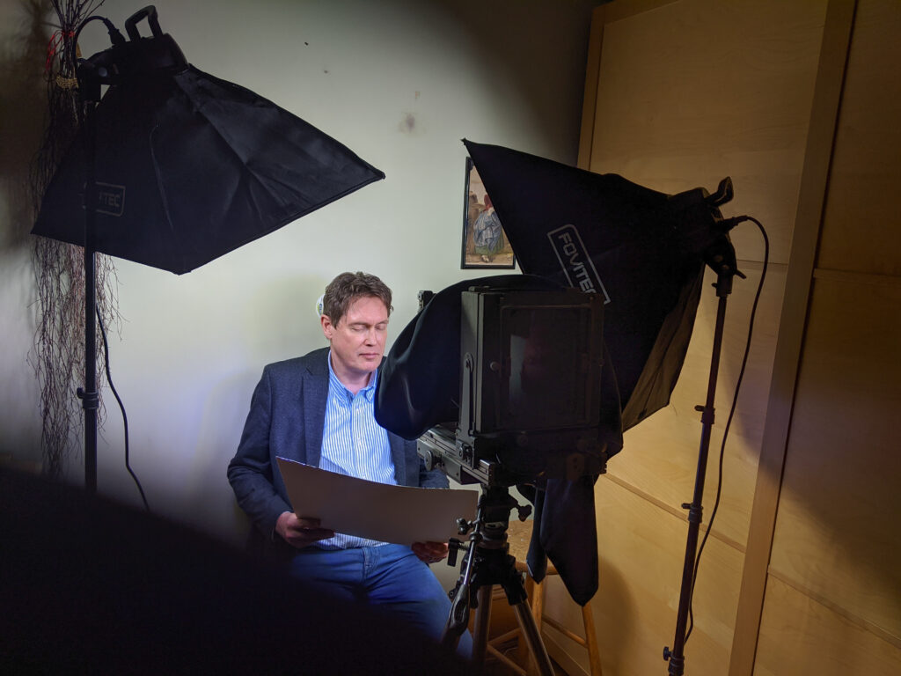
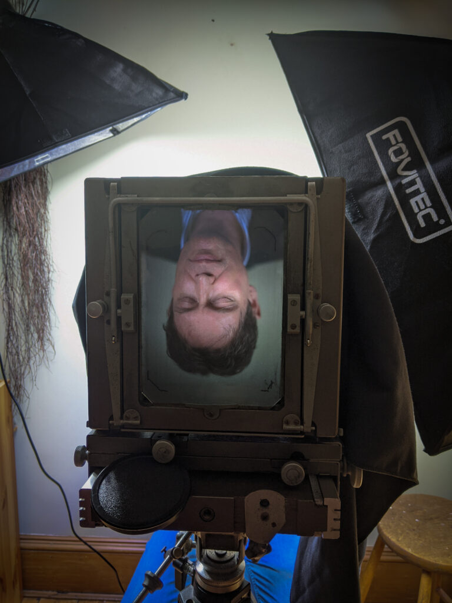
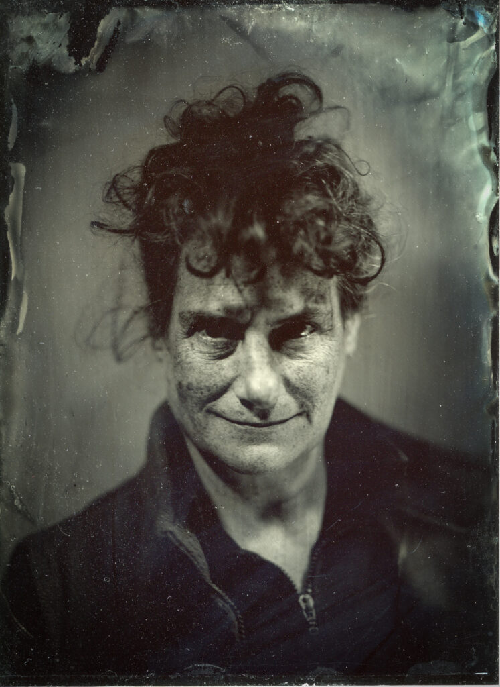
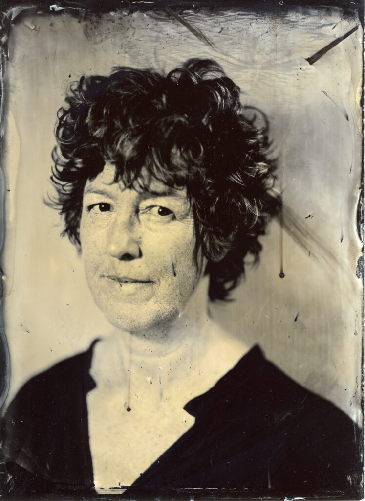

18 Plates in under 24 hours

I turned 55 on 28th February and we used that as an excuse to invite friends around on Sunday 1st March for an open house. This is something we only do once every five years or so. This time I set up what is basically a Victorian photo booth. I really wanted to practice making my [ambrotypes](https://en.wikipedia.org/wiki/Ambrotype). I made sixteen plates between mid day and about nine at night. It was tough going but fun and I think people enjoyed seeing how the process worked and what the looked like. Here are some of the images.

I use compact fluorescent light bulbs augmented with LED UV black lights. We also used the yoghurt pot on the wall technique to keep people still. Exposures were around 3 seconds.

I use a Kodak Specialist 1/2 plate camera with a process lens. This is a really nice camera to use once it is on the tripod.

Faith: Taken as a test shot the night before. A bit bright but works.

Demetra: Checking my backup developer made from white wine vinegar. Not a good idea but worked slower.

Henry

Ainsley

Karen

Colin

Kenneth

For wet plate collodion buffs - I used Poe Boy mixed four weeks beforehand and decanted after two weeks. I use Hypo as a fixer warmed in a baby warmer to about 30C. I restricted my self to half plate size black Perspex to keep things simple. I don't varnish but use two layers Renaissance Wax. My whole process has to be low toxic and low impact as it is all done in our two bedroom flat.
