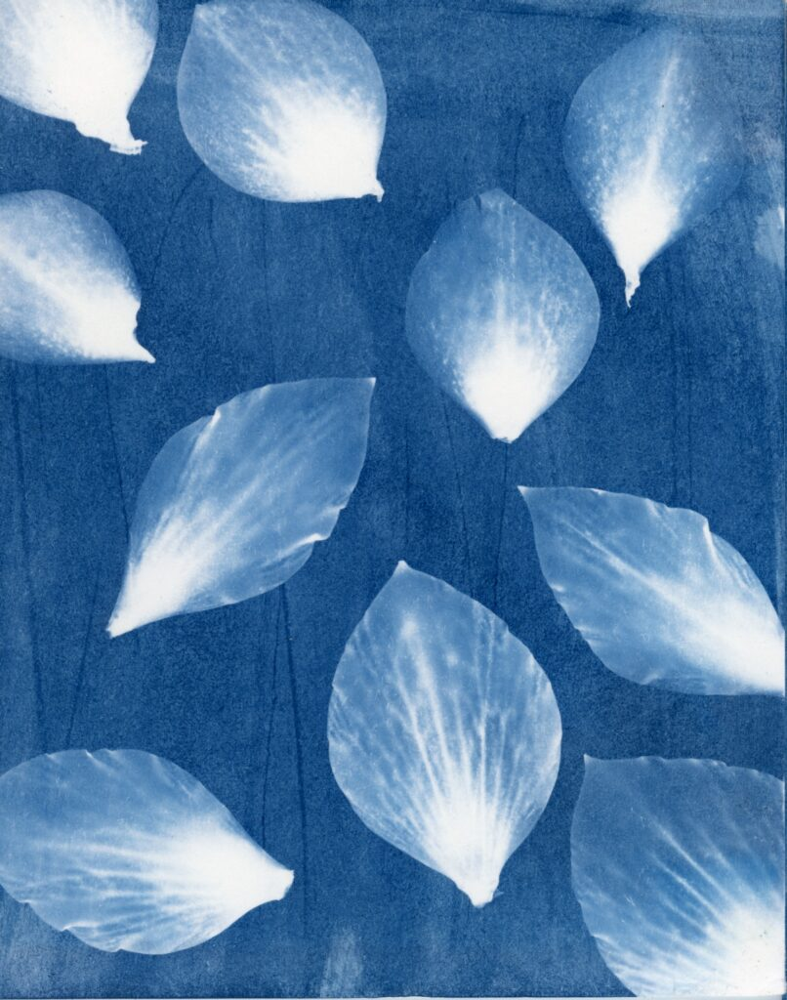
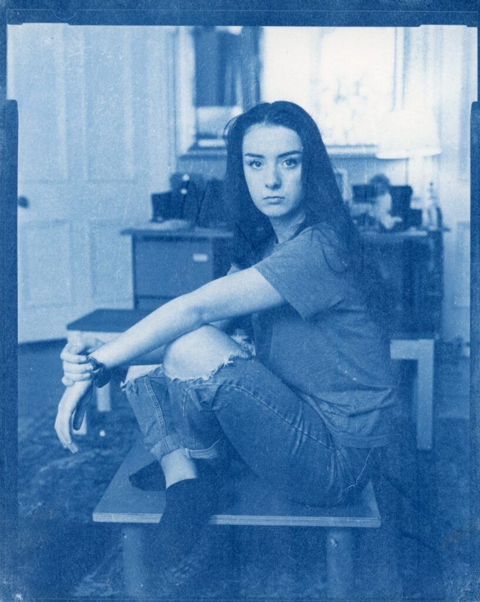
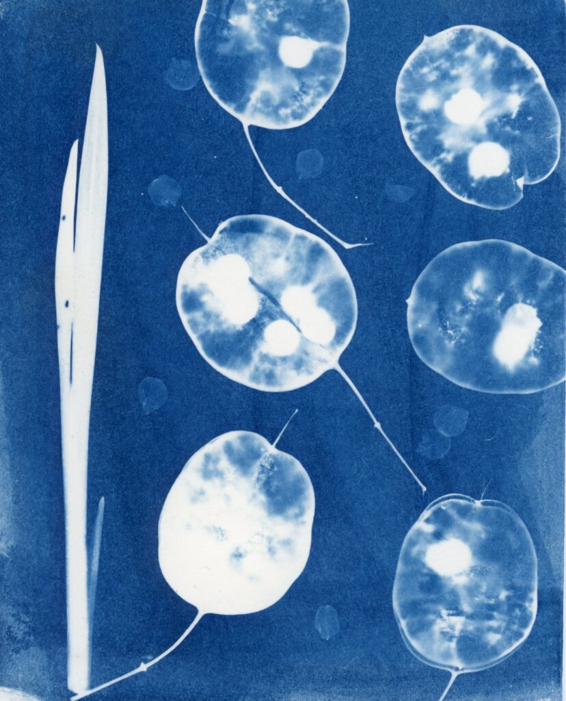
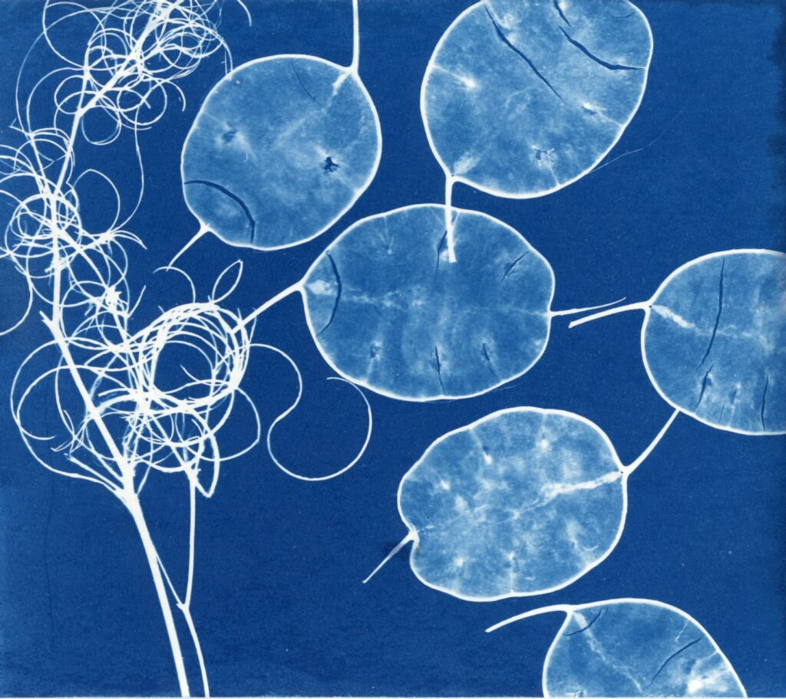

Photogram of petals from Hellebores in the garden

With the family at home for the Covid-19 lock down there is no space to set up the darkroom and so little hope of analogue photography beyond developing film in the bath - but fortunately we still have cyanotype printing! Coating papers can be done on the kitchen table and developing in plain water in the sink. The exposure can be outdoors or with UV bulbs in the corner of the room.

An old 4x5 negative of Joscelyn

I have an analogue way to make prints from objects or sheet film negatives. I may even try, horror of horrors, making digital negatives. As soon as I perfect this we'll be set free again.

Honesty is good. The number of valves effect the exposure of course!

Possibly my favourite. I need to get coating right.

