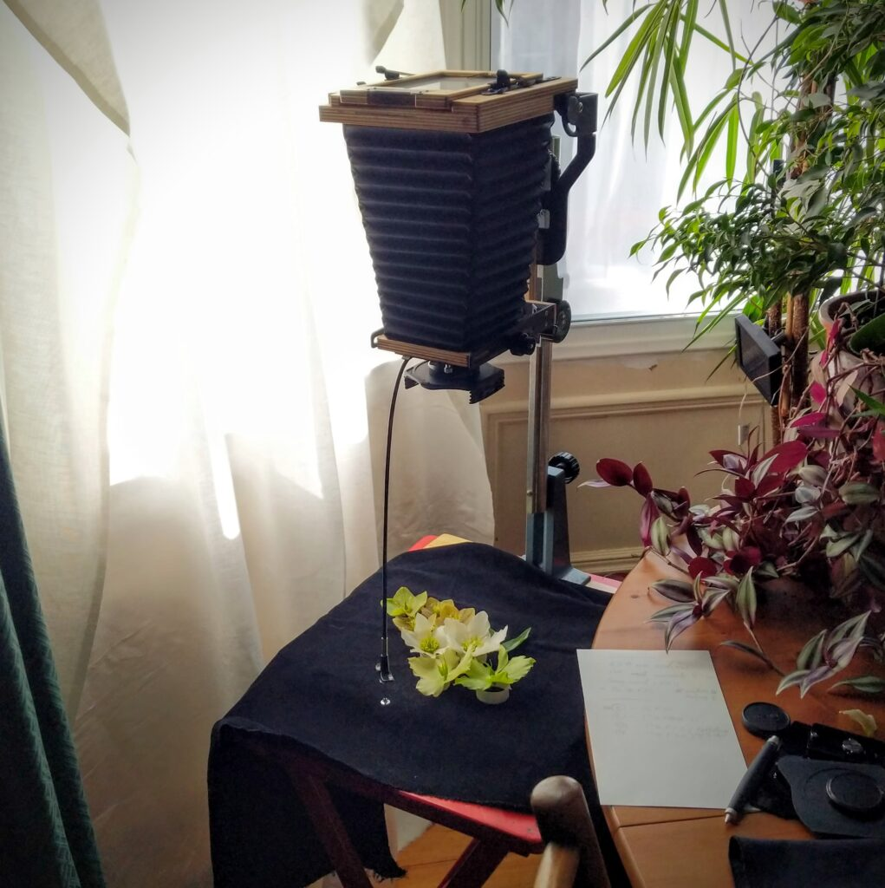
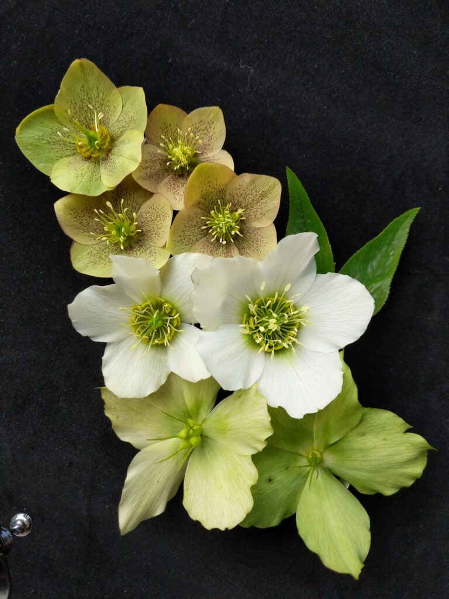
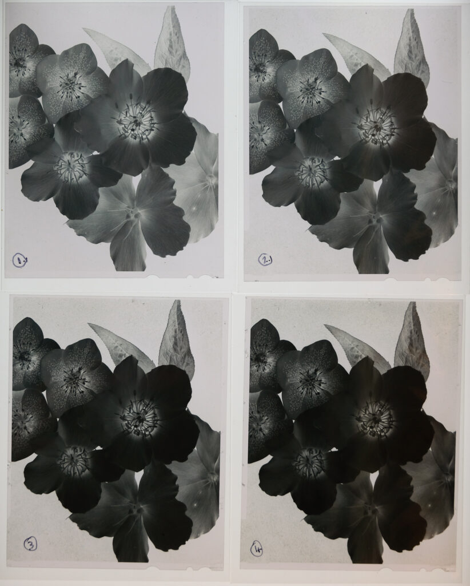
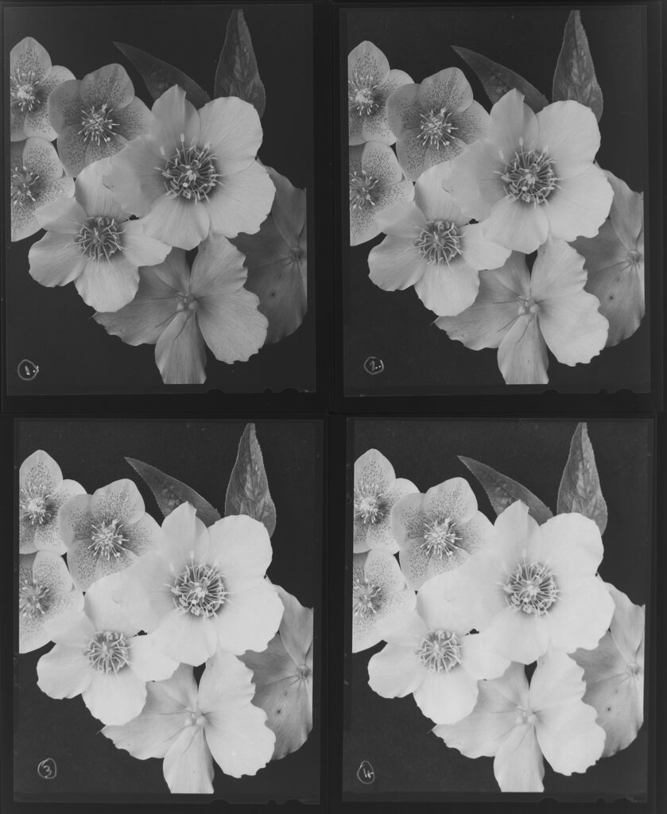
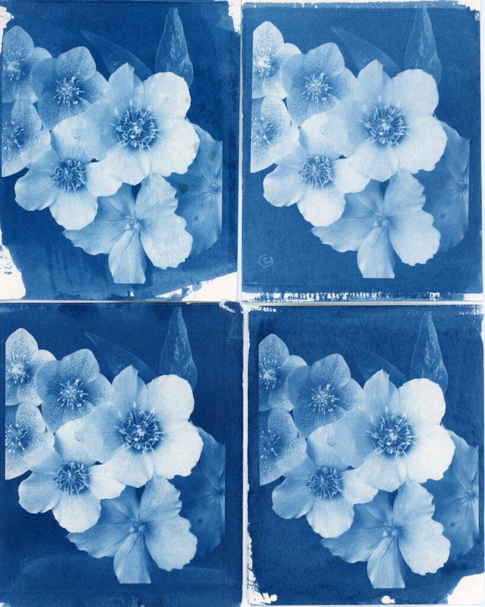

During the Covid-19 lock down I'm messing with cyanotypes and want to have a go at [Argyrotypes](https://en.wikipedia.org/wiki/Argyrotype). These processes use contact negatives the same size as the finished print. The negatives need to have a long tonal range - be very contrasty. Many people produce such negatives using an inkjet printer and transparency film. This allows for precise control of the tonal range and size. To me this seems redundant. By the time you are firing up the computer and inkjet printer you may as well make the final print that way too. And the easiest way to get the image into the computer in the first place is to make it with a digital camera. [Resistance is futile. You have been assimilated.](https://en.wikipedia.org/wiki/Borg) So I am looking at making high contrast, conventional, large format negatives for printing through an entirely analogue process - old school.

Window light and my 4x5 Intrepid to make the exposures.

The longer you soak a negative in developer the darker it gets. The effect is the same across the negative but the result is a change in overall contrast. If the shadow areas (thin on the negative) get 20% more silver developed and the highlight areas (dark on the negative) also get 20% more silver developed then the difference between the shadow and highlight areas increases. This is because 20% of almost nothing hardly changes the shadows but 20% of a lot changes the highlights markedly. Hence the old adage "Expose for the shadow and develop for the highlights". You need to get enough detail in the shadows first then development will change the density of the highlights and control the contrast of the negative. (It is obviously a little more complex than this with film base plus fog levels at the bottom and DMAX at the top and a bunch of other chemical niceties but the basic principle holds. Also remember for slide film and digital the rule is the other way around. "Don't blow the highlights because you can always pull back the shadows")

The subject taken with my phone. Why don't I just stop here?

So I set up a scene with a range of tones and photographed it four times then developed the negatives three different ways to generate a test set of negatives I could play with.

| **Negative** | **Exposure** | **Development** |
| --- | --- | --- |
| 1 | as per grey card | 6m 30sec (as recommended) |
| 2 | \+ 1 stop | 6m 30sec |
| 3 | +1 stop | \+ 50% = 9m 45sec |
| 4 | \+ 1 stop | +100% = 13m |

The four different negatives

For the record I was using Ilford HP5+. Ilfotec LC29 at 1:19 at 20ºC. There were about 5.5 stops difference from the black background and white petals. I compensated for bellows extension (250mm on a 150mm lens) by rating the ISO 400 film at ISO 120. Processing was in my Stearman Press tank in the bath as usual.

The four negatives on the light box

Looking at the results we can see that the black background is denser on 2,3&4 compared to 1 because of the increased exposure. It does get darker from 2 to 4 with increased development but not dramatically. The white flowers on the other hand change dramatically as we increase the development creating much more contrasty negatives.

A crude inversion of the light box image. I'll scan the negatives properly another time.

The first thing I tried with my new test set was some cyanotypes. I had to adjust the exposure for each negative ranging from 1m 30s all the way to 6m for the negative #4. The results are difficult to interpret because I haven't got my cyanotype coating technique standardised enough. I need to get the same amount of sensitiser on every sheet. But I do feel neg #3 is produces the nicest result although just a regularly exposed developed negative like #1 doesn't produce bad results.

Initial cyanotypes of the four negatives

This is just the start. I need to work on my cyanotype coating technique. I'd like to see if I can make as satisfactory digital scans of the high contrast negatives as the lower contrast one. This would give me the confidence to stew my negs for a long time to make alternative prints in the knowledge I can always scan and make inkjet prints if I want to. [I also want to try them as Argyrotype](http://www.hyam.net/blog/archives/4133).
