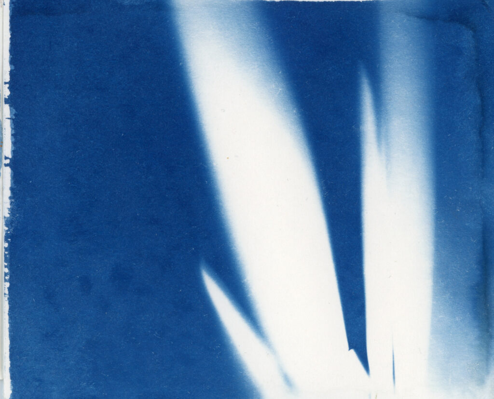
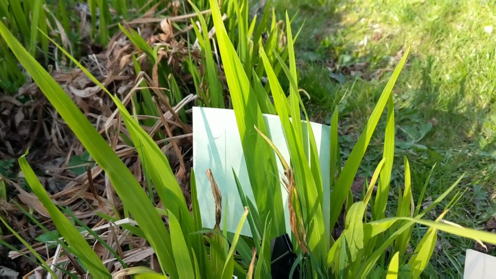
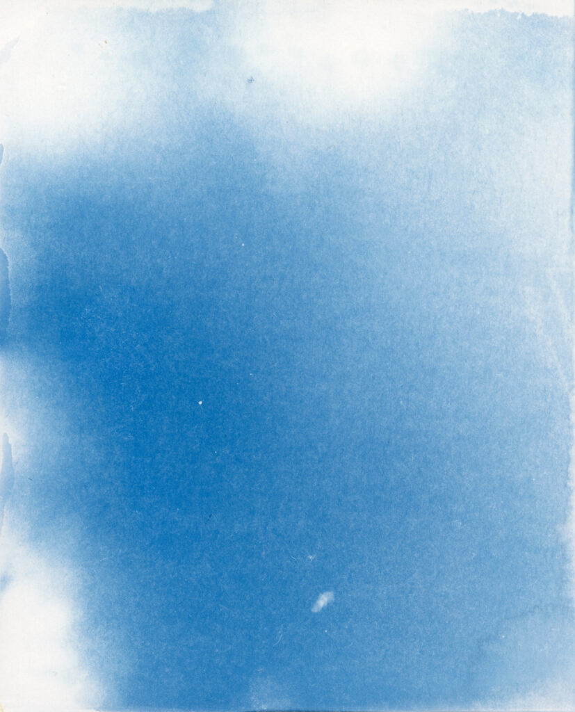
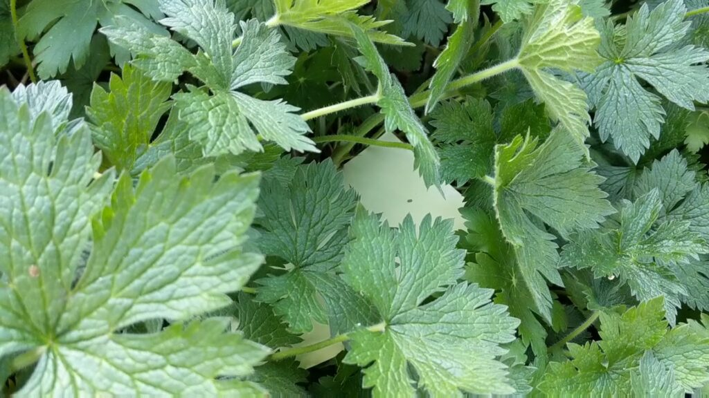
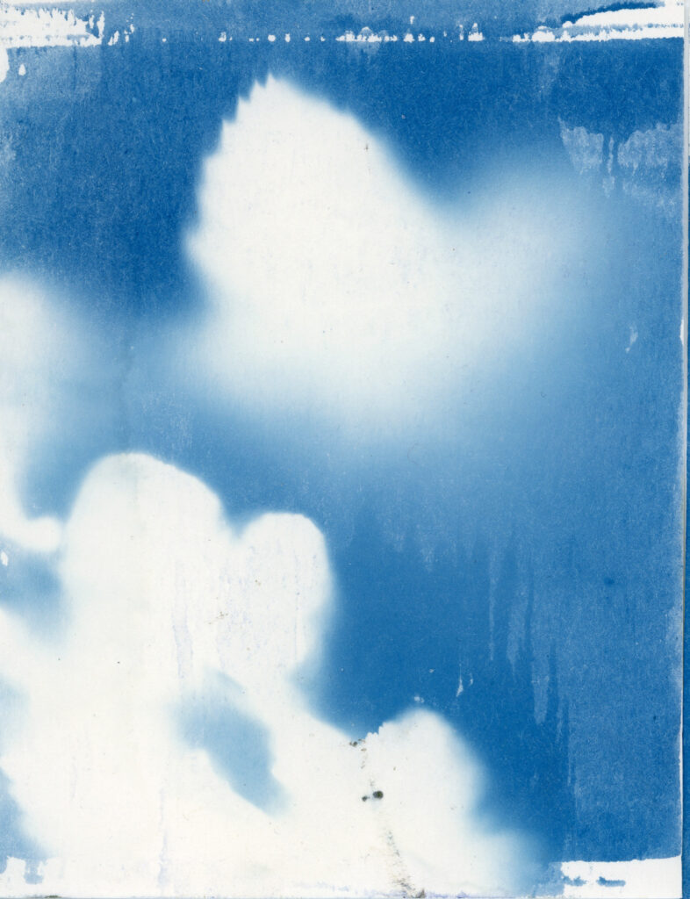
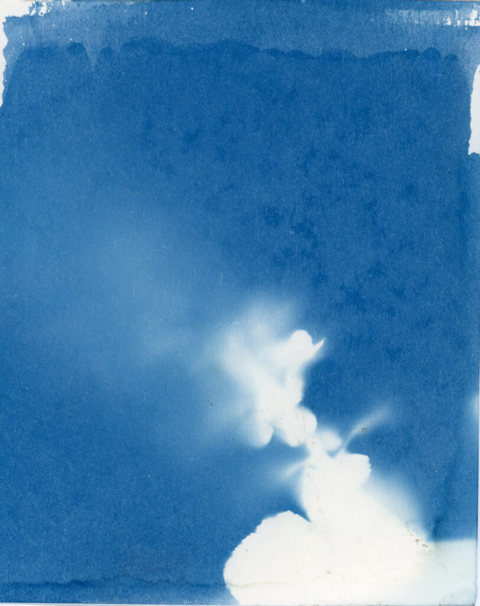

[Stills Gallery](https://stills.org/) and photography centre in Edinburgh was planning to run a project called Elementary Blueprint where they sent out cyanotype papers for people to expose to the elements around Edinburgh and sent them back to make a single exhibit - like a blueprint of the city I guess. Then Covid-19 happened which put a stop to a physical exhibit. It has now become a virtual project and expanded to cover the whole UK. A nice idea for lockdown Britain. People can still write in and get cyanotype papers but then they send back scans/photos of what they have done and a virtual combined work will be created.

I heard about this just as [I crack open the cyanotyping solutions again because of the lockdown](http://www.hyam.net/blog/archives/4100). So I've had an excuse to take some of the papers I'm using into the garden and expose them in different ways.

Crocosmia. Sunny Day. 8/4/2020

Stills invite participants to be loose with what they do and maybe not even bother to develop the prints. I can't quite bring myself to do that. I guess I'm too square or want to control the process too much.

I have been pinning papers to plants with bulldog clips and forgetting about them for a while.

Under the geraniums. Sunny Day.

Or wedging them in the foliage.

Raspberry bush. Dull evening. (1)

Raspberry bush. Dull evening (2).

The results I'm getting are fun. I'll submit these but not make anymore just yet. It would be interesting to see what rain would look like but that would be very dependent on when it came and how heavy it was. There would be a competition between the forming of Prussian Blue by the ambient UV light and the washing away of the sensitiser. I suppose that light rain on a very dull day would make the most diverse images especially if the paper was lightly covered with foliage.

You can take part too! [Details are on the Stills website](https://stills.org/learning/projects/).
