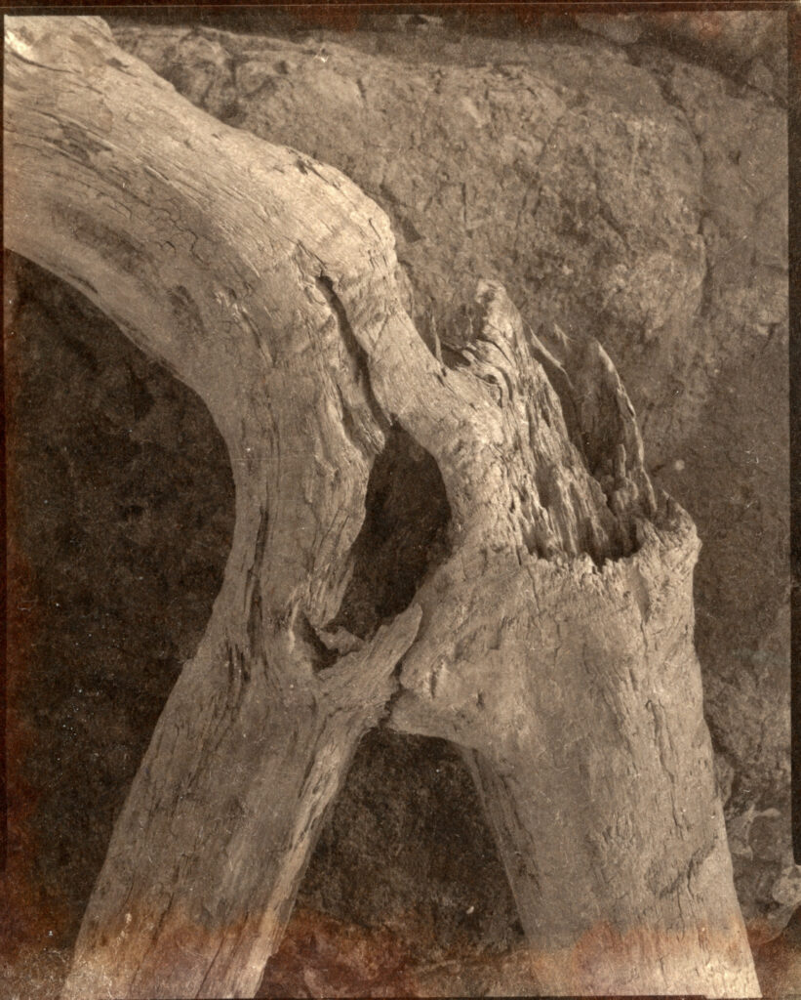
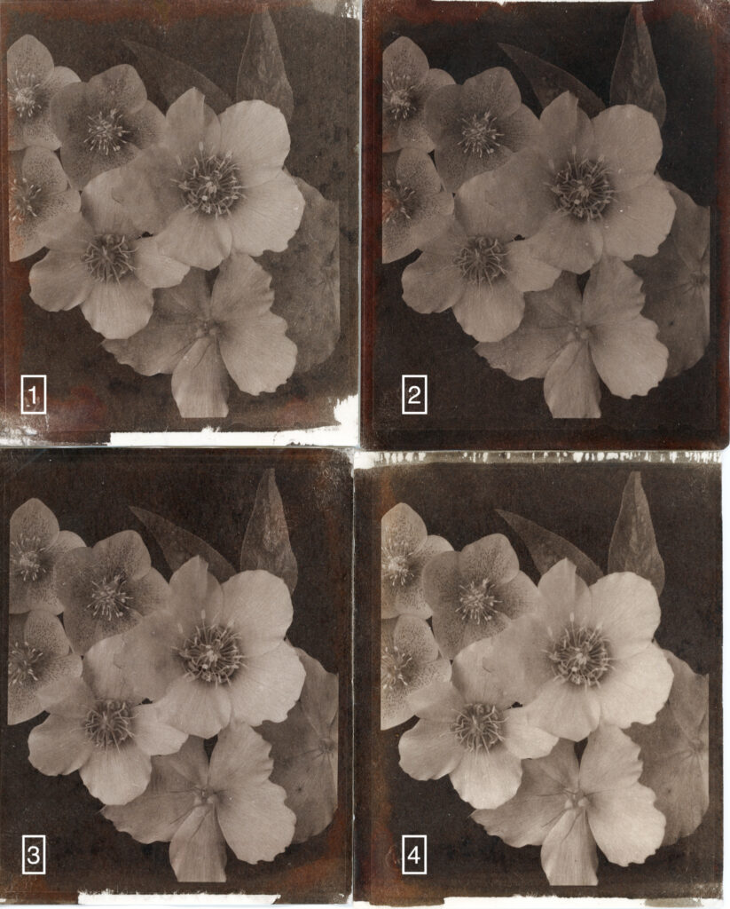

The Argyrotype print process is a "modern" nineteeth century way of making silver prints on paper. It was created by [Mike Ware](https://www.mikeware.co.uk/mikeware/main.html) in the early 1990's \[[_British Journal of Photography_, **139**, (6824), 17-19 (13 June 1991)](https://www.mikeware.co.uk/mikeware/Argyrotype_Process.html)\].

Back in 1842, right at the start of photography, [Sir John Herschel](https://en.wikipedia.org/wiki/John_Herschel) created a process based on iron and silver called Argentotype. Later in the 19th century a whole bunch of variations on iron-silver printing were developed including Kallitype, Van Dyke, Sepiaprint and Brownprint. All these 19th century iron-silver processes suffered from the problem of clearing residual iron salts from the paper. Any iron salts that remain react with the tiny silver particles that make up the image and eventually the print will fade.

Mike Ware, who is a chemist as well as photographer and has consulted on archiving of older prints, created the Argyrotype process based on the rarer silver sulphamate rather than silver nitrate. This avoids the deposition of iron salts and partially sulphide tones the silver resulting in, we hope, longer lasting prints. More importantly from my point of view the process is very simple. It is almost as straight forward as cyanotypes. There is a single bottle of sensitiser that is coated on the paper, exposed under UV, cleared in water for 2 minutes (with a pinch of citric acid), fixed/toned in Hypo for 2 minutes and washed. When dry I then wax with Renaissance Wax. The sensitiser can be bought off the shelf (actually off the web from somewhere like [Silverprint](https://www.silverprint.co.uk/)). The sensitiser has a shelf life of a year.

One of my first attempts at Argyrotype. A random high contrast 4x5 negative pulled from the file. Terrible composition!

I had kind of given up on plain paper based printing and was going to concentrate on making conventional silver gelatine darkroom prints but when Covid-19 arrived I lost access to my darkroom and [had to look for alternatives](http://www.hyam.net/blog/archives/4100). I ordered some [Fotospeed Argyrotype](https://www.fotospeed.com/Argyrotype/products/1268/) sensitiser from Silverprint and have started playing. I love it. I have wanted to get the feel of salt prints for a while but that process can be messy to do in limited space, especially if you do floating paper method of sensitising, and takes a lot of tweaking.

The Fotospeed instructions say the contrast is about equivalent to Grade 0 on conventional photographic papers so you need really high contrast negatives. Here are my four 4x5 test negatives printed in a similar way to the way I [printed them for cyanotype the other day](http://www.hyam.net/blog/archives/4110).

Four test negative at different contrasts

It definitely benefits from the higher contrast negs, although you can see my coating isn't perfect.!Prints #3 & #4 were given the same exposure (90s) but I could have cut it half a stop for #3. I'm not sure where the uneven colour comes from. I thought it was drying marks at first.

Much to learn and do. I feel this may be "the one" process I want to work with for a while. The sensitiser isn't cheap but that is only in comparison to cyanotype which is practically free. The 50ml of Fotospeed sensitiser cost me £30 and according to the instructions would cover 28 prints at 8x10 - although I suspect that varies enormously by paper. If I really get into it I think I could make up my own sensitiser for less than half the cost if I had to. Doing this would also allow me to have batches of different contrast. I have a stack of archival paper/board from work that was going to be pulped that I can use so things are looking good. Next I'll maybe try an 8x10 Fomapan 100 neg.
