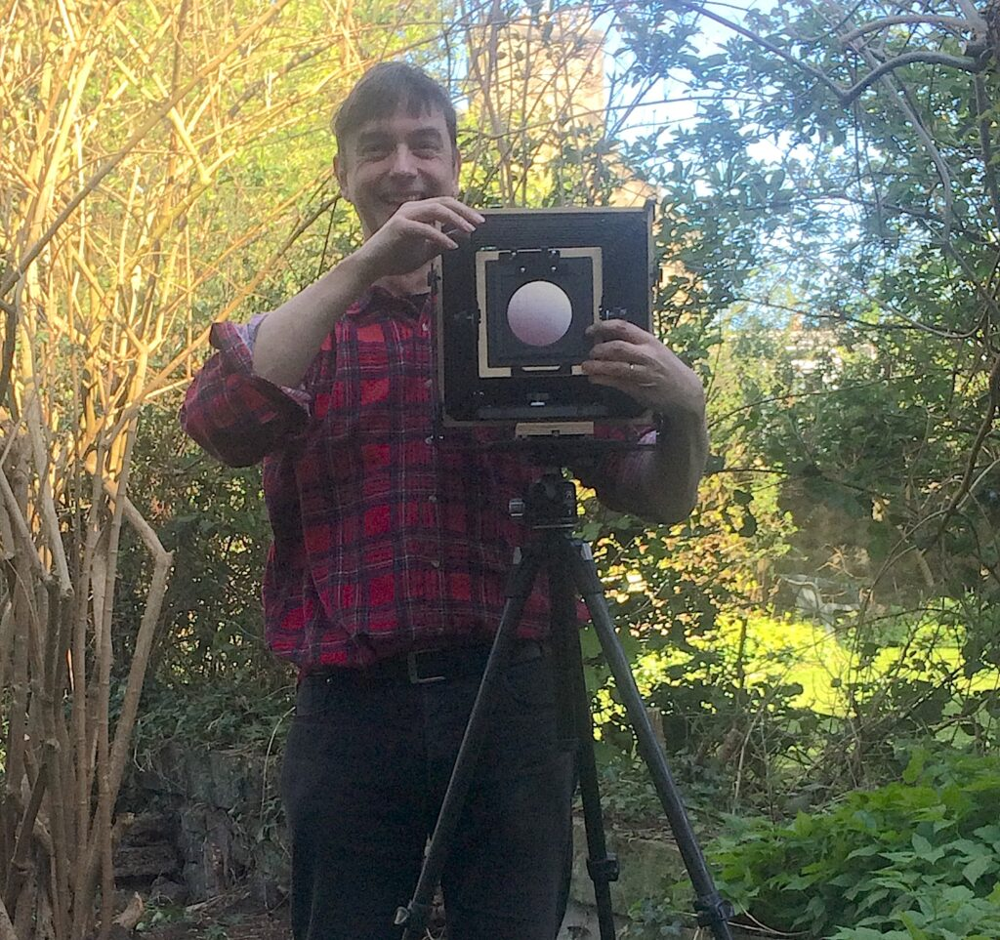
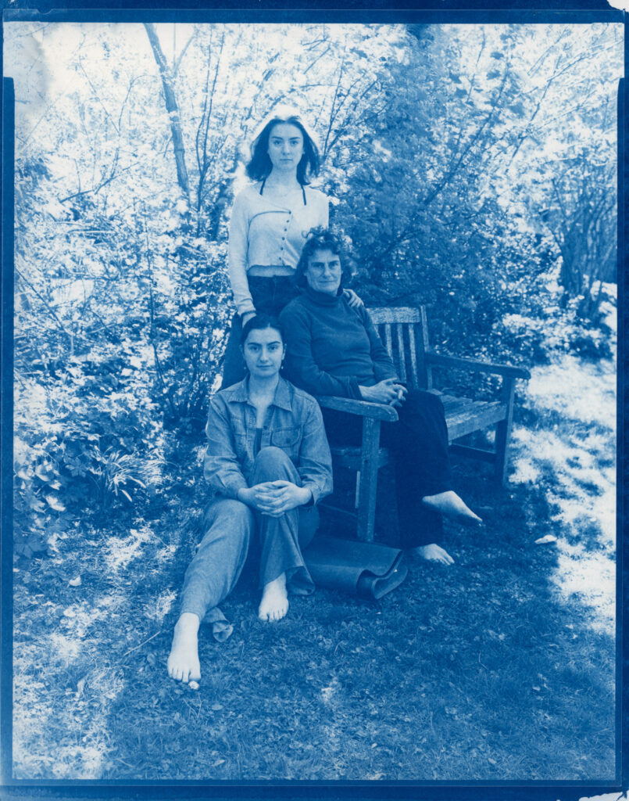
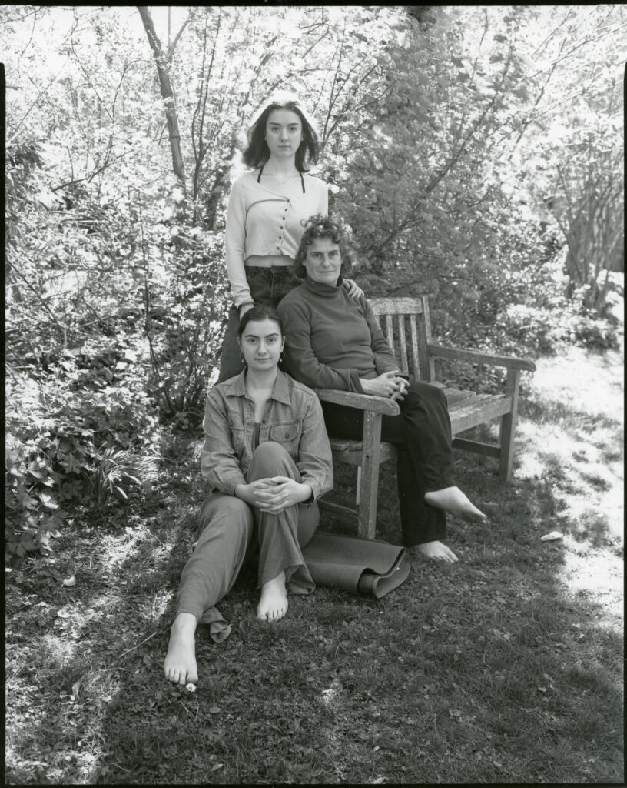
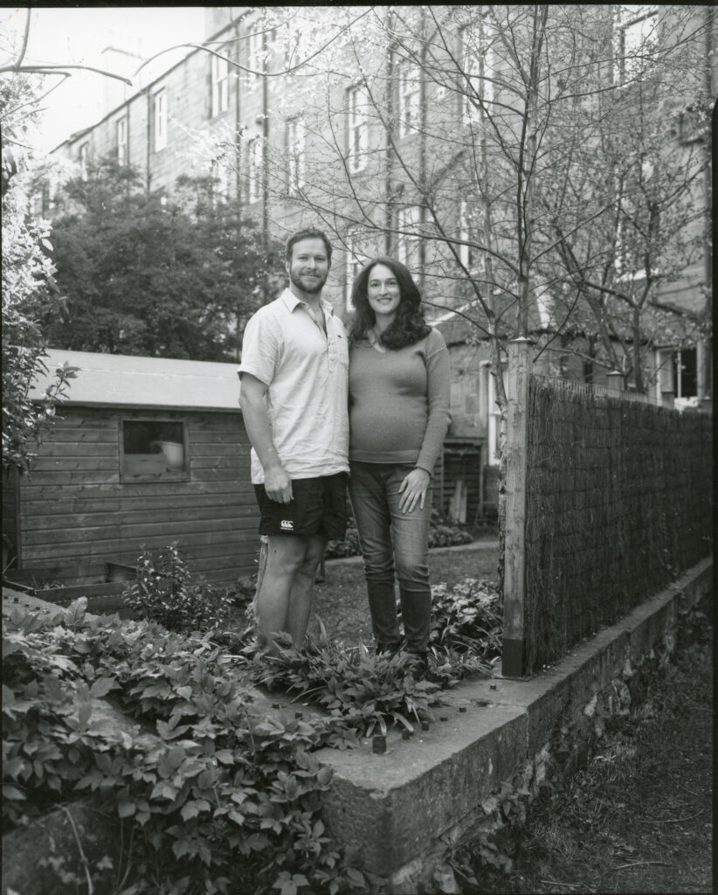
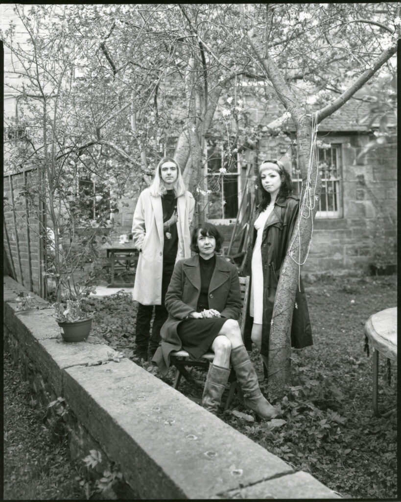
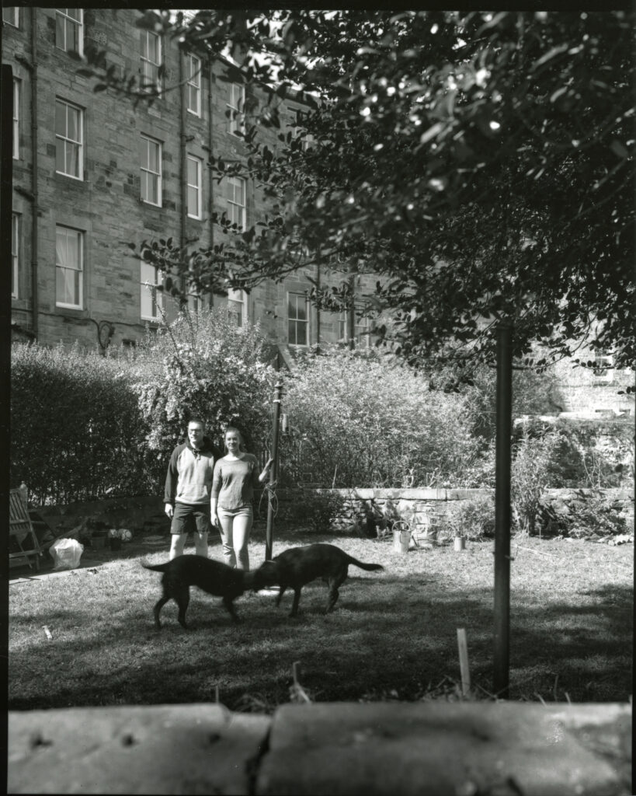
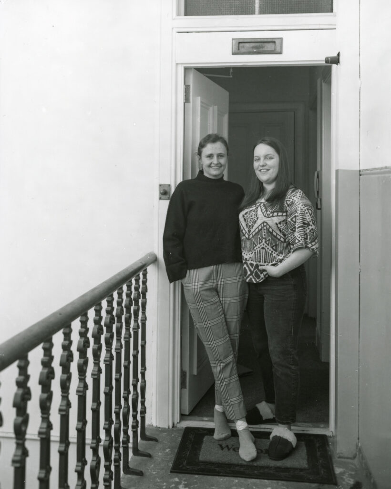
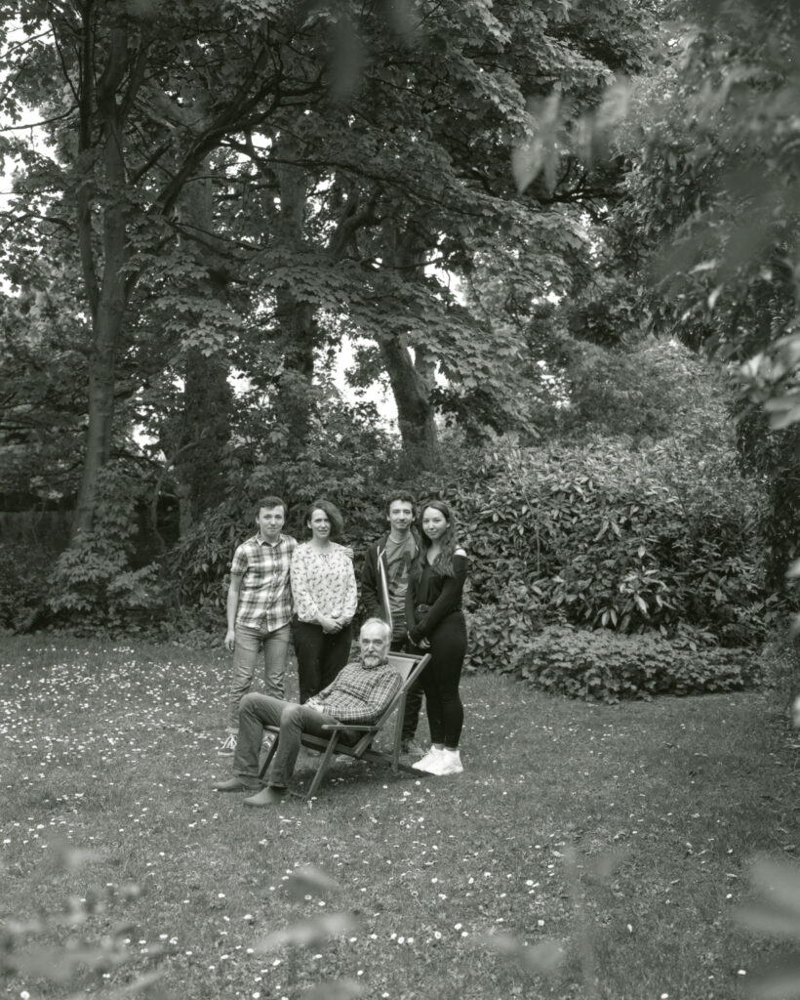
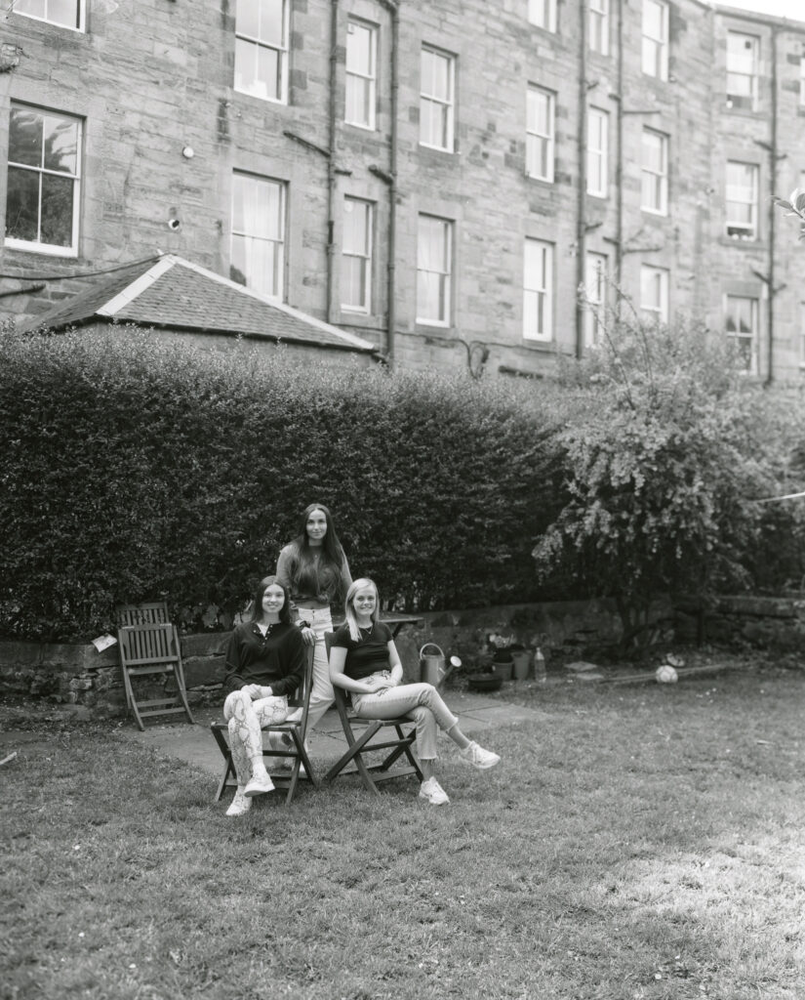
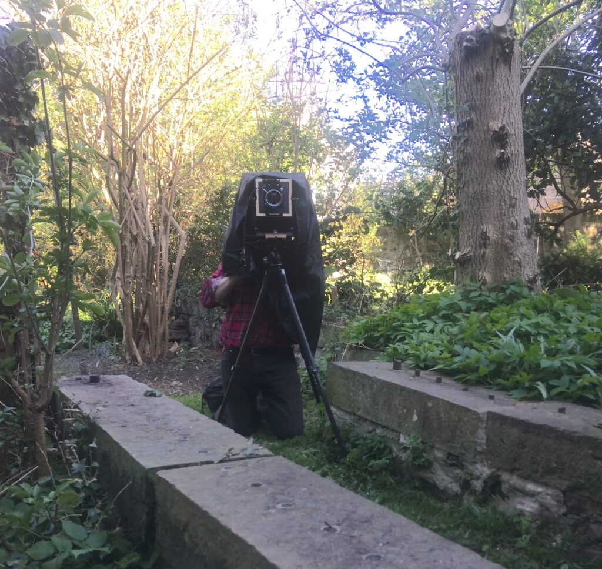

Are you bored during lockdown? Are you speaking to neighbours more than you did before? Would you like to be part of an art project capturing a little piece of this unique time?

In January my very special 8x10 inch [Intrepid](https://intrepidcamera.co.uk/) view camera arrived. It is new but of a kind that has been used for well over a century. I had planned to take it to the Highlands but I've found something as wonderful to photograph nearby - my neighbours in [Marchmont](https://en.wikipedia.org/wiki/Marchmont).

I develop the film in the bathroom. At first I made cyanotypes prints (blue prints) because that process doesn't need a darkroom.

Hyam family: Cyanotype print

After a move around I've been able to start making darkroom prints in our box room.

Hyam family: Darkroom work print.

I like to keep the computer out of the loop as much as possible. We are all dragged into the interweb and zoom meetings so much at this time. These are scans of the 8x10 inch contact prints I make.

William and Caroline: Darkroom work print.

Dylan, Susan and Fiona: Darkroom work print.

Chris and Cara: Darkroom work print.

Jess & Caitlin: Darkroom work print.

Angus & family: Darkroom work print.

Lisa, Toni, Rachel: Darkroom work print

I'd like to photograph more of the people of Marchmont and nearby. Would you like to be involved? Do you know someone who would? I offer nothing but a few minutes distraction from the lockdown and a print. This is old style, analogue photography and the chance that the image won't "come out" adds a frisson of excitement! Perhaps we'll end up with a collection that captures a little piece of this historic time.

Unfortunately I don't feel I can visit people as leaving the house for an art project isn't currently permitted. But if you are interested please contact me by email: [roger@hyam.net](mailto:roger@hyam.net) and we can try and work something out when the lockdown loosens a bit. I'm also thinking of doing some walk past sessions from our front door!

Sitter's eye view

