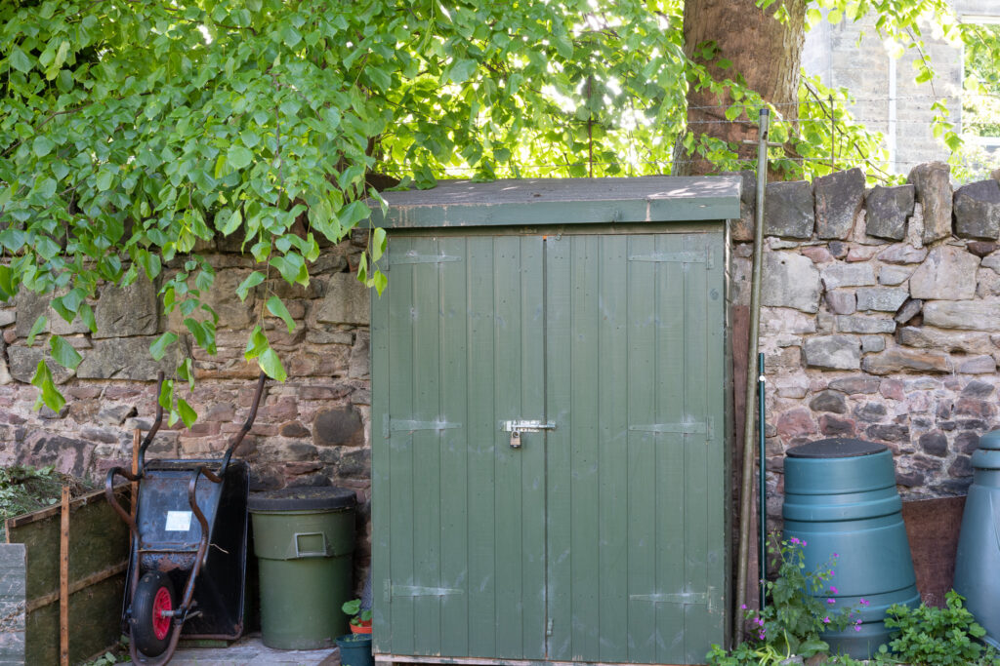
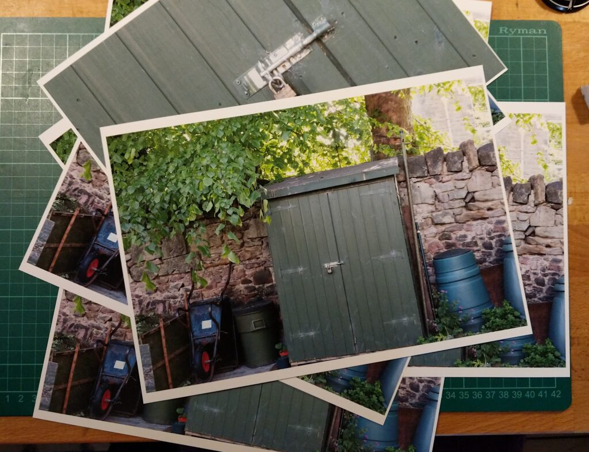
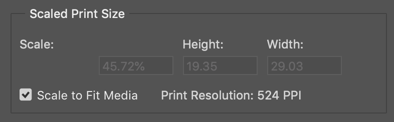
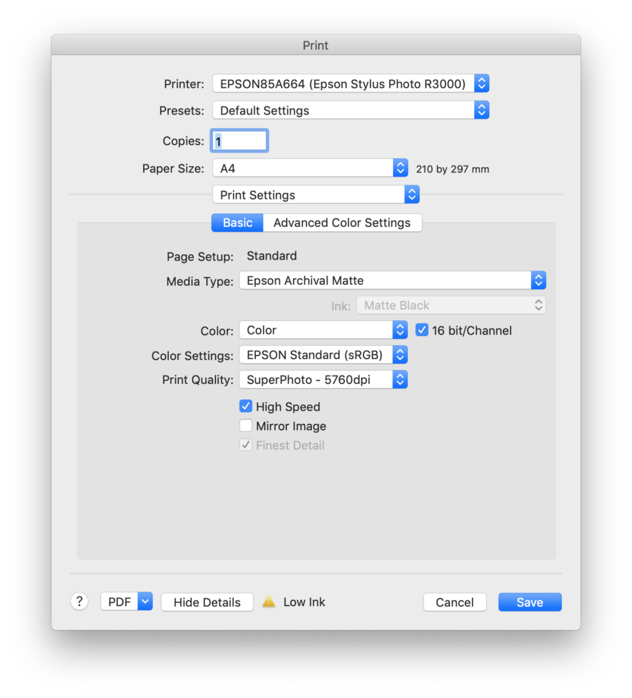

> Give me six hours to chop down a tree and I will spend the first four sharpening the axe.
> 
> Abraham Lincoln (attributed to at least)

Even if being in lockdown doesn't enable too much creative photography it allows for some axe sharpening ready for when we are free again.

Today I took a picture of the shed in the garden with my Fujifilm X-Pro 2 camera. It has a 24 megapixel ASP-C sensor. The composition is almost random but I was very careful to lock it down on a sturdy tripod and focus and expose manually, releasing the shutter with the self timer to avoid movement. It is a very "correct" picture of a shed.

I did this because I had been lusting after a Fujifilm GFX 50R camera which has 50 megapixels on a sensor that is twice the size. It costs a lot. The lenses cost a lot. Both the camera and the lenses are heavier and bulkier than the Fujifilm X series I own. It would allow for bigger, higher resolution prints though. But just how big can I print now? This is a question I've thought about for a while and lockdown gives me a chance to find out the answer.

Standard wisdom (i.e. the internet) tends to say you need to send 300dpi (dots per inch) files to the printer. This isn't true. It is a rule of thumb from the days where 150 lines per inch were used in halftone reproduction. But still many people adhere to the 300dpi rule. At 300dpi the maximum I could print from my 6,000x4,000 pixel camera would be 20" x 13". I know from experience I can send lower resolutions to the printer and get good results and so could print bigger but I have never done real practical tests to check out how low - and therefore how big a print we can make.

I took the shed shot and, without editing at all, loaded it (via Lightroom) into Photoshop. There I sent it direct to the printer at A4 size.

This gives a ppi (a.k.a. dpi) to the printer of 524 - over kill. I used Epson Archival Matt and SuperPhoto resolution.

I then reduced the image size so it would be 300dpi (actually 299 because of rounding) and sent it again. Then again till I had done seven prints with different combinations of settings. These are the notes on my results.

1. 524dpi - Overkill maximum from camera for an A4 print.
2. 300dpi - Indistinguishable from 524dpi with reading glasses or close focus glasses.
3. 200dpi - Indistinguishable from 300dpi with reading glasses or close focus glasses.
4. 150dpi - Indistinguishable from 300dpi with reading glasses but looks softer with close focus glasses.
5. 100dpi - Definitely soft with reading glasses. Pixelated with close focus glasses.
6. 100dpi resized back up to 300dpi in photoshop. Horrible, over sharpened and artifacts.
7. Enhance Details in Lightroom then export to photoshop and print at 100dpi just the lock in the centre of the image. Looks a bit soft but would probably be OK with sharpening. This would be a 60x40 inch print.

How does this translate into print sizes?

| **DPI** | **Width** | **Height** | **Notes** |
| --- | --- | --- | --- |
| 300dpi | 20" | 13" | Easily good enough |
| 200dpi | 30" | 20" | Easily good enough. |
| 150dpi | 40" | 26" | Probably OK |
| 100dpi | 60" | 40" | Possible with tweaking |

So practical testing shows I could do 30x20 inch prints of the full image or even maybe with a little cropping. What about if I were using the GFX 50R? Then I could do 41x30 inch prints at 200dpi - which doesn't seem much bigger in the great scheme of things. It is twice the area but not twice the dimensions and a different, possibly preferable, aspect ration. We go from maximum 30" prints to maximum 40" prints for a lot of cost and effort. But the killer blow is that my printer only goes up to A4+ which is 19x13 inches! If I want to go any bigger I have to outsource my printing.

All this is not dismissing the GFX. I still have the old techno lust for it. I'm sure the image quality would be "better" but maybe in a few years when one can be had for a fraction of the current price.
