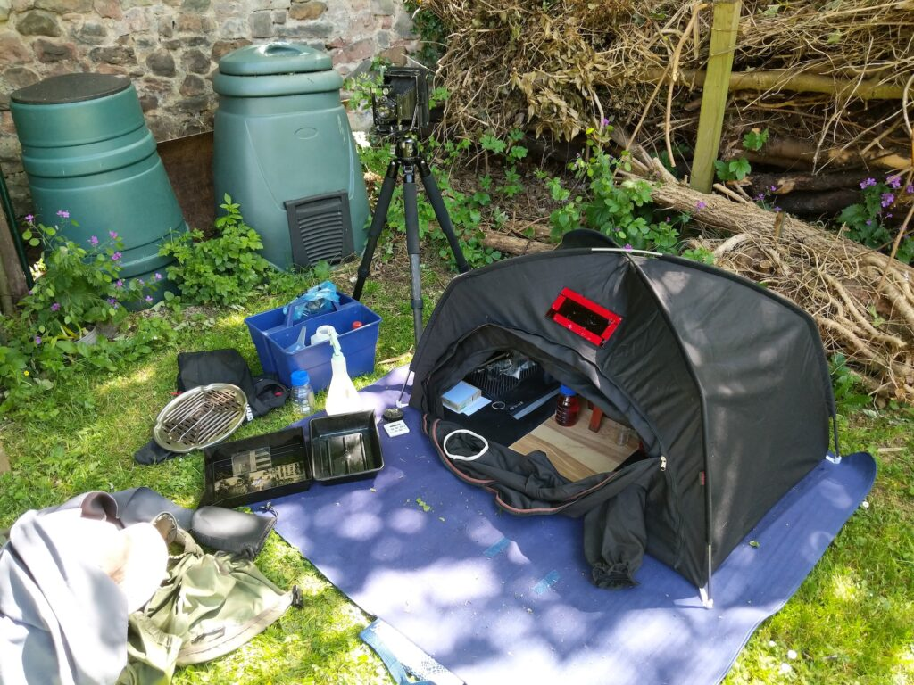
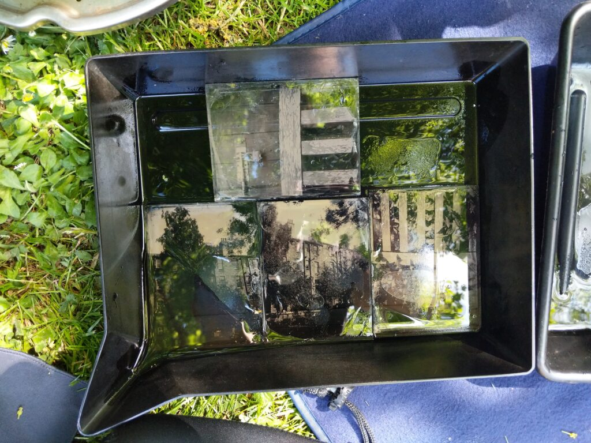
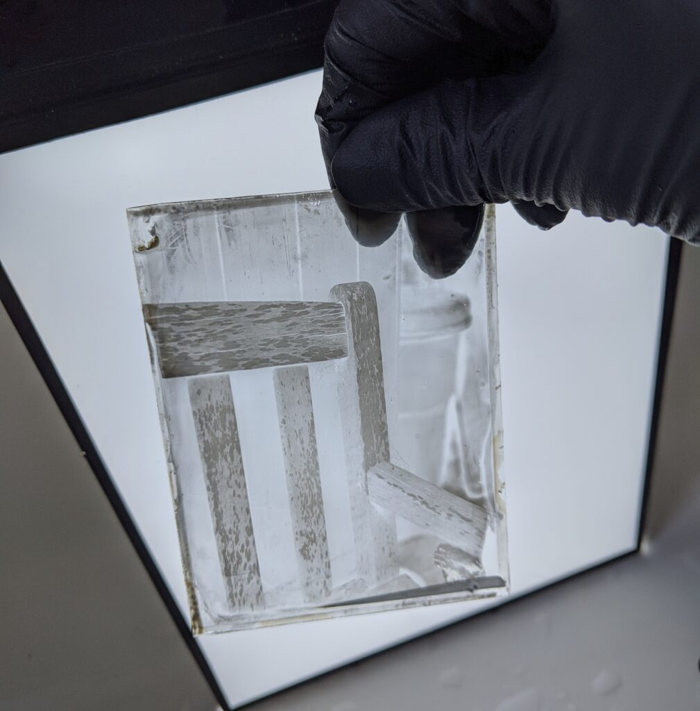
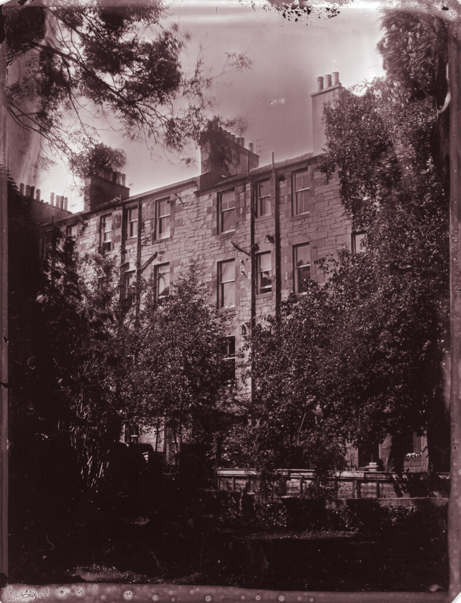
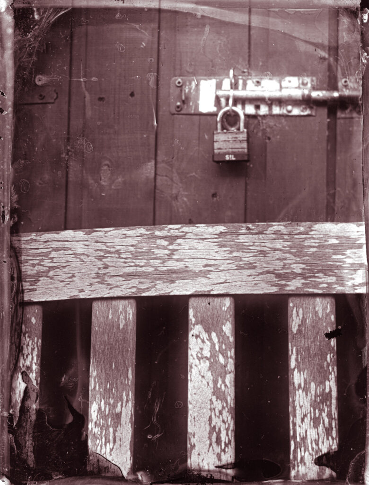
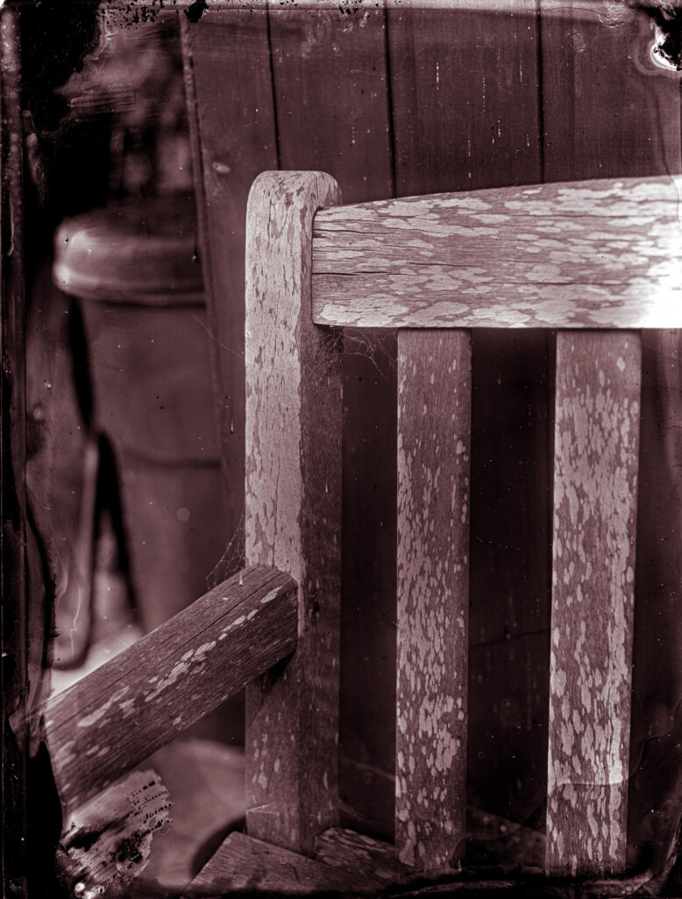
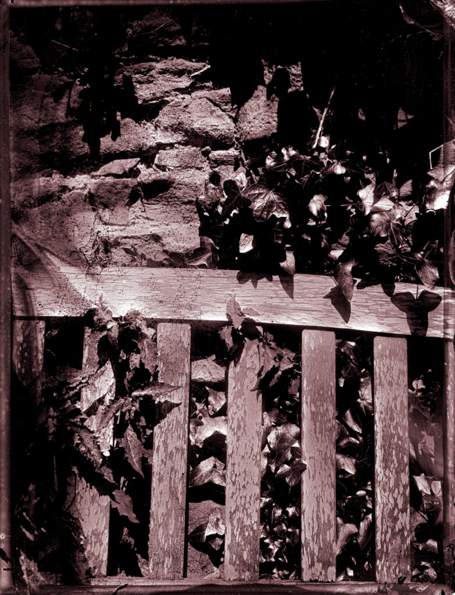

My three month old iodising collodion finally got to me. Today I mounted an expedition to the bottom of the garden to make some collodion negatives. I've often wondered whether it would be feasible to do backpack collodion - to head for the hills with all that I need to make a few plates and return having left nothing but footprints. When I started making ambrotypes this seemed totally feasible. When I learned a little more it became totally farcical. Now it feels like a doable thing again. Perhaps the past ten weeks of lockdown are getting to me.

The picnic blanket is essential.

I used my [Voigtländer Avus](http://www.hyam.net/blog/archives/3945) as it is the smallest but maybe not lightest 4x5 I own. It was an rag bag collection of bits that wouldn't fit in a backpack today but with some ingenuity maybe one day.

The collodion is very slow so I found I was making quite acceptable ambrotypes but had to give it really long exposures to approach something like a negative. I used my regular positive vinegar & sugar developer. There was little fogging even with thirty seconds of development.

This is before toning.

The results were not thick enough for alternative printing processes but my plan was to only get them good enough to scan. Rather than redevelop as is traditionally done I gave each a minute or so in Ilford Selenium Toner (1+3) which boosted the density and contrast somewhat. I've never heard of this done with collodion negatives before.

I scanned them in black and white on an Epson 800 resting on rubber tags a la [Ben Horne](https://www.benhorne.com/blog/2019/9/3/custom-8x10-film-scanning-mask). In Lightroom I gave them minimal tweaking and added a split tone. Overall I'm pleased. It was a pleasant way to spend the day. I discovered that making some 1/4 plate or 4x5 acrylic plates in the field and then scan them to produce reasonable size exhibition prints might be a feasible way of working.

- 
    
- 
    
- 
    
- 
    

Four of the six plates were worth scanning

