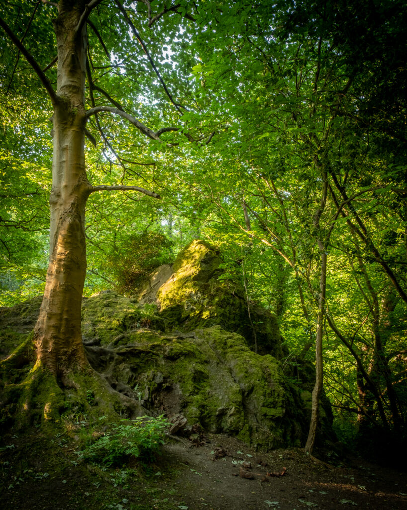

Twenty minutes walk from home the Hermitage of Braid is a wooded valley beside the volcanic plug that is Blackford Hill. Scattered across the whole area are these lumps of igneous rock that withstood the retreat of the glacier fifteen thousand years ago. This is one of my favourites. I'm enjoying photographing digitally for the first time in a while.

