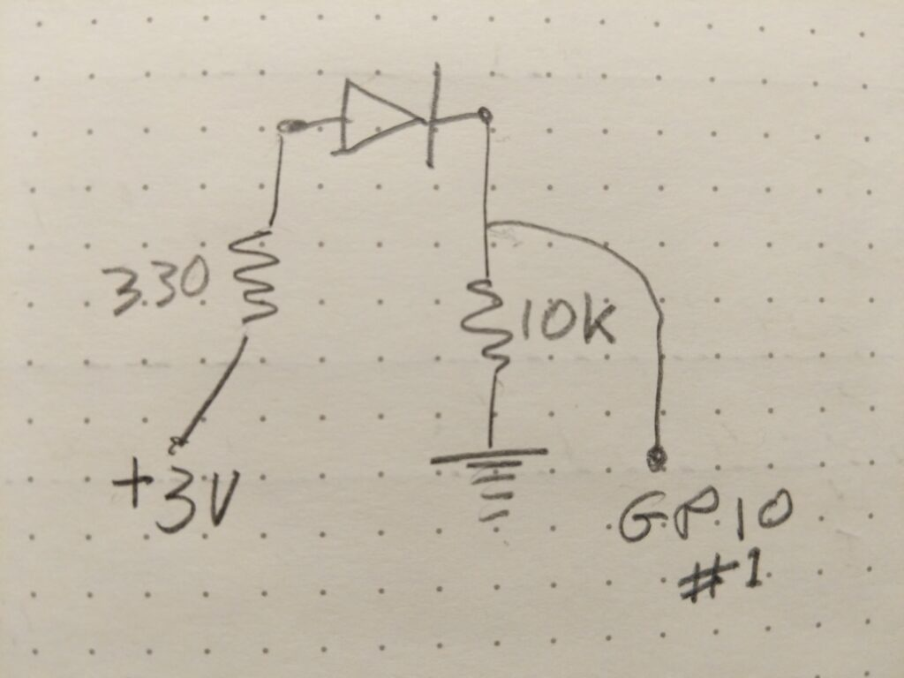
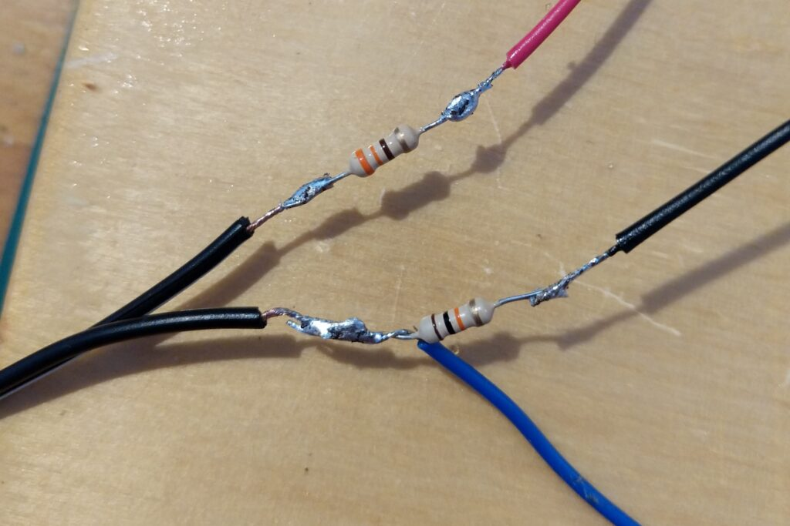

https://youtu.be/XODxLiduKVg

The mechanical shutters found in many analogue cameras, especially those before the 1980s, are amazing pieces of engineering. Many still work accurately but alas many others do not. One solution is to pay to have them professionally serviced but often the camera simply isn't worth the expense. Also a shutter will sometimes be inaccurate but reliably **and therefore totally useable**.

To discover the actual exposures your shutter is giving you you need some kind of timer. There are a few alternatives. In the past I have used the slow motion video on my phone to film the shutter opening and closing. It is a chore to do but works for slower shutter speeds. You can record the sound of the shutter opening and closing and use audio software like [Audacity](https://www.audacityteam.org/) to measure the time between the clicks of the shutter blades. Again this is doable but tricky. There is an app available to help you do it on your phone. You can also use a simple circuit to turn changes in light into audio clicks.

All these approaches are quite labour intensive so I thought I'd see if I could make a stand alone device that would measure shutter speeds based on the [BBC micro:bit](https://microbit.org/). If you haven't come across a micro:bit they are little, embedded systems created to encourage school children to learn to program. You can buy them for about £13 or you could steal one from a passing pupil. They have a simple display, a couple of buttons, some sensors and some I/O pins. You can program them using a graphical block language or Python.

I took a micro:bit and added a BPW43 photodiode, a 10 kΩ resistor and a 330 Ω resistor in a simple circuit that reverse biased the photodiode so it acts like a switch. This maxed out my electronics knowledge but works. I then wrote a simple Python program to measure the duration the diode was on for and convert that into something useful for a photographer. I'm more comfortable with the programming than the wiring. The result is demonstrated in the video above. The whole project cost me less than £25 which included a [MI:power board](https://thepihut.com/products/mi-power-board-for-the-bbc-micro-bit?variant=19935511812) so the micro:bit ran off a little battery rather than needing USB power.

Design skills! I'm not sure I have the diode the right way round. If it doesn't work just switch it. The 330Ω resistor may not be needed and the 10kΩ just needs to be big. These are just the ones I had to hand.

Check out my soldering skills!

[This is the Python code to run on the micro:bit](main.py_.zip)

The way I turn microseconds into photographic time is as follows.

- If the microseconds are within 10% of a standard time (like 1/30th of a second) I count that as being correct.
- If the microsecond time is greater than the standard time by more than 10% but less than half way to the next stop I add a + to the time e.g. 1/30+
- If the microsecond time is less the standard time by more than 10% but greater than half way to the next stop I add a - to the time e.g. 1/30-

This is the way I think when I'm looking at a light meter and gets to within a third of a stop. i.e. "A bit more than 30th or a bit less than 60th". If you want timing closer than a third of a stop you really need to use electronic shutters. For print film it really doesn't matter once you are this close. If you can afford reversal film you can pay to have your shutter serviced!

## Where next?

I have this working as well as I need it to for my purposes but I'd love it if someone else wanted to make one or maybe take it to the next level. For starters it would be good to have it working reliably for speeds up to 1/1000th. If people want to collaborate we could put the code in Github. I can't guarantee I'll be able to put too much time in as I'm back to the day job from tomorrow.
