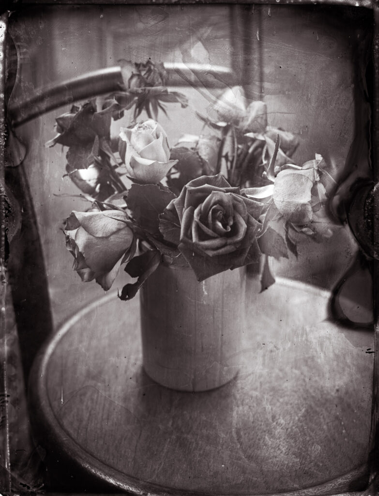
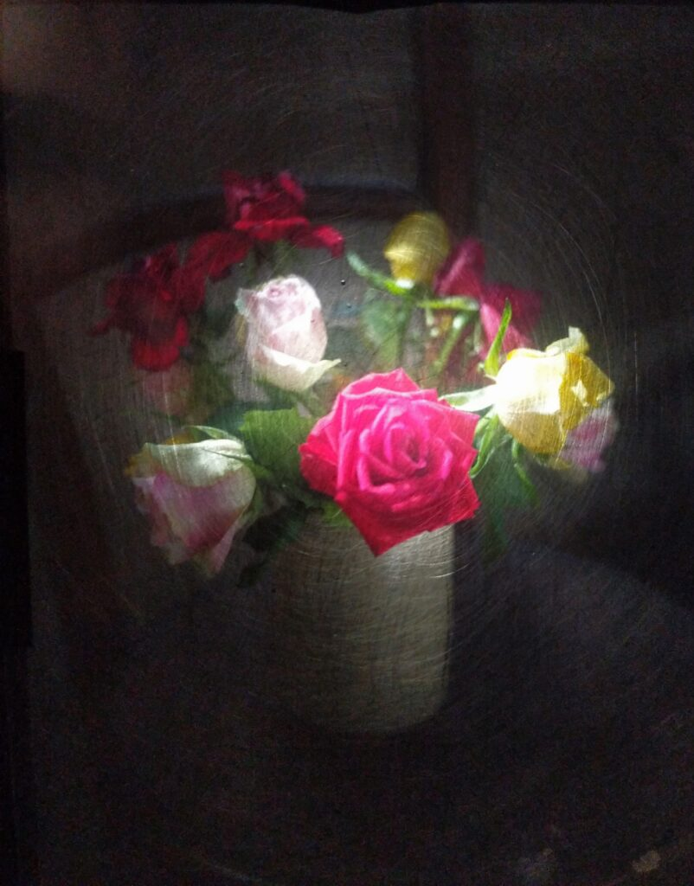

Scanned collodion negative. Five minute exposure.

Fun this afternoon playing with [my adapted Voigtländer Avus](http://www.hyam.net/blog/archives/3945) and three month old Poe Boy collodion. I'm using quarter plate glass from some old glass plate negatives I found in a junk shop. I scrub the plates down and re-using them when the fail. I intensify successful ones for a couple of minutes with Ilford Selenium toner at 1+3. I'm using this camera enough now to warrant making a proper focussing screen for it.

View of the makeshift acrylic focusing screen

Voigtländer Avus with 4x5 adapter back in which quarter plates were used.

