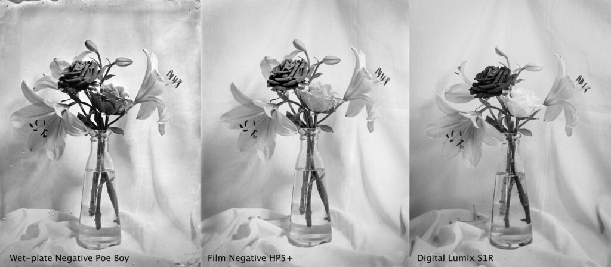
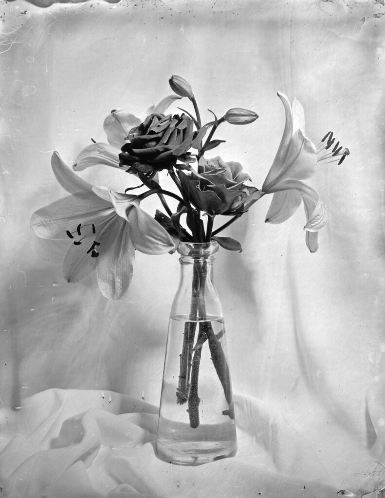
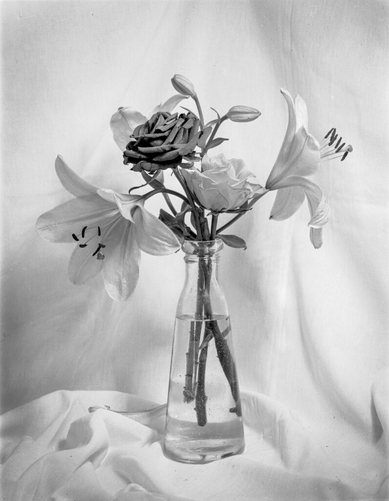
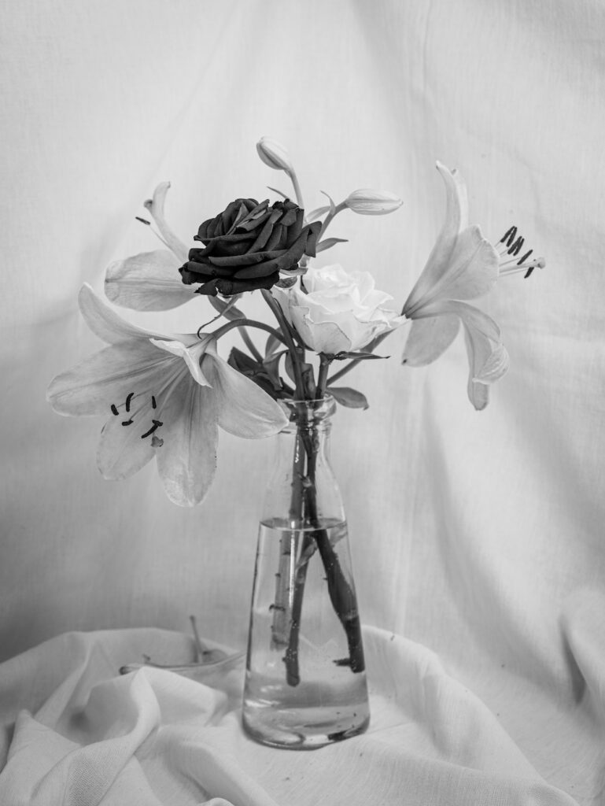

The combined image above shows three photographs I made over the course of an afternoon and evening. I had my wet-plate collodion set up running and wanted to refine how I made glass plate negatives specifically for scanning. Once I had what I felt was a successful wet-plate negative it occured to me that I could easily make a film negative for comparison. And of course once I had both negatives scanned I thought I should add a digitally captured version into the mix.

I did very little digital processing of the wet-plate neg although I confess to removing handful of badly placed comets. For the film neg I upped the texture and clarity in Lightroom so it resembled the wet-plate image a little more although I wasn't aiming to make it identical. Likewise I tweaked the digital version but looking to get it to feel a bit like the wet-plate image rather than make it identical. I could have gone much further in either emulating the wet-plate version or improving on it.

Moving from left to right the amount of effort involved reduces by about an order of magnitude between each image. Processing and scanning a 4x5 film negative is probably ten times less work than making a collodion negative especially if you cut and prepare the glass yourself, salt your own collodion, make up your own developer etc. Compared to the film negative making the digital image is almost trivial.

The result is a set of images that become progressively "clinical" in appearance although none are displeasing.

Wet-plate Collodion

A really skilled wet-plate practitioner should be able to make plates that resemble orthochromatic film so this image's rustic, artisanal appearance is somewhat artificial. If I upped my game it would be slicker. Or I could just by some Ilford Ortho Plus film and save a lot of effort! Coming from the other direction roughing up a digital image to make it look like film or wet-plate is the worst form of pastiche. Why use one medium to emulate another when it has its own qualities to bring out?

Film Negative HP5+

So is analogue photography worth it? This question is unanswerable. Firstly it depends what analogue means. Conventional film is a lot easier than wet-plate collodion. Working in a hybrid form, where we scan the negatives into the computer, is very different from producing your own darkroom or alternative prints. More importantly it depends what we mean by "it". Do we mean the time, effort and money? If our reward is actually in the expending of time and effort doing something that pleases us then the more convoluted and difficult a technique is the more it is worth doing. We make pictures because we like making pictures after all.

Digital Lumix S1R

What I have learned from this somewhat accidental experiment is that film might be enough for outdoor work. I've been trying to compress my wet-plate process into a rucksack but I should consider more carefully if this is worth "it". I'm not saying it isn't and I won't work that way. I'm just mulling.
