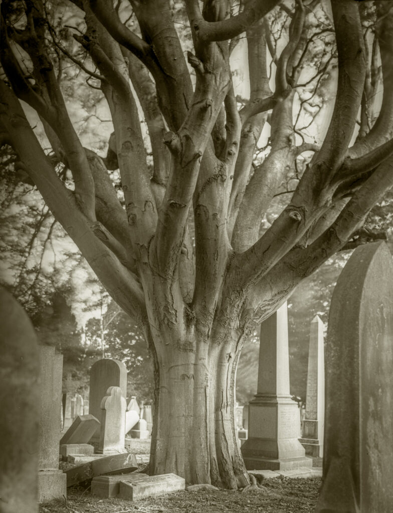
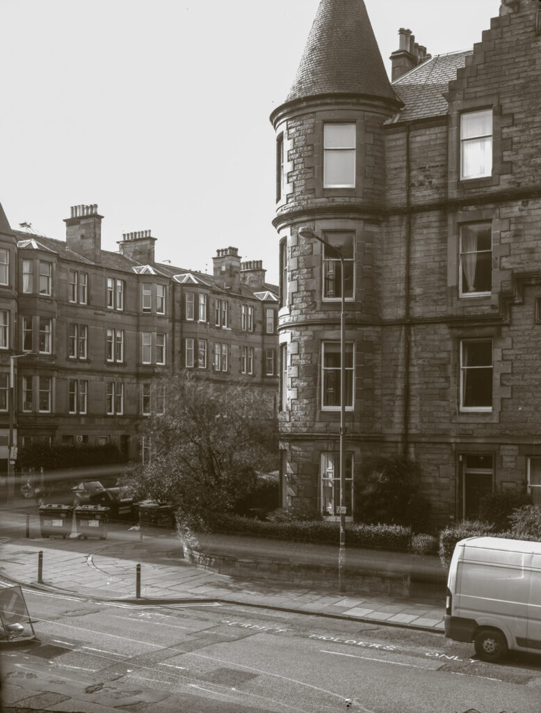

Third successful test. This is 10 minutes at f11. Overcast + under trees + 4pm in September at 56° North.

A week off the day job has given me time to work on my silver gelatine glass plate negatives. I've learnt a big lesson and results are much improved.

1st out the window test.

For emulsions #1 & #2 I had downsized a larger recipe and got to a Potassium Iodide content of about 0.2g. My scales really don't go that low so I put in about 0.5g. In hindsight suspect it was more than that. The resulting plates didn't clear when fixed and were grainy. This time I calculated I actually needed about 0.15g iodide (to go with 4g bromide and 5g silver nitrate). To add that I made up 10% iodide solution and added 15ml (reducing other volumes appropriately). It turns out if you get the ratios nearer correct the emulsion works better! I need to do some research on the "correct" ratio of bromide to iodide for future emulsions.

Now I have 17 plates coated with #3 and am off to the Deeside pine woods for a couple of days to see what I can get.
