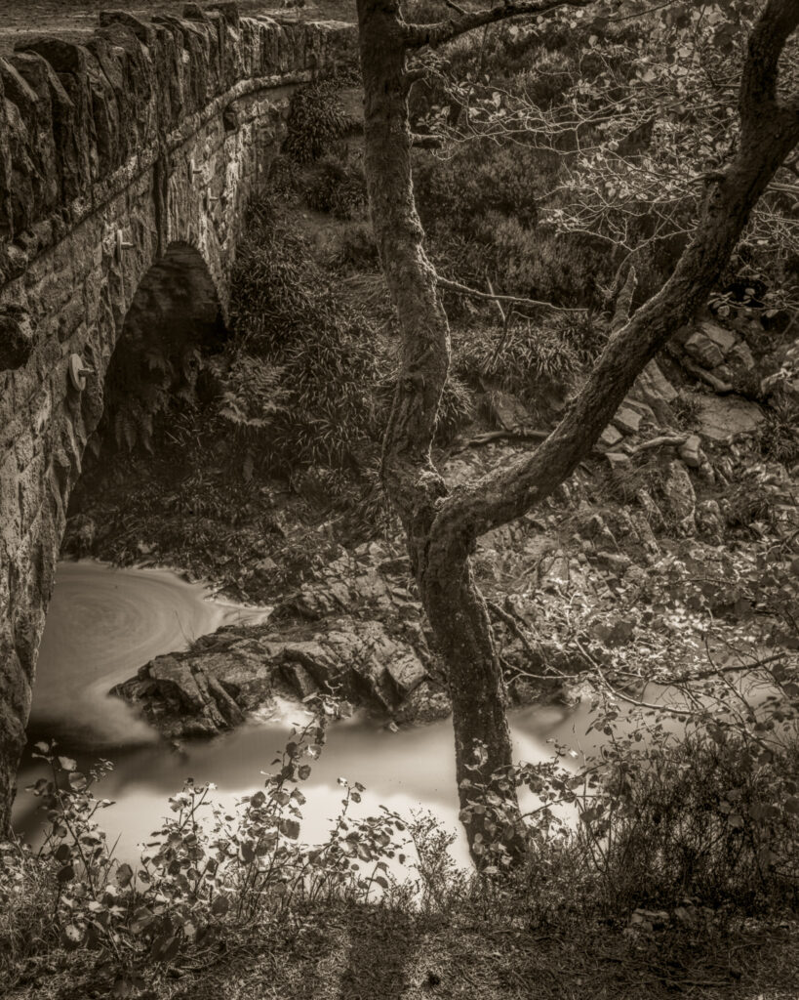
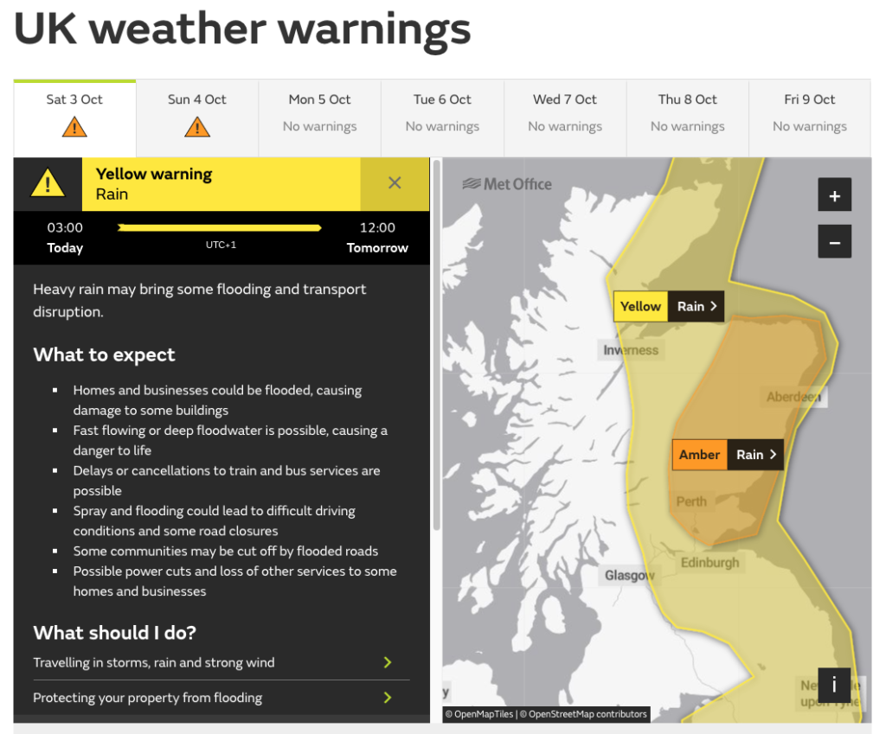
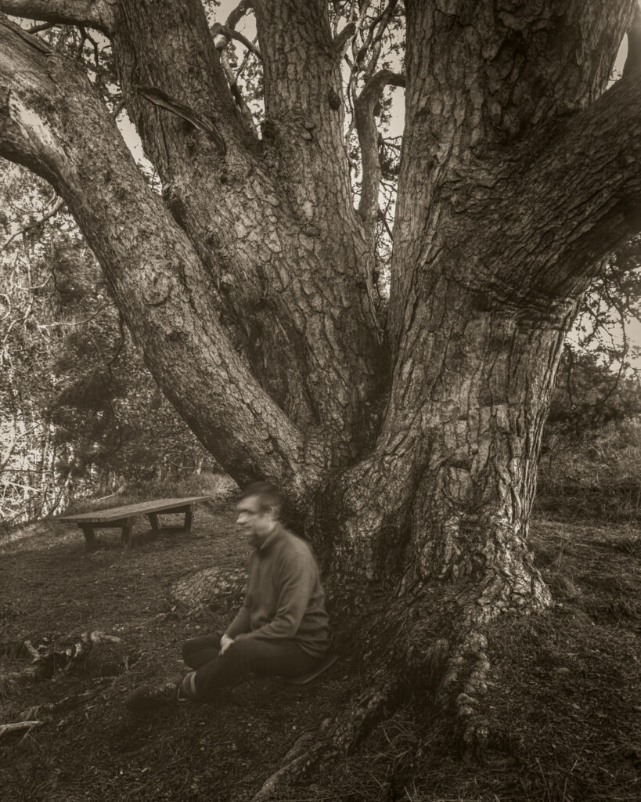

Glen Tanar

Last week I headed off to explore Deeside some more and photograph with my freshly made glass plates. I got about ten miles before the brakes on the van started playing up and I had to abandon the trip. This week I tried again and made it all the way to Marr Lodge and Glen Tanar but the first day was a wash out. I had a nice walk but it rained pretty much continually. The light was bad for either dry plate or digital photography. The next day the sun came out but not in a nice way. There was hardly a cloud in the sky resulting in glaring highlights and harsh shadows. For the third day the met office issued a weather warning for heavy rain! I came home early.

Of my four trips in 2020 only one has come off as planned. I've had snow, mechanical failure and rain stop the other three. But I'm not too disheartened. I have some images and I've learned some lessons. For example I've just ordered a cheap mountain bike so I can get further along the glens without tiring myself out.

Self portrait with old pine at Glen Tanar - A 20 minute exposure.

