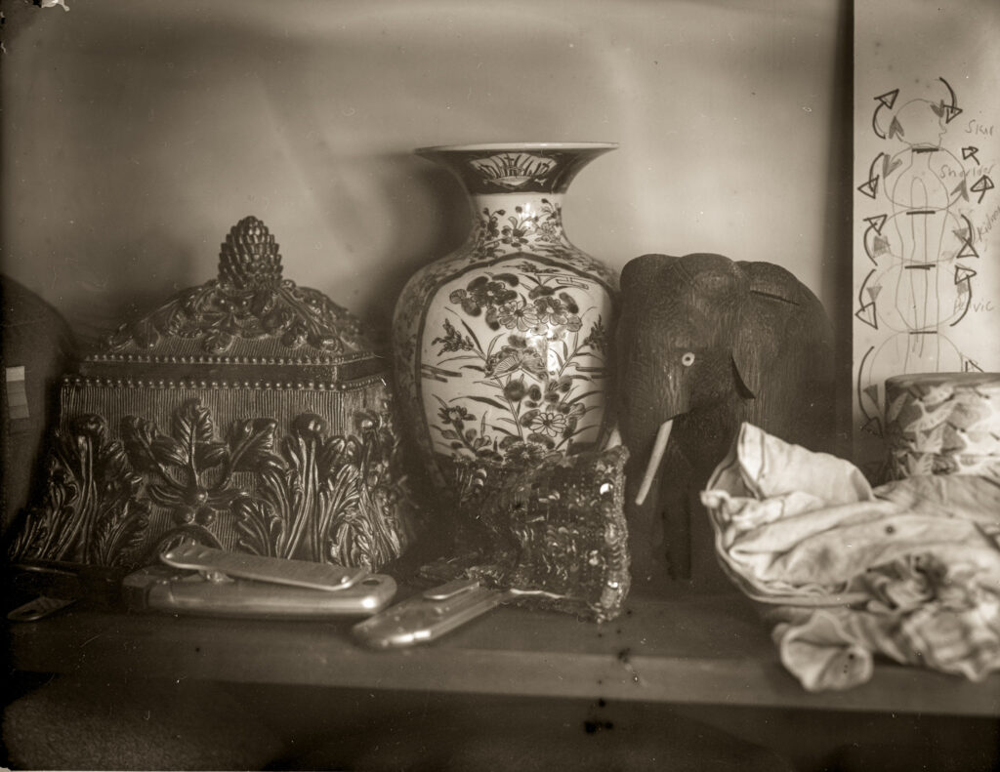
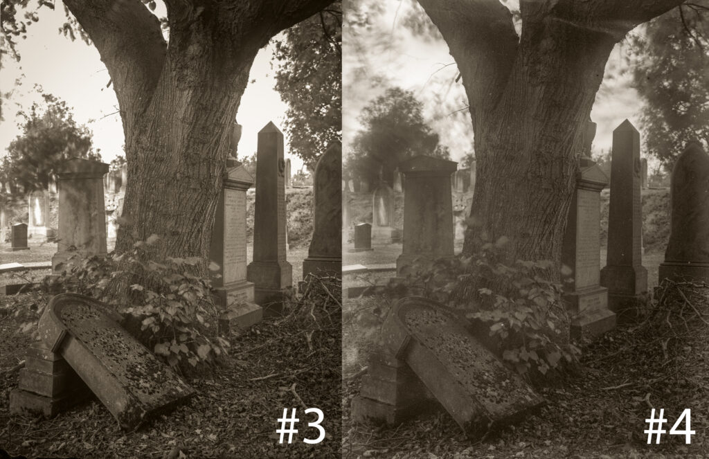
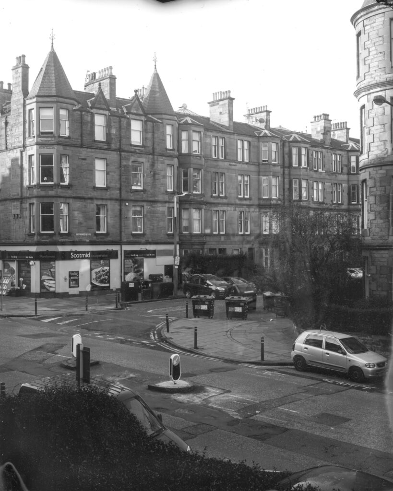

We learn by making mistakes. The third photographic emulsion I made was great. It was clean and contrasty and just worked. So I thought I'd jazz it up a bit for the fourth emulsion by adding ten drops of 1% Erythrosine (that's pink food colouring E127) to increase the green response. It didn't work. Right from the start the fog test looked terrible and the images were muddy. When you get thrown the only solution is to get back on the horse. I immediately made emulsion #5 with no additions at all. It looks as good as #3 barring some "pepper fog" - a specking of black dots on the negative or white dots on the print.

Emulsion #4 - Random test shot with artificial light. This actually has some emotional meaning to me because the vase and elephant are from my childhood. But it is accidental not deliberate muddiness.

Side by side comparison of emulsions #3 and #4

I think I'm going to stick to simple bromo-iodide emulsion till I can do it repeatedly. These emulsion have just four ingredients:

- Gelatine (preferably photo grade)
- Silver Nitrate
- Potassium Bromide
- Potassium Iodide
- Distilled/deionised Water - that makes five ingredients.

All you have to do is combine these in the right way and you can make high resolution UV/Blue sensitive emulsions.

Very quick and (literally) dirty test plate of emulsion #5. No toning in Lightroom. We're back in business!

Much image making to be done to perfect the bromo-iodide emulsion.
