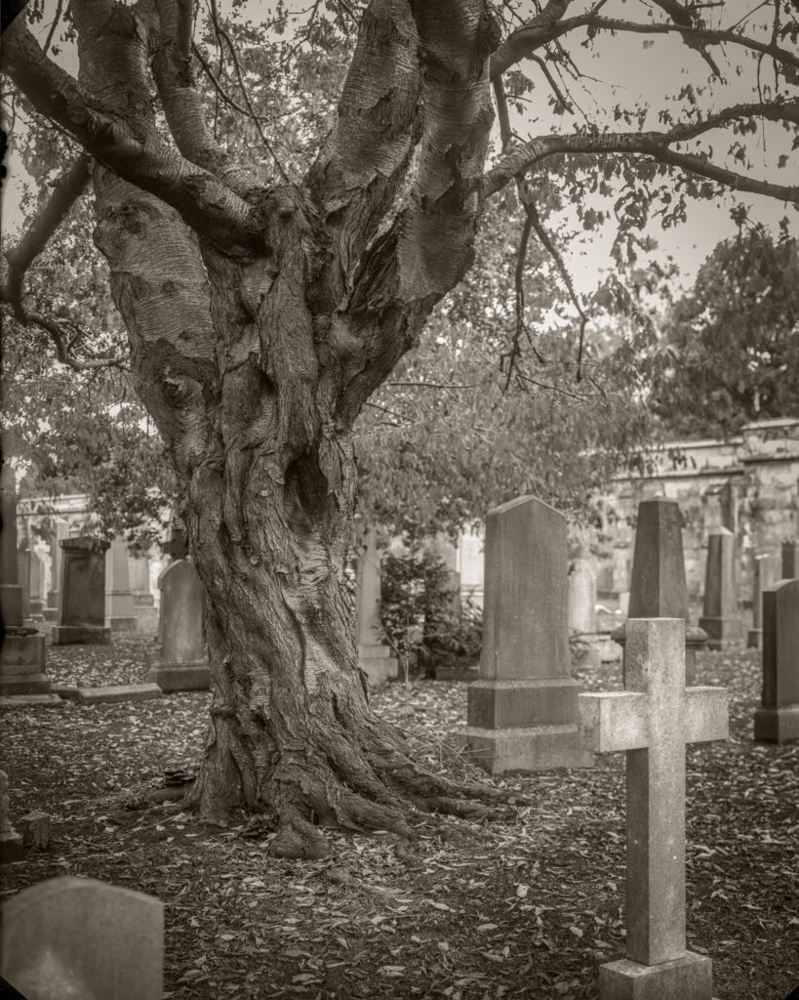
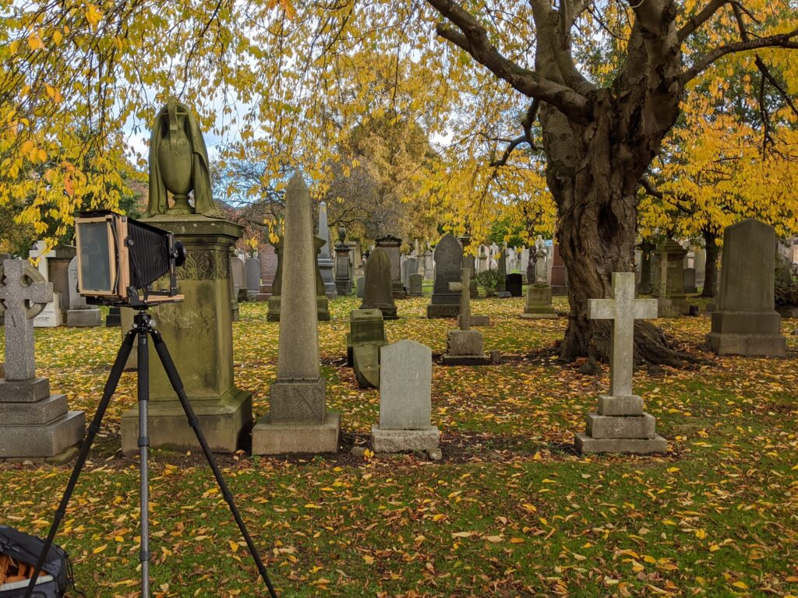
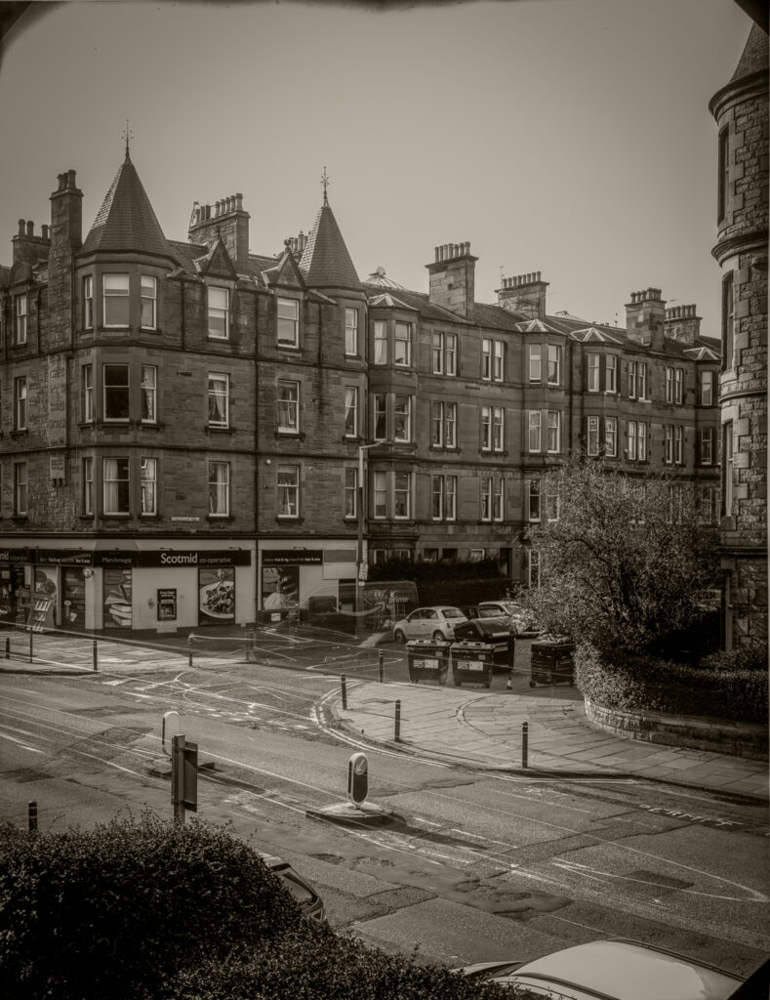

I was back in Grange Cemetery in my lunch break this time with my 8x10 to see if I can do 8x10 dry plates or not. The first attempt was a disaster because I didn't push my DIY plate holder all the way home and there was a light leak. My second and third were better. This is using emulsion RH5.

https://youtu.be/Nyoz0G8Ftk8

A familiar tree. 20 minute exposure at f/22

The compulsory test shot from living room window. Activity during the 90 second exposure is evident.

Conclusion: 8x10 glass negs are wonderful things and the images do have a different feel even when scanning them.
