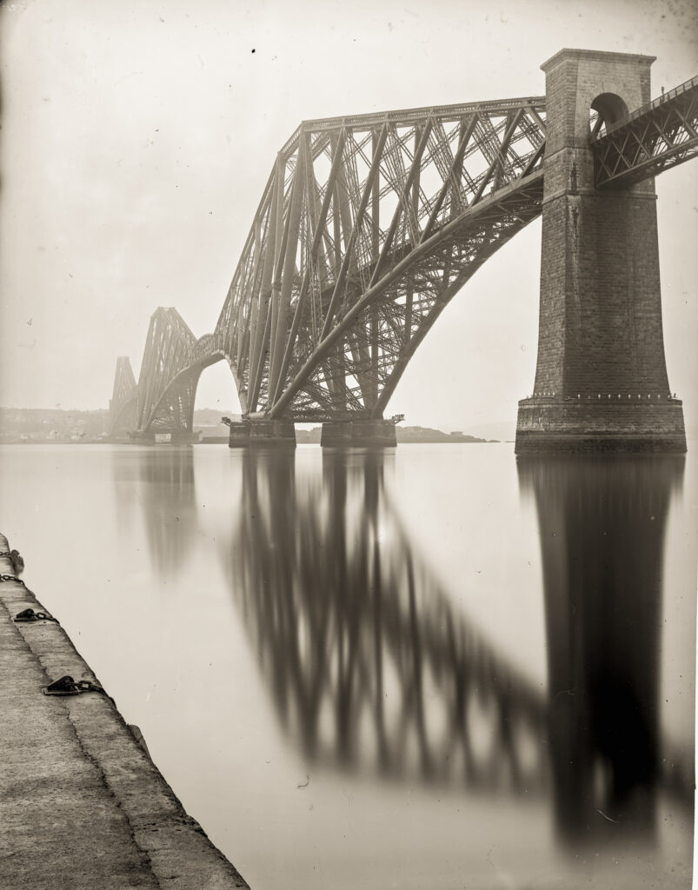
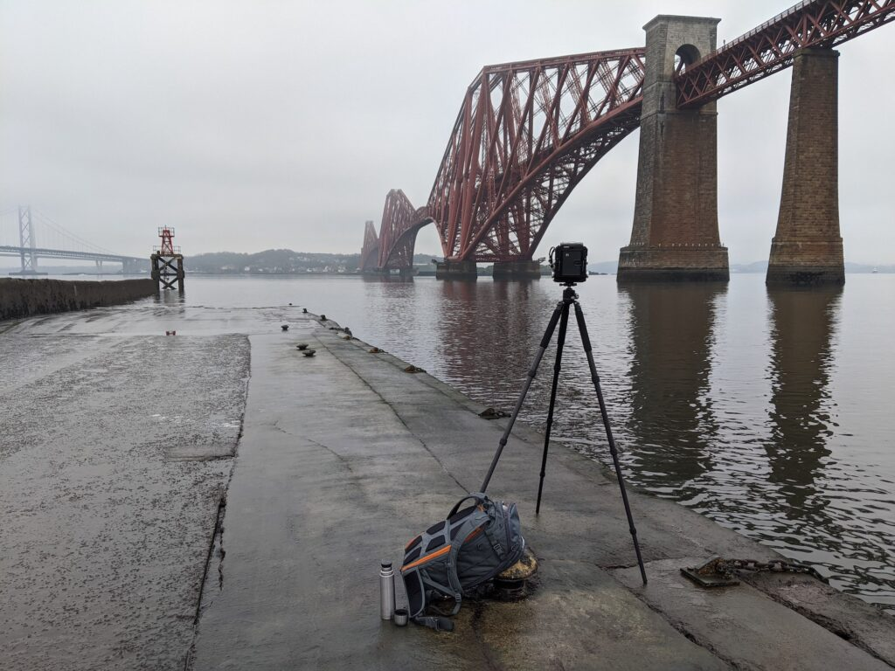
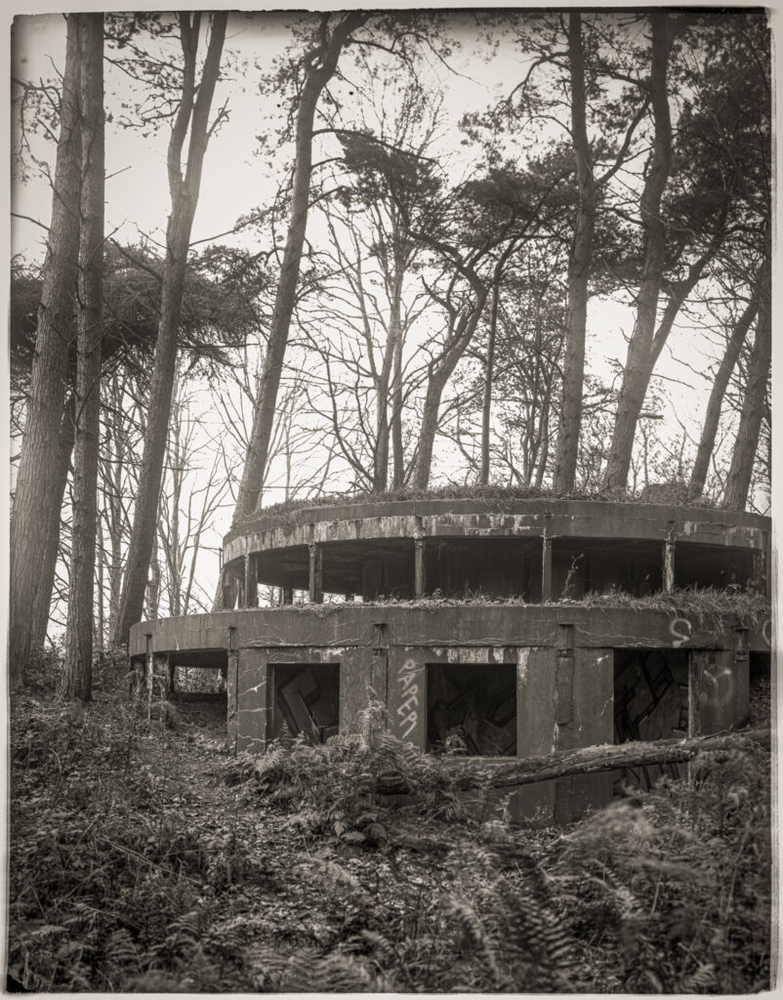

Using dry plate technology from the 1880s I feel drawn to anything from the Victorian era. Living in Edinburgh we are blessed with such subjects which is good because the current Covid-19 restrictions mean I can't leave the city. Today I photographed the [Forth Rail Bridge](https://en.wikipedia.org/wiki/Forth_Bridge) (opened 1890) and the result is convincingly late 19th Century.

Forth Rail Bridge photographed November 2020 on simple bromide emulsion

Time for a brew during the 16 minute exposure. Looks so mundane on the phone.

A little way down the coast is a [First World War coastal battery.](https://canmore.org.uk/site/50454/forth-defences-inner-hound-point-battery) It suits the medium very well.

Inner Hound Point WWI battery. 20 minute exposure on simple bromide emulsion

