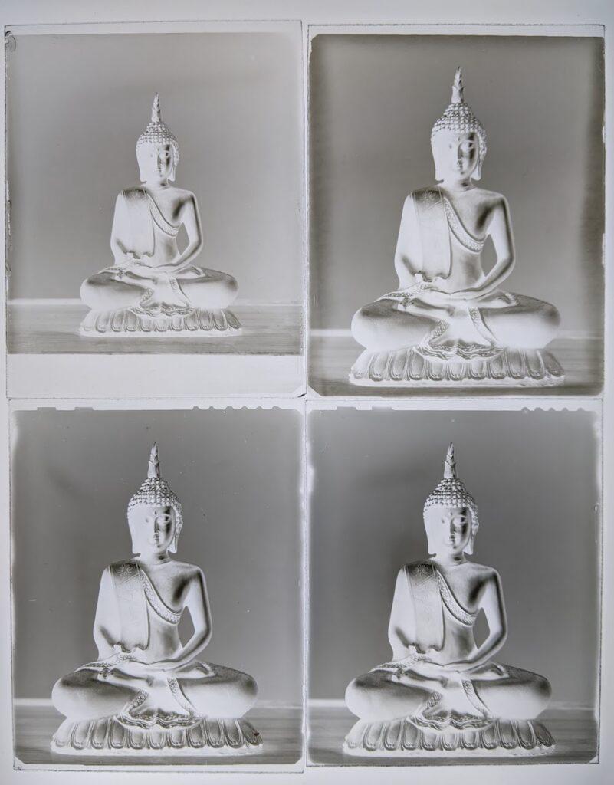
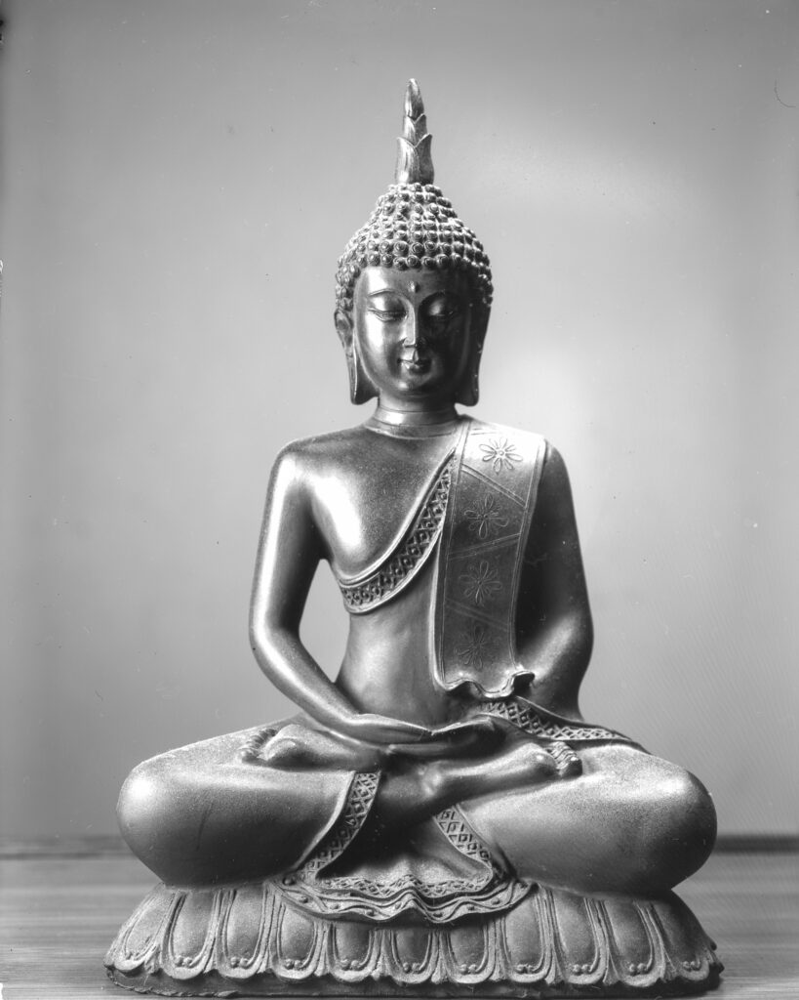

Work makes it hard to get outside while it is still light but I've been itching to test out using Ilford PQ Universal developer on my dry plates. Last night I set up a simple still life. I didn't really have the energy to do more than pick an object. I'm please with the image I made and a little surprised there was so little difference between developer concentrations.

- Top Left: Well under exposed first shot in PQ @ 1:29
- Top Right: Reframed and plus one stop. PQ @ 1:29 for 7 minutes
- Bottom Left: PQ @ 1:19 for 6 minutes
- Botton Right: PQ @ 1:9 for 6 minutes

All were developed until I didn't see any more detail coming in the shadows. I think I'm basically developing to completion on these. More exposure would have given denser results but not markedly higher contrast. They are still a bit thin overall. I thought there would be much more difference between 1:9 and 1:19. Ilford recommend 1:19 for pictorial work and 1:9 for more graphic stuff with sheet film but this emulsion is more like a paper emulsion. Overall tonality is really nice. I could scan to have details in the specular highlights if I wanted to.

Scan of bottom right plate.

Conclusion is I think I'll adopt Ilford PQ as my default developer.
