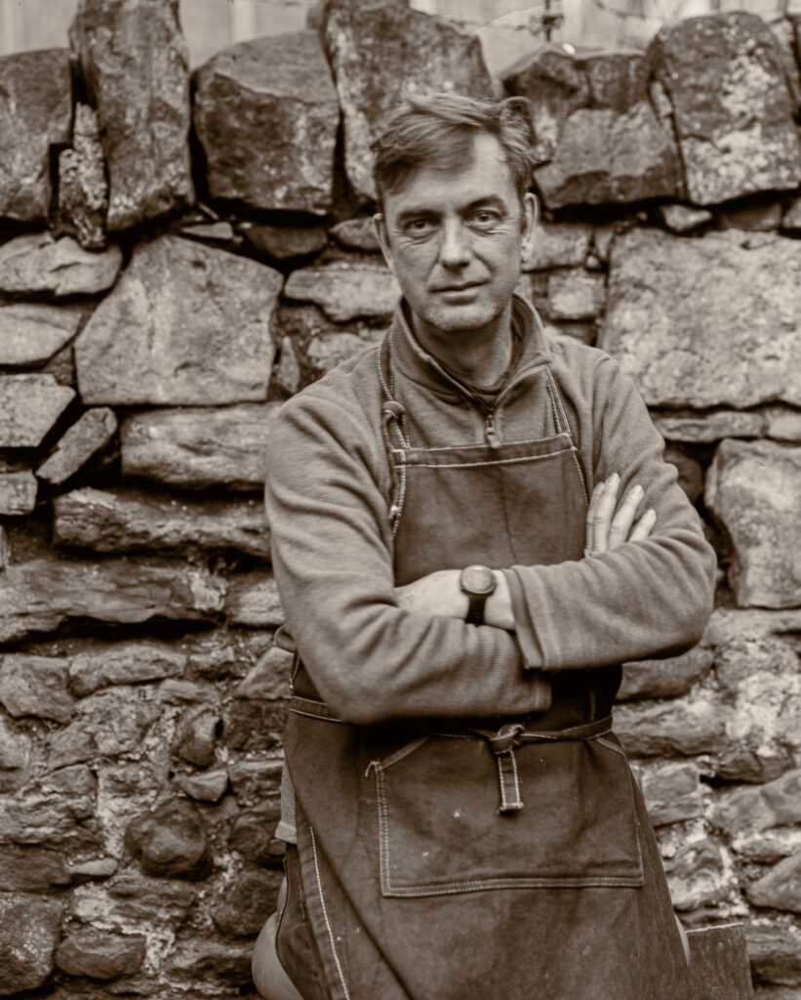
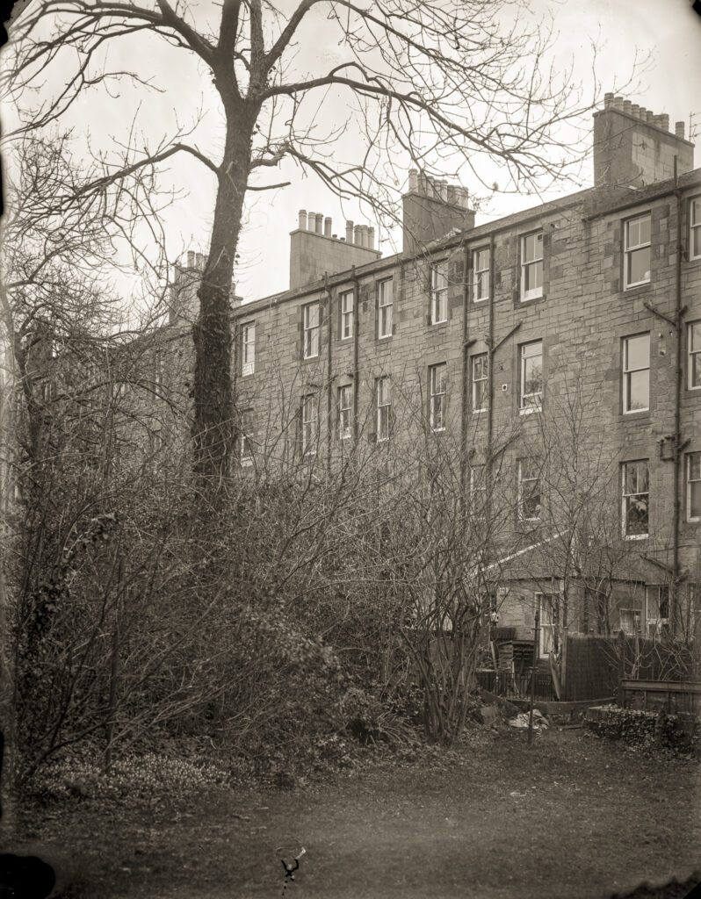

For my birthday the family humoured me by playing at making portraits in the garden. I broke out the Intrepid 8x10 - a special occasions camera - and we shot some very old Ilford Multigrade paper as negatives.

Me at 56 - Taken by Faith. Exposure of six little monkeys.

My daughter, Faith, is getting pretty good at doing the large format dance and did the whole exposure procedure on her own to make this image of me. It was a dull day and exposures were long.

I also found an old 8x10 glass plate I had coated so I made an exposure of the back of our building - about 10 minutes at f/16 - then popped it through the same developer and contact printed it. (We live in an Edinburgh tenement flat and share the garden.)

Direct scan of 8x10 plate

It is a pretty dull image but I enjoyed the process of working with the large plate. This is a way of working I have considered but not embraced because of the frustration with plate holders. I may look into making my own in the future.
