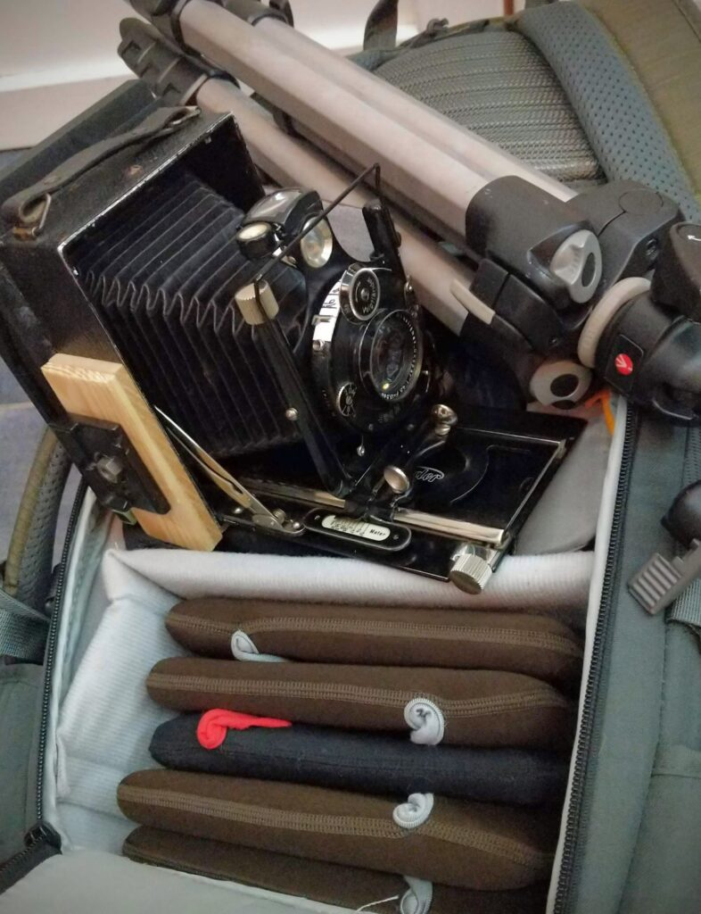
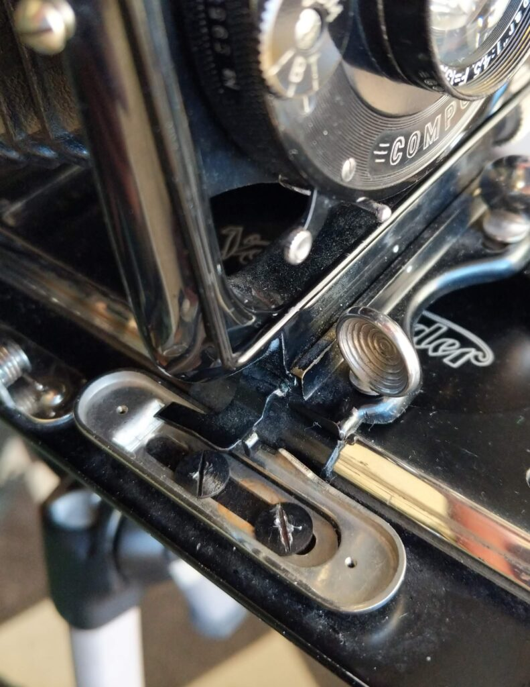
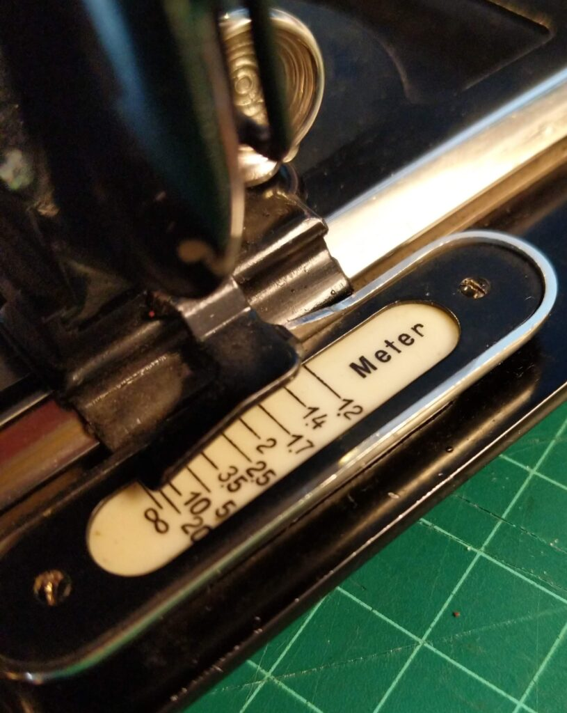
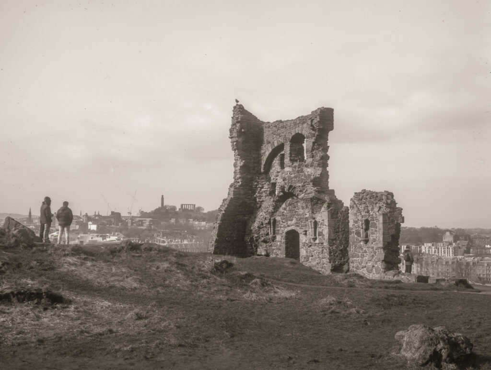
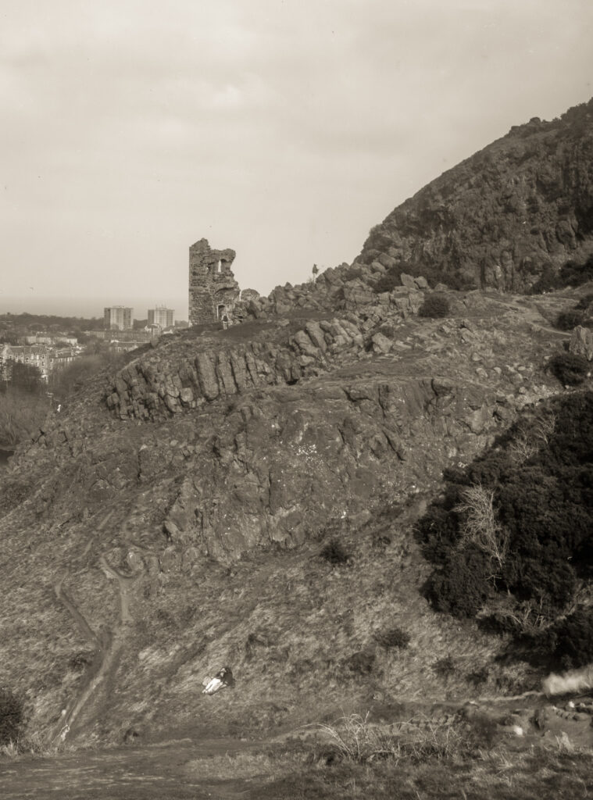
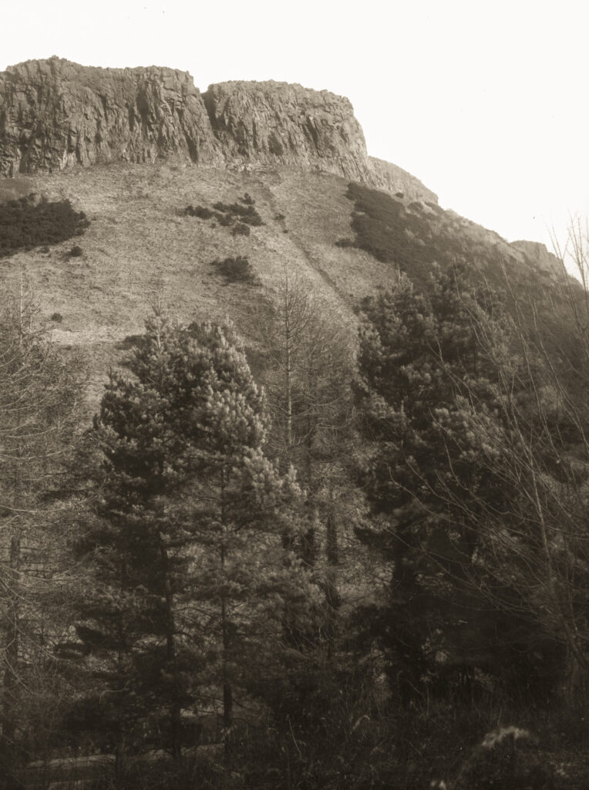

We have a "stay at home" order in place in Scotland right now which means we can only go outside for essential reasons such as work (that can't be done from home), caring responsibilities or exercise. I've decided not to count using my full size pack, containing a large carbon fibre tripod and Wista 45 camera as an essential activity. It would be OK carrying it about for exercise but when I set up to make a photo it is like a small encampment and I don't want to set a bad example to others in the city/ But I have a pile of plates waiting to be exposed and itchy feet. I have therefore come up with a lightweight dry plate kit I feel comfortable using in public.

Minimalist dry plate gear

I have a [Voigtländer Avus with an adapted 4x5 back](http://www.hyam.net/blog/archives/3945) that has been something of an _objet d'art_ for too long. I dusted it off and made a new glass focussing screen. The previous version had been very crude acrylic. The new screen made it possible to calibrate the focus scale more precisely. A few tests with a laser measure showed it was quite accurate. I also added Manfrotto quick release plates so that the camera can be mounted in landscape or horizontal format quickly and reliably.

Two screws below distance scale give a wide range of movement

Once calibrated the camera slides to infinity when opened and the focus knob allows adjustments down to 1.2 metres. Parallax would make focussing any closer impractical.

And that is it! All I need is plates (I take 5x double dark slides but could take fewer), the camera and a small tripod. I don't need a focus cloth or loupe or even a cable release. I can set up, make an image or two and pack away in five minutes, ten minutes if I want to be artsy.

The results aren't bad if you like the 19th Century look. I took a [picture of one of my favourite trees](http://www.hyam.net/blog/archives/6445) on one walk. Below are the results of a cycle trip with the family to picnic in Holyrood Park. It's a bit of fun anyway.

St Anthony's Chapel in Holyrood Park

St Anthony's Chapel with 1960's tower block and guy who looks like he is playing golf  
(all very Scottish)

Yosemite Salisbury Crags in Holyrood Park

