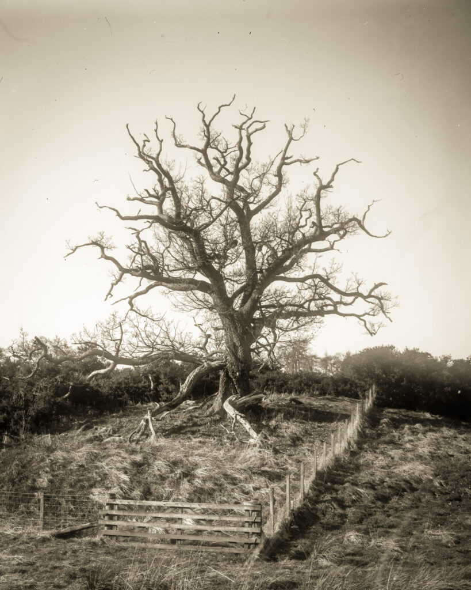

There is an old wind blasted oak tree close to the [North Esk River](https://en.wikipedia.org/wiki/River_Esk,_Lothian) that I like to visit. It is just within the area we are allowed to visit under the current Covid restrictions. Doing the tree justice in a photograph is really hard. The best composition is from due South and the early and late light is cut off by the surrounding trees and hills.

Blasted Oak. My own dry glass dry plate Voigtländer Avus

This is perhaps my most successful attempt. I was walking with my lightweight dry plate kit which consists of five plate holders, a modified 1920's Voigtländer Avus and a small tripod. The combination of century old uncoated optics and crude glass plates, that lack an anti-halation backing, give it a ghostly air.
