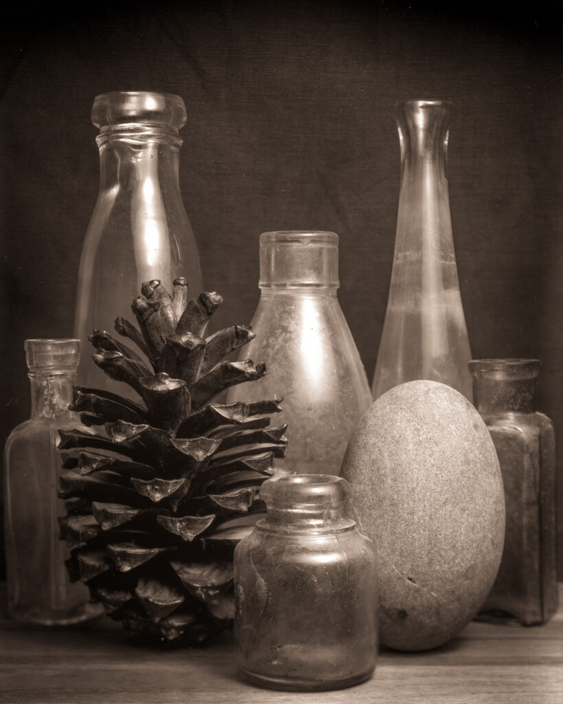
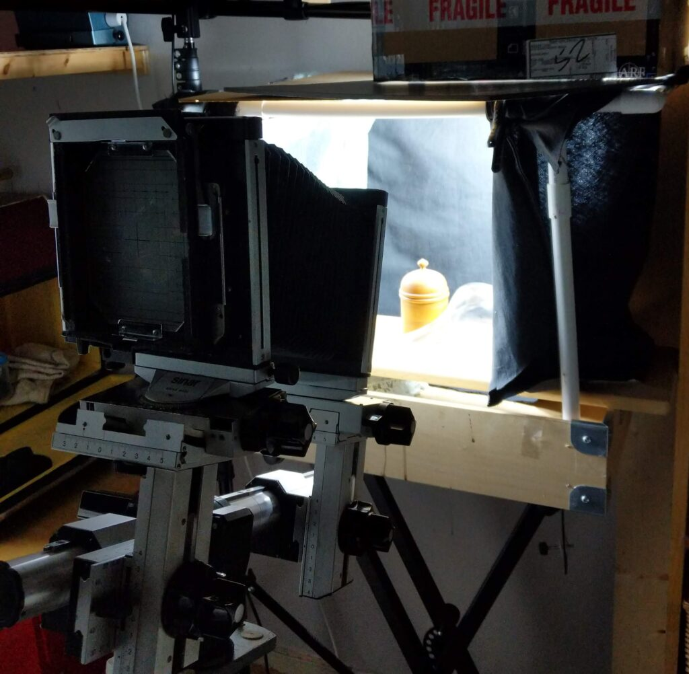
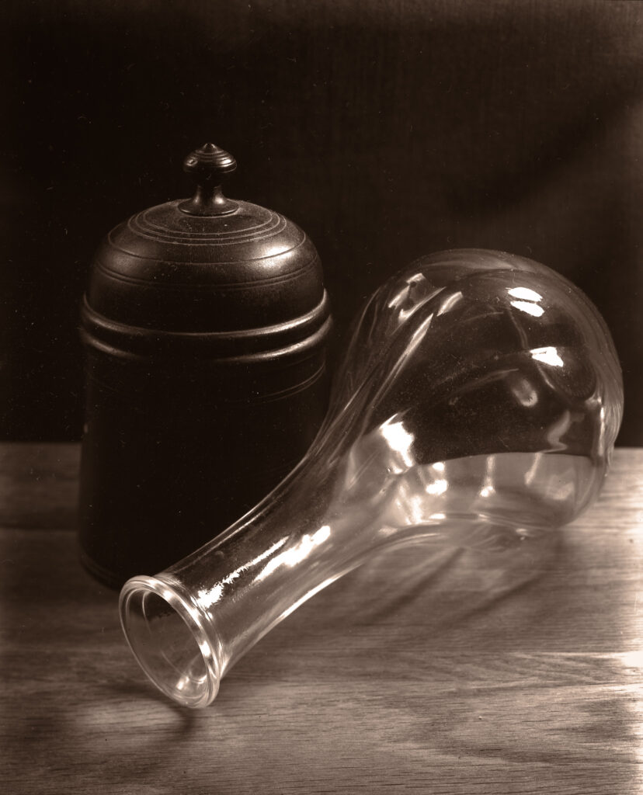
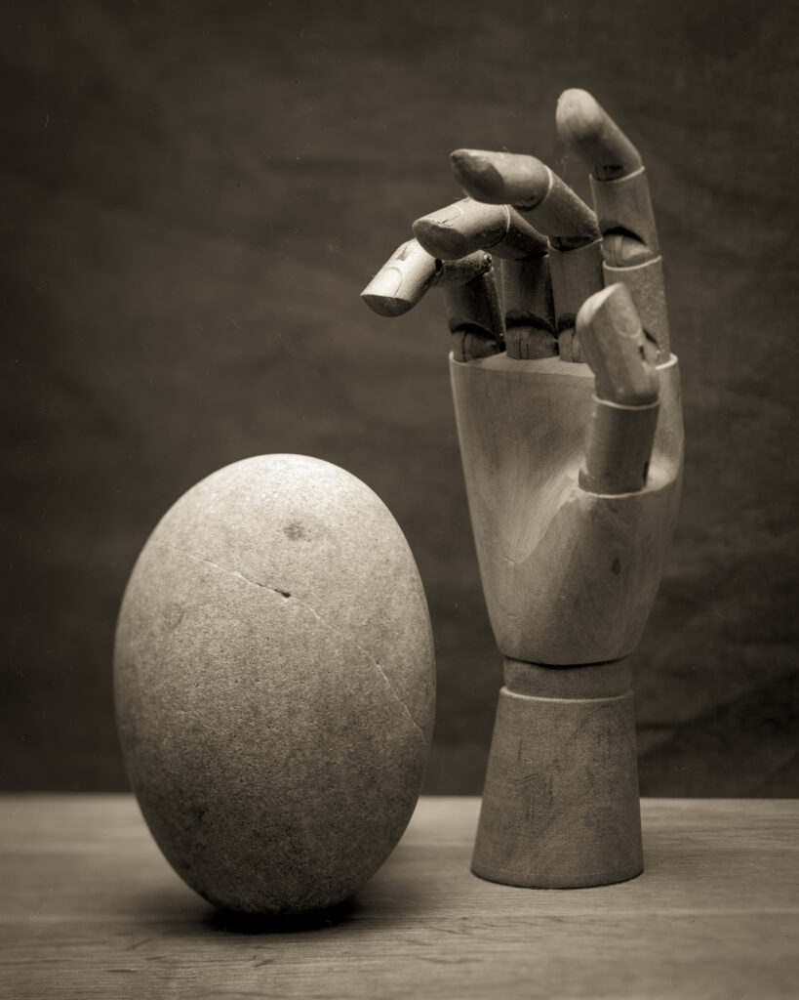
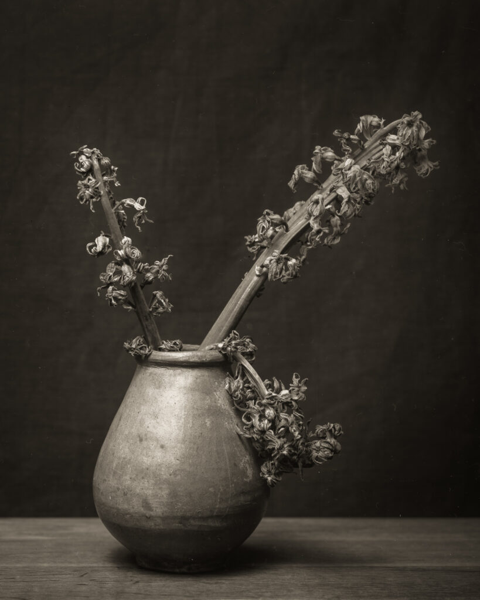

I've been putting things on [Instagram](https://www.instagram.com/edinburgh_ambrotypes/) without blogging them - this is against my new social media policy. How sad I have one!

As we are still in lockdown with a "stay at home" order in effect I've been playing with my Sinar P studio camera. There is precious little room in the flat so have to I set up a still life in the same box room I use to develop the plates in. This means I can shoot and develop and learn about how the plates are responding all at the same time.

One of my main frustrations in working this way is that I have to have a large diffuse light source. This is because the only way to get enough actinic (Blue+UV) light is to use several compact florescent daylight bulbs plus a UV LED "disco" bulb. These are quite large and so act like a soft box. Any modifiers between the source and the subject block too much light. Needing f/numbers to be high to get enough depth of field means long exposures. Ideally it would be hours but I wimp out at about 30 minutes or it gets tedious.

Painters still life box

I tried making a painter's still life set up where the light could be more controlled but getting enough light into the box was near impossible.

Painter's lighting leads to very thin negs

Even without light modifiers and lots of movements depth of field is a challenge.

Subject have to be chosen as being flat but tones can be nice

I'm not particularly inspired by this still life work. This is possibly be cause I'm more interested in found objects and although our flat is full of interesting things they are just too familiar or too big for my wee studio or too small for 4x5 glass plates.
