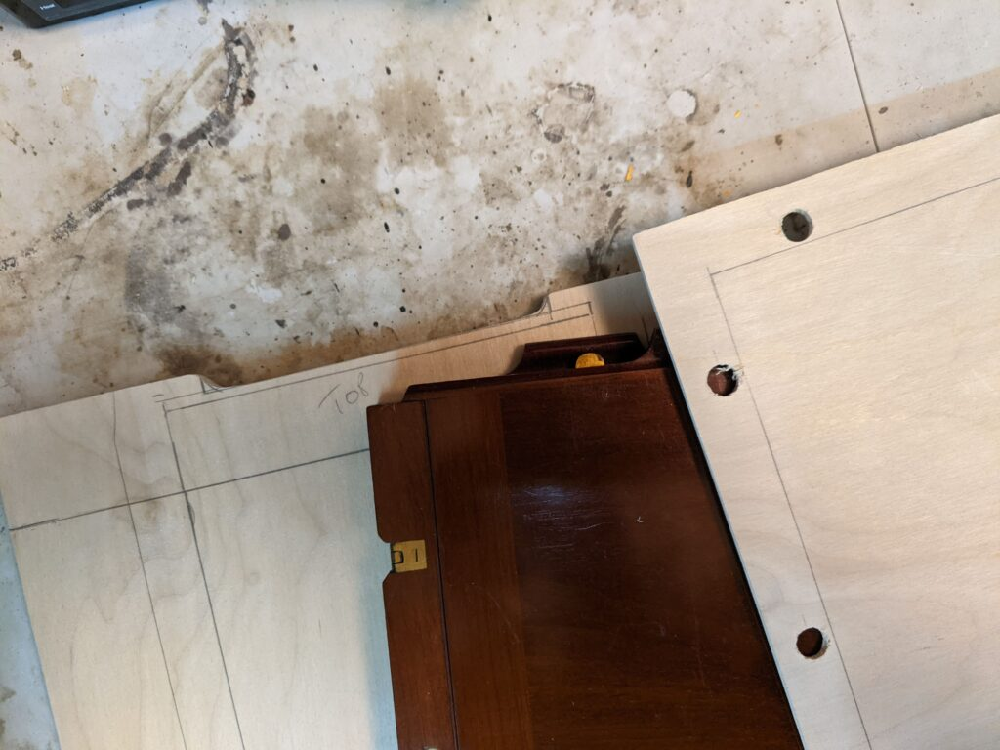
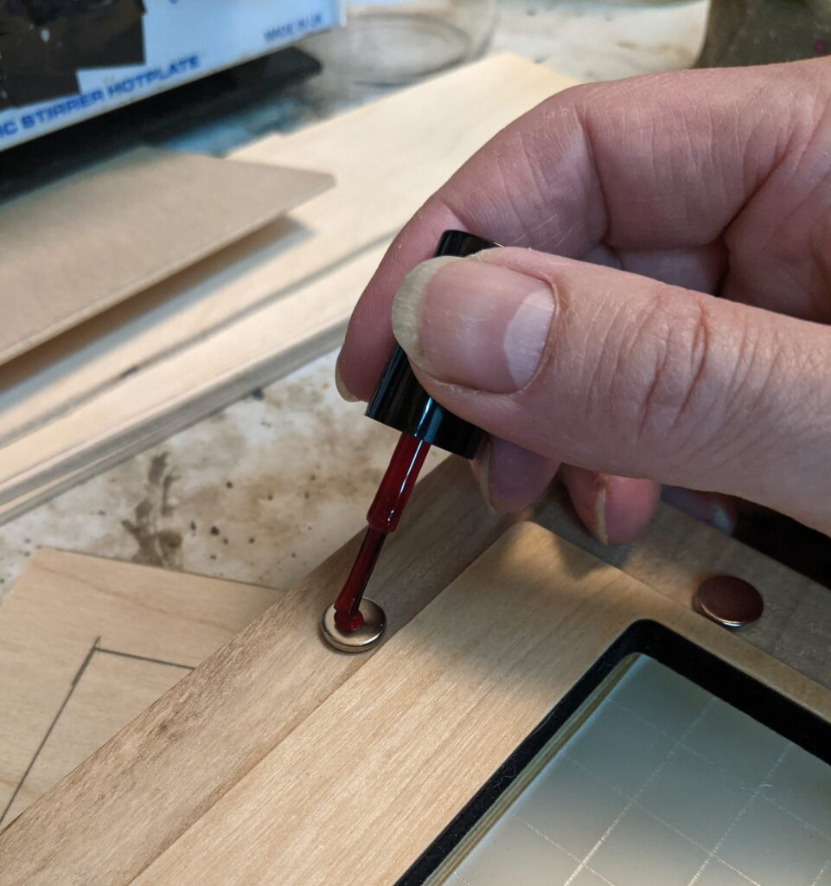
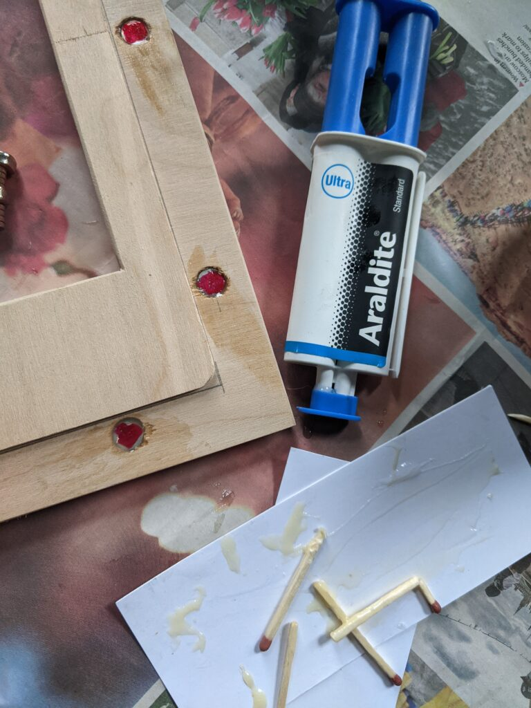
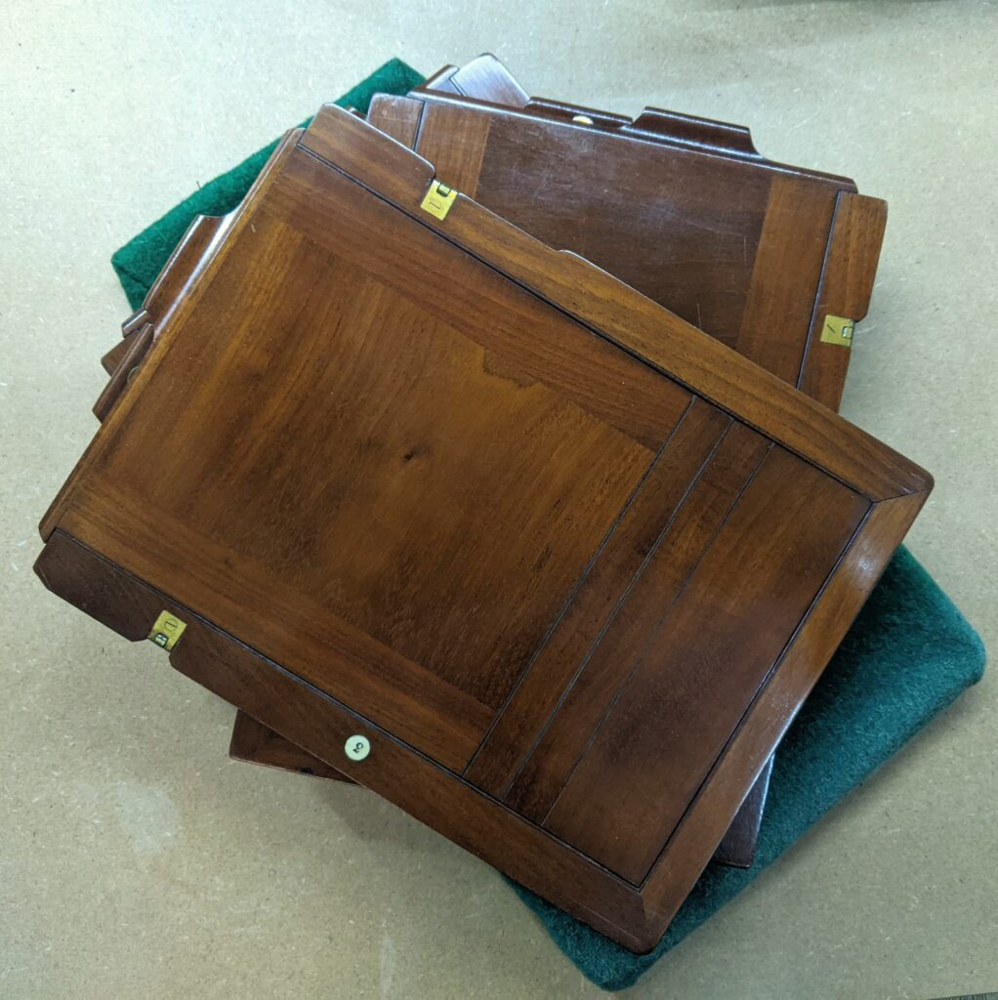
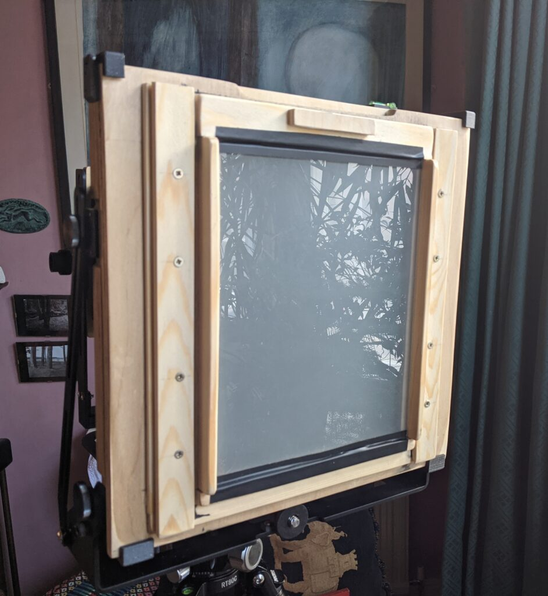
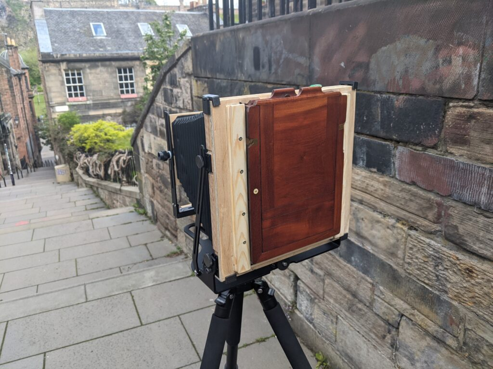
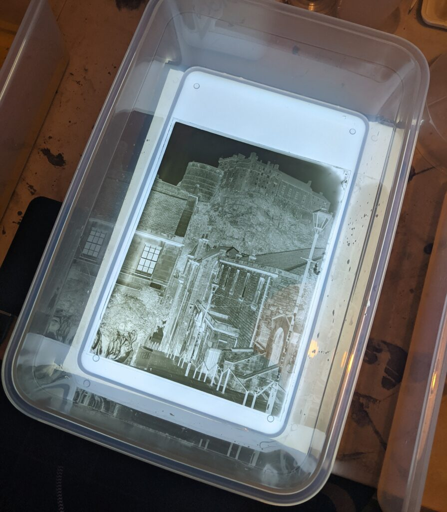
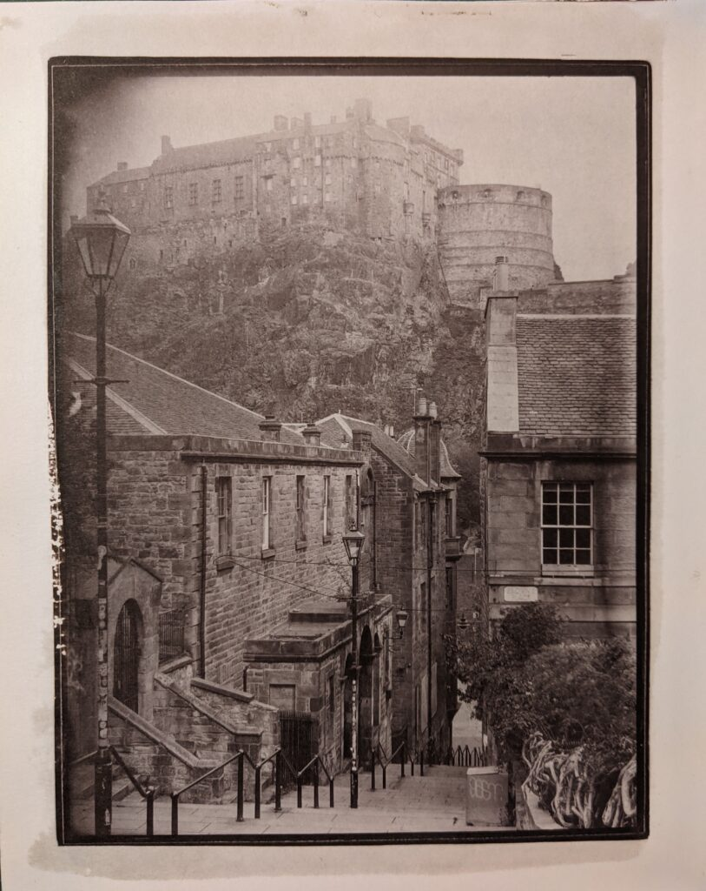

I've got a routine going of pouring my own 4x5" gelatine silver plates and then scanning them and inkjet printing the results but I've felt unsettled because I would like to have a 100% analogue process, \[AAA\] in stead fo \[ADD\]. To address this I've been messing with salt printing some of my 4x5" plates. It works quite well because they are very contrasty. Simple silver emulsion plates are generally too contrasty to print on modern photographic papers. The downside of contact printing 4x5" plates is the resulting prints are so small. I've therefore been experimenting with different ways to work with larger glass plates and over the last couple of weeks have built myself an adapter back so I can shoot Whole-plate (6.5x8.5") Victorian book-form holders on my Intrepid 8x10.

I built the adapter to replace the whole back of the Intrepid by layering 3mm plywood sheets cut on a Dremel jigsaw at the kitchen table.

Key thing was to get magnets in my back to match the polarity of those in the Intrepid back. I did this by sticking them to the old back and marking them with nail polish.

I then araldited them in place and sanded off the mess when it had dried.

I bought a set of 3 immaculate plate holders from eBay for £65. (I also bought two others for £25 but they were slightly different design so I decided to match the back to just these holders). This is really cheap compared to contemporary large plate holders!

I made a plywood frame to hold the focus screen, which I ground myself. Distance to the "film" plane was 7mm which I matched with two sheets of 3mm ply and a little aluminium shim. Looking at the initial results the focus seems pretty much spot on.

With some sanding and messing about the holders fit snuggly and didn't appear to leak when I did my flashing light test on them. So yesterday it was out for first light at my usual test location in Edinburgh!

The plates looked great, although I need to work on my pouring technique for larger plates as they clearly hadn't set fully before I moved them to the drying rack. No light leaks though and in focus. I feel quite chuffed.

I'm quite pleased with the finish salt print, produced at a leisurely pace on the same day I took the photo. I do need to work on my salt printing technique though.

So now I need to take stock of where I go with this next. The Intrepid works well and has a wide range of movements but using it for whole-plate sizes does involve carrying a larger camera than necessary. This counts for a lot as three mahogany plate holders containing six sheets of 2mm glass weighs quite a lot on its own. A Victorian whole-plate camera may be a better way to work with this format but they have fewer movements and finding one in a useable condition may be a challenge.

Another thought that occurs is adding an expansion back to the Intrepid. I've always wanted to have a go on a 7x17" banquette camera. I could build a back and a couple of plate holders to fit the Intrepid using the same basic approach. The result wouldn't be particularly portable but the idea is crazy enough to be appealing and who knows, it might just work!
