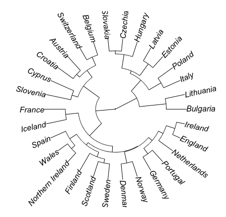
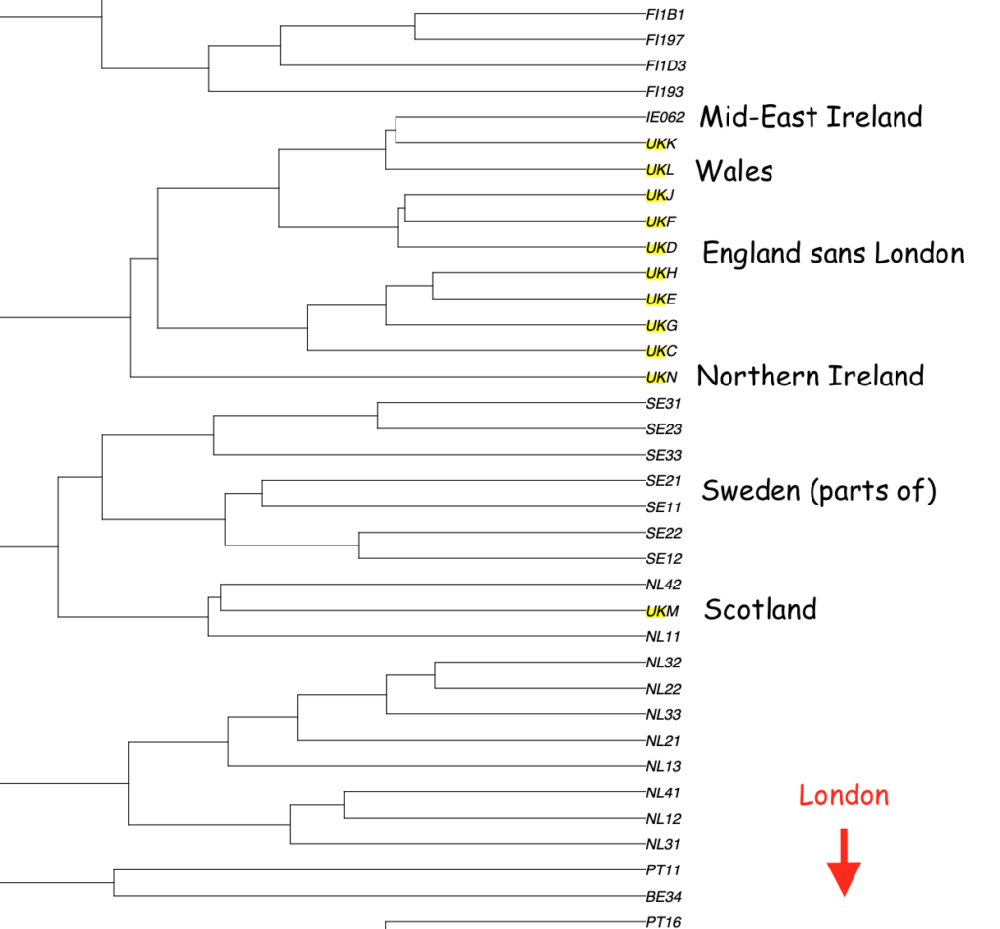
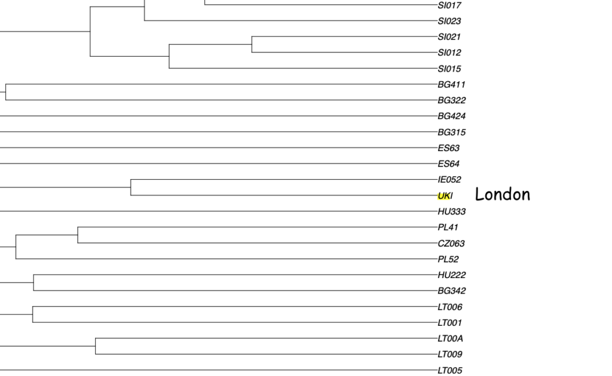

There is a movement in "Britain" that, in modern times, was kicked off by Gordon Brown with his 2006 speech on "British Values". I believe this threw fuel on the fire of the nationalist project that eventually lead to Brexit - which is another story. Recently an organisation called [More in Common](https://www.moreincommon.com/) wrote a report entitled [Britains Choice](https://www.britainschoice.uk/). It is three hundred pages long and is more of a market research document than a piece of research. It divides "Britain" into seven groups with different but overlapping values and uses this as an argument for the people of "Britain" to pull together.

I have to write "Britain" in scare quotes because its use is ambiguous. The report failed to get data from Northern Ireland because their partner didn't follow protocols or the data that was returned was totally out of whack with what was expected. But the report still claims to be about the UK as a whole. It purports to include NI on the basis anecdotal evidence. It uses the term "Britons" on 106 of the 291 pages and UK on 174 pages. NI is constitutionally not part of Britain but the people who live there are British. They are Britons. A report that claims to show how united the people of "Britain" (or is it the UK?) failing to include data on the part of the UK that is historically most divided, to the point of armed conflict, has to ring alarm bells. Just like Gordon Brown's speech in 2006 this is a piece of political propaganda. The subtext, the dog whistle if you like, is that we have more in common with the other people in "Briton" than we do with foreigners. That is why this is actually a nationalist enterprise.

You may think this is all irrelevant but Gordon Brown is still popping up quoting this stuff and being reported in the press. It is designed as ammunition for politicians and the media to use and they will use it and it will change people's behaviour.

It set me thinking about values and how stupid it is to justify national unity on the basis of it. The Britains Choice report is wrong because it doesn't include an out group. We need to compare values across nations to prevent this becoming an exercise in confirmation bias jingoism. Are these values our values or just human values?

Fortunately we have a set of questions that have been asked across European countries for a number of years and the data is made open by the European Social Study. Unfortunately I can download this data and waste my entire Sunday afternoon and evening analysing it.

## "British" Values 2018

- the rule of law
- individual liberty
- democracy
- mutual respect, tolerance and understanding of different faiths and beliefs.

These are the CONTEST strategy values [as reported on Wikipedia](https://en.wikipedia.org/wiki/Britishness).

## ESS Human Values Questions

- Important to think new ideas and being creative
- Important to be rich, have money and expensive things
- Important that people are treated equally and have equal opportunities
- Important to show abilities and be admired
- Important to live in secure and safe surroundings
- Important to try new and different things in life
- Important to do what is told and follow rules
- Important to understand different people
- Important to be humble and modest, not draw attention
- Important to have a good time
- Important to make own decisions and be free
- Important to help people and care for others well-being
- Important to be successful and that people recognise achievements
- Important that government is strong and ensures safety
- Important to seek adventures and have an exciting life
- Important to behave properly
- Important to get respect from others
- Important to be loyal to friends and devote to people close
- Important to care for nature and environment
- Important to follow traditions and customs
- Important to seek fun and things that give pleasure

These seem to overlap enough to at least check if these kind of values bind us together beyond just on a human level.

## Method 1

I downloaded the latest ESS human values data (release 9 version 3 for 2018). This is about 40k rows. Imported it into a MySQL database. Produced weighted means for nations (splitting the UK into constituent parts). Loaded this data into the R stats package and did a simple dist() similarity matrix (Euclidean distance) followed by a clustering using hclust() with default complete linking method. And the result is in the fan dendrogram below.

Clustering of nations by ESS human values.

On the basis of human values we should have a nation of Spain, Wales and NI. England, Ireland and the Netherlands would form another! It is like reading Tarot cards. The nations don't cluster by values. The notion of "British Values" or values that we share more in common is a dumb one - as if it needs stating let alone proving.

## Method 2

I did another analysis averaging and then clustering by regions of nations as that is available in the data. There are 300 regions so this can't easily be displayed but here is a screen shot of how Britain comes out.

UK kind-of clustering together but Scotland is nearer The Netherlands and London is off the scale. I wouldn't use this to argue for Scottish independence even though I'm in favour of it as the data equally shows we should be run by the Netherlands not England!

London is way off the scale clustering regions of Ireland, Spain, Poland etc

Method 2 appears to show that there is clustering by nation, many of the national regions clustered closely. France was very unified apart from including the Basque country. Some, like Spain, were spread all over the place.

## Method 3

Ideally it would be better to see if individual **people** clustered by nation. I suspect this would be even more of a mess with more variation of values between individuals than between nations but at this point is was gone midnight so I went to bed.

## Caveats

This is really, really crude back of an envelope hacking but I hope I have done enough to show that claiming nations are held together by values is both dangerous and factually wrong. My chief concern in the analysis is that the data for each nation is gathered by that nation and so the chances that clustering of nations is due to sampling errors or translation factors (these are all done in the local language after all) are really high. This should be a PhD's worth of work and I've spent a few hours on it.

## Conclusion

1. Don't use values to define nations it is dumb.
2. I should not waste my evenings doing this kind of thing but read a good book and go to bed instead.
