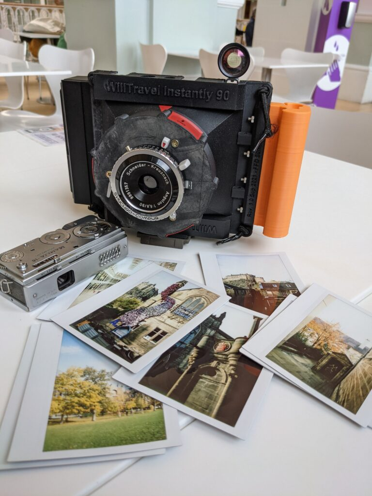
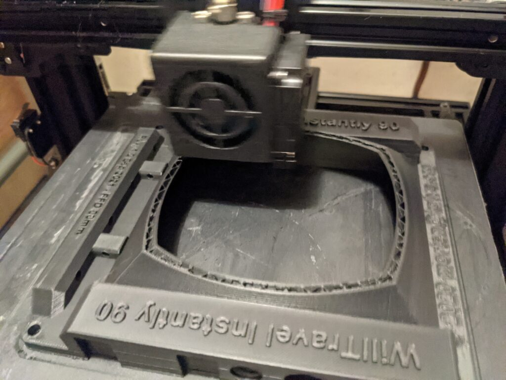
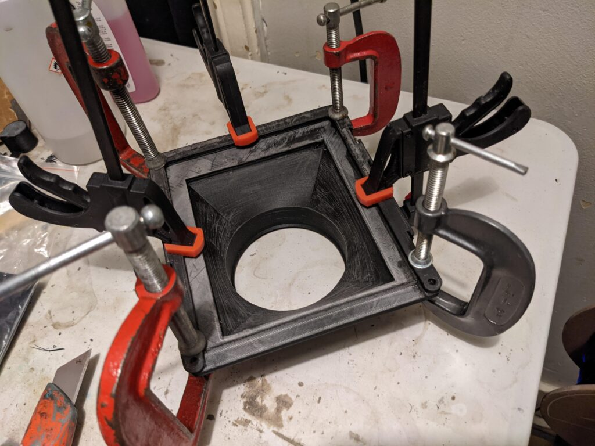
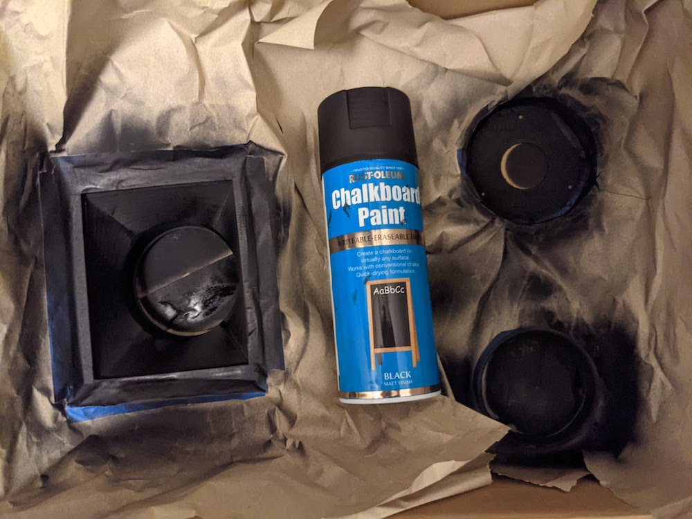

It started with a me buying a 1950's Mamiya-16 just because I thought it looked like such a cool camera. The trouble is the film cassettes are like hen's teeth so I thought I'd get Barney down the road at [OpenFactory](https://openfactory.uk/) to 3D print me some. That didn't work out because the models on Thingiverse were wrong but I mentioned to Barney that what I really wanted to do was print a [WillTravel](https://film.kolve.org/darkroomdiy/will-travel-friendly-cameras/) camera. To this he responded that it might be cheaper for me to buy my own 3D printer than get him to do it. A few hours of YouTube and eBay later and I've bought a [Xvico 3S](http://www.xvico3d.com/) for an amazing £94 delivered to my door. You can see how this is snowballing. My adventures in 16mm subminiature photography have become a side story and I'm now a 3D printer.

Because my [Lomografloc](https://shop.lomography.com/en/lomo-graflok-instant-back?country=gb) [Fujifilm Instax](https://instax.com/) film back had recently arrived (I actually bought it a year ago) I thought it would be cool to dedicate a WillTravel body to instant photography. That would mean a slightly shorter body length. I wrote to [Morten Kolve](https://film.kolve.org/) who creates the WillTravel cameras and of course he has already made this combination and kindly sends me the models. A few days later and a bit of fussing and I've done it. Printed my own camera and it works! Thanks to Morten and Barney for their help and support.

First light on the new camera was a brief wander around the tourist sites of Edinburgh followed by lunch at the museum.

The printer is basically an Ender 3 clone. I used Ender 3 as the default option in PrusaSlicer, slightly eco PolyTerra PLA and left everything on default. It worked remarkably well!

There is a small amount of gluing.

Matt the insides with blackboard paint and we are done!

What is left to do? Well the viewfinder is well off! I just used one I had lying around to centre the image but of course that didn't work because there is effectively a front rise (or side shift for portrait orientation) because of the format. I need to come up with something else. I also need to do some more focus calibration points. At the moment I have infinity, six feet and four feet but, to be honest, I probably don't need many more than that if the end result is only an Instax print.
