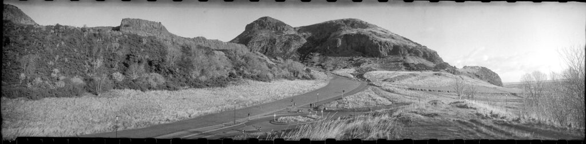
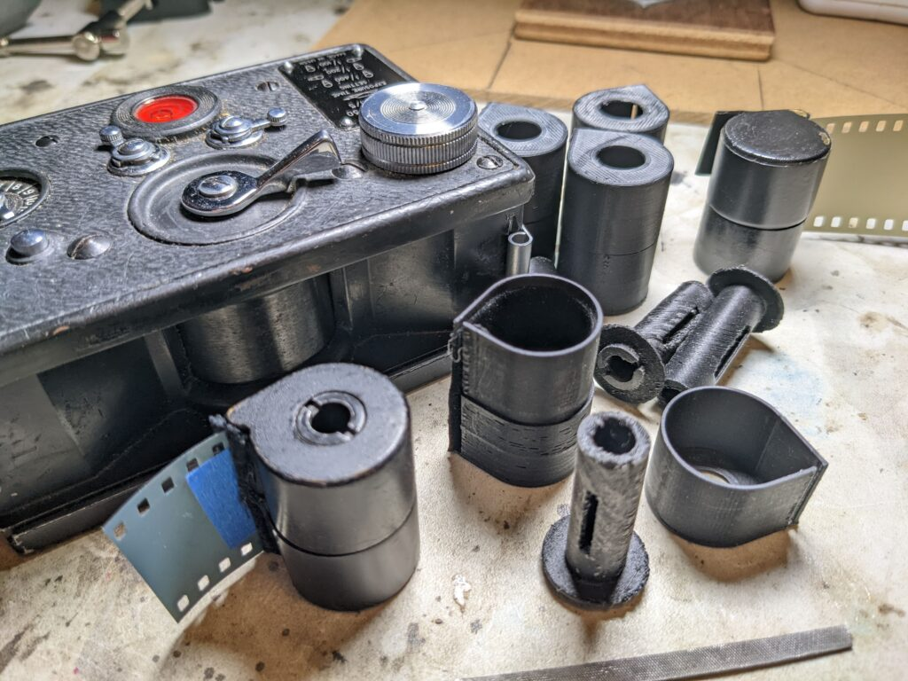
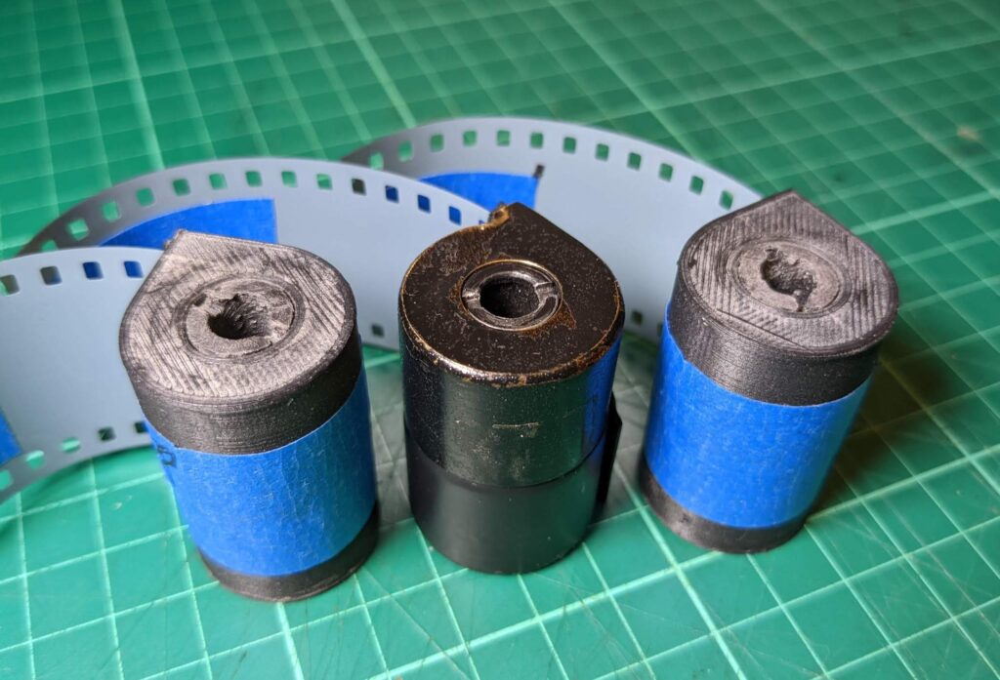

Yet another test shot. Note uneven dev at the top because I was tight with the developer!

🇺🇦 In February 2022 Russia invaded Ukraine. Playing with old Russian military inspired tech isn't fun any more. My FT2 will rest in the cupboard till better times. Thoughts and good wishes are with the people of Ukraine and those in Russia who have been dragged into this madness.

I have spent some time 3D printing film cassettes for my KMZ FT-2 Panoramic Camera. I've submitted the designs to [Thingiverse](https://www.thingiverse.com/) so that others can use them but am also putting everything here for safety. You can see the 3D models on Thingiverse [here](https://www.thingiverse.com/thing:5154356) or download the from here:

[FT-2\_Cassettes\_Frames](FT-2_Cassettes_Frames.zip)

Work in progress. The original brass cassette is in the foreground. The plastic ones are near identical externally but the spindles are different.

The FT-2 is a crazy camera from 1950's USSR. The predecessor to the far more common Horizont and Horizon 202 panoramic cameras of the 1980s. There's quite a lot about it online. This is a nice [article on Kosmo Foto](https://kosmofoto.com/2020/05/kmz-ft-2-review-life-on-the-wide-side/) or there is one on [Camera Wiki](http://camera-wiki.org/wiki/FT-2) or on [Living Image](http://licm.org.uk/livingImage/KMZ_FT-2.html).

Fedor Tokarev

The legend varies depending on who is telling it. Basically [Fedor Vasilievich Tokarev](https://en.wikipedia.org/wiki/Fedor_Tokarev) was a weapons designer in the early USSR. He was a mate of Jo Stalin (you kind of needed to be). He designed the pistol and rifle used extensively by the Russian armed forces during the [Great Patriotic War](https://en.wikipedia.org/wiki/Great_Patriotic_War_\(term\)) (a.k.a. WWII). He had an idea for a camera, probably to survey the effects of artillery damage, and at some point in the 1940s (probably after the war) he asked the guys at KMZ (Красногорский механический завод) to make it. They didn't want to but, because this was Stalinist Russia, they put it into production. By the 1950s there was much need for foreign currency so export versions were produced and sold in the West. KMZ are better know for the Zorki ranger finders and Zenti SLR cameras. Today Zenit even sell [an M series Leica under license](https://zenit.store/products/zenit-m-camera-and-35mm-f-1-0-lens-kit-limited-edition). The FT stands for _Fotoapparat Tokareva_ (_Фотоаппарат Токарева_) or Tokarev's Kamera. The pistol he designed was the TT-33 or just called the Tokareva. It is a little like Kalashnikov in the next generation of weapons designers but unfortunately [Mikhail Kalashnikov](https://en.wikipedia.org/wiki/Mikhail_Kalashnikov) did not design a camera, at least I don't think he did.

The FT-2 sold until 1968. A total of 16,662 were made. By the mid 1960s it was replaced by a much more sensibly designed swing lens camera called the Horizont and nearly fifty thousand of these were produced but it too was discontinued in 1973. The Horizont was resurrected in 1989 as the Horizon 202 and a series of similar models. The Soviet Union fell in 1989 and I wonder if this was KMZ looking for old products they could bring to market in a more open world. Production continued into the 21st Century.

The Horizont and Horizon models are very similar in that they use a 28mm f2.8 lenses to produce a wide angle image on a 24x58mm negative which could be printed (or these days scanned) like any medium format negative. They take standard 35mm film cassettes. They are fixed focus cameras but you can close the lens down to f/16 and get things from as close as 1m to infinity in focus. They are built like Zenit SLR cameras.

The FT-2 is a very different animal. It has a 50mm f/5 lens. You can't change the focus or the aperture. The nearest focus is maybe 30ft away. It is a panoramic camera but not really a wide angle camera. The vertical field of view is the same as a standard 50mm lens and actually slightly shifted upwards. It is only stretched horizontally. The negatives are 24x108mm, nearly twice that of the Horizon 202 and requiring a large format enlarger. When you hold an FT-2 in your hand it actually feels more like a pistol than a camera. Whether or not the legend is true it totally makes sense that this thing is designed for military reconnaissance use not regular photography.

In many respects the FT-2 is a terrible camera but it is also very unique and makes images like nothing else. Just to add to the awkwardness **the FT-2 takes non-standard 35mm cassettes.** My camera came with two which made it useable but frustrating. Whenever I finished a roll (twelve exposures) I'd needed a dark bag to reload the cassette. There are many examples of FT-2s which have been separated from their cassettes. This is why I've spent the last few evenings designing 3D printable cassettes and some frames to help scan the resulting negatives. I know I should have been working on a cure for cancer and world peace but this seemed more important.

Here are my notes for those interested in printing their own cassettes.

### Design

There are some challenges in that the space for the cassette in the camera is only 39mm high but the film is, of course, 35mm high. This leaves just 2mm top and bottom for the lid/base and the spindle top. I've therefore left the bottom ring off the spindle and replaced it with a peg in the base of the cassette. The top ring is still fragile. I'm more interested in photography than 3D printing so am not going to wrestle for hours to print at less than 0.8mm in regular PLA on a cheap printer!

### Code

I designed it in OpenSCAD. The SCAD Code is not elegant. It is just something functional to do what I need. You may need to tweak it for your printer as the tolerances are tight.

No attempt is made to keep this pretty so SCAD drafts renderings will look odd because of the overlapping surfaces. Do a full render to see the models properly.

### Printing

Print 0.16mm regular black PLA. I use a XVICO X3S - very cheap printer.

### Cassette Lid

The lid is rendered the "wrong" way around. This is because it is easier to flip it on the z-axis when it is imported into the slicing software than mess around in code trying to get it right. Feel free to mess around in the code and improve on this :)

### Spindle

The spindle needs to be printed on a 45 degree slope with some support. At 45 degrees the support stuff shouldn't get on the top surface of the disc. Amount of support and angle will vary. I had some failures. It is also a fraction too long by design. During finishing sand the top down to fit the camera snuggly.

### Cassette Body

The body should be lined on the walls with "felt". Cut a strip 36mm wide and long enough to go around the cassette and out the film slot. After it is stuck down trim most of it off leaving just a little sticking out. I use sticky back Fablon Velour (it is used on card tables and that kind of thing). CS glue it if it comes loose.

### Scanner Frame (lid and base)

This can be used to scan on an Epson V800. It is about the right focus distance. Put a tape hinge on one side and tape tags on the other. You'll need to trick the scanner into thinking that is it looking at a negative frame by leaving a gap near the top. You can work this out by looking at the negative holders that come with the scanner if you haven't done it before or look at Ben Horne's 8x10 scanning mask for a clue ([https://youtu.be/Ack\_CWovz4Y?t=292](https://youtu.be/Ack_CWovz4Y?t=292)).

### Scanner Plate

You can use this to stand the scanner frame on a regular light table if you are going to digitise with a camera. I designed it to fit the Intrepid 4x5 enlarger light source which I use fo digitising regular 35mm film.

Maybe not as elegant as the brass original but they do the job.

### Tips

- Feed and take up cassettes are identical but the feed side is upside-down.
- Do NOT tape film in feed cassette as you will lose your last frame unless you then open the camera in a changing bag.
- Do tape film in take up cassette as so you can be sure to pull it through.
- Leaving a tape tag sticking out the side of the cassette make it much easier to pull the cassette out of the camera and saves you getting your keys or a screw driver out.
- Remember closest focus is 15m (45ft) away! Maybe 30ft if you don't blow the image up.
- Remember you are mad to even consider using this camera.

License is free to do what you like but a credit would be appreciated.
