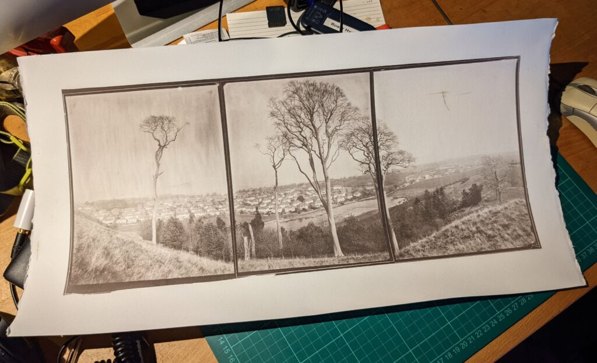
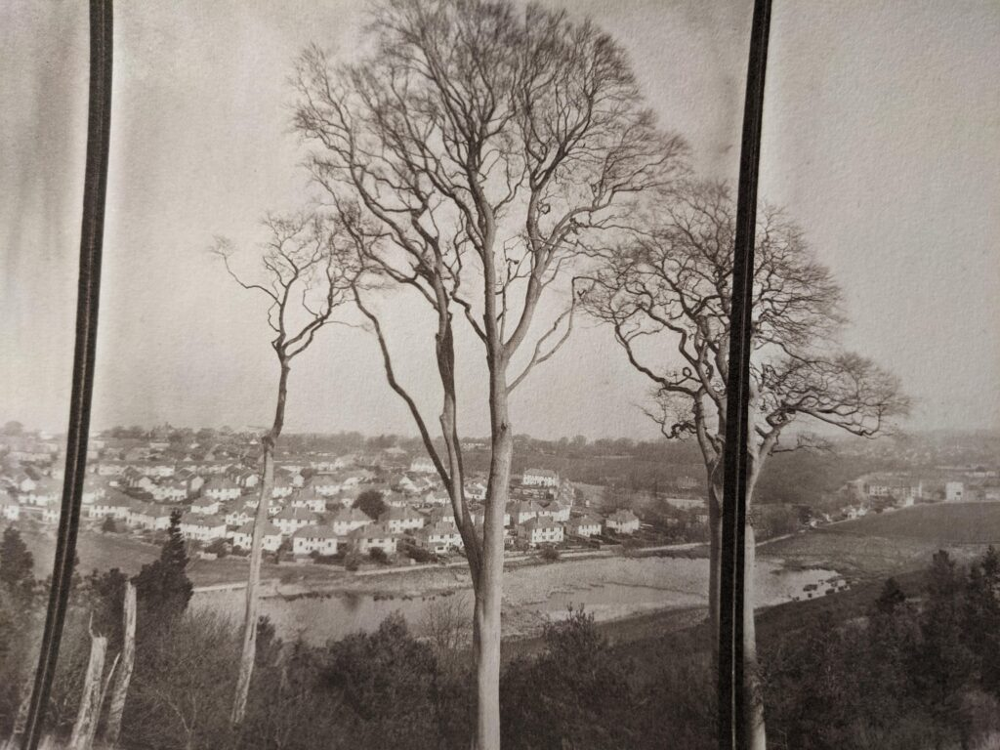
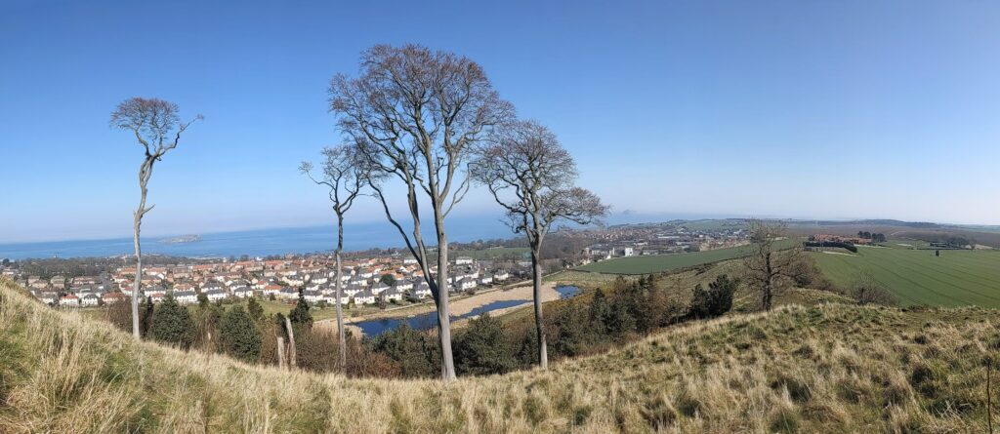

I finally got to make what I'm calling a triptych panorama. I've been thinking about doing these since I first started printing the entire plate with a black border. The print consist of three 6 1/2 x 8 1/2 inch plates laid next to each other to make an Argyrotype contact print. The plates can't be perfect because of the hand poured emulsion and neither can the print because the paper isn't great and is hand coated. The edges of the glass are rough because they too are cut by hand. The perspective has to be off because you can't bend the plates like you can a digital file. But the image also has the realism of being a photograph. I'd like to make more of these.

I'm not sure the best way to share the physical object so here is a quick snap.

A detail

It took me three trips to North Berwick Law to get this right. The first time was scouting then I made the images but got the exposure wrong and finally it came together. All the plates I made and the printing and traveling it was probably a week's work to make a single print.

Of course it is trivial to make a pano with a phone. It took about 30 seconds. But where is the fun in that!?

These are the Act of Union Beech Trees on the East side of North Berwick Law. They are the only survivors of a woodland planted by Sir Hew Dalrymple one of the Scottish Commissioners of the Act of Union, tasked with negotiating the agreement with his English peers. He was a big land owner and planted them to celebrate the union of the kingdoms. Read what you will into the fact that they still hang on or that they are nearly all gone! There is a thriving wood of Scots Pines rising up to take their place when they do fall though.
