I've been falling behind with posting. I swear I'm going to post more often.

Working with glass plates and contact printing means that you can only make prints the same size as the plate your camera will hold and there is always a desire to go a bit bigger - till things get ridiculous. Things started to get really ridiculous in early February when I saw a camera for sale on the Oxfam website. It was a 10x12 inch Vageeswari. It was very expensive but it came with four, yes that's right, four double plate holders. The battle with buying old plate cameras is finding matching plate holders. This is especially the case when you are working with dry plates. Wet plate collodion workers only need one plate holder because they can only use one at a time. To have enough to hold eight plates right from the start was wonderful. It needed a home. I wanted to make a donation to Oxfam's work, especially in Yemen, so I could justify it. Reader, I bought the camera.

Here are a sequence that tell the tail of the first exposure.

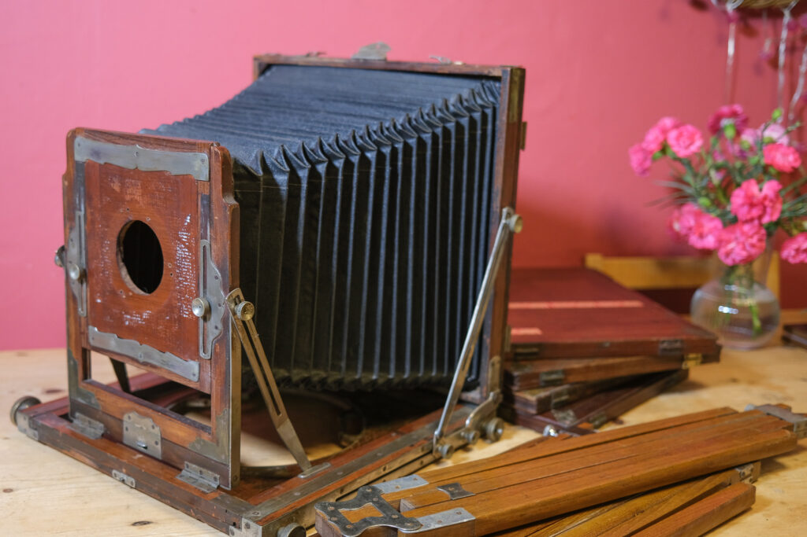

Vageeswari as it came

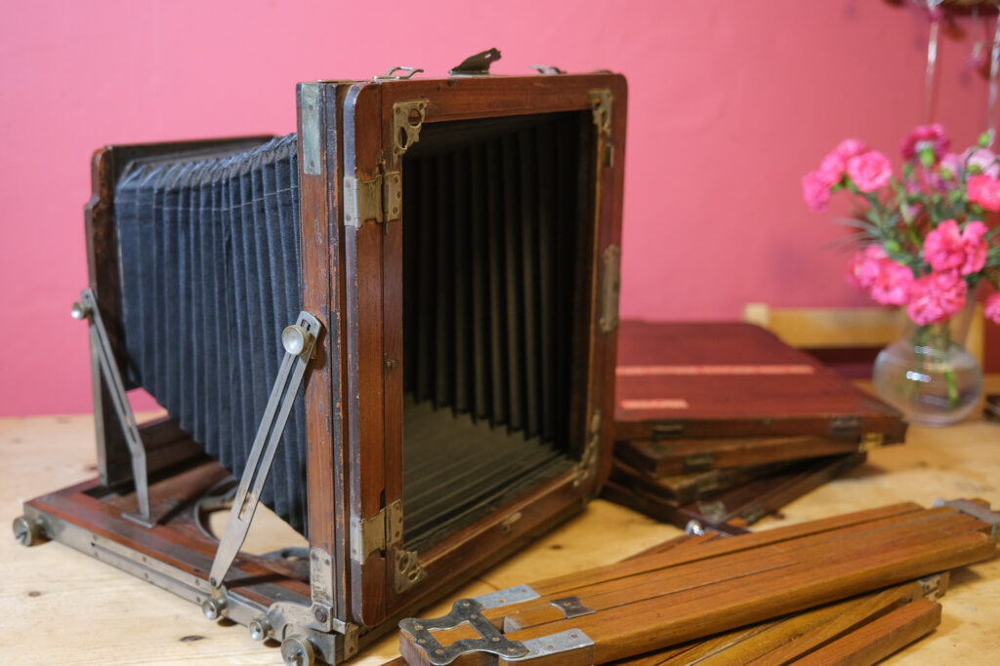

As is common no focus screen

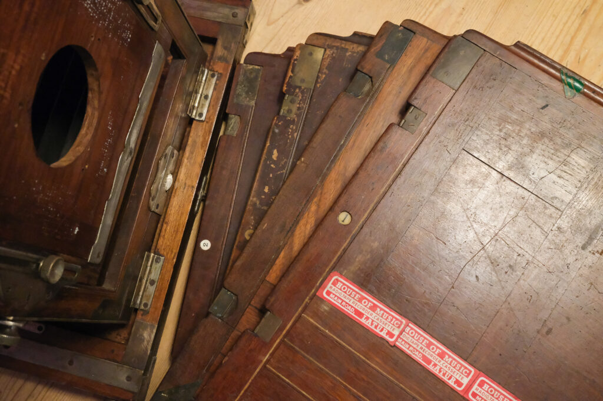

Four plate holders were of varying condition and much was covered in dark wood stain. Not sure if this is original.

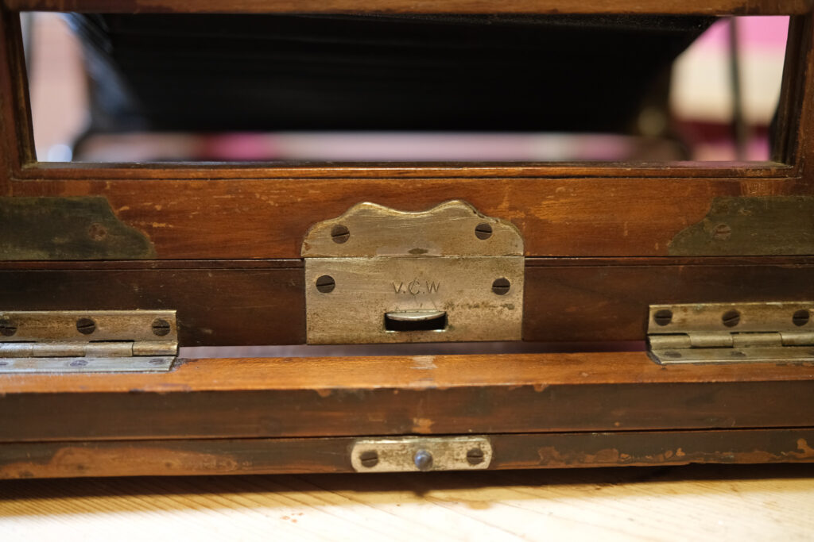

Note the V.C.W. (Vageeswari Camera Works)

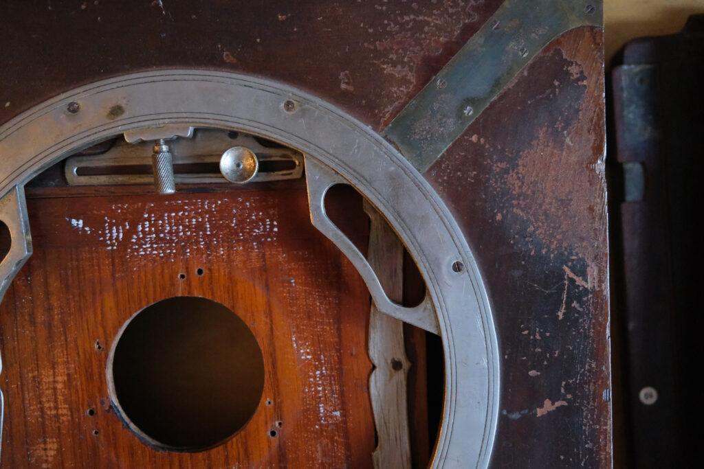

The base was for traditional field tripod with three separate legs.

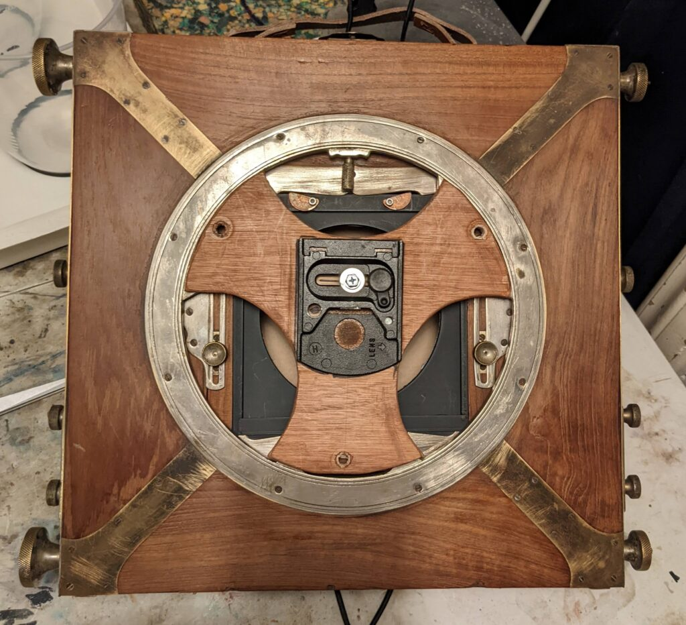

I did a load of cleaning of the stain but not to the extent of making it "perfect". I also made an adapter plate so that I could use it on a normal tripod. This still allows the rotating base to work and is removable.

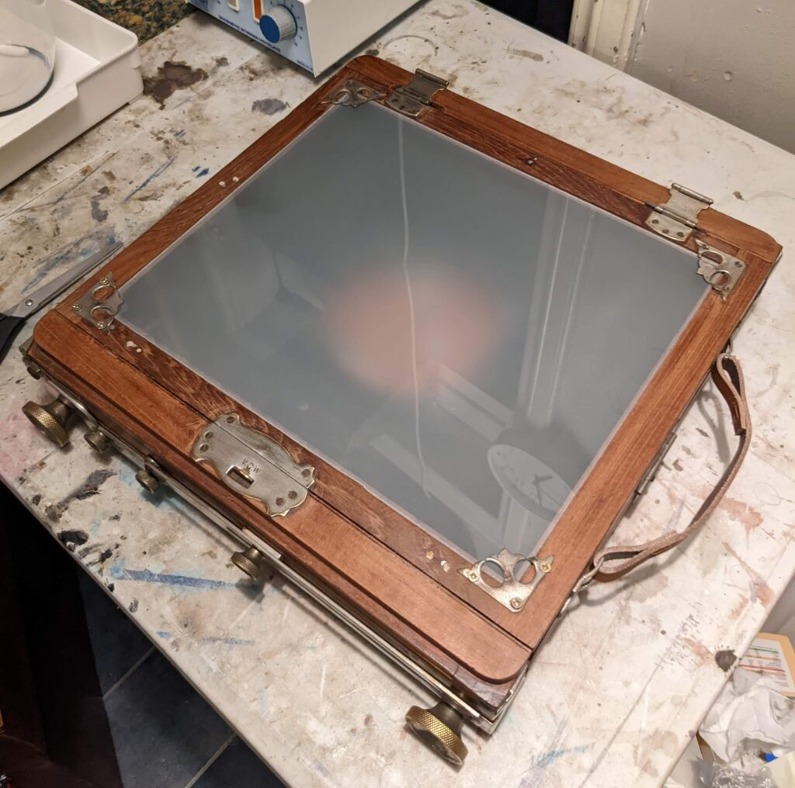

A new ground glass screen was relatively straightforward. Most screws are rusted though so I'm wary about undoing any I don't have to as they could lead to far more work.

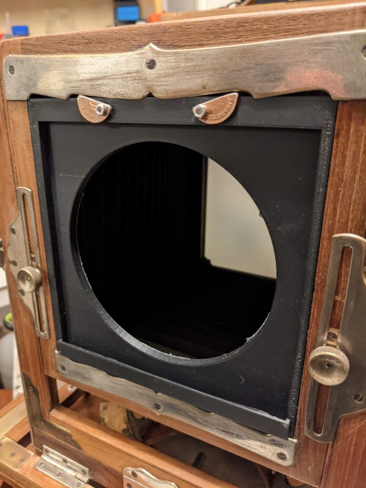

The lens board was, of course, not any standard size although it had an ingenious spring mounting mechanism. I 3D printed an adapter board so I can use Sinar compatible boards. I have a Sinar to Linhof adapter too so I can now mount almost any lens.

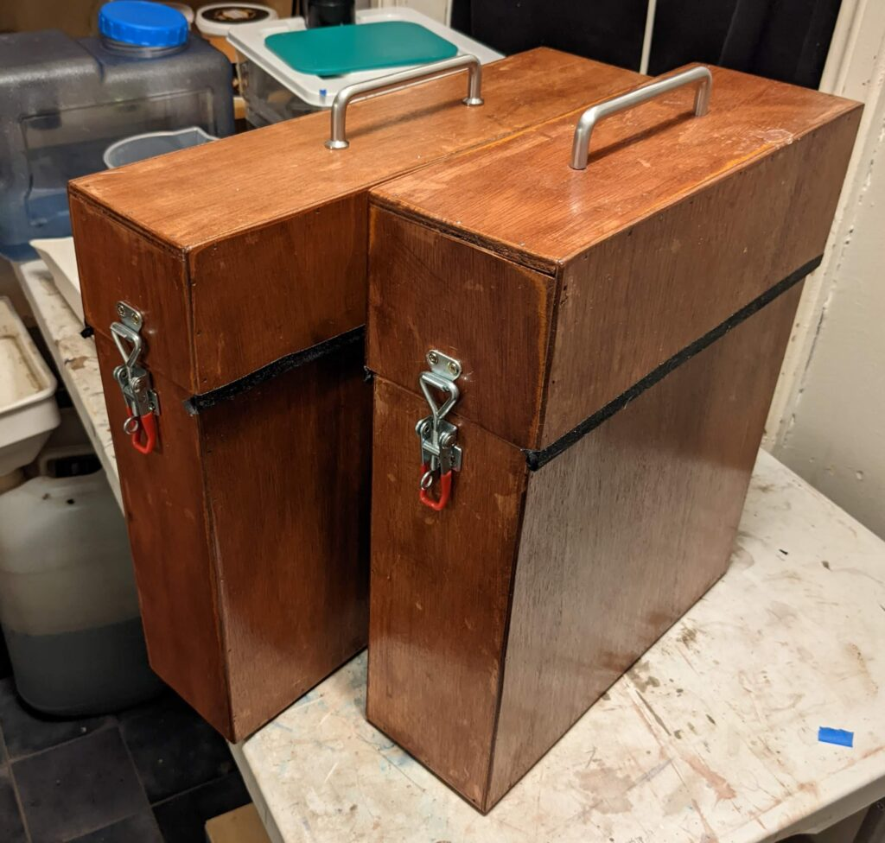

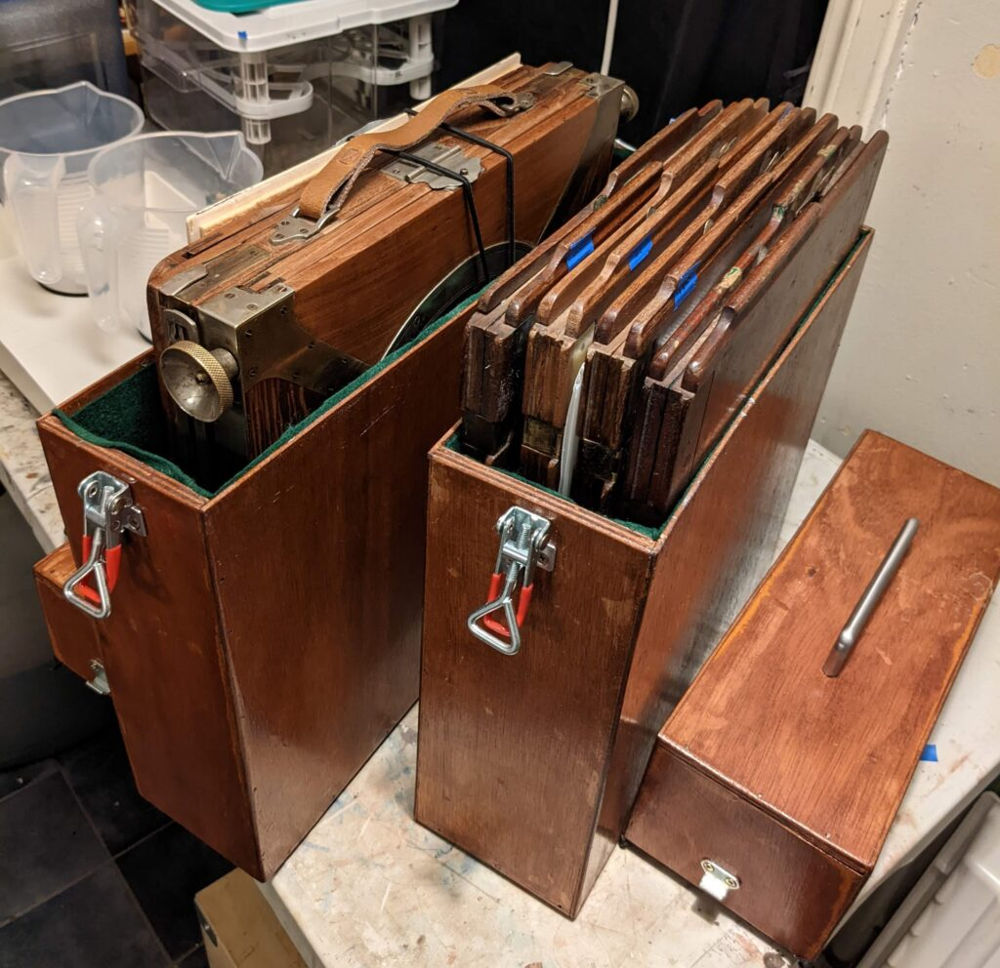

It is a difficult thing to store so I made two storage/transport boxes for the camera and plates and lined them with green felt.

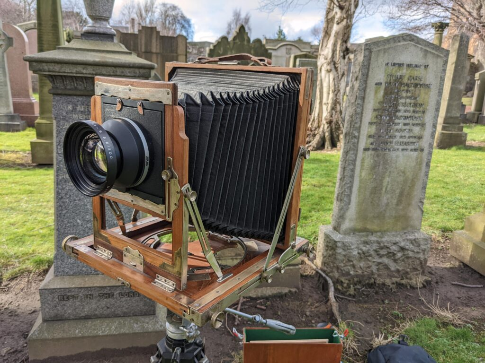

First light! It's been cold and windy but I had to try one shot using my Symmar 300mm f/5.6 (a moderate wide angle lens on 10x12 inches but lots of coverage).

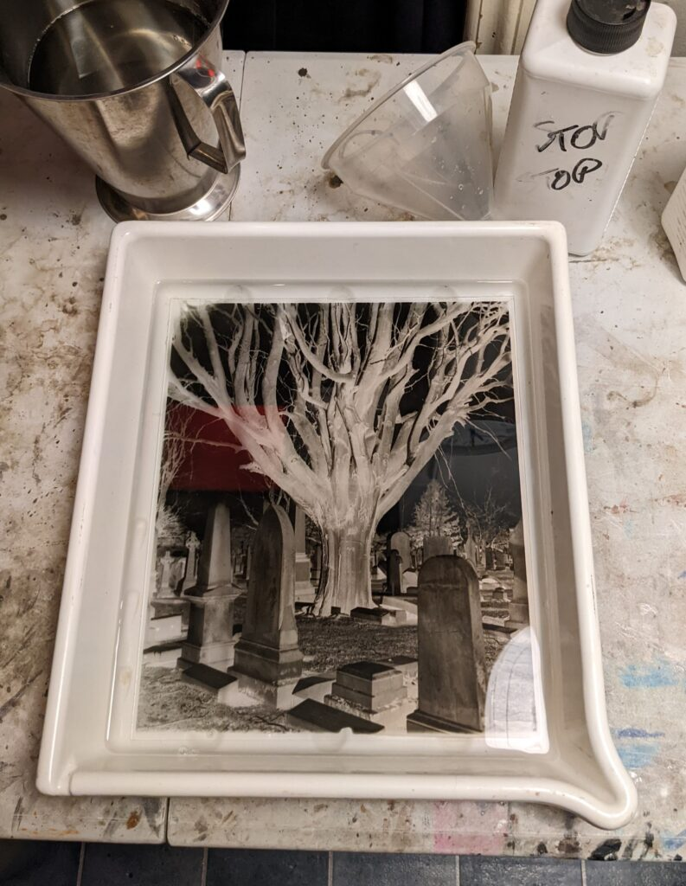

It works! Although this isn't the sharpest of plates because there was quite a bit of wind.

Vageeswari was an Indian camera manufacturer. Mr K. Karunakaran set up the company just after the second world war, at about the same time as Indian Independence I guess, to make field cameras in the style of the British (but also Indian made?) Houghton Butcher cameras which were also copied by the Japanese as the Asahi Asanuma field camera. Everyone was copying everyone else in those days. The British companies stopped making old style plate cameras mid century partly because of the war and partly because the technology had moved on but in freshly independent India their was probably still a market for a new, old fashioned camera. I'm sure they were popular with enthusiasts later as well. It appears the Vageeswari Camera Works did very well till it faded out in the 1980s. Mr Karunakaran only died in 2016 at the age of 90 and did much more in life than just this. [You can read an obituary here](https://www.onmanorama.com/news/kerala/unsung-hero-invent-vageeswari-camera-karunakaran.html).

From this history we can deduce my camera might be only forty years old but is most likely about seventy. The bellows look like they have been replaced (badly) and the focus mechanism is pretty knackered but just about useable. The important thing from my perspective is that Vageeswari continued to make Victorian style book-form plate holders when the rest of the world moved to ANSI standard sheet film holders. Book form holders are really bad for film but great for glass plates. I now have an Ultra Large Format (ULF) camera with plate holders. This is something that can only be had from very expensive (and very good) bespoke camera makers today.

Famous photographers who use the same camera? I just noticed that [Borut Peterlin](https://www.borutpeterlin.com/) uses one for his smaller works! Here is an example. Borut's looks better condition than mine but then he's a pro.

https://youtu.be/ehM\_UInuuNI

Borut Peterlin using a 10x12 Vag.

Now what was it I was going to photograph again?
