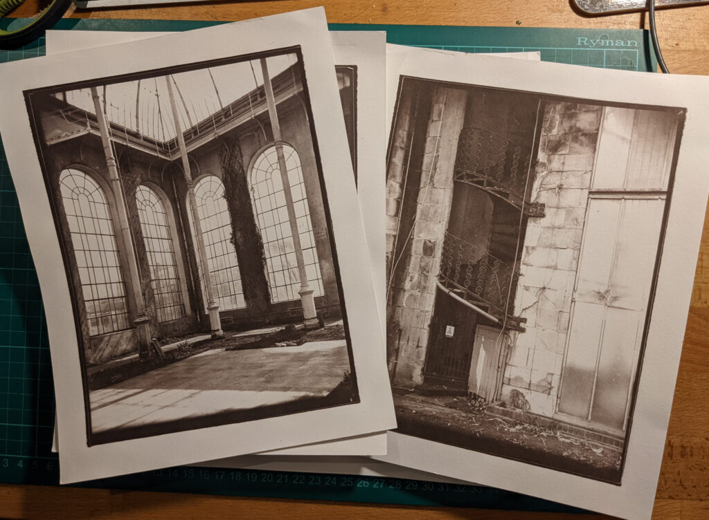
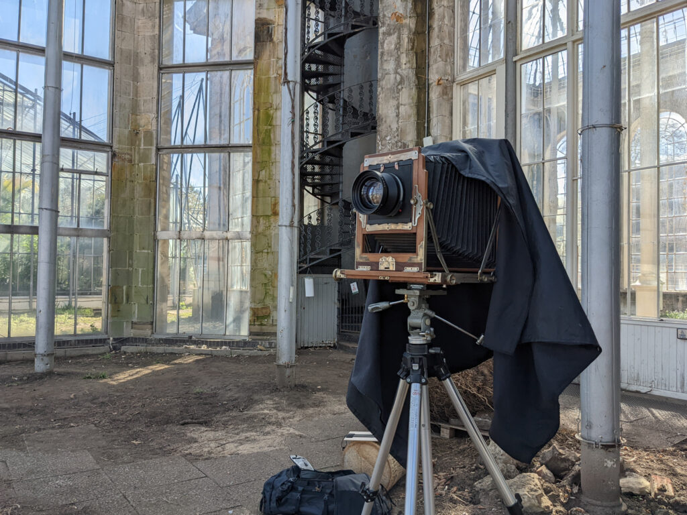
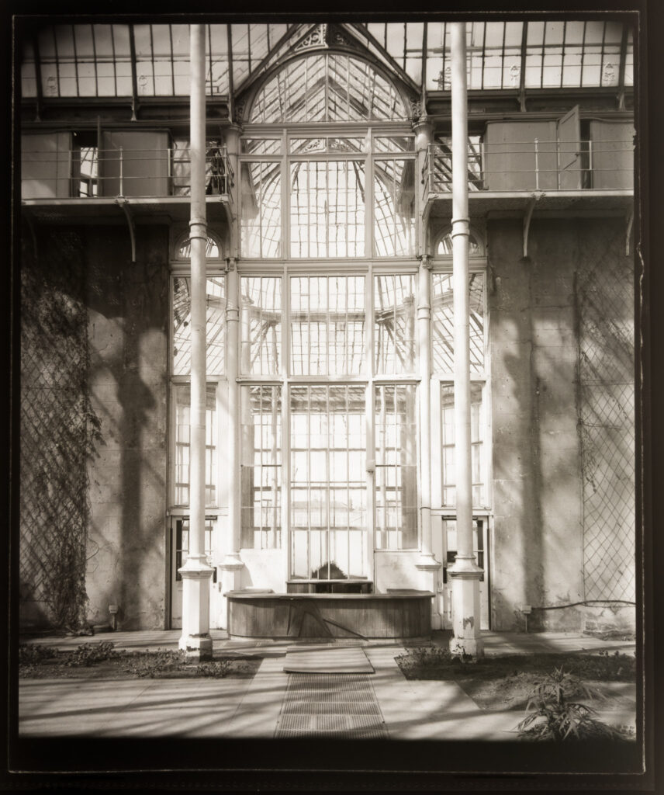
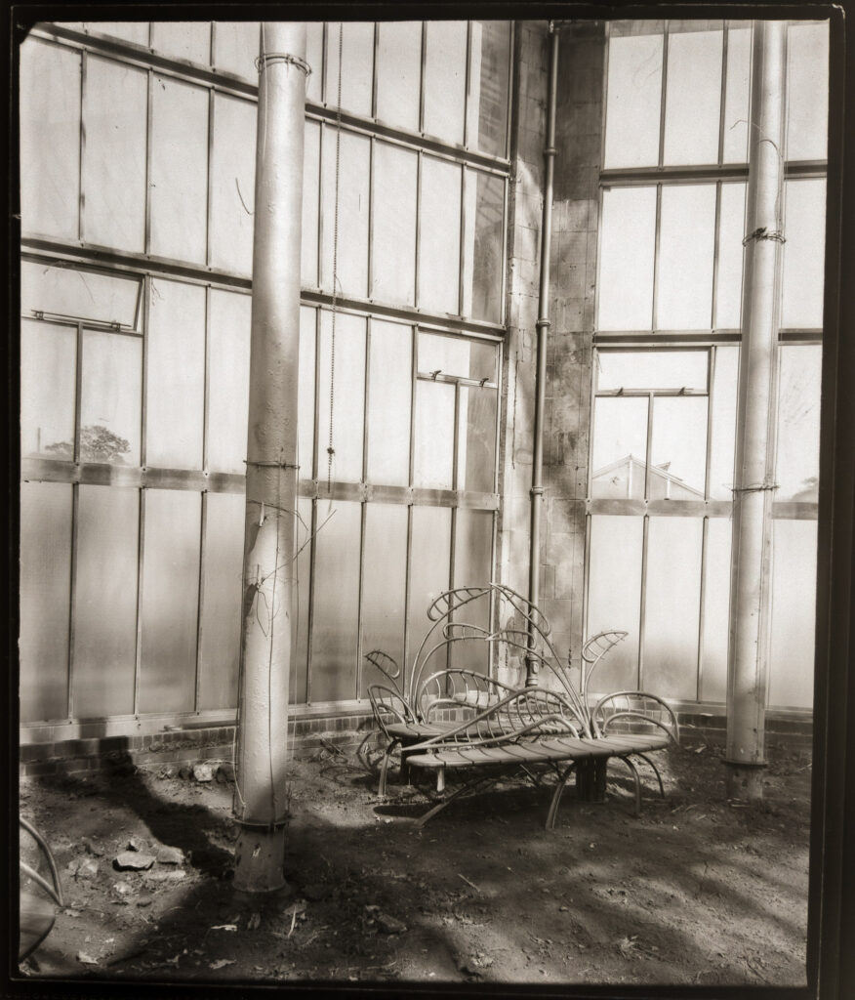
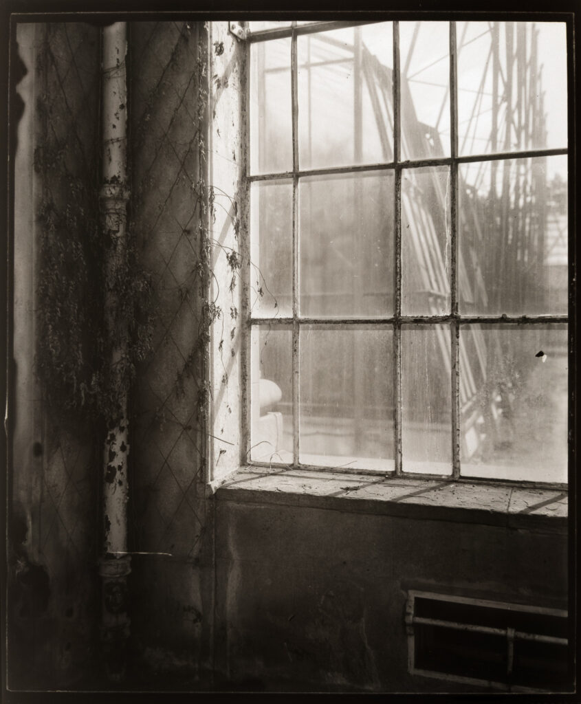
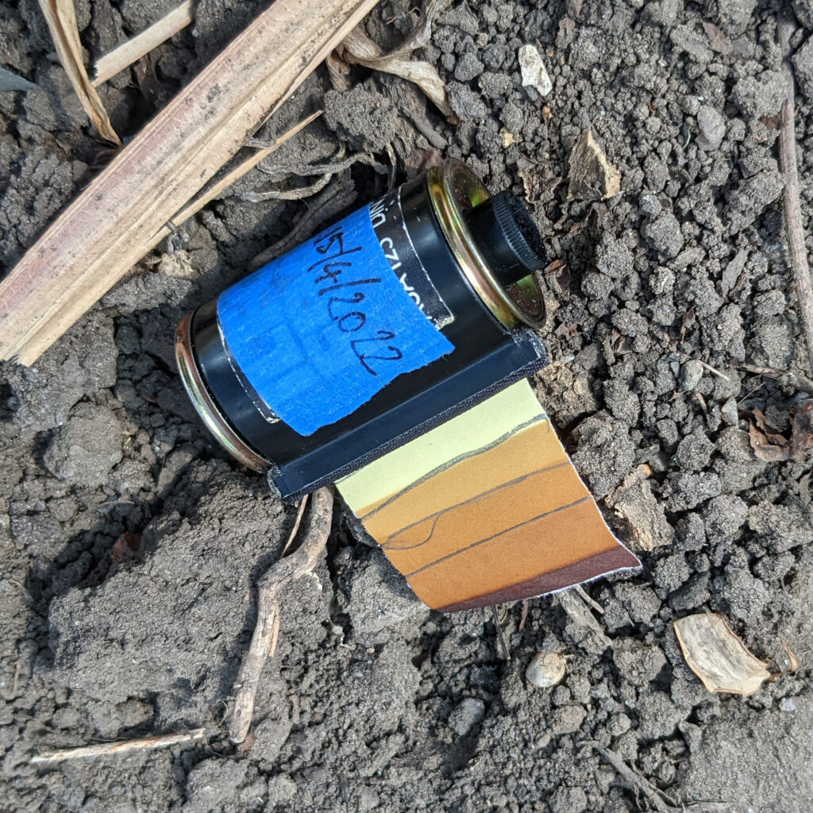

Working at the Botanics in Edinburgh means I can get access to the currently closed Palm Houses. They are about to undergo a major restoration. It is an amazing space to be in so I've visited twice, once with my whole plate camera and once with the [10x12inch Vageeswari](http://www.hyam.net/blog/archives/13029).

Argyrotype prints from whole plate glass negatives.

Vageeswari in action.

Digital rush (phone scan) of an 10x12inch glass plate.

Digital rush (phone scan) of an 10x12inch glass plate.

Digital rush (phone scan) of an 10x12inch glass plate.

I've got really mixed feelings about how this is going. On the one hand my new system for guessing exposures using the rate of darkening of some argyrotype paper seems to be working. On the other hand I made some rookie mistakes with getting bellows vignetting and allowing a damaged plate holder to come open as I took it out the bag. I think I'll make more visits and keep working the project till I'm happy or frustration gets the better of me. I'll probably concentrate on whole plate rather than 10x12.

My system for helping judge the amount of actinic light present. This is especially useful in glass house where it is unclear what the glass may be stopping.

