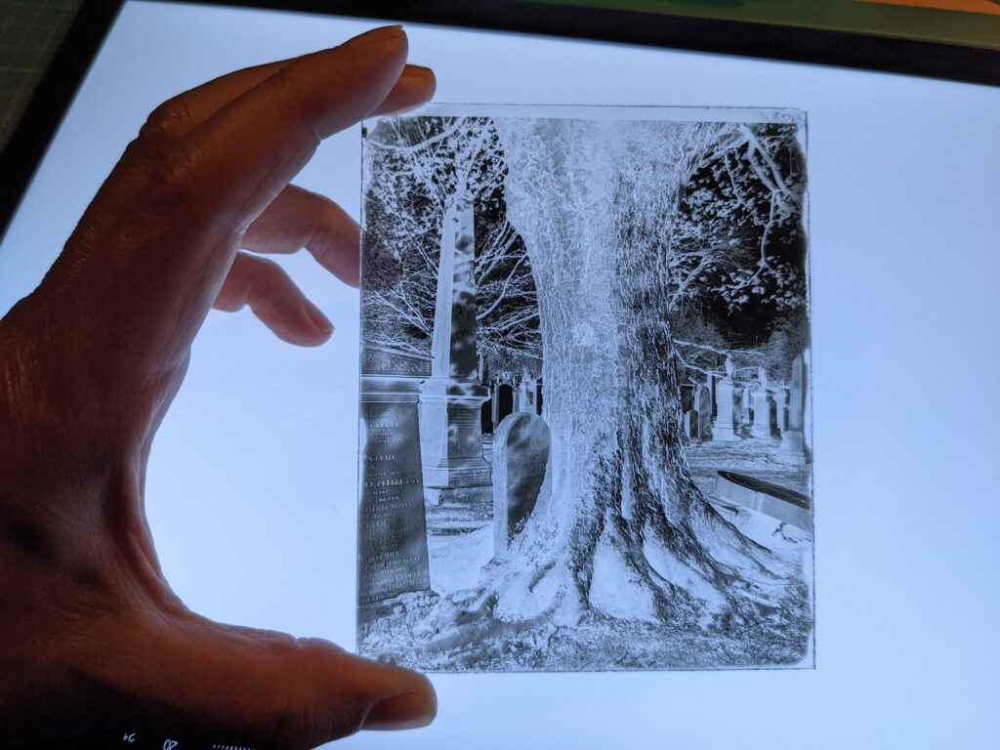
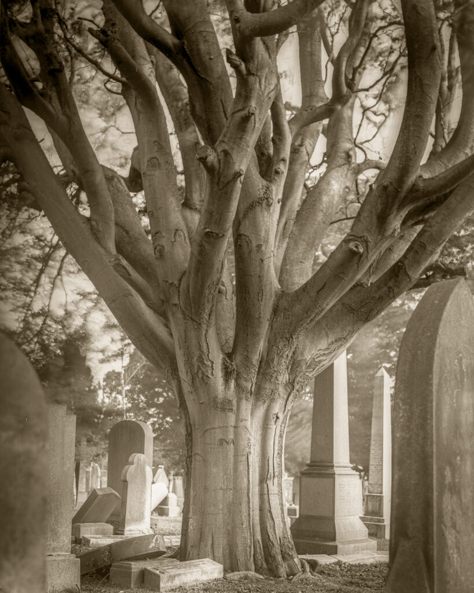
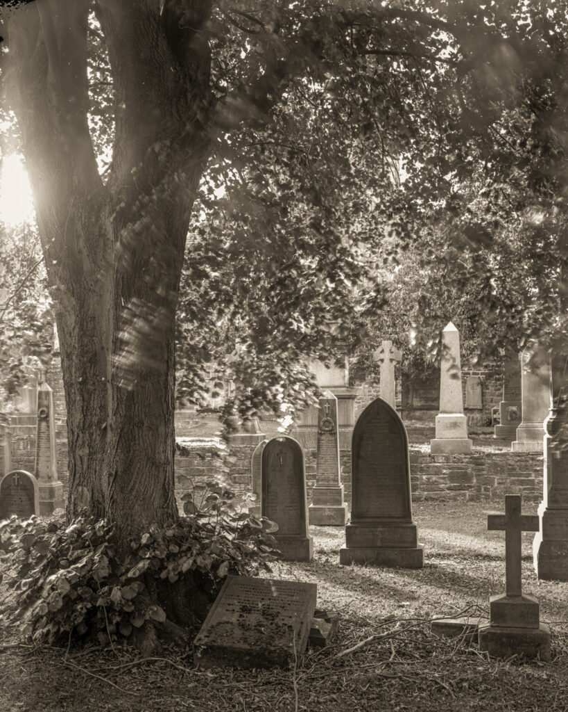
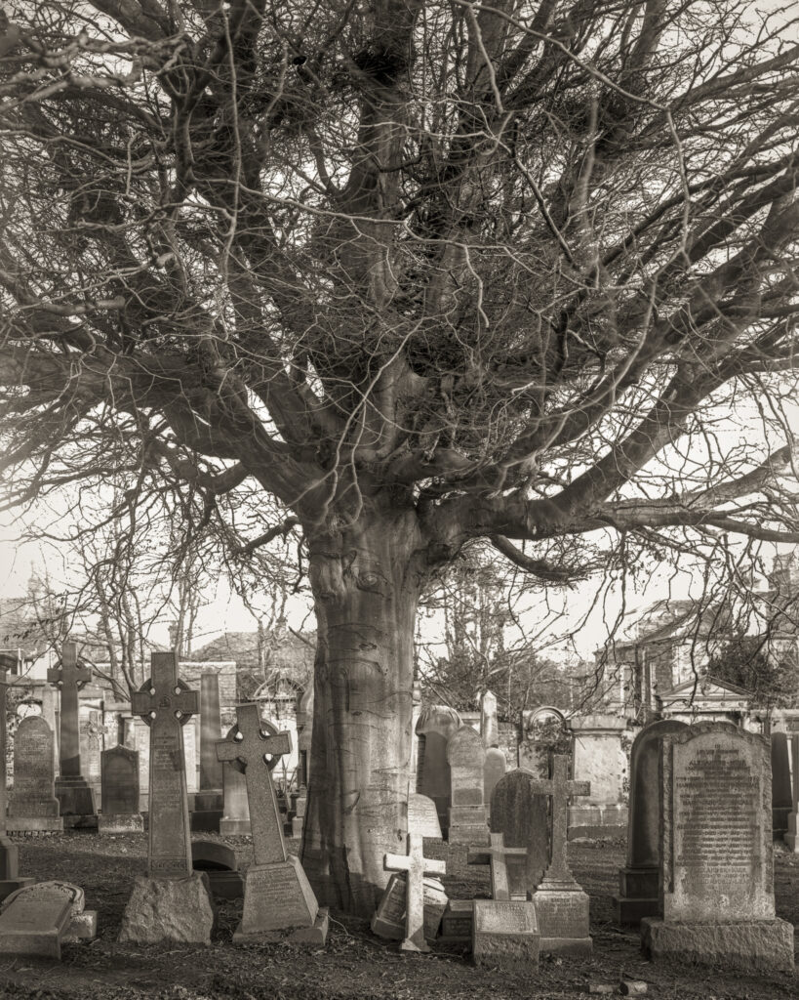
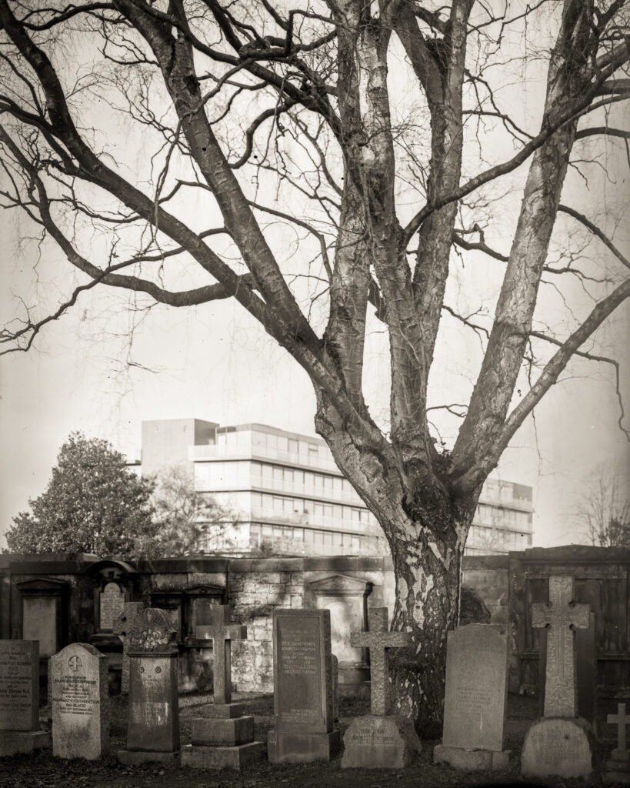
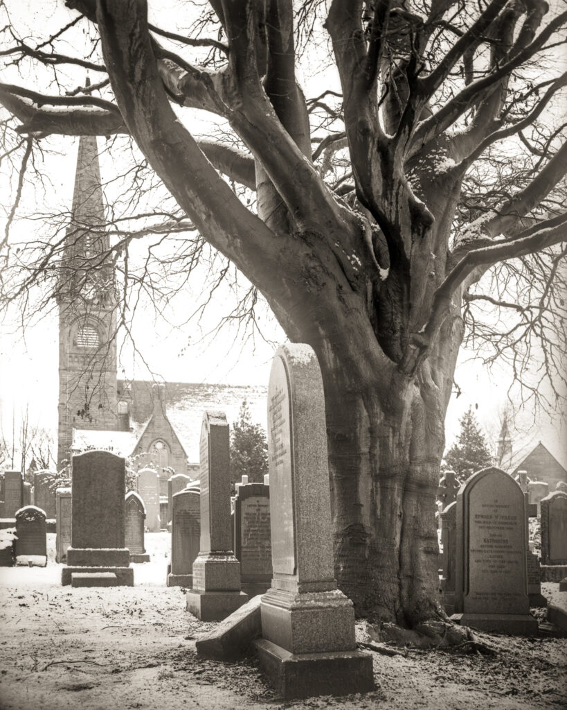
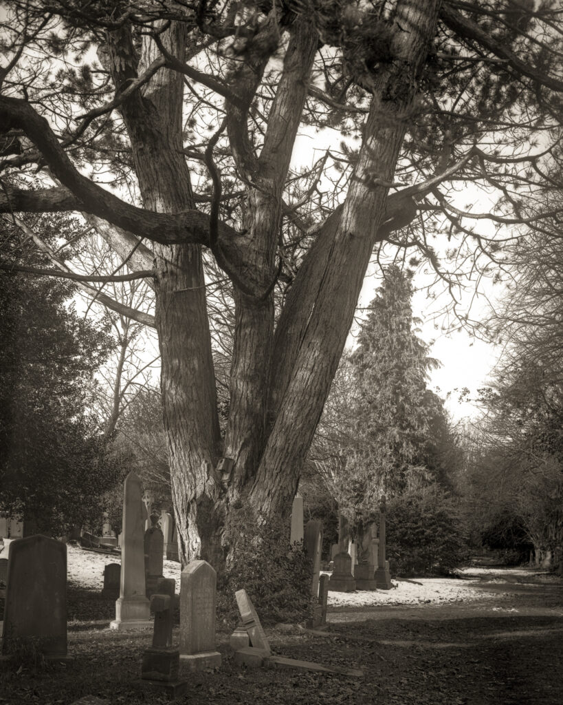
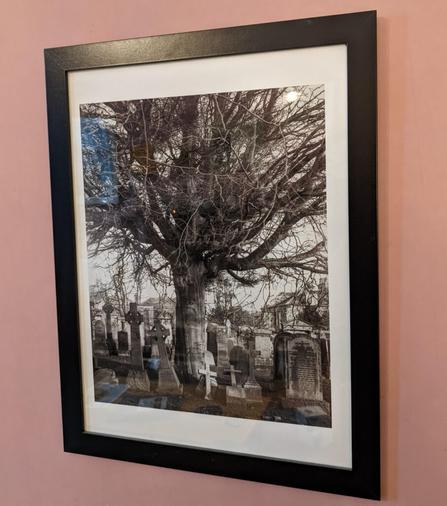

Whilst we were under periods of looser Covid restriction during 2020 and 2021 I had a project photographing the local cemeteries near where I live in Edinburgh. It was an opportunity to make many test exposures as I honed my emulsion making skills. But somehow the project petered out. I was using my Wista 45D camera with 4"x5" plates. I then scanned them and inkjet printed on various kind of paper. There was something unsatisfactory about the hybrid workflow and I moved to making larger plates and printing them on salted paper or with argyrotype. Of course Covid also became less of an issue so we were free to go further a field. That's not to say I won't revisit this way of working in the future. But I totally forgot to share anything from the project outside [an Adobe Lightroom gallery](https://rogerhyam.co.uk/marchmont-cemetary-dry-plates). Here are a few of the photos from that time.

I used hand cut and coated 4"x5" glass plates.

Perhaps my favourite tree and one of the first I photographed. Grange Cemetery.

The trigger for me was to concentrate on the trees and let the gravestones look after themselves.

Grange Cemetery is only a few yards from my house and so was the main destination.

Juxtaposition at Dene Cemetery. I visited in mid winter and must go back again.

Grange Cemetery surrounds Marchmont St Giles (not to be confused with St Giles cathedral) so feels like a graveyard but it is very much a commercial Victorian cemetery like many others.

Newington Cemetery has a very different atmosphere and is quite overgrown in parts.

A few of the prints have mad it into IKEA frames and onto the walls of the flat.

