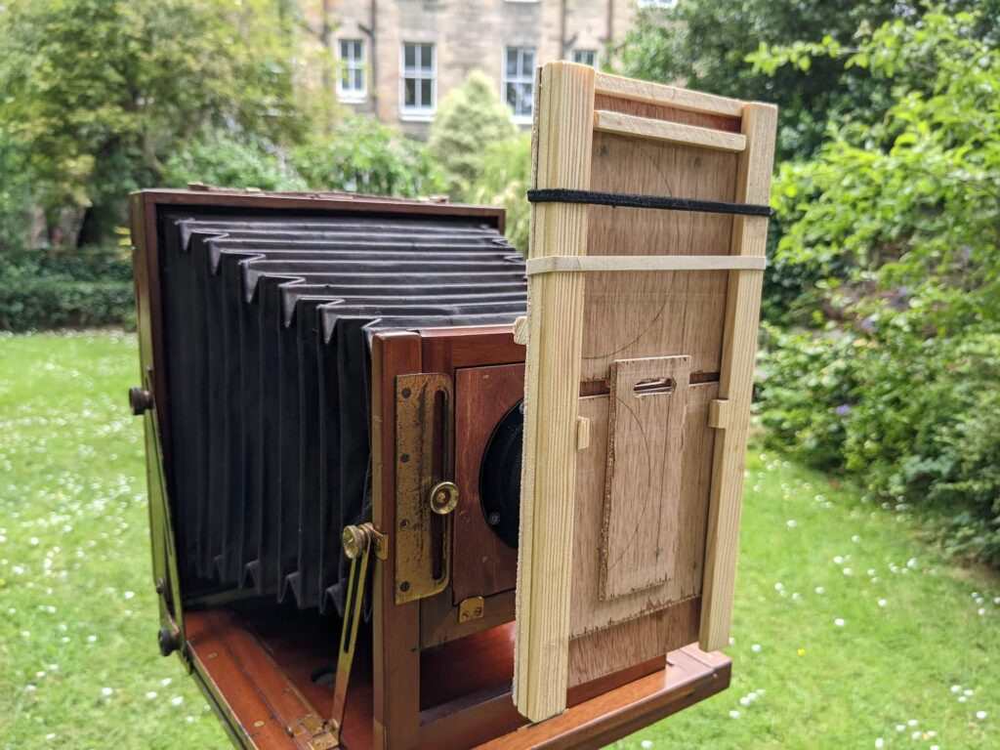
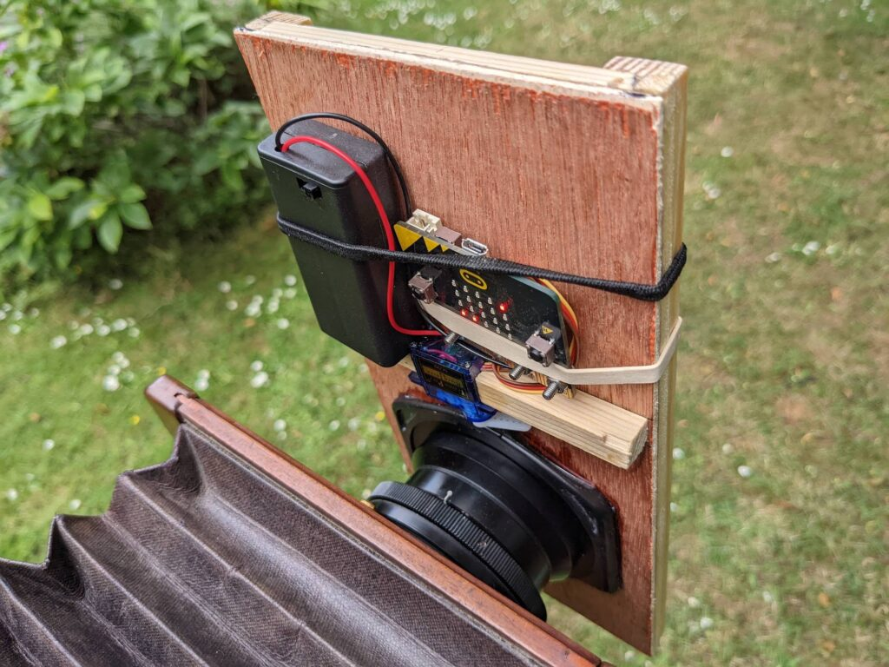
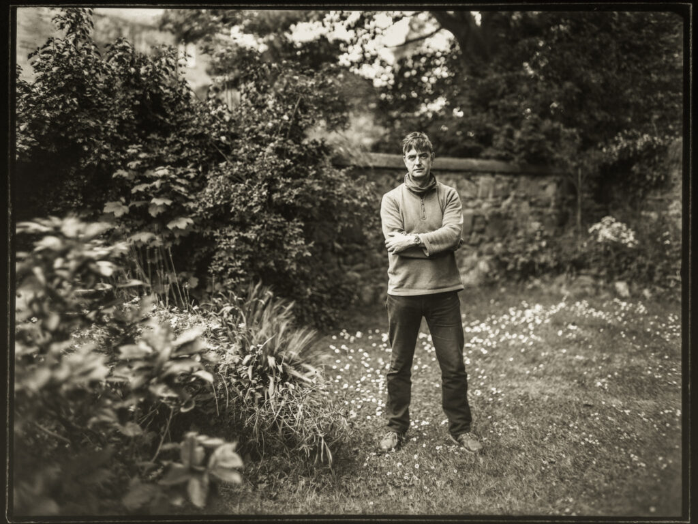

I got covid so had to stay at home for ten days. I couldn't really work due to the brain fog. It was like having very bad jet lag and I didn't want to mess with production servers in that state. But you can only sleep so much and so I worked on this low input project. It was something I could do for about an hour a day with things I had to hand.

Guillotine shutters are just what the name implies. A shutter in the form of a gravity driven guillotine. They can either be implemented as two plates that slide down one after another (the delay between release governing the exposure time) or a single plate with a slit in it (the width of the slit governing the exposure time). Mine is the former kind aimed at exposure of several seconds or more on my own simple silver gelatine plates. It only achieves what I can do by simply removing and replacing the lens cap except I can control it remotely now.

The slide is plywood joined to a cut down Cokin-P filter holder with epoxy resin. The release mechanism is a BBC micro:bit and a small servo run off two AA batteries - a total of three component.

https://youtu.be/R8WPfP6A410

Watch the guillotine in action.

The remote is a second BBC micro:bit in a case and powered by a button cell. The micro:bits are aimed at school children. They are microcontrollers with a few sensors, LEDs and a BlueTooth radio that can also be used to send simple (non-BlueTooth) singles up 70 metres between two micro:bits. They are very easy to programme in Python. It would be possible to add many fancy features. On the servo side I just added the ability to set the exposure at T or between 1 and 9 seconds. On the remote side I set the ability to delay exposure by five seconds - so the remote can be hidden. I also made the remote beep each second during the exposure.

Post covid me in the garden (simple phone scan of the plate)

I don't have a big project planned for this thing. I thought it might be useful to practice environmental portraiture which is pretty hard to do without a willing and very patient subject. I'm pleased with the first test shot in the garden. This has the feel of a vintage lens but it was taken with a relatively modern process lens at f/5.6 5 seconds. They are definitely not designed for this hence the soft edges. It's a shame about the wall bisecting my head!

I was inspired to make the shutter by Borut Peterlin who uses one for his New Earth project - naked self portraits in the woods. Don't worry I'll not be getting my kit off any time soon. Although maybe ...

https://youtu.be/POEPy88XQGg

Here is the code I used on the microbits incase it is of any use to anyone. Very simple grunged together stuff not written to be re-distributed!

[microbit\_python](https://www.hyam.net/blog/wp-content/uploads/2022/07/microbit_python.zip)[Download](https://www.hyam.net/blog/wp-content/uploads/2022/07/microbit_python.zip)
