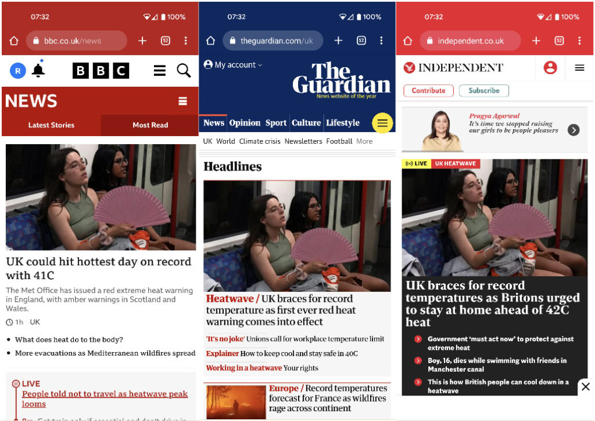

Screen grabs Monday 18th July 2022

I woke this morning to find the same image used as the lead across three media outlets. This isn't a one off picture of a burning building or scoop from a war zone but a woman with a fan on a train in London. It is credited to Reuters - no photographer.

How is it that three ostensibly independent publications choose to use the exact same image for a 100% predictable story. This heatwave has after all been forecast for nearly a week.

Many publications have long since done away with staff photographers who might provide original material for this kind of thing so is it that there is little material on the wire for them to choose from? Is there a kind of group think on the picture desks that makes them choose the same image? Do picture desks even exist anymore?

Because it is an image the similarities are very striking but the headlines and content are pretty similar too. Might all journalists be going the way of the photojournalists?
