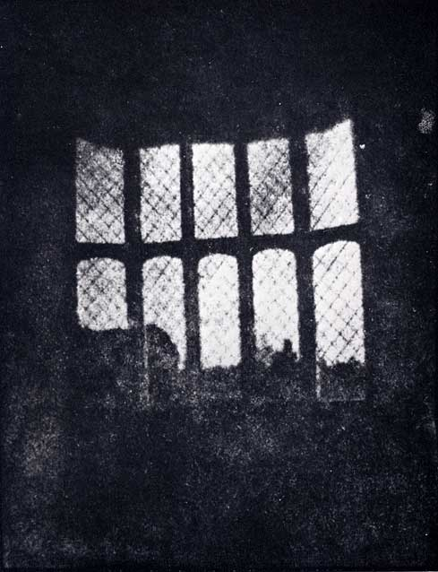
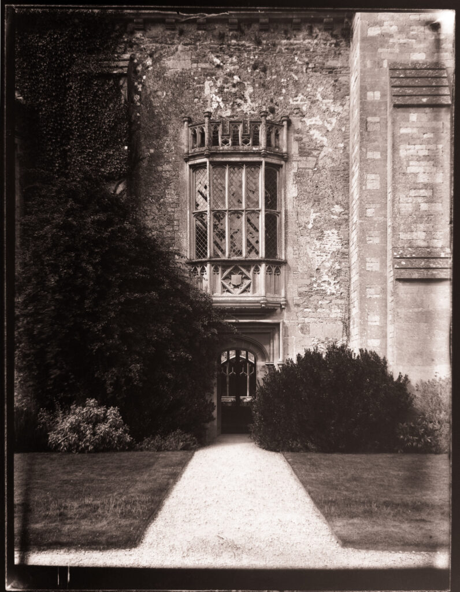
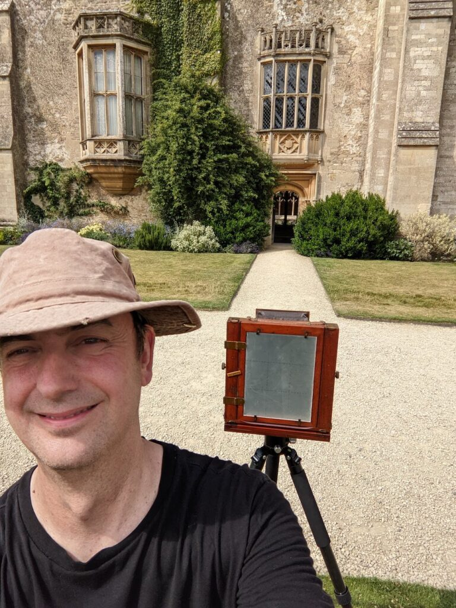
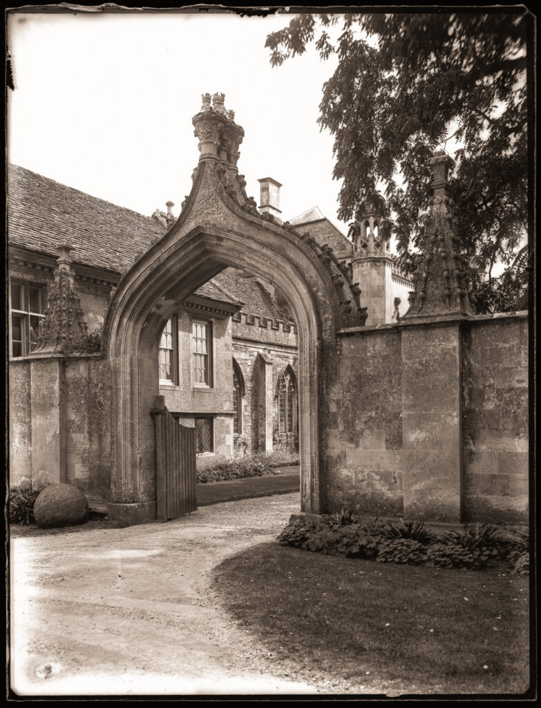
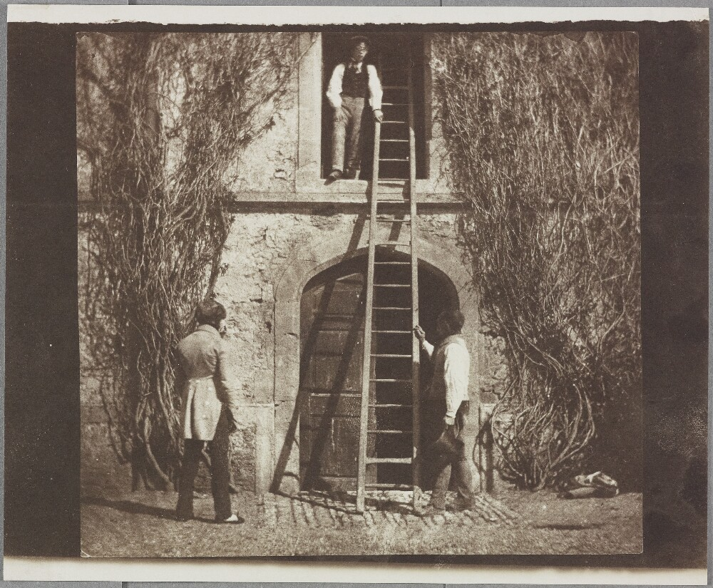
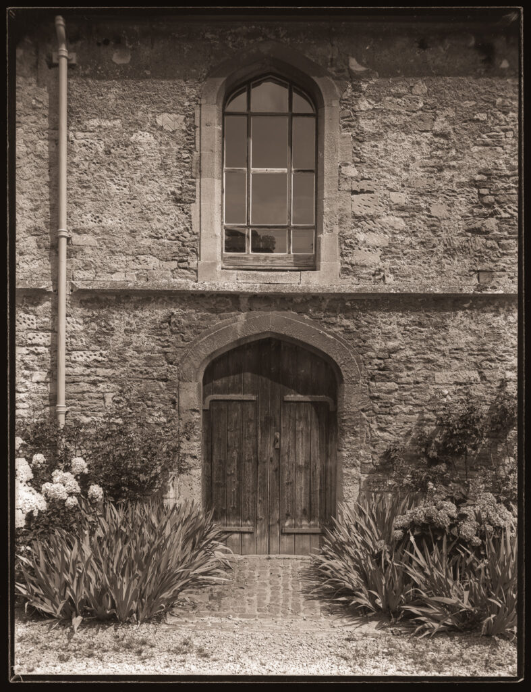
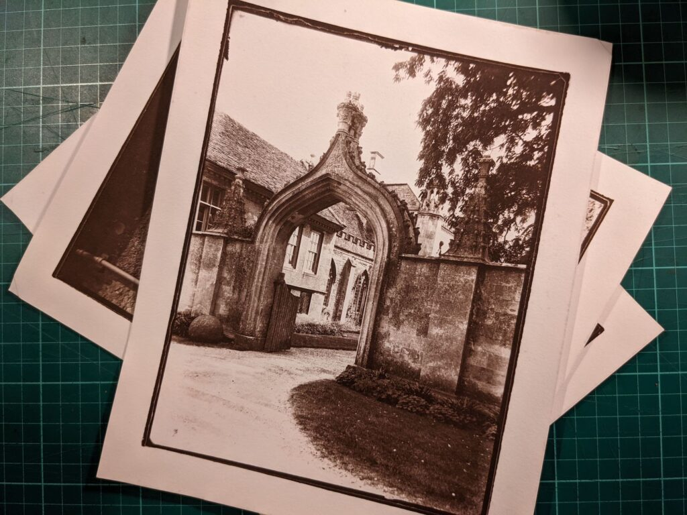

A trip to the West of England gave an opportunity to visit perhaps the most significant location in the history of photography, [Lacock Abbey](https://www.nationaltrust.org.uk/lacock-abbey-fox-talbot-museum-and-village), the family home of [William Henry Fox Talbot](https://en.wikipedia.org/wiki/Henry_Fox_Talbot). I grew up just down the road from Lacock but had never visited. Of course I had to take my plate camera and repeat some of the famous images. We had about three hours there and it was hot and very sunny so not ideal for photography. The village and house are fascinating outwith their link to the invention of photography. We also had a delicious pub lunch.

Fox Talbot's image of the lattice window. Positive from possibly first camera negative in 1835.

That most famous window from the outside on one of my plates.

Selfie with my whole-plate. It had to be done!

Entrance to the house.

Fox Talbot could ask staff to stand still for a photo!

Today the upper story is a flat.

I made just five exposures across three scenes. It was hot work. The property and museum are definitely worth a visit but perhaps a little disappointing for the true enthusiast (nut) of historical techniques. I guess this is because they have to be suitable for a general audience.

Some Argyrotype prints from the plates.

Technically the challenge wasn't just the high contrast provided by the bright sun but the fact that the gravel paths tended to glow brightly in the ultraviolet resulting in plates that are very difficult (if not impossible) to print well with simple alternative techniques and so I've resorted to scanning. If I had been doing this on modern film I could have given something like N-2 development to compensate.

Perhaps I'll return in a few years when I've mastered calotypes. If I do I bet it will be raining!
