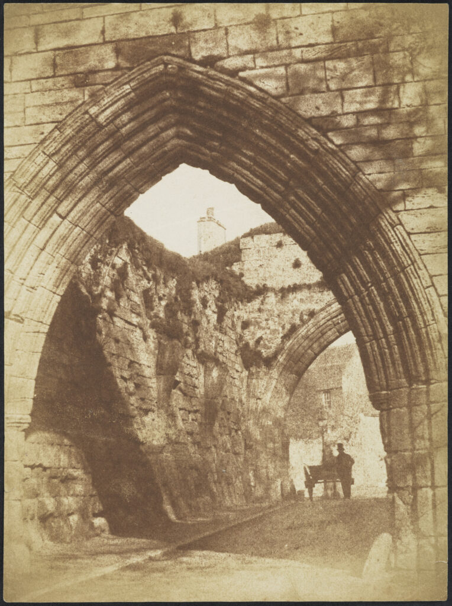
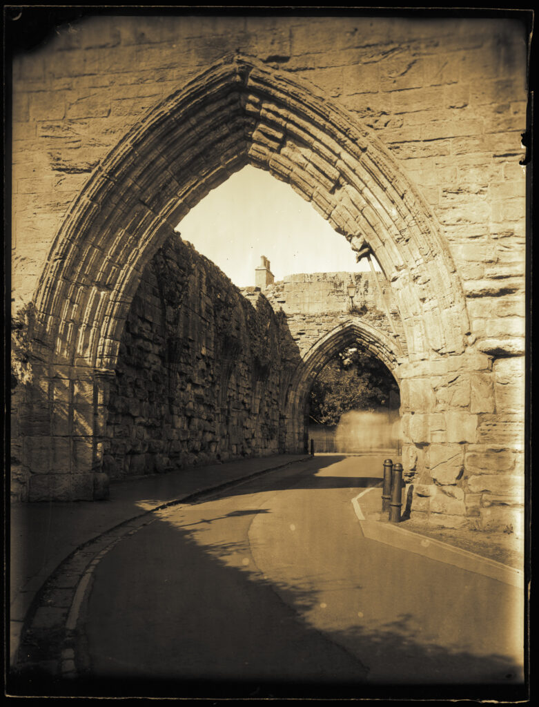

I dropped my daughter back at St Andrews University the other day and it gave me the chance to make a reproduction of a Hill & Adamson view. It was very sunny and very busy with tourists - who appear as smears.

The Pends - 1843-47 - Hill & Adamson - salt print from calotype. CC by NC - National Galleries of Scotland.

The Pends - 2022 - Roger Hyam - scanned silver gelatine glass plate.

I'm really getting the itch to go full calotype. Maybe this winter I'll work up a protocol.
