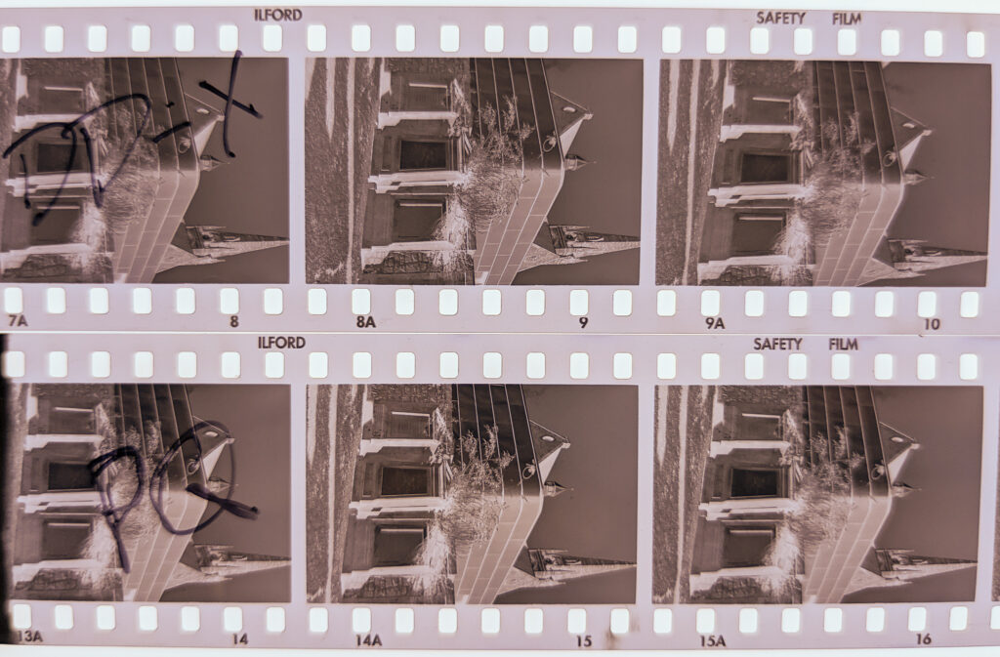
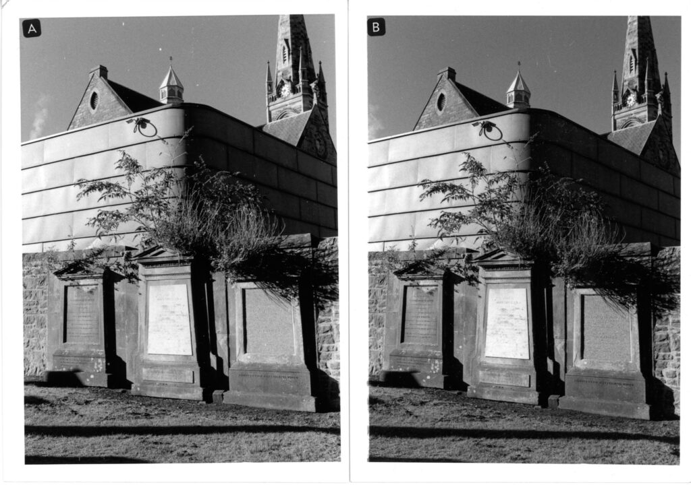
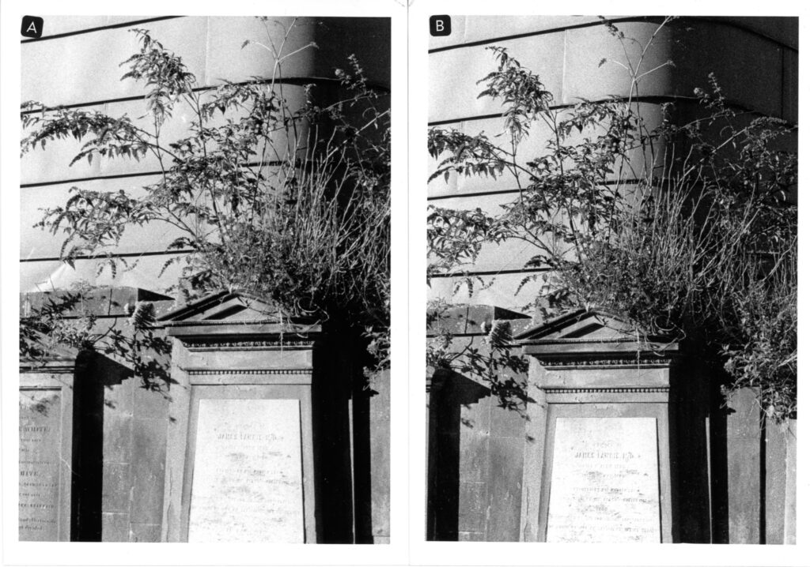
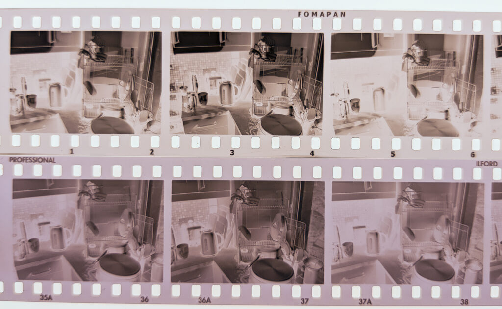
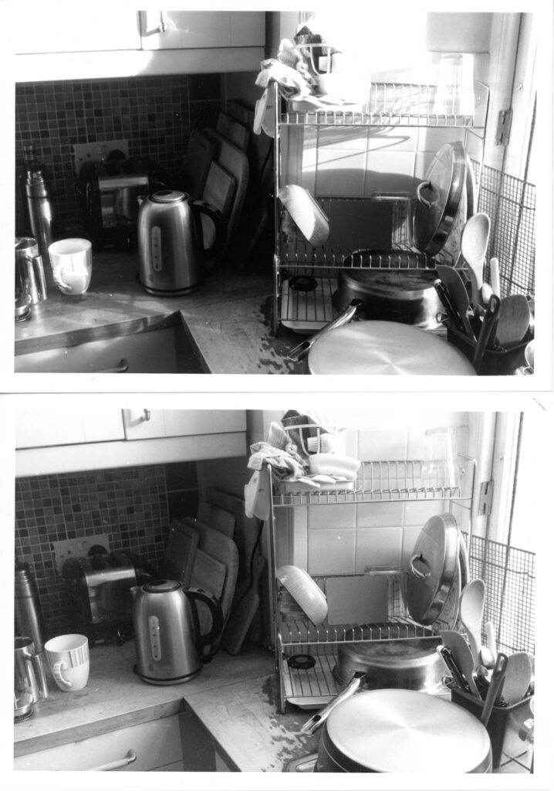
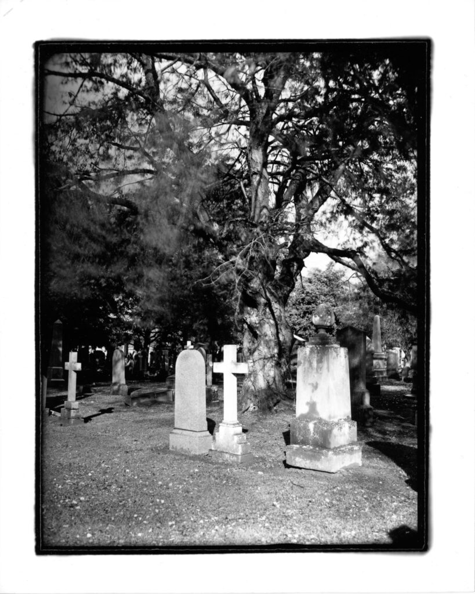
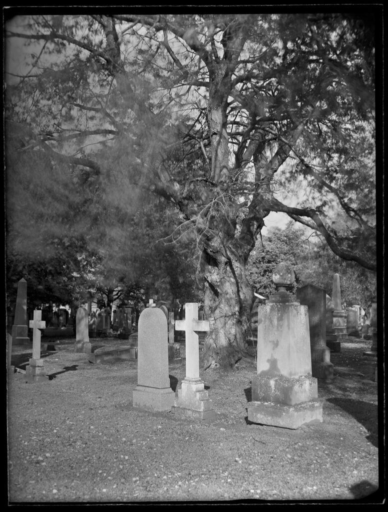
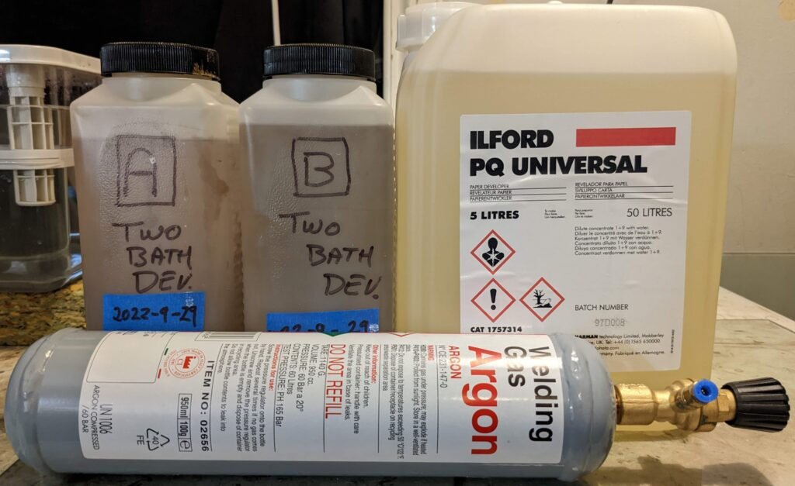
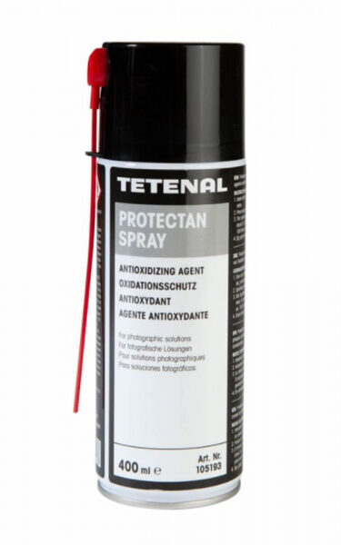

A thinking aloud/allowed blog post.

I've decided I need to rationalise things a bit on the old developer front. Choosing the best developer is a rabbit hole that I'm not keen to fall down. I've been reading the film developer cook book and it just depresses me. It can result in years of anguish rather than doing anything fun in the field and darkroom. Although I acknowledge messing with developers can be fun! The real question is, which developer(s) will suit my needs just now?

Currently I have six developers in the cupboard. (The Multigrade is actually empty as I'm working through the warm tone at the moment.) I also have a little bag of Metol and many of the other ingredients to make my own developers up. There is even some instant coffee in the kitchen and aspirin in the bathroom if I want to go down the caffinol route. The world is my oyster. But what do I do and what do I want?

- **My own silver gelatine glass plates.** For this I use Ilford PQ Universal. It works very well, although I do wonder if I could get lower contrast with something else. I can either scan these plates or print them on a printing out paper like Argyrotype but they are usually too contrasty for Multigrade papers. It is my most used developer but oxidises after opening which is why it is decanted in a glass bottle in the picture above.

- **Argyrotypes from my glass plate.** This is a printing out technique so no developer. Water with a pinch of citric acid.

- **Large format film (4x5 & 8x10).** I've used Ilfotec HC and it works well. I could use PQ as it is recommended.

- **Silver gelatine darkroom prints, Ilford Multigrade papers.** I've used Multigrade in the past but I like it warm so got a bottle of Warm Tone which is nice. It is nearly used up now. I could use PQ for this too.

- **35mm film, typically HP5+ but whatever is lying around.** Currently I'm working through 30m of Delta 400 but will probably switch back to HP5+ or maybe Foma or something next. I have used Ilfotec HC for these films but wasn't happy with a roll of Delta and, seeing Ilford recommend DD-X for Delta films, I bought a bottle and have been using that. It is a very nice combination but expensive and a bit "slick". Good if you want smooth tones. May be good for scanned negs. I prefer traditional emulsions I think. I also have a ton of Kodak Tech Pan to play with, some of it very old.

- **Simplicity**. I don't mean the brand name of the range of chemicals from Ilford but a simpler life. If I could do with one or two developers then decisions would be easier and keeping a fresh supply more straight forward. I wouldn't have that nagging feeling of things going off in the cupboard.

- **Economy.** By this I don't mean money so much as lack of waste. I could use ID-11 and chuck it out as soon as the stock looked brown and it would be an economical way to develop films financially but wouldn't feel like it environmentally. Getting the best use of what I buy, for myself and the planet, is what I mean by economy.

What jumps out from that list is that Ilford PQ Universal could be used for everything except the 35mm films. It is a warm acting paper developer. It works on my dry plates and it is OK for traditional emulsion sheet film like Fomapan. The only issue is Ilford don't recommend it for small formats of film, 120 and 35mm. They literally say: "**_Do not use PQ UNIVERSAL to process general purpose 35mm and roll film formats._**" in the technical documents. Which is about as emphatic as you can get. I presume they mean for quality reasons and not that the combination is explosive! But if I did use PQ Universal for 35mm I could live with just PQ, Rapid Fix and an stop bath. It would be simple and economical and I could concentrate on other factors.

What film developers might I consider in addition to PQ?

- **ID-11 (clone of D-76).** I used this extensively/exclusively in the last century. I would pick it as a default film developer but I'm slightly worried about metol poisoning. I develop at home and wash films in the bathroom. The risk of triggering a reaction in a family member or guest might not be worth the benefits. At the moment they think everything I do is harmless - lets keep it that way. But it remains a possibility. I only have a box of it because I added it an order to trigger free delivery.

- **Ilfotec HC (clone of HC-110).** Would be great as a film developer. Expensive and oxidises but seems to keep working even when brown. My fall back choice is to buy another bottle of this. It is currently £39 for a litre (but that is 100 35mm films at 1+31) though and it would be painful if I didn't get through it.

- **Pyrocat-HD.** A lot of large format photographers rave about this. If I were intending to use alternative printing techniques on my film negatives then this would be worth it because the staining increases the UV density. I get my alt-print kicks from my glass plates though and so will stick to regular multigrade prints from film. So no need for Pyrocat-HD at the moment. Maybe I'll try it one day. I'm not aware that people use it much at 35mm.

Now I could spend forever reading about this on the internet or I could do some tests. So let's get testing.

My first test is to expose the last dozen frames of the current roll of Delta 400 on the same scene with the same exposure then snip off the last six or so frames and develop them in PQ Universal (6mins @ 1+19) but develop the rest of the film as usual in DD-X (8mins @ 1+4) so I have a direct comparison between official recommended development and officially NOT recommended. I can see if the PQ is "good enough" for what I do which is typically small darkroom prints.

Phone snap of Delta 400 developed in DD-X vs PQ Universal - superficially similar looking negs.

I'm not interested in scanning 35mm negs, it makes my heart sink. I usually make small prints. Here are two 5x7 off those negatives. Of course this is a scan of those prints so has been through another process and I've know idea what device you are view this on. Basically the prints are very similar and could be made more similar if I wanted to spend hours working on a test shot. The PQ neg did need to be printed on Grade 1 paper but the DD-X was fine on Grade 2.

5x7 Multigrade prints. A = DD-X on Grade 2. B = PQ on G1

Both acceptable but the tone and ease of printing is definitely more pleasant on the DD-X negative. The PQ neg was more grainy under the focus magnifier but that probably wouldn't show much till printing bigger than 8x10. To test this I put my enlarger up as high as it goes, it is under a shelf, which gives a print about 16 inches across.

16 inch prints from same negs as above. A = DD-X and B = PQ Universal

**Conclusion:** Ilford PQ could be used for everything but I don't feel I want use it for everything. Those 35mm negs were OK but didn't spark joy. The DD-X ones had a bit more wow to them. Should you used PQ for small negs? Only if there isn't anything else available. There is a quote from Ansel Adams about just about any developer being capable of delivering good results given enough work.

## Another Road

Perusing the Film Developing Cookbook (in a hot bath, it helps) there actually is a developer that is billed as the one developer to rule them all. To quote:

> Two-bath developers give excellent results with almost all films at a fixed time and temperature. It is almost impossible to overdevelop with two-baths, and it takes an effort to underdevelop. **They are ideal for photographers who want quality negatives but are not interested in obsessing about developers.**
> 
> Film Developing Cookbook 2nd Ed page 113

This sounds like what I'm looking for! With two-bath developers you have two bottles, Part A and Part B. Part A contains the developing agent but no accelerator. Part B just contains accelerator no developer. You stew the film in Part A for three minutes and the developer soaks into the emulsion but hardly any development takes place because the conditions aren't right. You switch to Part B for three minutes and the developer that is in the emulsion starts to work. In highlight areas it becomes exhausted more quickly than in shadow areas so is self limiting on contrast. This is analogous to how a printing out paper works where increasing density acts as a mask to slow down shadow areas in the print letting the highlights catch up. What is more you can just keep re-using Part A stock solution with no change in timing or results for twenty films and Part B for ten films. Stock keeps for six months. Let's put it to the test.

I made up some TD-200 from Film Developing Cook Book except I used 4g Metol because I was unsure when mixing if the 3g in the book was a typo or not. All the other formulas have 5g but the "Leica Developer" I've seen elsewhere has 3g. Ho hum. Suck it and see I guess.

Phone snap of Fomapan 100 and Delta 400 in TD-200, 4 mins A and 4 mins B @ 17C

Before my first coffee of the morning I made some exposures on Fomapan 100 and Delta 400 and stewed them both in the TD-200 at the same time. This is last nights washing up and this mornings coffee - what a mess.

Scans of 5x7 inch prints. Top Fomapan 100, bottom Delta 400. Both in TD-200

First impressions are what lovely negs. The details run all the way into the shadows and highlights. I printed them both on Grade 2. Whilst I changed films the sun came out so, although the Fomapan looks much more contrasty it is largely down to the change in the subject. This is art not scientific testing after all.

To me this looks great as a developer to rule them all. The question is whether it will work on my glass plates. They have the same issue of run away highlights. Lets put it to the test...

I nipped out to the local cemetery and found a very high contrast scene. Bright sunlight on a white stone and detail disappearing into the shadows. I made a whole plate of my basic silver gelatine emulsion (RH25) and stewed it in TD-200 and presto I have a plate I can print on Multigrade, albeit at Grade 1 but that is acceptable for a scene like this.

Grade 2 contact print on 8x10 paper of whole plate (6.5x8.5) developed in TD-200

Inverted soft scan of plate developed in TD-200 showing detail all the way down.

**Conclusion:** TD-200 (or similar two-bath developer) may be the one developer to rule them all. Except two-bath developers don't handle low contrast scenes very well, where an increased contrast in the negative is need to get an adequate print on Multigrade paper. The _Film Developing Cookbook_ says the best approach is to use a high contrast developer for these special circumstances. By jingo I've got it! We already have a high contrast developer to hand, Ilford PQ Universal.

A couple of weekends of messing and we have an overall conclusion. Two developers to rule them all:

- **TD-200 two-bath** - All pictorial film including my own glass plates unless a great increase in contrast is required.

- **Ilford PQ Universal** - All paper and pictorial film requiring increased contrast over TD-200.

What this doesn't cover is trying to get pictorial use out of my stash of Tech Pan document film but that is another story - it may be three developers in the end.

Two developers in three bottles - plus a bottle of argon?

**Just one more thing.** Oxidation is bad for Part A and PQ goes brown pretty quick. I investigated getting some Tetenal Protectan gas to spray in the bottles but it has been discontinued. An alternative is wine keeper (under various brands) but those are very expensive for the amount of gas you get. Everything to do with wine snobbery is expensive apparently. Then it occurred to me that Argon is used for MIG/TIG welding and costs less than a 1/30th what wine keeper costs. I just needed to buy a valve but even including the cost of the valve it worked out and 1/15th the cost of wine keeper and if I need to buy more it will be even cheaper.
