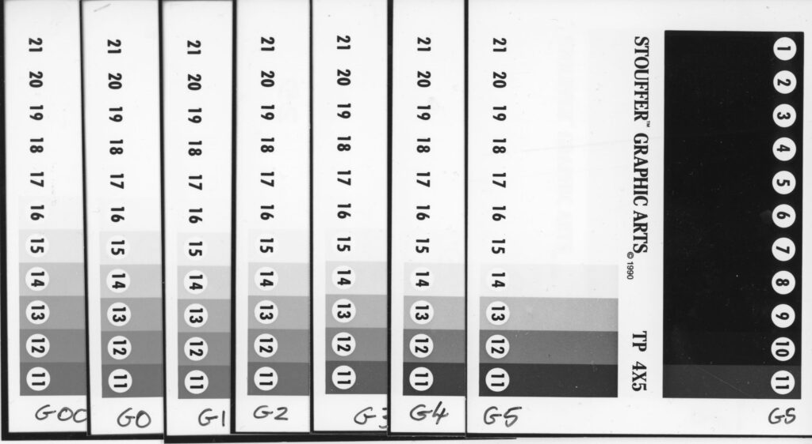
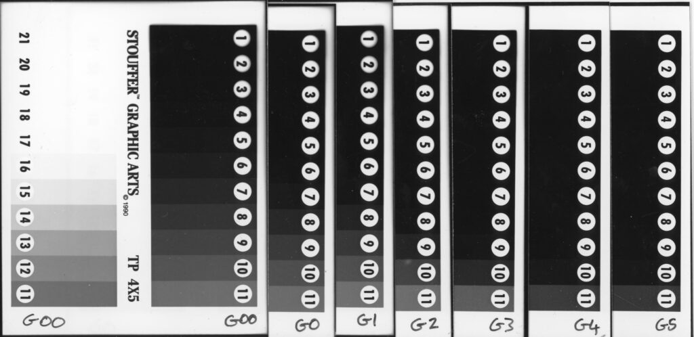

There are loads of YouTube videos out there about split grade printing with [Multigrade](https://www.ilfordphoto.com/photographic-paper) filters. It is an excellent technique for getting the most out of a negative. But what if you just want to do some quick work prints and don't have time to mess about with multiple filters for each and every negative? What is the most efficient way to reach the correct exposure and contrast grade choice without wasting too much time and paper doing tests?

With film the old adage is "Expose for the shadows, develop for the hight lights." If you don't get enough light in the dark parts of the scene when you take the picture you can never recover it later no matter how long you soak it in the developer. On the other hand the highlights will always have plenty of developable silver and will just keep getting denser if you extend development. I wondered if an analogous (but not the same) approach could be taken with paper. Expose for the highlights and pick a grade for the shadows. Or perhaps the other way around. The contrast control in MG papers is achieved with two emulsions that are sensitive to different colours of light so there is no reason it would mirror the way film worked but having a rule of thumb would be really useful. I thought I'd do some tests.

Highlights side of the step wedge. Only steps 14 and 15 show change through grades.

I took a Stouffer step wedge I bought for testing film. Each step is 1/2 stop. I made seven contact prints all at the same exposure (grades 4 and 5 are double as this is how the filters are designed). I wanted to see if expansion in tones occurred more in the highlights or the shadows or evenly in both.

Shadows side of the step wedge. Steps 6 to 11 change dramatically through grades.

Laying the prints on top of each other to compare either the highlights or the shadows it is clearly visible that changing the grade leads to expansion in the shadow areas more strongly than in the highlights. Only steps 14 and 15 are markedly affected by grade changes in the highlights but grades 6 through to 11 all change in the shadow side.

This suggests the best approach is to choose a middle grade (2.5) and get the exposure of the lighter parts (not extreme highlights) of the print right not worrying about the shadows then adjust the grade either up to make the shadows contract (less detail) or down to open them up (more tones). Changing the grade should have little effect on the exposure till you get to grade 4 and 5 where you will need to double your exposure anyway and may want to tweak it up a bit. **Expose for the highlights and pick a grade for the shadows is the correct approach.** I'm sure I read this somewhere a long time ago but going through this exercise might help ingrain it.
