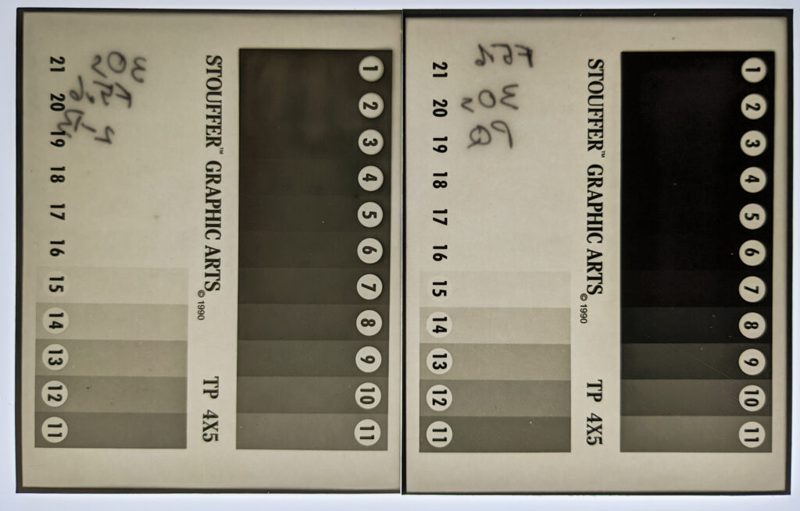

Multigrade Paper negatives on a light box. Left is two bath TD-200. Right is Ilford PQ

This is a quick note to self. Two bath film developer is designed to control highlights because the developing agent that is absorbed in the first bath soon becomes exhausted in the dense areas when the film is immersed in the second bath containing the accelerator. It occurred to me that this would be really useful when making paper negatives (in this case Ilford Multigrade V). I thought I'd give it a try with my Stouffer step wedge - a quick darkroom experiment to test a theory.

It appears that, in principle, this would work well for picture taking. On the normally developed negative (2 minutes in PQ) the last step that can be separated is Step 7 giving the neg a max of 5 stops of dynamic range. On the two bath (TD-200 from the Film Developers Cookbook) there is separation all the way down to Step 1. The very dense areas don't look evenly developed though. I only gave this two minutes in each bath because the image started coming up in the first bath - possibly because there is an accelerant in the paper. It is possible that bathing it for long enough to get even development might reduce the range of tones but I suspect that by giving longer exposure (lower ISO) it would be possible to get a negative with 7+ stops of dynamic ranges - which is much more useable.

Pre-flashing the paper also extends dynamic range but in the opposite direction - into the shadows. It might be worth doing a comparison or even a combination of the two.

At the moment I'm not planning to use paper negatives like this but in the future this might be an interesting thing to try. It might make ULF cameras more affordable to use!
