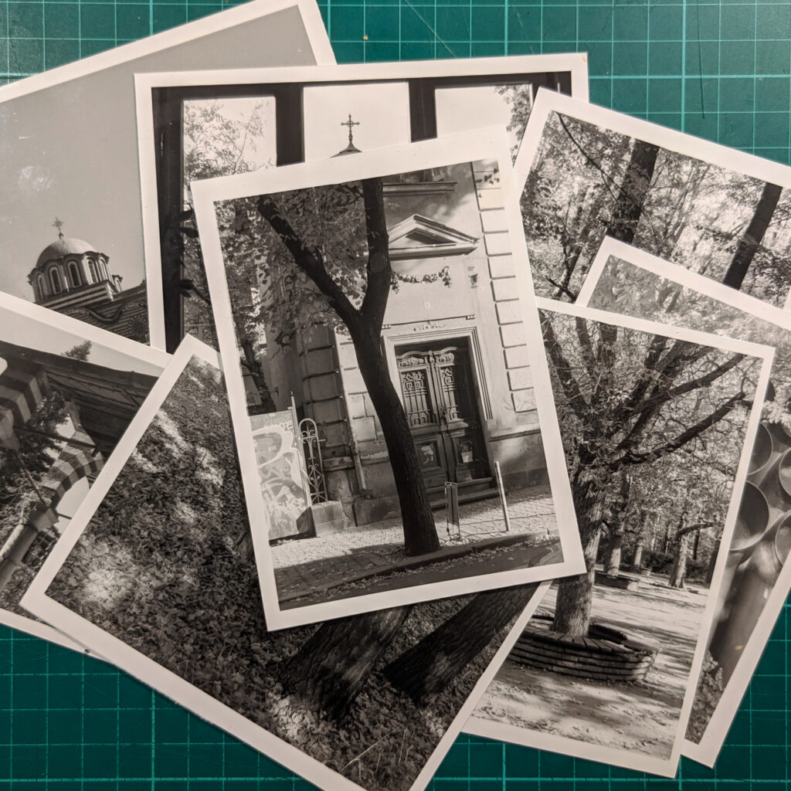
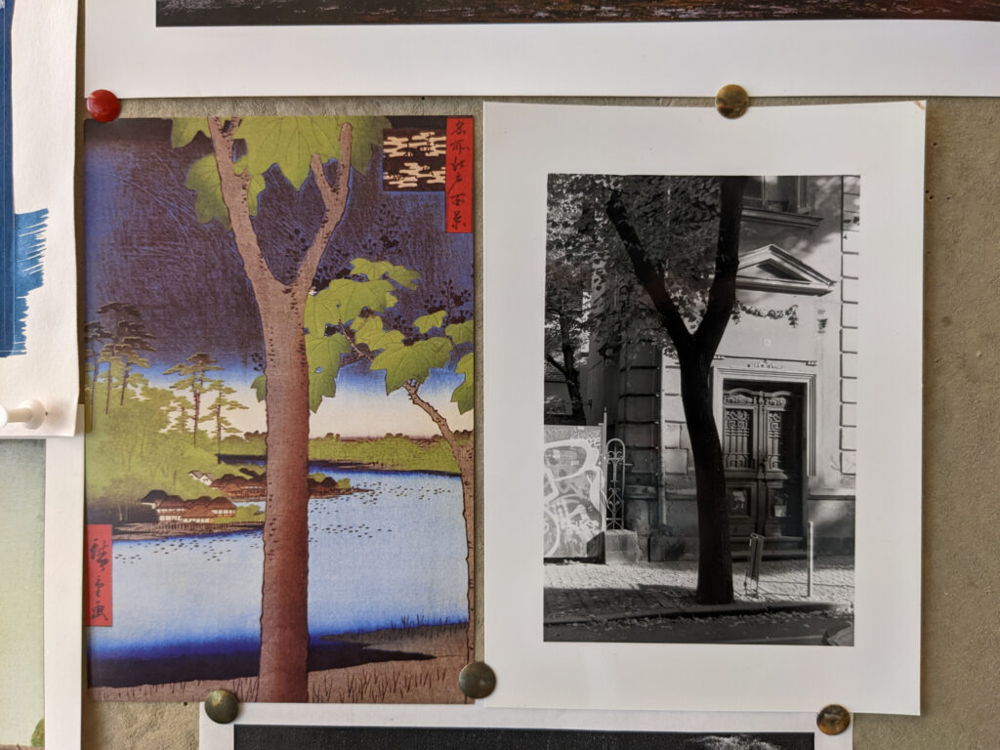

I had a week long work trip to Sofia, Bulgaria to attend the [TDWG 2022 Conference](https://www.tdwg.org/conferences/2022/). Most of the time was spent with colleagues in a conference room or on a trip to [Rila Monastery](https://en.wikipedia.org/wiki/Rila_Monastery). There wasn't much opportunity for photography but I took a little [Olympus XA2](https://en.wikipedia.org/wiki/Olympus_XA) for day to day use and my [Canon T90](https://global.canon/en/c-museum/product/film118.html) (plus 50mm f/1.4) to use on the one day I had to myself.

Pile of small prints from Sofia trip.

I have a "[Render unto Caesar](https://en.wikipedia.org/wiki/Render_unto_Caesar)" approach. If it is born analogue it mainly stays analogue. I don't routinely scan negs. I make little 3.5"x5" prints in the darkroom instead. If I like a shot I may go to 5"x7" or even 8"x10". This means that my trip to Sofia has resulted in just over two rolls of Ilford Delta 400, a few evenings messing in the darkroom and a small pile of prints. I still have some negs I might print so the fun continues!

Pinboard in the office

One print made it as far as the pinboard above my desk at the office. Only when I went to stick it up did I notice the similarity to the [Hiroshige](https://en.wikipedia.org/wiki/Hiroshige) woodblock print already there. Did the Hiroshige inspire me to take the photograph or do trees just look like that?

I could have taken my [Fujifilm X100V](https://en.wikipedia.org/wiki/Fujifilm_X100#Fujifilm_X100V) (lovely camera) but then I'd have taken a gazillion photos and shared a bunch online and probably not been as satisfied. But then I kind of wish I'd done that anyhow...
