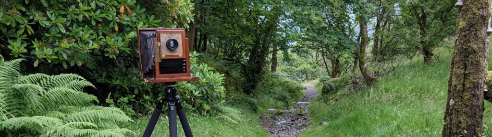
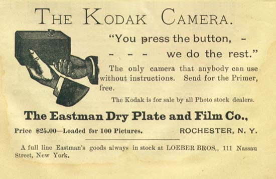

When I'm out with a plate camera people often stop and ask me what I'm doing. I love to talk about old school photography but am sometimes struggling with light and temperamental equipment and need to concentrate. I've therefore had some cards printed with this website address on them.

Whole plate camera in the Lake District

## Really Quick Summary

I like making photographs using more-or-less the same technology as would have been used in the 19th Century - specifically in the 1870s. Sometimes I do other stuff but that is my focus. I do it for fun. I don't have anything against digital photography (I do that too) but I work with computers all day and want to get away from them when I can. I don't currently sell prints but one day I might.

## Historic Context

- **Before 1839** - Loads of people worked on different ways of capturing images with chemicals. Many of these were unsung heroes we may never know about.

- **1839a** - [Daguerreotypes](https://en.wikipedia.org/wiki/Daguerreotype) - Very detailed positive images on polished silver plates. Popular for portraits for 20 years but a dead end technically. Difficult and toxic to do today.

- **1839b** - [Calotypes](https://en.wikipedia.org/wiki/Calotype) - Negatives on paper sensitized with silver iodide printed to positives on paper sensitized with silver chloride. A bit fuzzy because of the paper used. Fox Talbot patented the Calotype but it was quickly superseded by improved versions. Widely used for 30 years, notably by Hill & Adamson in Scotland. I've not done calotypes but may one day.

- **1851** - [Wet-plate Collodion](https://en.wikipedia.org/wiki/Collodion_process) - The same basic chemical process but in a film of collodion on a glass plate. The whole process must be completed within five minutes, before the collodion dries. This has the clarity of the Daguerreotype and the reproducibility of the the Calotype. It was the dominant technique for 30 years. Images of the Crimean War and American Civil War are collodion photos. Lewis Carroll's photos of Alice and Julian Margaret Cameron's images of Charles Darwin are collodion photos. I've done a little wet-plate photography myself but the logistics are too complex to do it consistently.

- **1871** \- [Richard Leach Maddox](https://en.wikipedia.org/wiki/Richard_Leach_Maddox) invented a way of combining the silver chemistry with gelatine so that it can dry on a glass plate and still work like a wet-plate does. This was a tipping point for photography, as significant as the move to digital. Silver gelatine plates are **shelf stable**. They can be made in advance, not necessarily by the photographer. Plate making can be commercialised.

- **1879** - George Eastman invents a plate coating machine. Once plates can be made on an industrial scale teams of scientists can be employed to improve the technology with the profits. A flexible film base is developed. Movies become possible. 20th Century culture occurs!

What I do is based on the period from 1871 to the mid 1880s where photographers would make their own silver gelatine plates, just prior to industrialisation. This means I can make and print plates in the dark evenings and make photos when the weather is good.

"**You Press the Button, We Do the Rest**" was an advertising slogan coined by [George Eastman](https://en.wikipedia.org/wiki/George_Eastman), the founder of [Kodak](https://en.wikipedia.org/wiki/Kodak), in 1888. The point at which it all changed.

## Cameras

I have more cameras than you can shake a stick at but the one I use most often is probably an **Unnamed Whole Plate** from around 1900. It takes 6.5x8.5 inch glass plates rather than film. I have holders for twelve plates but can only carry six. I also use a 10x12 inch Vageeswari plate camera made in India, probably in the 1950s as a copy of a much earlier camera. "The Vag" is very heavy so I can't carry if far. Then there is a wooden 1910 Victo half plate with red bellows, a 2023 Chamonix 4x5 inch (Walnut and Carbon fibre construction) for plates and "shop bought" film and a modern Intrepid 8x10 inch for film.

## Film and Photographic Plates

People often ask if they still make film. Yes they do and yes I do - kind of. There is a resurgence of film photography and after much restructuring Ilford and Kodak are still making film along with other smaller players. Photographic film consists of a photosensitive emulsion on a transparent backing. It is quite possible to make a **simple** photo emulsion at home and coat it on glass like the Victorians did and that is what I do. I buy large sheets of 2mm picture framing glass and cut it down to the appropriate sizes. The photo emulsion only has four active ingredients: Gelatine, Ammonium Bromide, Potassium Iodide and Silver Nitrate. They need to be combined in a very specific way. It takes me two evenings to make about 300ml of emulsion which I coat on six plates at a time over subsequent evenings - eighteen plates in all. The resulting plates are very slow (insensitive) and only respond to blue and ultraviolet light. If I add two drops of Erythrosine (E127 red food colouring) it extends the sensitivity to green a little. Plates like this have a special look and are very satisfying objects to create but they can't record the sky as it appears too bright to them. This is why I also use shop bought film sometimes. Commercial film is incredibly sophisticated compared to the homemade stuff. Imagine the difference between the first car patented by Carl Benz in 1886 and a Mercedes-Benz saloon from the 1990s.
