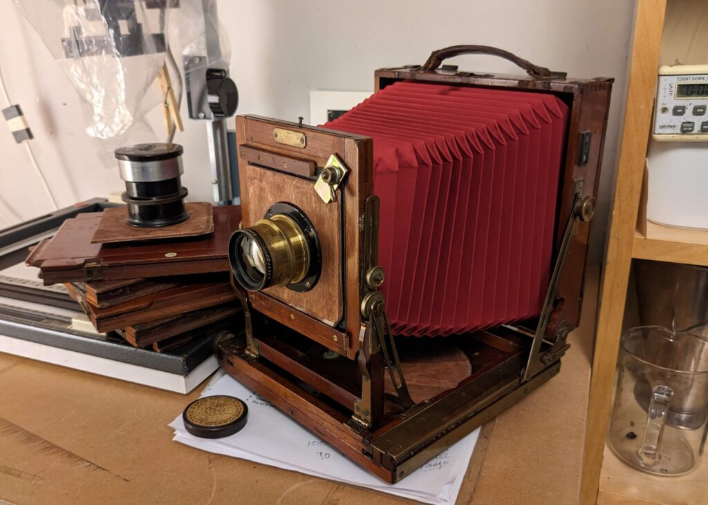
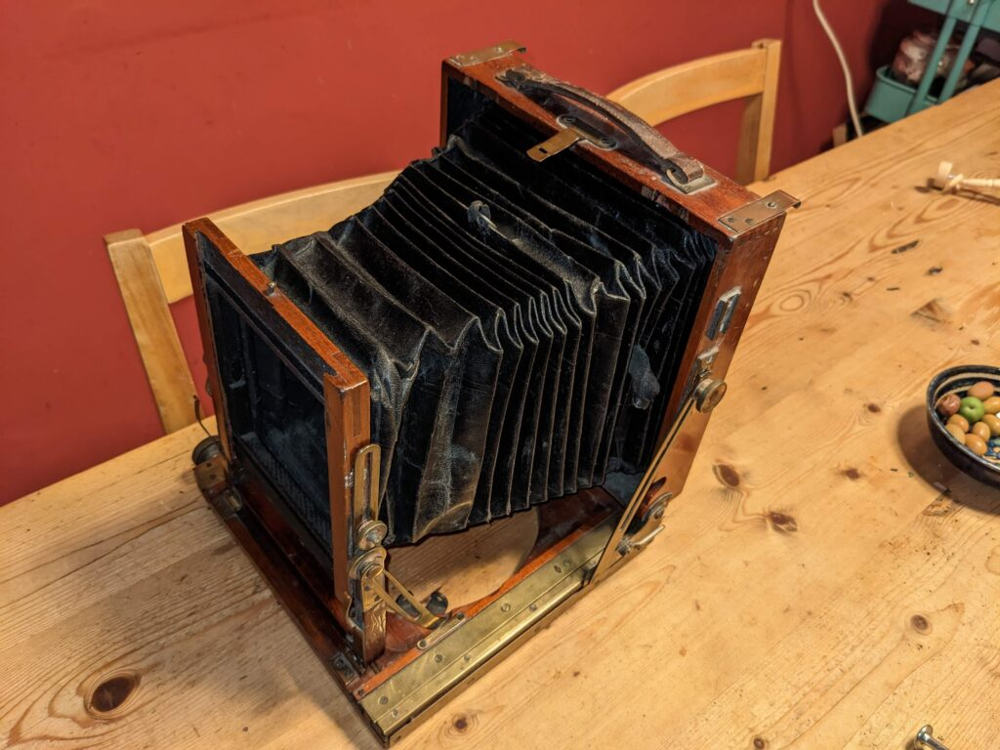
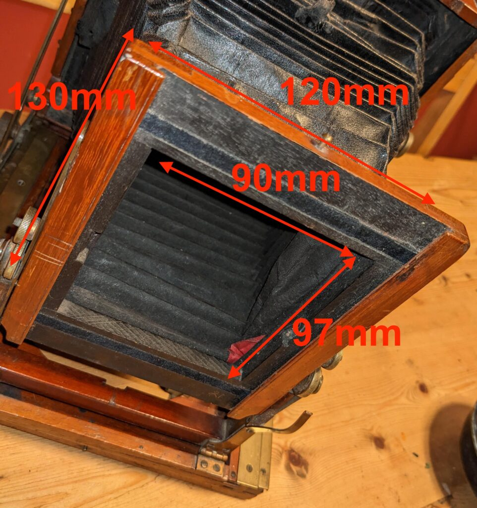
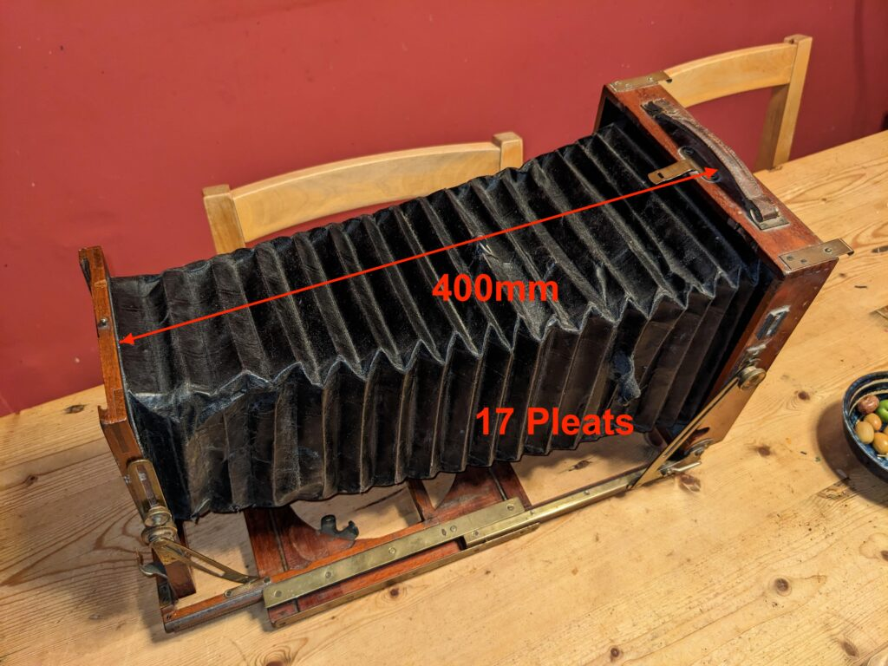
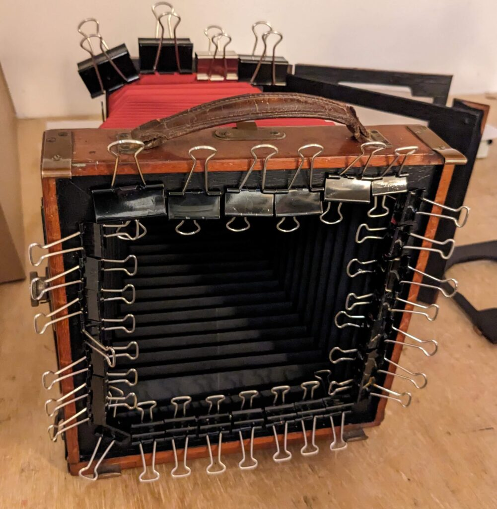
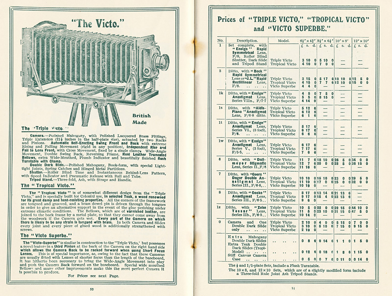
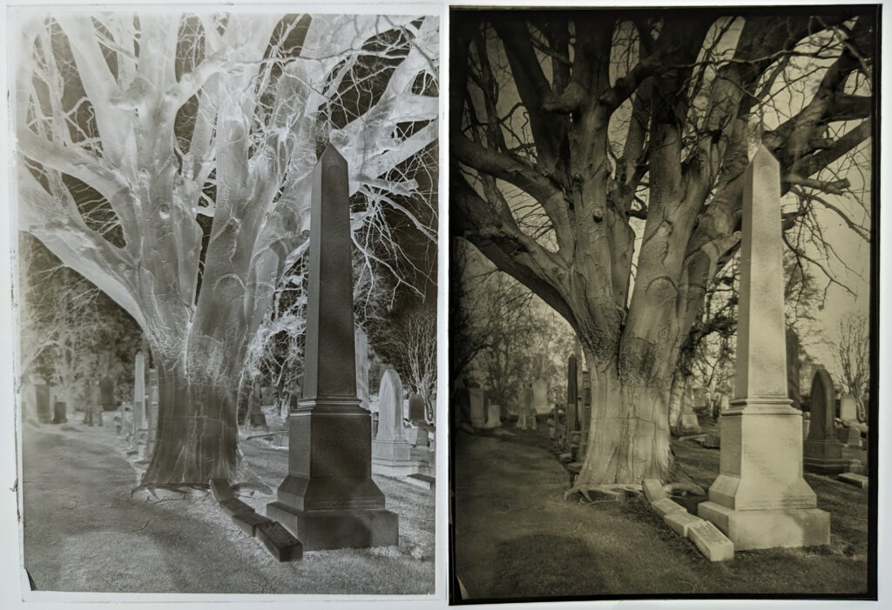

I had a few days off after the Christmas and New Year and couldn't resit another renovation project. I'd been wanting to have a go at a half plate camera as a smaller and lighter alternative to my whole plate. Half plate is slightly smaller than the 'modern' 5x7 inch format at 4¾ × 6½ inches (120 × 165mm). Before Christmas I spent some time at [Camera Base](https://www.cameratiks.co.uk/) here in Edinburgh picking a derelict from their storage room and matching it to some plate holders. Book-form plate holders were not standardised between makers like modern film holders are.

Ready for first light.

I wanted to create a usable camera rather than a perfect restoration so replaced the tripod base with a plywood one with a regular tripod thread and spirit level. I also adapted the front standard to take Linhof style lens boards so I can switch lenses between a bunch of different cameras.

As it came

Unsurprisingly the bellows were rotting so I ordered replacement, synthetic bellows from a supplier in China (You can find them on eBay). The bellows arrived the first week in January and I was really pleased with them.

Measuring up for new bellows

The Victo is double extension so can handle lenses up to about 300mm

Gluing the bellows

Advert from about 1910

I have two period appropriate lenses to try out that I'll maybe write more about in the future. I have poured some half plates and am just waiting for a reasonably bright day to go and try the thing out.

**Update:** Finally got a chance to a plate. The first few I poured were terrible as I didn't level the cooling slab in both directions so they are thicker on one side than the other - OK for testing though.

First half plate in the Victo. Rough and ready test shot as always. Positive is Multigrade print on Grade 2 layed on the light box next to the negative. Development was two bath which controls the highlights well.

